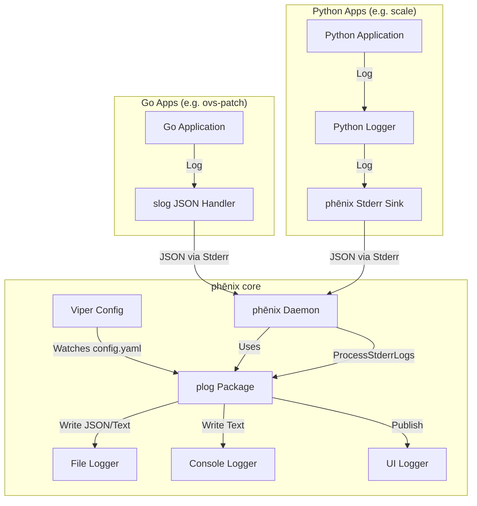

## phēnix

[](https://github.com/sandialabs/sceptre-phenix/actions/workflows/packages.yml)
[](LICENSE)

phēnix is an automated experimentation, emulation, and orchestration platform.

## 📖 Overview

phēnix provides a framework for defining, deploying, and managing complex cyber experiments. It orchestrates virtual machines, networks, and applications to create realistic emulation environments.

> [!NOTE]
> For full documentation, visit [phenix.sceptre.dev](https://phenix.sceptre.dev).

## 🚀 Getting Started

### Prerequisites

*   Linux environment (Ubuntu 22.04+ recommended)
*   Docker & Docker Compose

### Running with Docker (Preferred)

The easiest way to get phēnix running is using Docker.

> [!TIP]
> You can skip building locally by pulling the latest image from the container registry:
>
> ```bash
> docker pull ghcr.io/sandialabs/sceptre-phenix/phenix:main
> ```

> [!IMPORTANT]
> currently the main image available on GHCR defaults to having UI authentication disabled. If you want to enable authentication, you'll need to build the image yourself, setting the PHENIX_WEB_AUTH=enabled Docker build argument. See [issue #4](https://github.com/sandialabs/sceptre-phenix/issues/4) for additional details.

To build the phēnix container image from source (does not require installing local dependencies):

```bash
make docker
```

### Native Installation (.deb)

As an alternative to running phēnix using Docker, you can build a native Debian package (`.deb`) which installs the binaries and dependencies directly onto your system.

```bash
./scripts/build-deb.sh
```

Once the build is complete, you can install the generated package:

```bash
sudo apt install ./build/deb/phenix_<version>_amd64.deb
```

### Shell Completion

phēnix supports shell completion (tab-completion) for Bash, Zsh, Fish, and PowerShell.

> [!IMPORTANT]
> **Docker Users:** If you are running phēnix via Docker, standard shell aliases (e.g., `alias phenix='docker exec ...'`) will break completion due to TTY allocation issues. You **must** install the wrapper script:
>
> ```bash
> # This command installs the `scripts/phenix-wrapper.sh` script to /usr/local/bin/phenix.
> make install-wrapper
> ```

Once the wrapper is installed (and any existing aliases removed), enable completion by sourcing the script in your shell profile (e.g., `~/.bashrc` or `~/.zshrc`):

```bash
# Bash
source <(phenix completion bash)

# Zsh
source <(phenix completion zsh)
```

## 🛠️ Local Development

If you wish to build and run the services locally without Docker, follow these steps.

### Prerequisites

*   Go 1.24+ (for core development)
*   Python 3.10+ (for app development)
*   Node.js 18+ & Yarn 1.22+ (for UI development)
*   Protoc 3.12+ (for Protocol Buffers generation)

To install the required system packages on Ubuntu:

```bash
sudo apt update
sudo apt install -y protobuf-compiler npm python3 python3-pip python3-venv
sudo npm install -g yarn
```

For Go 1.24+, follow the [official installation instructions](https://go.dev/doc/install).

### Makefile

We use a `Makefile` to standardize development tasks. Run `make help` to see all available targets.

```bash
# Development
make all         # Run all tools (format, lint, test)
make check       # Run linters without fixing (for CI)
make format      # Format code
make generate    # Run code generation (protobuf, mocks, etc)
make lint        # Run linters and fix issues
make test        # Run unit tests

# Build
make build       # Build the main phenix binary
make deb         # Build the phenix .deb package
make docker      # Build the phenix docker image
make tunneler    # Build phenix-tunneler binaries

# Installation
make install-dev # Install development and build dependencies

# Cleanup
make clean       # Clean build artifacts
```

### Build

To build the phēnix core services locally:

```bash
git clone https://github.com/sandialabs/sceptre-phenix.git
cd sceptre-phenix
make build
```

## Logging & Configuration

phēnix features a centralized, structured, and dynamic logging system. This system aggregates logs from the core daemon, internal Go services, and external Python/Go user applications into a unified stream that can be routed to files, the console, and the web UI.

### 🏗️ Architecture

The logging architecture is designed to be **centralized**. The phēnix core acts as the aggregator.



### ⚙️ Configuration

Logging settings are managed via the `phenix settings` command, which modifies the `config.yaml` file. Changes are applied **dynamically** (hot-swapped) without restarting the service.

#### Settings Reference

| Setting Key | Environment Variable | Default | Description |
| :--- | :--- | :--- | :--- |
| `log.level` | `PHENIX_LOG_LEVEL` | `info` | Global log verbosity (`debug`, `info`, `warn`, `error`). |
| `log.console` | `PHENIX_LOG_CONSOLE` | `stderr` | Destination for console logs (`stderr`, `stdout`, or a file path). Uses **Text/Human-Readable** format. Note: Setting this to a file path will prevent console logs from appearing in `docker logs`. |
| `log.system.path` | `PHENIX_LOG_SYSTEM_PATH` | `/var/log/phenix/phenix.log` | Path to the persistent system log file (used by UI). Uses **JSON** format. This is independent of `log.console` and is always active. |
| `log.system.max-size` | `PHENIX_LOG_SYSTEM_MAX_SIZE` | `100` | Max size in MB before rotation. |
| `log.system.max-backups` | `PHENIX_LOG_SYSTEM_MAX_BACKUPS` | `3` | Number of old log files to retain. |
| `log.system.max-age` | `PHENIX_LOG_SYSTEM_MAX_AGE` | `90` | Max age in days to retain old logs. |
| `ui.logs.level` | `PHENIX_UI_LOGS_LEVEL` | `""` | Log level for the web UI stream (defaults to `log.level`). |
| `ui.logs.minimega-path` | `PHENIX_UI_LOGS_MINIMEGA_PATH` | `""` | Path to the minimega log file to display in the UI. **(Restart Required)** |

#### Configuration Precedence

phēnix resolves configuration settings in the following order (highest to lowest):

1.  **Command Line Flags**: Arguments passed directly to the binary (e.g., `phenix ui --log.level=debug`).
2.  **Config File**: Settings defined in `config.yaml` (managed via `phenix settings set`).
3.  **Environment Variables**: Variables like `PHENIX_LOG_LEVEL`.
4.  **Defaults**: Internal application defaults.

> [!NOTE]
> This precedence allows you to set baseline configuration using Environment Variables (e.g., in Docker Compose) but still override them at runtime using `phenix settings set`. To revert to the environment variable value, use `phenix settings unset`.

#### Managing Settings

> [!TIP]
> Use `phenix settings set` to change configuration on the fly.

```bash
# View all current runtime settings
phenix settings list

# Change log level to debug
phenix settings set log.level debug

# Revert a setting to default
phenix settings unset log.level

# Reset all settings
phenix settings unset --all
```

### 👨‍💻 Developer Guide

> [!TIP]
> Check out the [Example Applications](examples/README.md) for complete, runnable reference implementations in Go and Python.

#### The Logging Contract
All applications (Go or Python) running under phēnix must adhere to the following contract to ensure their logs are correctly parsed and displayed in the UI:

1.  **Output**: Logs must be written to `stderr`.
2.  **Format**: Logs must be single-line **JSON** objects.
3.  **Required Fields**:
    *   `level`: `DEBUG`, `INFO`, `WARN`, `ERROR`
    *   `msg`: The log message string.
    *   `time`: Timestamp (RFC3339 or similar).
4.  **Optional Fields**:
    *   `traceback`: For exceptions/panics (string).

#### Python Apps
Use the `phenix_apps.common.logger`. It is pre-configured to output JSON to stderr.

> [!IMPORTANT]
> For fatal errors, **raise an exception** (e.g., `ValueError`, `RuntimeError`) instead of calling `sys.exit(1)`. The `AppBase` class wraps execution in a try/except block and will automatically catch the exception, log the traceback as structured JSON, and exit cleanly.

```python
from phenix_apps.common.logger import logger

def my_func():
    try:
        logger.bind(custom_field="value").info("Starting operation")
        # ... code ...
    except Exception:
        # Automatically captures traceback and formats as JSON
        logger.exception("Operation failed")
```

#### Go Apps
Use `log/slog` with a JSON handler.

```go
import (
    "log/slog"
    "os"
)

func main() {
    logger := slog.New(slog.NewJSONHandler(os.Stderr, nil))
    slog.SetDefault(logger)

    slog.Info("Application started", "app", "my-app")
}
```

#### phēnix Core
Use the `phenix/util/plog` package.

```go
import "phenix/util/plog"

func MyFunc() {
    // Always provide a LogType enum
    plog.Info(plog.TypeSystem, "System initialized", "version", "1.0")
}
```

### 🧠 Decision Log

| Decision | Reasoning |
| :--- | :--- |
| **Wrapper (`plog`)** | We needed to enforce the `LogType` field for UI filtering and handle multiplexing to files/sockets, which raw `slog` doesn't do out-of-the-box. |
| **JSON on Stderr** | `stderr` is the standard channel for container/process logs. JSON allows the core to parse, filter, and reformat logs from child processes without complex regex. |
| **Viper + fsnotify** | Allows for "hot-swapping" configuration (like log levels) without restarting the daemon, critical for debugging live experiments. |
| **`settings` vs `settings db`** | Separated the legacy BoltDB settings (business logic) from the new runtime configuration (system behavior) to avoid confusion. |

### ⚠️ Gotchas & Troubleshooting

*   **Do NOT delete `config.yaml`**: If you delete the config file while phēnix is running, the file watcher breaks. Use `phenix settings unset --all` instead.
*   **Tracebacks**: In Python, standard `print(e)` or `traceback.print_exc()` writes raw text to stderr, which breaks the JSON parser. Always use `logger.exception()`.
*   **Timestamps**: Ensure timestamps are consistent. The core now enforces `2006-01-02 15:04:05.000` format for file logs for easier reading.

### 🌐 HTTP Request Logging
To view detailed HTTP request logs (method, path, status, duration), start the UI with the `--log-requests` flag

## 🤝 Contributing

Please refer to [CONTRIBUTING.md](.github/CONTRIBUTING.md) for details on our code of conduct, and the process for submitting pull requests.

## 📄 License

This project is licensed under the terms of the [LICENSE](LICENSE) file.
