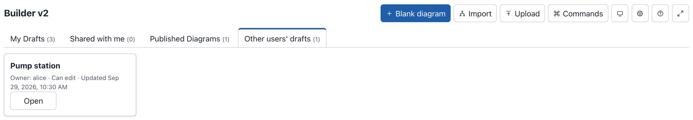

# Administration

This page is for phenix administrators. It covers turning Builder v2 on,
the permissions its users need, where it keeps drafts and published
diagrams, the `builder-doc` annotation, Builder documents kept in files, its
REST API, and what to do when something goes wrong.

## Enabling Builder v2

Builder v2 is a beta feature named `builder-v2`. It is off by default.
Turn it on in one of three ways, then restart `phenix ui`:

- The `--features` flag of `phenix ui`. Separate several features with
  commas:

    ```bash
    phenix ui --features builder-v2
    phenix ui --features builder-v2,vm-mount
    ```

- The `ui.features` setting in the phenix configuration file (see
  [Configuration Files](../settings.md#configuration-files)), as a list:

    ```yaml
    ui:
      features:
        - builder-v2
        - vm-mount
    ```

- The `PHENIX_UI_FEATURES` environment variable. Separate several features
  with spaces:

    ```bash
    PHENIX_UI_FEATURES="builder-v2 vm-mount" phenix ui
    ```

With the repository's Docker Compose file, `docker/docker-compose.yml`, add
the flag to the `command` of the `phenix` service, then run
`docker compose up -d phenix` to recreate the container:

```yaml
    command:
      - phenix
      - ui
      - --hostname-suffixes=-minimega,-phenix
      - --minimega-console
      - --features=builder-v2
```

!!! warning
    In the configuration file and in `PHENIX_UI_FEATURES`, a comma does not
    separate features: `builder-v2,vm-mount` enables neither of them. Use a
    YAML list in the file and spaces in the variable. Only the `--features`
    flag takes commas.

When the feature is on, the phenix log has the line
`Builder v2 API enabled`, and:

- the navigation bar shows **Builder v2**, with a **beta** tag, to users
  whose role has `configs` `list`;
- the editor is at `/builder-v2`;
- the Builder v2 API routes answer under `/api/v1/builder-v2` (see
  [REST API](#rest-api)).

The legacy **Builder** tab stays as it is.

When the feature is off, the navigation bar has no **Builder v2** tab. A
link to `/builder-v2` goes to the Experiments page with the notice
"Builder v2 is not enabled on this phenix server." Every Builder v2 API
route answers 404. On the Configs page, **Edit** on a topology that has a
`builder-doc` annotation says "Built by Builder v2" and explains that the
topology can only be edited there. That is every topology Builder v2
published, every topology `phenix builder publish` created, and every
topology that names a Builder file (see
[The builder-doc annotation](#the-builder-doc-annotation)).
`phenix config edit` still opens such a topology. Turning the feature off
does not delete drafts: they are there again when you turn it back on.

The `phenix builder publish` command does not need the feature: it works
whether Builder v2 is on or off (see
[From the command line](import-export.md#from-the-command-line)).

Builder v2 works over plain HTTP. Only **Copy link** in the Share dialog
needs HTTPS (see `--tls-key` and `--tls-cert` in `phenix ui --help`), or a
phenix opened as `localhost`: otherwise it shows the link for the user to
copy by hand.

## Permissions

Builder v2 never gives a user more than their role's config permissions.
Every Builder v2 request needs the `configs` permission of the same verb:
`list` to list drafts, `get` to open one, `create` to make one, `update` to
save a change, and `delete` to delete one. See
[Resource: `configs`](../user-administration.md#resource-configs) and
[Roles](../user-administration.md#roles).

How the users of a server see Builder v2 depends on its authentication
mode (see [User Authn/Authz in phenix](../user-administration.md)):

- With authentication disabled, everyone works as the same user,
  `global-admin`, with the Global Admin role. Everyone sees and changes the
  same drafts, under **My Drafts**. No one can share a draft, because
  sharing needs user accounts.
- With authentication enabled, each user has their own drafts and can share
  them.

Of the built-in roles, only two have `configs` permissions:

- **Global Admin** can do everything, including opening, changing and
  deleting every user's drafts. The drafts page offers **Delete** only on
  the user's own drafts and on damaged drafts. Delete another user's draft
  with the REST API: `DELETE /api/v1/builder-v2/drafts/{owner}/{draft}` (see
  [REST API](#rest-api)).
- **Global Viewer** can open every draft and published diagram, read only.
  Other users' drafts appear under **Other users' drafts** with **Can
  view**.

The Experiment and VM roles have no `configs` permissions, so their users do
not see Builder v2. Give Builder v2 users a role such as the
[example roles](#example-roles) below.

### What each task needs

| Task | Permissions |
|---|---|
| See the **Builder v2** tab, and list drafts and published diagrams | `configs` `list` |
| Open a draft or a published diagram | `configs` `get`; for a published diagram, or the diagram of a topology that names a Builder file, on that topology, such as `Topology/riverside-water` |
| Make a draft: **Blank diagram**, **Import**, **Upload**, **Edit as a draft**, **Save my history as a new draft** | `configs` `create` |
| Import a stored config | Also `configs` `get` on the config, such as `Topology/riverside-water`, and `topologies` `list` (or `experiments` `list`) on its name |
| Import an uploaded config | `configs` `create` |
| Save changes, undo, redo, and restore or delete a snapshot | `configs` `update` |
| Delete your own draft | `configs` `delete` |
| Share your own draft | `configs` `update`, and authentication enabled |
| Choose a stored scenario | `configs` `list` and `scenarios` `list` |
| Export **Topology YAML** | `configs` `get` |
| Use the **Publish** button | `configs` `update` |
| Publish a topology | `configs` `create` on `Topology/<name>` for a new topology, `configs` `update` to update one. For a draft imported from a stored config, also `configs` `get` and `topologies` `get` (or `experiments` `get`) on that config |
| Publish an experiment | `experiments` `create` and `configs` `create` on `Experiment/<name>`; `update` of both to update one |
| Publish a scenario with an experiment | `configs` `create` on `Scenario/<name>` for a new scenario, `configs` `update` to update one. A stored scenario, which Publish uses as it is, also needs `configs` `update` on `Scenario/<name>` |
| Delete a published topology | `configs` `delete` on `Topology/<name>` |
| Get the Inspector's fields from the server | `schemas` `get` on `builder-v2` |
| Get drive image suggestions and missing-image checks | `disks` `list` |
| List, open, change or delete other users' drafts | `builder-drafts` (see [Other users' drafts](#other-users-drafts)) |

Import and Publish read included topologies, such as `corp-services`, with
the user's `configs` `get` and `topologies` `list` permissions. An include
the user cannot read is reported as a warning.

phenix reads an uploaded config as it reads a new config on the Configs
page: it fills in `${NAME}` and `${NAME:default}` from the server's
environment. So anyone whose role may create configs can read the server's
environment variables this way (see
[sandialabs/sceptre-phenix#436](https://github.com/sandialabs/sceptre-phenix/pull/436)).

A share does not replace these permissions. A user with a **Can view** share
still needs `configs` `get` to open the draft, and a user with **Can edit**
also needs `configs` `update` to save changes and the publish permissions to
publish.

!!! note
    A stored scenario needs `configs` `update` on the scenario even though
    publishing does not change it. When a role may create topologies and
    experiments but not update `Scenario/riverside-water`, publishing the
    Riverside Water diagram as a topology and an experiment fails, and the
    Publish dialog says "Could not publish the diagram. Publishing scenario
    riverside-water not allowed for", followed by the user's name.

### Other users' drafts

A user always sees their own drafts and the drafts shared with them. The
`builder-drafts` resource lets a role reach other users' drafts too, for
example to help a user or to clean up after someone leaves:

| Verb | What it allows |
|---|---|
| `list` | List other users' drafts under **Other users' drafts** |
| `get` | Open another user's draft, read only |
| `update` | Change another user's draft (shown as **Can edit**) |
| `delete` | Delete another user's draft, with `DELETE /api/v1/builder-v2/drafts/{owner}/{draft}`. The drafts page offers **Delete** on another user's draft only when that draft is damaged. |

`builder-drafts` has no `create` verb, and no verb lets a role share another
user's draft: only the owner shares a draft. The `configs` permission of the
same verb is still needed.

The resource names are `<owner>/<draft id>`. Use `"*/*"` for every draft, or
`alice/*` for the drafts of one user. A bare `"*"` matches no draft, because
`*` does not match the `/` in the name.

This policy lets a role list, open, change and delete every user's drafts:

```yaml
- resources:
  - builder-drafts
  resourceNames:
  - "*/*"
  verbs:
  - list
  - get
  - update
  - delete
```

This one lets a role list and open the drafts of `alice` only:

```yaml
- resources:
  - builder-drafts
  resourceNames:
  - "alice/*"
  verbs:
  - list
  - get
```



### Example roles

Two roles cover the usual needs. Download them from
[topology-designer.role.yaml](examples/roles/topology-designer.role.yaml)
and [topology-reviewer.role.yaml](examples/roles/topology-reviewer.role.yaml).

**Topology Designer** creates drafts, imports and uploads, and publishes
topologies, scenarios and experiments. It sees only its own drafts and the
drafts shared with it:

```yaml
apiVersion: phenix.sandia.gov/v1
kind: Role
metadata:
  name: topology-designer
spec:
  roleName: Topology Designer
  policies:
  - resources:
    - configs
    resourceNames:
    - "*"
    - "*/*"
    verbs:
    - list
    - get
    - create
    - update
    - delete
  - resources:
    - topologies
    - scenarios
    resourceNames:
    - "*"
    verbs:
    - list
    - get
  - resources:
    - experiments
    resourceNames:
    - "*"
    verbs:
    - list
    - get
    - create
    - update
  - resources:
    - disks
    resourceNames:
    - "*"
    verbs:
    - list
  - resources:
    - schemas
    resourceNames:
    - "*"
    verbs:
    - get
```

**Topology Reviewer** opens drafts shared with it and published diagrams. It
cannot create drafts, import, upload or publish:

```yaml
apiVersion: phenix.sandia.gov/v1
kind: Role
metadata:
  name: topology-reviewer
spec:
  roleName: Topology Reviewer
  policies:
  - resources:
    - configs
    resourceNames:
    - "*"
    - "*/*"
    verbs:
    - list
    - get
  - resources:
    - topologies
    - scenarios
    - experiments
    resourceNames:
    - "*"
    verbs:
    - list
    - get
  - resources:
    - schemas
    resourceNames:
    - "*"
    verbs:
    - get
```

Both name `"*/*"` for `configs`, because config names such as
`Topology/riverside-water` contain a `/` that `"*"` does not match. To let
Topology Designer manage every user's drafts, add the `builder-drafts`
policy from [Other users' drafts](#other-users-drafts).

To add the roles, store them as configs:

```bash
phenix config create topology-designer.role.yaml topology-reviewer.role.yaml
```

Then assign a role to a user on the **Users** page (see
[Updating Users](../user-administration.md#updating-users)).

!!! note
    phenix copies a role's policies into a user when you assign the role.
    After you change a Role config, assign the role to its users again.

### What users without a permission see

Builder v2 hides or turns off what a user's role does not allow. The
server still checks every request.

- Without `configs` `list`, the navigation bar has no **Builder v2** tab.
- Without `configs` `create`, the drafts page has no **Blank diagram**,
  **Import** and **Upload** buttons. It shows the note "Your role can open
  drafts and published diagrams, but not create drafts." An empty **My
  Drafts** tab says "You have no drafts." In the editor, **Upload** is
  unavailable. The command palette still lists **Blank diagram**, marked
  "Unavailable: Your role cannot create drafts."
- Without `configs` `update`, **Publish** is unavailable, and the command
  palette gives the reason "Your role cannot publish diagrams." The user
  cannot share their own drafts: **Share** is not shown on them. On a draft
  shared with the user, the toolbar shows **Share**, unavailable.
- Without `schemas` `get`, the Inspector shows a message that starts "Could
  not load this server's form fields." and ends "The Inspector shows the
  fields built into the Builder instead, which may differ from what this
  server accepts." The Inspector still works, with those built-in fields.
- Without `disks` `list`, the Inspector does not suggest drive images, and
  the **Diagram checks** dialog says "Drive images are not checked: the
  server did not list its disk images." The dialog says the same when the
  server lists no images, for example while minimega is not running.

For example, bob's role, Topology Reviewer, cannot create drafts. His drafts page looks like this:


The server does not tell a user whether another user's draft exists: a draft
the user cannot see answers 404, as a missing draft does. A request that the
user's role or share does not allow answers 403, with a message such as
"deleting a builder draft not allowed for bob".

## Storage

Drafts are records in the phenix store (the `store.endpoint` setting, bolt or
etcd), apart from configs. `phenix config list` and the Configs page do not
list them. Limits:

- A draft keeps at most 50 snapshots and 50 MiB of them. Past either limit,
  the oldest snapshots are dropped.
- A diagram (a Builder document) can be at most 5 MiB.
- A draft can be shared with at most 25 people.

Publishing stores a copy of the diagram that never changes, the published
document, and names it in the topology's `builder-doc` annotation (see
[The builder-doc annotation](#the-builder-doc-annotation)). Published
documents are records in the phenix store too, apart from configs. The
**Published Diagrams** tab lists the topologies that name one, and the
topologies that name a Builder file instead (see
[Builder documents in files](#builder-documents-in-files)). After a publish,
older published documents of the same topology are removed once they are
more than an hour old.

Deleting the topology removes its published documents too, however it is
deleted: with **Delete** on its **Published Diagrams** card, on the
**Configs** page, through the REST API or with `phenix config delete`, and
whether or not Builder v2 is enabled. Deleting it anywhere but the
**Published Diagrams** card keeps a document stored after the topology was
last written, if it is less than an hour old: a publish of the topology may
still be under way. A later publish of the topology, or `phenix ui` starting
with Builder v2 enabled, removes such a document once it is more than an hour
old.

Renaming the topology, on the **Configs** page, through the REST API or with
`phenix config edit`, removes its published documents the same way. The
renamed topology is no longer listed under **Published Diagrams** until it is
published again, unless its annotation names a Builder file: the `path`
stays, and the topology is then read from that file (see
[Renaming and copying a topology](#renaming-and-copying-a-topology)).

Deleting or renaming a topology never reads, changes or removes a Builder
file.

The browser keeps some Builder v2 data too:

- Changes not yet saved to the server wait in the browser's IndexedDB
  database `phenix-builder` until the server stores them.
- Preferences stay in localStorage: `phenix.builder.theme`,
  `phenix.builder.panes`, `phenix.builder.minimap`,
  `phenix.builder.shortcuts` and `phenix.builder.settings`.
- Logging out clears the rest: the unsaved changes and the recent commands.
  Signing in as another user on the same browser clears them as well. Before
  it clears unsaved changes, logging out tries to send them, and warns when
  some remain (see [Logging out](drafts.md#logging-out)).

### etcd

Every Builder v2 edit writes to the store. etcd keeps every earlier version
of every key until its history is compacted, and a Builder v2 user makes
many edits. So when phenix uses etcd, it compacts the etcd history itself,
whether or not Builder v2 is on. It keeps one hour of history by default.
The `compaction-retention` parameter of the store endpoint changes that, as
a Go duration. `0` turns compaction off, for clusters that you compact
yourself:

```yaml
store:
  endpoint: etcd://localhost:2379?compaction-retention=30m
```

!!! warning
    Compaction applies to the whole etcd cluster, not only to phenix's keys.
    If other programs share the cluster and read older revisions, set a
    retention long enough for them, or `0`.

When etcd reaches its space quota, it refuses every write, config writes
included. phenix then answers 507 with the message "etcd is out of space:
phenix cannot save changes until an administrator frees space (compact and
defragment etcd, then clear its NOSPACE alarm)". The editor keeps the user's
changes in the browser and retries: its save state says "Could not save your
changes.", gives the message, and says "Saving retries automatically."
Publish reports the stages that failed. To recover, compact and defragment
etcd, then clear its `NOSPACE` alarm (see
[etcd maintenance](https://etcd.io/docs/latest/op-guide/maintenance/)).

## The builder-doc annotation

A topology names its diagram in the `builder-doc` annotation of its Topology
config. The annotation is a map with up to three keys:

```yaml
apiVersion: phenix.sandia.gov/v1
kind: Topology
metadata:
  name: pump-station
  annotations:
    builder-doc:
      digest: sha256:5bbc6d046a1b98011f227ded600b90947bd1f44be35858654b4cae6b4cca9184
      id: b856fc9e35107594f72e715f74ee1cae3eb951b41bf09a504327924e0a220d34
      path: /phenix/topologies/pump-station/pump-station.builder.json
```

| Key | What it holds |
|---|---|
| `digest` | The digest of the Builder document: `sha256:` and 64 lowercase hex digits. It names the published document with that content that phenix stores for this topology. Beside `path`, it also says which content the file must hold. |
| `id` | The ID of a published document in the phenix store. It counts only for the topology that document was published to. |
| `path` | The absolute path of a Builder file on the phenix server (see [Builder documents in files](#builder-documents-in-files)). |

Each key is optional, but the map must have at least one, and no other key.
**Publish** and `phenix builder publish` write `digest` and `id`. You write
`path` yourself, or `phenix builder publish --record-path` writes it. A
publish keeps a `path` the topology already has.

`builder-doc` is the only annotation that is a map: every other annotation
of a config is text. In the JSON of a config it is an object:

```json
"annotations": {
  "builder-doc": {
    "digest": "sha256:82a1aba006d86a043d3d0ed615a7aa05aeff52407f1121f6e9224595c5dea308",
    "id": "ae78c07ebf467ded1928a0f144b109fa47416e549c901fe0dd54f7753932e9b5"
  },
  "maintainer": "range-team",
  "purpose": "Water utility training range"
}
```

### Which diagram a topology shows

1. The published document in the store, when the annotation names one: by
   `id`, or by `digest` when there is no `id`. The document must have been
   published to this topology, and when the annotation has a `digest`, the
   document must have that digest.
2. Otherwise the Builder file at `path`, when the annotation has one. With a
   `digest` beside it, the file must hold the document with that digest.
3. Otherwise none. The topology is not listed under **Published Diagrams**.
   It still has the tag `builder v2` on the **Configs** page, and its edit
   button opens Builder v2 with the message "No published Builder v2
   document exists for topology pump-station. Use Import to make a diagram
   from it."

The stored document comes first because it is the diagram the stored
topology was published from. The file may have changed since.

### What phenix checks

phenix checks the annotation whenever a Topology config is created or
updated, by any means: `phenix config create` and `phenix config edit`, the
**Configs** page, and the REST API. It refuses a config whose `builder-doc`
is not valid. With `phenix config create`, the reason is in the log line
before the error:

```console
$ phenix config create pump-station.topology.yaml
2026-10-01 21:52:35.595 ERR calling config hook: config validation failed: topology pump-station: builder: invalid request: builder-doc.path: must be an absolute path type=SYSTEM uuid=197b8a05-ccb3-4162-994a-c39d8ebc1dc5
Error: Unable to create configuration from pump-station.topology.yaml (search error logs for 197b8a05-ccb3-4162-994a-c39d8ebc1dc5)
```

The reasons are:

| Reason | What is wrong |
|---|---|
| `value must be an object` | `builder-doc` is text, not a map |
| `property "file" is unsupported` | A key other than `digest`, `id` and `path` |
| `there must be at least 1 properties` | The map is empty |
| `builder-doc: digest is not a sha256 digest` | `digest` is not `sha256:` and 64 lowercase hex digits |
| `builder-doc.path: must be an absolute path` | `path` does not start with `/` |
| `builder-doc.path: must be a clean path, with no ".", "..", "//" or trailing "/"` | `path` has one of these |
| `builder-doc.path: must end in .json, .yaml or .yml` | `path` has another ending. An ending in capitals, such as `.JSON`, is refused too. |

A `path` can be at most 1024 bytes long. phenix does not look for the file
when it stores the config: the file is read only when someone opens the
diagram.

`phenix config edit` changes the keys of an annotation but cannot remove an
annotation. To remove `builder-doc` from a topology, send the config without
the annotation with `PUT /api/v1/configs/topology/<name>`, or delete the
topology and create it again without the annotation.

### Renaming and copying a topology

A published document belongs to one topology name. When a topology is stored
under another name (renamed, or its config copied and created under a new
name), the `id` and `digest` that a publish wrote no longer name a document
of that topology, so phenix drops them:

- Without a `path`, the whole annotation is removed. The topology is then a
  plain Topology config until it is published again.
- With a `path`, the `id` is removed. The `path` and the `digest` stay, so
  the topology is read from the file, and the file must still hold the
  document with that digest.

## Builder documents in files

A topology can name a Builder document that is a file on the phenix server,
instead of a published document in the store. This suits topologies kept in
a repository that is checked out on the server: the Topology config and its
diagram sit side by side as files, and the diagram opens in Builder v2
without anyone publishing it first.

### Example

The directory `/phenix/topologies/pump-station/` holds two files:

- `pump-station.builder.json`, the Builder document (the example file
  [pump-station.builder.json](examples/pump-station.builder.json)).
- `pump-station.topology.yaml`, the Topology config that the document
  publishes, with a `builder-doc` annotation that names the document:

    ```yaml
    apiVersion: phenix.sandia.gov/v1
    kind: Topology
    metadata:
        name: pump-station
        annotations:
            builder-doc:
                path: /phenix/topologies/pump-station/pump-station.builder.json
    spec:
        nodes:
            - general:
                description: Field engineering laptop
                hostname: eng-ws-01
            # ... the rest of the nodes
    ```

To make the Topology config, open the document in Builder v2 and select
**Export** > **Topology YAML** (see
[Topology YAML](import-export.md#topology-yaml)). Then set `metadata.name`
and add the annotation. Use the exported `spec` as it is: when the topology
differs from what the document publishes, Builder v2 says so, and a draft
made from the file cannot update the topology (see
[Editing and publishing](#editing-and-publishing)).

Store the config:

```console
$ phenix config create /phenix/topologies/pump-station/pump-station.topology.yaml
2026-10-01 21:52:35.788 INF configuration created type=SYSTEM kind=Topology name=pump-station
```

The **Published Diagrams** tab now lists `pump-station` with the tag
**File** and "Read from
/phenix/topologies/pump-station/pump-station.builder.json" (see
[Diagrams read from a file](drafts.md#diagrams-read-from-a-file)). **Open**
shows the diagram read only.

After a `git pull` changes the Builder file, the next **Open** shows the new
diagram: phenix reads the file each time, and keeps no copy. The stored
Topology config does not change with the file. Create the config again, or
publish a draft made from the file, to bring the topology in step.

### Which files phenix reads

phenix reads a Builder file only when all of this holds:

- The file is below the phenix base directory: `/phenix`, or the directory
  the `base-dir.phenix` setting names (see [Settings](../settings.md)).
- It is not below the directory where VM file systems are mounted:
  `/phenix/mounts`, or the directory the `mount-dir` setting names.
- It is a regular file, not a directory, a device or a pipe. A symbolic
  link is followed only while it stays below the base directory and outside
  the mount directory.
- It is at most 5 MiB.
- It holds one valid Builder document, as JSON or YAML. The content
  decides which, not the file name. A YAML file may not use anchors,
  aliases, merge keys or more than one document.

`${NAME}` in the `path` of a config is filled in from the environment when
the config is created, as everywhere in a config. `${NAME}` inside the
Builder file is left as it is.

The path is resolved on the server that runs `phenix ui`. When several
phenix servers share one store, each reads its own file system.

The file is read when someone opens the diagram, makes a draft from it, or
publishes such a draft to the topology. Listing the **Published Diagrams**
tab reads no file, so a card is listed even when its file is missing or not
valid. Creating, editing, renaming and deleting the config read no file
either, and neither does any `phenix` command: `phenix builder publish`
reads only the file you give it.

Anyone whose role has `configs` `get` on the topology can open its diagram.
The `path` itself is part of the config, so everyone who can list the
config can see it.

### Pinning the file with a digest

With `path` alone, the topology shows whatever document the file holds. Add
`digest` to accept one document only:

```yaml
    builder-doc:
      digest: sha256:5bbc6d046a1b98011f227ded600b90947bd1f44be35858654b4cae6b4cca9184
      path: /phenix/topologies/pump-station/pump-station.builder.json
```

When the file holds another document, the diagram does not open: "Builder
file /phenix/topologies/pump-station/pump-station.builder.json does not
match the digest topology pump-station records for it."

The digest is the SHA-256 of the document as phenix writes it, not of the
file. `sha256sum pump-station.builder.yaml` gives another value: a YAML
file, or a JSON file with other spacing, key order or a final line break,
has other bytes than the document phenix writes. To get the digest, use
either of these:

- `phenix builder publish --dry-run`, which writes nothing:

    ```console
    $ phenix builder publish /phenix/topologies/pump-station/pump-station.builder.json --dry-run
    Document:     Pump station
    File:         /phenix/topologies/pump-station/pump-station.builder.json
    Digest:       sha256:5bbc6d046a1b98011f227ded600b90947bd1f44be35858654b4cae6b4cca9184
    Document ID:  1e13fa9bd9417c696159a9d0f1496953909516221c6600383cea29fa1fa8dc90
    Topology:     Pump-station (would be created)
    Nodes:        3
    Nothing was written.
    ```

- The REST API, for a topology that already names the file (see
  [Examples](#examples)).

### When the file cannot be used

Opening the diagram then fails with "Could not open the diagram of topology
pump-station." and one of these sentences. Each names the path and nothing
of what the file holds. The REST API answers with the same sentence as
`message`.

| Message | Status | Why |
|---|---|---|
| "Builder file … is outside /phenix, the directory phenix reads Builder files from." | 422 | The path is not below the base directory, or it is below the mount directory |
| "Builder file … does not exist on this phenix server." | 404 | No file is at the path |
| "Builder file … cannot be read by phenix." | 422 | phenix has no permission to read it, a symbolic link leaves the base directory, or reading failed |
| "Builder file … is not a regular file." | 422 | The path is a directory, a device or a pipe |
| "Builder file … is larger than 5 MiB." | 413 | The file is too large |
| "Builder file … is not a valid Builder document. Upload it in the Builder to see why." | 422 | The file is not JSON or YAML, or not a valid Builder document. **Upload** the file to see what is wrong with it (see [Uploading a Builder document](import-export.md#uploading-a-builder-document)) |
| "Builder file … does not match the digest topology pump-station records for it." | 422 | The annotation has a `digest`, and the file holds another document |

The phenix log has a line for each failure: `builder document file not
usable`, with the topology, the path and the reason.

### Editing and publishing

**Edit as a draft** on the diagram makes a draft from the file, as it does
from a published diagram (see
[Diagrams read from a file](drafts.md#diagrams-read-from-a-file)).

The draft can update the topology while both of these hold:

- The file still holds the document the draft was made from.
- The topology is still what that document publishes: no one changed the
  config by hand.

Otherwise Publish refuses the update, and the draft can still be published
under a new topology name.

**Publish never writes the file.** It stores the diagram as a published
document, as every publish does, and writes `digest` and `id` beside the
`path`:

```yaml
    builder-doc:
      digest: sha256:ea65ffe247c2e425e96ced25ba077fd50104c481435974f995d2a05ce10fe159
      id: bcf0b3bd4b8b876f594637d3d43e2f6b6fcdedaceb0bfde99e994c9992928a03
      path: /phenix/topologies/pump-station/pump-station.builder.json
```

From then on the topology shows the published document, and its
**Published Diagrams** card has no **File** tag. The file is now behind, and
the Publish dialog warns: "Topology pump-station names the Builder file
/phenix/topologies/pump-station/pump-station.builder.json, which Publish
does not change. Export the diagram and replace the file to keep it in
step." To do that, select **Export** > **Builder JSON** (or **Builder
YAML**) in the draft, and replace the file with the export.

The `path` stays because it still helps where the published document is
missing: on another phenix server that gets this Topology config, the
diagram is read from the file there, and only when the file holds the
document with that `digest`.

## REST API

Scripts use Builder v2's REST API, which the web UI uses too. All routes
are under `/api/v1`, and each answers 404 while the `builder-v2` feature is
off. The interactive API docs of a running server, at `/docs/`, describe
every request and response under the **Builder v2** tag (see
[Interactive API Docs](../api.md#interactive-api-docs-swaggeropenapi)).

Builder v2 has one `phenix` command, `phenix builder publish`, which makes
a topology from a Builder file (see
[From the command line](import-export.md#from-the-command-line)). Drafts,
sharing and everything else are in the web UI and the REST API only. The
REST API has no single request that publishes a Builder file: create a
draft from the document, then publish the draft.

| Route | What it does |
|---|---|
| `GET /schemas/builder-v2/v1` | The JSON Schema of the Builder document |
| `GET /builder-v2/drafts` | List your drafts (`drafts`), other users' drafts you can see (`shared`), and drafts this server cannot read (`damaged`) |
| `POST /builder-v2/drafts` | Create a draft |
| `GET /builder-v2/drafts/{owner}/{draft}` | Read a draft, with its current document |
| `DELETE /builder-v2/drafts/{owner}/{draft}` | Delete a draft |
| `GET /builder-v2/drafts/{owner}/{draft}/snapshots` | List a draft's snapshots |
| `POST /builder-v2/drafts/{owner}/{draft}/snapshots` | Save a new version of the document |
| `GET /builder-v2/drafts/{owner}/{draft}/snapshots/{snapshot}` | Read one snapshot's document (`current` for the current one) |
| `DELETE /builder-v2/drafts/{owner}/{draft}/snapshots/{snapshot}` | Delete a snapshot other than the current one |
| `PATCH` or `PUT /builder-v2/drafts/{owner}/{draft}/cursor` | Undo and redo: choose the current snapshot |
| `POST /builder-v2/drafts/{owner}/{draft}/publish` | Create or update the Topology, Scenario and Experiment configs |
| `GET`, `PUT /builder-v2/drafts/{owner}/{draft}/shares` | Read or replace who a draft is shared with (owner only) |
| `GET /builder-v2/drafts/{owner}/{draft}/shares/candidates` | The users a draft can be shared with |
| `GET /builder-v2/sources` | The configs a document can be made from or published with |
| `POST /builder-v2/generate` | Make a document from a stored or uploaded Topology or Experiment config |
| `POST /builder-v2/export/topology` | The Topology YAML a document would publish as (writes nothing) |
| `GET /builder-v2/documents` | List the published documents (`source` `store`), and the topologies that name a Builder file instead (`source` `file`, with the `path` and no `id`) |
| `GET /builder-v2/documents/{document}` | Read a published document |
| `DELETE /builder-v2/documents/{document}` | Delete a published topology and its published documents |
| `GET /builder-v2/topologies/{topology}/document` | Read the diagram a topology names in `builder-doc`, from the store or from its Builder file |

`GET /schemas/builder-v2/v1` needs `schemas` `get` on the resource name
`builder-v2`, the name in its path. The legacy Builder's `/builder/topologies`
routes are separate, and answer whether the feature is on or off.

With authentication enabled, send a token in the `X-Phenix-Auth-Token`
header, as `Bearer <token>` (see
[Generating User Authentication Tokens](../user-administration.md#generating-user-authentication-tokens)).
With authentication disabled, no header is needed.

Every change to an existing draft needs an `If-Match` header with the draft's
current ETag, as the last response returned it. A request without one answers
400, and one with an older ETag answers 412: read the draft again, and retry
with its new ETag. Draft responses also have the ETag in their body, as
`etag`. Use that one: a proxy that compresses responses can change the
`ETag` header.

### Examples

These examples use the example lab (see
[The example lab](index.md#the-example-lab)) and `jq`. Set the server and
your token first:

```bash
PHENIX=http://localhost:3000
TOKEN='your-token'   # a token from the Users page
```

List your drafts:

```bash
curl -s -H "X-Phenix-Auth-Token: Bearer $TOKEN" "$PHENIX/api/v1/builder-v2/drafts" \
  | jq '.drafts[] | {title, owner, id, etag}'
```

```json
{
  "title": "Metro Campus",
  "owner": "e2e-admin",
  "id": "4f049bec-cf47-4fbb-979d-8baea1aa033f",
  "etag": "\"6\""
}
{
  "title": "Riverside Water",
  "owner": "e2e-admin",
  "id": "6290aef3-24a3-4126-b90a-308cbf561f17",
  "etag": "\"10\""
}
{
  "title": "Riverside Water expansion",
  "owner": "e2e-admin",
  "id": "829f7ef6-f8e8-48b1-b1a3-e744a29c6561",
  "etag": "\"4\""
}
```

Import the stored topology `riverside-water` as a new draft, as **Import**
does. `POST /builder-v2/generate` makes the document and writes nothing; `POST
/builder-v2/drafts` stores it as a draft:

```bash
curl -s -X POST -H "X-Phenix-Auth-Token: Bearer $TOKEN" -H 'Content-Type: application/json' \
  -d '{"source":"Topology/riverside-water"}' "$PHENIX/api/v1/builder-v2/generate" > generated.json
jq '{name: .document.name, source: .source.fullName, warnings}' generated.json
```

```json
{
  "name": "riverside-water",
  "source": "Topology/riverside-water",
  "warnings": [
    "Added 2 nodes from included topology corp-services (2 nodes). They are shown read only: edit them in their own topology. Publishing keeps includeTopologies instead of copying them."
  ]
}
```

```bash
jq '{title: .document.name, sourceToken: .source.fullName, document}' generated.json \
  | curl -s -X POST -H "X-Phenix-Auth-Token: Bearer $TOKEN" -H 'Content-Type: application/json' \
      -d @- "$PHENIX/api/v1/builder-v2/drafts" > created.json
jq '{id, owner, title, etag}' created.json
```

```json
{
  "id": "6b471c7d-dd32-44e7-ae85-a889f377747f",
  "owner": "e2e-admin",
  "title": "riverside-water",
  "etag": "\"14\""
}
```

The `sourceToken` ties the draft to the topology it came from, so the draft
can later publish back to `riverside-water`.

The server writes who made and last saved the diagram into the document it
stores (see
[Who made and last saved a diagram](import-export.md#who-made-and-last-saved-a-diagram)).
The answers to creating a draft and to saving one have no document, so they
return these four values as `stamp`:

```bash
jq .stamp created.json
```

```json
{
  "author": "e2e-admin",
  "createdAt": "2026-10-02T03:53:41Z",
  "updatedBy": "e2e-admin",
  "updatedAt": "2026-10-02T03:53:41Z"
}
```

A draft made from an uploaded file can carry the file's name, which the
Inspector shows as **Source file**: send it as `sourceFile` beside
`document`, for example `"sourceFile": "riverside-water.builder.json"`. It
must be a plain file name of at most 255 bytes, with no `/` or `\`.

Delete that draft, with its current ETag. The owner and ID come from
`created.json`. The owner is your user name, or `global-admin` when
authentication is disabled:

```bash
OWNER=$(jq -r .owner created.json)
ID=$(jq -r .id created.json)
ETAG=$(curl -s -H "X-Phenix-Auth-Token: Bearer $TOKEN" "$PHENIX/api/v1/builder-v2/drafts/$OWNER/$ID" | jq -r .etag)
curl -s -X DELETE -H "X-Phenix-Auth-Token: Bearer $TOKEN" -H "If-Match: $ETAG" \
  "$PHENIX/api/v1/builder-v2/drafts/$OWNER/$ID"
```

The delete answers 204 with no body. Without `If-Match`, it answers:

```json
{"cause":"","message":"an If-Match header is required for this request"}
```

Read the diagram of a topology, wherever it is kept. This is the topology
`pump-station` of [Builder documents in files](#builder-documents-in-files);
`jq` leaves out the document itself:

```bash
curl -s -H "X-Phenix-Auth-Token: Bearer $TOKEN" \
  "$PHENIX/api/v1/builder-v2/topologies/pump-station/document" | jq 'del(.document)'
```

```json
{
  "source": "file",
  "digest": "sha256:5bbc6d046a1b98011f227ded600b90947bd1f44be35858654b4cae6b4cca9184",
  "size": 6480,
  "target": "pump-station",
  "kind": "Topology",
  "config": "Topology/pump-station",
  "path": "/phenix/topologies/pump-station/pump-station.builder.json"
}
```

`digest` is the digest to write beside `path` (see
[Pinning the file with a digest](#pinning-the-file-with-a-digest)). For a
file, the answer also has `"topologyDiffers": true` when the stored topology
is not what the document publishes. For a published document, `source` is
`store`, and the answer has the document's `id` and who published it and
when (`createdBy`, `createdAt`) instead of a `path`.

## Troubleshooting

| What you see | Why | What to do |
|---|---|---|
| No **Builder v2** tab | The `builder-v2` feature is off, or the user's role has no `configs` `list` | Enable the feature and restart `phenix ui` (see [Enabling Builder v2](#enabling-builder-v2)), or give the role `configs` `list` |
| "Builder v2 is not enabled on this phenix server." | The feature is off. A comma in `PHENIX_UI_FEATURES`, or in a `ui.features` string in the configuration file, leaves it off | Enable the feature (see [Enabling Builder v2](#enabling-builder-v2)). When it is on, the phenix log says `Builder v2 API enabled` |
| "Your role can open drafts and published diagrams, but not create drafts." | The role has no `configs` `create` | Give the role `configs` `create`, or leave it as a reviewer role |
| **Publish** is unavailable | The role has no `configs` `update`, or the draft is read only (shared with **Can view**, or a published diagram) | Give the role `configs` `update`; for a read-only draft, see [Drafts](drafts.md) |
| "Could not publish the diagram. Publishing scenario riverside-water not allowed for …" | The role cannot update that scenario config | Give the role `configs` `update` on `Scenario/riverside-water` (see [What each task needs](#what-each-task-needs)) |
| "Could not load this server's form fields. …" in the Inspector | The role has no `schemas` `get` on `builder-v2` | Give the role `schemas` `get` |
| "Drive images are not checked: the server did not list its disk images." | The role has no `disks` `list`, or the server lists no images (minimega not running) | Give the role `disks` `list`, or start minimega |
| The Publish dialog says the topology "already exists, and this diagram cannot update it" | The draft was not imported from that topology, opened from its published diagram, or published to it | Publish under another name, or import the topology and make your changes in that draft (see [Publishing](publishing.md)) |
| The Publish dialog says the topology "changed after this diagram published it" | Someone changed the topology after this draft published it | Import the topology again, or publish under another name (see [Publishing again](publishing.md#publishing-again)) |
| The Publish dialog says the topology "belongs to the legacy XML Builder and cannot be updated here" | The legacy Builder made that topology | Publish under another name |
| "Could not open the diagram of topology pump-station. Builder file … " | The topology names a Builder file that phenix cannot use | See [When the file cannot be used](#when-the-file-cannot-be-used) |
| "No published Builder v2 document exists for topology …" | The topology's `builder-doc` annotation names no document of that topology | See [Which diagram a topology shows](#which-diagram-a-topology-shows) |
| `phenix config create` skips a file with "skipped Builder document; use phenix builder publish", or refuses it as "a Builder document, not a configuration" | The file is a Builder document, not a config | Publish it with `phenix builder publish` (see [From the command line](import-export.md#from-the-command-line)) |
| `phenix builder publish --update` says the topology "was changed after it was published" | Someone changed the topology after its diagram was published | See [Updating a topology](import-export.md#updating-a-topology) |
| **Copy link** shows a **Link to this draft** field and "Press ⌘C to copy the link." ("Press Ctrl+C to copy the link." on Windows and Linux) | The page is served over plain HTTP, where the browser does not allow the clipboard | Copy the selected link with <kbd>⌘</kbd>+<kbd>C</kbd> on macOS or <kbd>Ctrl</kbd>+<kbd>C</kbd> on Windows and Linux, or serve phenix over HTTPS |
| The save state says "Offline: …" | The browser cannot reach the server | Keep the tab open: saving retries when the server answers (see [Working offline](drafts.md#working-offline)) |
| "This draft changed on the server" | Someone saved a newer version of the draft before your changes reached the server | Choose how to keep your changes (see [When the draft changed on the server](drafts.md#when-the-draft-changed-on-the-server)) |
| The save state says "Could not save your changes. Etcd is out of space: …" | etcd reached its space quota | Free space in etcd (see [etcd](#etcd)); the editor retries on its own |
| The **Sign in again** dialog | The user's session ended (the token lifetime, `--jwt-lifetime`, is 24 hours by default) | Enter the password; changes not yet saved are sent after sign-in (see [Signing in again](drafts.md#signing-in-again)) |
| A draft card says "This draft cannot be read, so it cannot be opened. A newer version of phenix may have saved it." | A newer phenix saved the draft | Open it with that phenix version, or delete it (see [Damaged drafts](drafts.md#damaged-drafts)) |
| "Auto layout failed. The layout engine could not start." | The browser could not start the layout worker, a script that phenix serves from its own address. A proxy or a content security policy may block it | Reload the page. Let the proxy serve phenix's scripts, and let the content security policy allow workers from the same origin |
