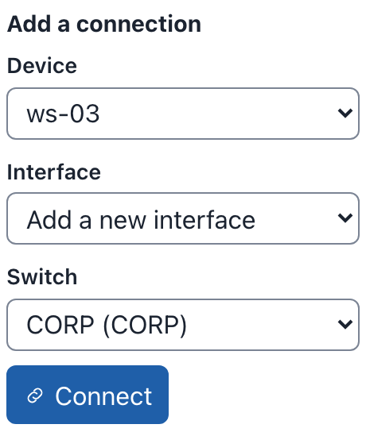
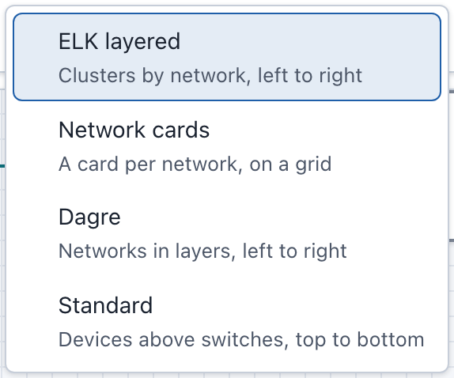
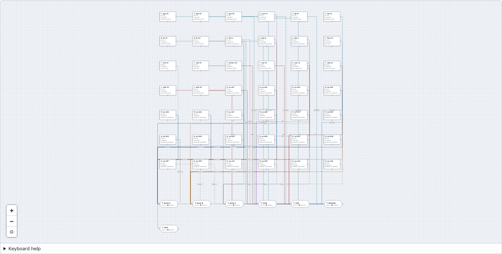
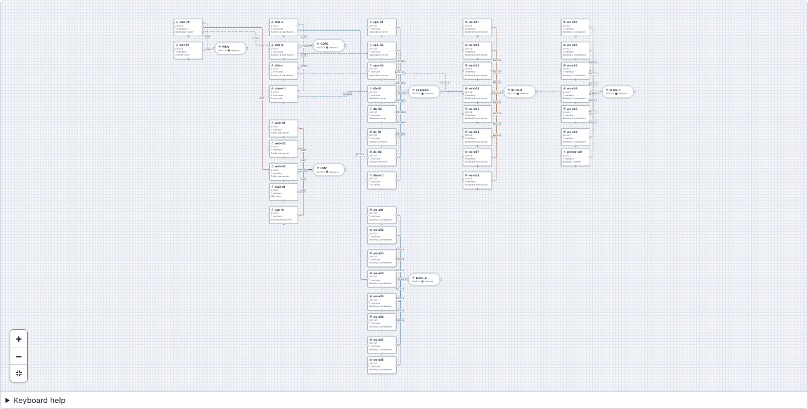
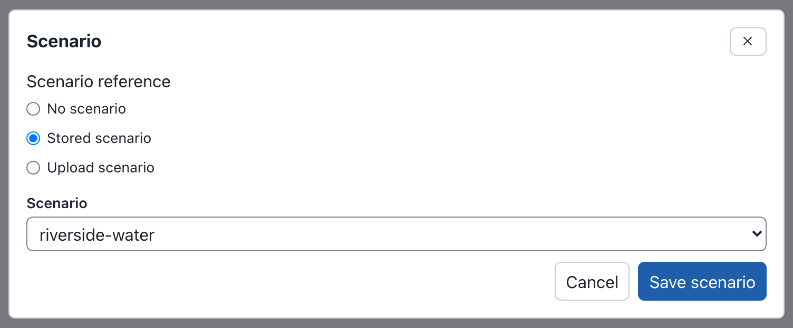

# Building a Diagram

This page shows how to draw and change a diagram: devices, switches and the
connections between them, device settings, groups, notes, layouts and the
scenario. For the parts of the editor that these tasks use, see
[The Editor](editor.md).

The examples on this page use the Riverside Water draft of the
[example lab](index.md#the-drafts-on-these-pages).

## Devices, switches and connections

A diagram describes one phenix Topology config. Each part of the diagram maps
to the topology like this:

| In the diagram | In the published topology |
|---|---|
| A device | A node in `spec.nodes`, with all its settings |
| A switch | A network. The network's name is the VLAN of every interface on it |
| A connection from a device to a switch | An interface of the device, whose `vlan` is the network's name |
| A device from an included topology | Nothing: `includeTopologies` names that topology |
| A note or a group | Nothing: notes and groups only help people read the diagram |

For example, the connection from ws-01 to the CORP switch is this interface
of ws-01:

```yaml
network:
  interfaces:
    - name: eth0
      type: ethernet
      vlan: CORP
      proto: static
      address: 10.10.20.101
      mask: 24
      gateway: 10.10.20.1
```

A connection always joins a device to a switch. Devices never connect to
each other directly: drawing a connection from one device to another adds a
switch between them (see [Connecting interfaces](#connecting-interfaces)).

## Adding devices

**Add nodes**, at the top of the left column, lists what you can add. To add
a device:

- Select the item. The device appears in free space on the canvas, and is
  selected, so the Inspector shows its fields.
- Or drag the item to where you want it on the canvas.
- Or, in the command palette, choose **Add device**, then a template (see
  [Command palette](editor.md#command-palette)).

**Device** adds a device with default settings. The **Device templates**
fill in more:

| Item | Hostname | Type | OS type | Image | Description |
|---|---|---|---|---|---|
| **Device** | node | VirtualMachine | linux | `ubuntu.qc2` | None |
| **Server** | server | VirtualMachine | linux | `ubuntu.qc2` | Generic Linux server |
| **Workstation** | workstation | VirtualMachine | windows | `windows10.qc2` | Operator workstation |
| **Router** | router | Router | minirouter | `minirouter.qc2` | Layer 3 router |
| **Firewall** | firewall | Firewall | minirouter | `minirouter.qc2` | Perimeter firewall |
| **External device** | external | HIL (external) | None | None | Hardware in the loop device |

When the hostname is taken, the new device gets a number, for example
server-2. A new device has no interfaces, so the checks warn "device
"workstation" has no interfaces" until you add one.

For example, to add an engineering workstation to Riverside Water:

1. Under **Device templates**, select **Workstation**. A device named
   workstation appears.
2. In the Inspector, set **Hostname** to `ws-03` and **Description** to
   `CAD workstation`.
3. Select **Apply**.

To connect ws-03 to the CORP network, see
[Connecting interfaces](#connecting-interfaces).

### Routers and firewalls

The **Router** and **Firewall** templates run minirouter. phenix's `vrouter`
app configures the interfaces, routes and rulesets of a device whose type is
Router or Firewall (see [vrouter App](../apps.md#vrouter-app)). For a VyOS
router, such as edge-rtr, set **OS type** to `vyos` and the drive's
**Image** to `vyos.qc2`.

### External devices

An external device is hardware that the experiment connects to, such as
plc-01, the pump station PLC of the example lab. phenix does not start a VM
for it, so it has no image. Give it interfaces as for any other device: they
tell phenix which VLANs the hardware is on. See
[External Nodes](../configuration.md#external-nodes).

## Adding switches and networks

A switch is one network. To add a network:

1. Under **Add nodes**, select **Switch**. A switch appears, with a new
   network named EXP (EXP-2 for the next one, and so on).
2. In the Inspector, set **Name** to the network's name, for example
   `SCADA`, and select **Apply**.

Renaming a network changes the VLAN of every interface on it.

The Inspector of a switch, for example "Network CORP", has these fields:

- **Name**: the network's name, which is the VLAN of the interfaces on it.
- **VLAN alias**: an optional number from 1 to 4094. When you publish the
  diagram with an experiment, it becomes that network's entry in the
  experiment's `vlans.aliases` (see
  [Publishing a topology and an experiment](publishing.md#publishing-a-topology-and-an-experiment)).
- **Description**, **Color** (see [Colors](#colors)) and **Position**.

For example, to give CORP the VLAN alias 120, select the CORP switch, type
`120` in **VLAN alias**, and select **Apply**.

{ width="354" }

A network that a device from an included topology is on cannot be renamed or
removed. Its other fields can still change. In Riverside Water, that is CORP,
where ntp-01 and dns-01 are.

**Networks**, at the bottom of the Outline, lists every network with its VLAN
alias (or "no alias") and the number of devices on it. Each network's
remove button (**Remove network** and the name) removes the network, its
switches and their connections. Deleting a switch on the canvas keeps its network in this list.
A network can have more than one switch on the canvas: a pasted switch, for
example, is another switch of the same network.

## Connecting interfaces

A connection puts a device's interface on a network. There are three ways to
make one. Each example connects ws-03 (see
[Adding devices](#adding-devices)) to the CORP network.

### Drag on the canvas

1. Point at ws-03. Each interface has a connection point (a circle) on the
   device's sides, and a **+** handle at its bottom ("Drag to connect ws-03
   on a new interface").
2. Drag from the **+** handle, or from an unconnected connection point, to
   the CORP switch.

Dragging from **+** adds a new interface to the device. The new connection
appears on the canvas.

Dragging from one device to another adds a new switch between them, with a
new network named EXP, and connects both devices to it. Rename the network
in the switch's Inspector. Two switches cannot be connected, because each
switch is one network.

### Add a connection in the Outline

To connect without dragging, use **Add a connection** in the Outline:

1. In **Device**, choose `ws-03`.
2. Keep **Interface** set to **Add a new interface**, or choose an interface
   that has no connection yet.
3. In **Switch**, choose **CORP (CORP)**.
4. Select **Connect**.

The form before step 4:

{ width="230" }

### Type the VLAN in the Inspector

Typing a network's name in an interface's **VLAN** field connects the
interface to that network's switch when you apply it. This is how the
[quick start](index.md#quick-start) connects ws-03:

1. Select ws-03.
2. In the Inspector, under **Network**, select **Add interface**.
3. Set **Interface kind** to **Static or OSPF**, and select **Switch and
   clear** when Builder v2 asks "Switch Interface kind to Static or
   OSPF?".
4. Enter **Name** `eth0`, **VLAN** `CORP`, **Address** `10.10.20.103`,
   **Mask** `24` and **Gateway** `10.10.20.1`.
5. Select **Apply**. eth0 connects to the CORP switch. **Draft History**
   names the change "Updated device ws-03 and connected eth0 to network
   CORP".

The interface before step 5:

{ width="354" }

The VLAN matches a network's name in any case. Typing another network's name
moves the connection to that network. A VLAN that names no network of the
diagram is kept, but the interface stays unconnected.

### Disconnecting

- In the Inspector's **Connection points**, select **Disconnect** next to
  the interface, for example "eth0 — network CORP".
- Or select the connection on the canvas and press <kbd>⌫</kbd> on macOS or
  <kbd>Delete</kbd> on Windows and Linux.

The interface stays, with no VLAN. An interface with no VLAN blocks
publishing (see [What blocks publishing](publishing.md#what-blocks-publishing)),
so connect it again, type a VLAN for it, or remove it: the trash button next
to it in **Connection points** (**Remove connection point** and its name)
removes the interface. **Add connection point** adds an interface without a
connection. The buttons under **Connection points** take effect at once,
without **Apply**.

## Editing device settings

Select a device to change its settings in the Inspector. Change the fields,
then select **Apply**, or press <kbd>Enter</kbd> in a field. See
[Editing a node](editor.md#editing-a-node) for how the fields and **Apply**
work.

An interface has an **Interface kind**:

- **Static or OSPF**: an address that you give, with **Address**, **Mask**
  and **Gateway**.
- **DHCP or manual**: the address comes from DHCP, or is set inside the VM.
  A new interface starts as this kind.
- **Serial**: a serial link.

Changing the kind asks "Switch Interface kind to Static or OSPF?" (or the
kind you chose), because "Switching clears the Interface kind values entered
so far." **Switch and clear** changes the kind and empties that interface's
fields, **Name** and **VLAN** included. **Keep current value** leaves it as
it was. So set the kind first, then fill in the other fields.

### Duplicating a device

**Duplicate** copies the selected nodes and pastes the copy next to them.
Press <kbd>⌘</kbd>+<kbd>D</kbd> on macOS or <kbd>Ctrl</kbd>+<kbd>D</kbd> on
Windows and Linux. The copy keeps every setting, addresses included, but not
its connections.

For example, to add a second historian:

1. Select historian-01.
2. Press <kbd>⌘</kbd>+<kbd>D</kbd> (<kbd>Ctrl</kbd>+<kbd>D</kbd>). A copy
   named historian-01-2 appears, with the address 10.10.30.20 and an eth0
   that is not connected.
3. The header now says **3 warnings**: both historians use 10.10.30.20, and
   eth0 of historian-01-2 has no VLAN (see
   [Checks and warnings](editor.md#checks-and-warnings)).

The Riverside Water expansion draft is a copy of Riverside Water after
step 2 (see [The drafts on these pages](index.md#the-drafts-on-these-pages)).
To keep Riverside Water unchanged, select **Undo** after step 3. To fix the
warnings, give the copy its own hostname and address, and connect it: see
[Example: Riverside Water expansion](publishing.md#example-riverside-water-expansion).

### Drive images

Each drive has an **Image**. When your role can list the server's disk
images, the field suggests them, and a drive image that the server does not
have is a warning. The checks do not look at images when the server lists
none (see [Checks and warnings](editor.md#checks-and-warnings)).

### Routes and rulesets

**Routes** and **Rulesets** are under **Network**. For example:

- edge-rtr has **Route 1: 10.10.30.0/24**, with **Destination**
  `10.10.30.0/24`, **Next hop** `10.10.20.254` (ot-fw) and **Cost** `1`.
  **Add route** adds another.
- ot-fw has **Ruleset 1: corp-to-ot**, with **Default** `drop` and **Rule 1:
  HTTPS to the historian**, which accepts `tcp` from `10.10.20.0/24` to
  `10.10.30.20` port `443`. The ruleset is used by eth0, whose **Inbound
  ruleset** is `corp-to-ot`.

The `vrouter` app applies them when the experiment starts (see
[vrouter App](../apps.md#vrouter-app)).

## Labels and annotations

A device's labels and annotations are under **More settings**, at the bottom
of its fields. The summary line counts them, for example "Labels (2),
Annotations (1)". Each row has a **Name** and a **Value**, and a remove
button.

For example, web-01 has the labels `zone: dmz` and `role: web`, and the
annotation `phenix/startup-autotunnel` with the value `["8080:80"]`:


To add a label:

1. Select web-01, and open **More settings**.
2. Under **Labels**, select **Add label**.
3. Enter **Name** `team` and **Value** `blue`, and select **Apply**.

**Add annotation** works the same way. An annotation's value is read as
YAML: `true`, `false` and numbers become those values, and `["8080:80"]` is
a list. Apps read annotations to configure a node; see
[Apps](../apps.md).

## Notes

A note is text on the canvas. Publishing ignores it.

1. Under **Add nodes**, select **Note**.
2. In the Inspector, enter the **Text**, for example `OT has no route to the
   internet. From CORP, only HTTPS to historian-01 passes ot-fw.`
3. Select **Apply**.

The Outline names a note after its first line. A note also has a **Color**
(see [Colors](#colors)).

## Groups

A group is a box around nodes, with a title. Publishing ignores it. Moving a
group moves the nodes in it.

To group nodes:

1. Select the nodes: click the first, then Shift-click the others.
2. Select **Group** in the toolbar, or press <kbd>⌘</kbd>+<kbd>G</kbd> on
   macOS or <kbd>Ctrl</kbd>+<kbd>G</kbd> on Windows and Linux.

The new group is named "Group", or "Group 2" and so on when that name is
taken. Select the group to change its **Title** and **Color** in the
Inspector.

To take a group apart, select it and select **Ungroup**
(<kbd>⇧</kbd>+<kbd>⌘</kbd>+<kbd>G</kbd> or
<kbd>Ctrl</kbd>+<kbd>Shift</kbd>+<kbd>G</kbd>). Its nodes stay where they are.

**Group** under **Add nodes** adds an empty group. Dragging a node onto a
group does not put it in the group. Use **Move to a group** in the Outline
instead:

1. In **Node**, choose the node, for example `web-01 (device)`.
2. In **Group**, choose the group, or **No group** to take the node out of
   its group.
3. Select **Move**.

To resize a selected group from the keyboard, press
<kbd>⌥</kbd>+<kbd>⇧</kbd> (<kbd>Alt</kbd>+<kbd>Shift</kbd>) with an arrow key.

## Auto-group

**Auto-group** in the toolbar puts nodes into new groups for you:

- **By network**: "Each network's switch with its devices". A device on
  several networks goes with the smallest of them.
- **By name**: "Devices with names like web-01 and web-02". Devices whose
  hostnames share a stem go together. Switches stay out.

Auto-group groups only the devices and switches that are in no group yet,
and it leaves existing groups as they are. When nodes are selected, it
groups only those. A group needs at least two members. After grouping, it
lays the diagram out with the draft's layout, or with the Settings layout on
a draft without one (see [Layouts](#layouts)), so the groups do not overlap.

For example, **By network** on the imported riverside-water makes the groups
CORP, DMZ, INTERNET and OT, as in the Riverside Water draft. **By name** on
Metro Campus makes six groups: app, db, dc, dist, web and ws. When there is
nothing left to group, Auto-group changes nothing.

**Undo** removes the groups again.

## Colors

Networks, connections, notes and groups have a **Color** field. A network's
color draws its switch and its connections. A connection's own **Color**
overrides its network's.

- Select the swatch button before the field to pick a color: one of the
  suggested colors (Blue, Orange, Green, Purple, Red, Teal, Olive and Plum),
  **Custom color**, or **No color**.
- Or type any CSS color in the field, for example `#1f7a5a` or `teal`.

A new network gets the suggested color that the fewest networks use. The
suggested colors keep their contrast in the light and the dark theme.

## Layouts

The layout menu in the toolbar arranges the whole diagram. It shows the
layout that last arranged the draft, or **Default** when none has. An
imported, uploaded or blank draft starts at **Default**: an import places
its devices in rows on a grid, with the switches below them.

{ width="287" }

| Layout | Menu summary | What it does |
|---|---|---|
| **ELK layered** | Clusters by network, left to right | Clusters each network's switch with its devices, a device on several networks in its smallest one, and runs connections left to right between the clusters. |
| **Network cards** | A card per network, on a grid | A card per network, its devices in a column grouped by name with the switch at their head, and the cards on a grid. |
| **Dagre** | Networks in layers, left to right | Each network's devices in a column beside their switch, and the networks in layers along the connections between them. |
| **Standard** | Devices above switches, top to bottom | The legacy Builder's Auto layout: every device in a row above the switches, from top to bottom. |

**ELK layered** suits most diagrams. The **Layout for drafts without one**
setting describes each layout the same way.

Layouts keep groups together: a group's members stay inside it, and no other
node goes in.

For example, Metro Campus has 42 devices on 7 networks. Imported, it uses
the **Default** grid:



Open the layout menu and choose **ELK layered**:



The draft keeps the layout, and the menu then shows it. Right after a layout
runs, the menu also offers **Restore previous layout** ("Put every node back
where it was"), until you change the diagram some other way. **Undo** puts
the nodes back too.

**Auto layout** in the command palette runs the draft's layout again, or the
Settings layout on a draft at **Default**. **Layout for drafts without one**
in [Settings](editor.md#settings) chooses that layout. **ELK layered** is
the default.

Publishing and export to a Topology config ignore positions and layouts.

## Arranging by hand

- Drag a node, or several selected nodes. Nodes snap to a 16-pixel grid.
- Press <kbd>⇧</kbd> (<kbd>Shift</kbd>) with an arrow key to move the
  selected nodes 10 pixels.
- Type a position: under **Position** in the Inspector, enter **X** and
  **Y**, then select **Move**. For example, move the note of Riverside Water
  to **X** `1248` and **Y** `880`.

A move by hand does not change the layout that the layout menu shows.

## Copy, paste, duplicate and delete

**Copy**, **Paste** and **Delete** are in the toolbar, and **Duplicate** is
in the command palette. Their keys are <kbd>⌘</kbd>+<kbd>C</kbd>,
<kbd>⌘</kbd>+<kbd>V</kbd>, <kbd>⌫</kbd> and <kbd>⌘</kbd>+<kbd>D</kbd> on
macOS, and <kbd>Ctrl</kbd>+<kbd>C</kbd>, <kbd>Ctrl</kbd>+<kbd>V</kbd>,
<kbd>Delete</kbd> and <kbd>Ctrl</kbd>+<kbd>D</kbd> on Windows and Linux (see
[Keyboard shortcuts](editor.md#keyboard-shortcuts)).

**Copy** and **Paste** use Builder v2's own clipboard, not the system
clipboard, so they work between drafts that you open one after the other in
the same browser tab. **Duplicate** copies and pastes in one step.

- A paste lands 40 pixels down and to the right of the original, and each
  further paste 40 pixels further. The pasted nodes are selected.
- A pasted device gets a free hostname, such as server-2, and keeps its
  settings. Connections are pasted only when both ends are copied: copy a
  device with its switch to keep the connection. A pasted device without
  its connection has interfaces with no VLAN.
- Copying a group copies the nodes in it.

**Delete** deletes the selected nodes and connections. Deleting a device
deletes its connections too. Devices from included topologies and their
connections cannot be deleted: Builder v2 says, for example, "dns-01 comes
from included topology corp-services, so it is read only here. Change it in
corp-services."

## Undo and redo

**Undo** and **Redo** in the toolbar step back and forward through your
changes: <kbd>⌘</kbd>+<kbd>Z</kbd> and <kbd>⇧</kbd>+<kbd>⌘</kbd>+<kbd>Z</kbd>
on macOS, <kbd>Ctrl</kbd>+<kbd>Z</kbd> and
<kbd>Ctrl</kbd>+<kbd>Shift</kbd>+<kbd>Z</kbd> (or <kbd>Ctrl</kbd>+<kbd>Y</kbd>)
on Windows and Linux. Each change is a snapshot of the draft on the server,
so undo moves the draft itself back. To go back further than this tab's
changes, use **Draft History** (see [Draft History](drafts.md#draft-history)).

## Attaching a scenario

A diagram can carry a Scenario config, which says which apps run on which
devices. Publishing with an experiment uses it (see
[The scenario](publishing.md#the-scenario)).

To attach the stored scenario riverside-water:

1. Select **Scenario** in the toolbar. With nothing selected, **Add
   scenario** (or **Edit scenario**) in the Inspector does the same.
2. Under **Scenario reference**, choose **Stored scenario**.
3. In **Scenario**, choose `riverside-water`.
4. Select **Save scenario**.

The dialog before step 4:



With nothing selected, the Inspector now says "Stored scenario
riverside-water", and lists each app with its hosts under **Apps and their
hosts**: vrouter on edge-rtr, and ntp on ntp-01, ws-01, ws-02, hmi-01 and
historian-01 (see [With nothing selected](editor.md#with-nothing-selected)).

The other choices:

- **Upload scenario**: choose a file in **Scenario config file (JSON or
  YAML)**, up to 5 MiB. The dialog shows its "Content digest". The diagram
  keeps a copy of the file, and publishing writes it as a Scenario config.
- **No scenario**: detaches the scenario. The configs on the server do not
  change.

A stored scenario is only named in the diagram: publishing uses it as it is
on the server.

## Included topologies

riverside-water includes the topology corp-services, so dns-01 and ntp-01
are in the diagram:

- They have a dashed border and say "Included from corp-services". The
  Outline marks them INCLUDED.
- Their fields are read only (see
  [Fields you cannot change](editor.md#fields-you-cannot-change)), but you
  can move them.
- They cannot be deleted or connected, and their connections cannot be
  deleted.
- The networks they are on (CORP) cannot be renamed or removed.
- The checks give them no warnings, but a device of this diagram that reuses
  their hostname is an error, and one that reuses one of their addresses gets
  a warning.

To change dns-01, change the topology corp-services, then import
riverside-water again (see
[Importing a topology or experiment](import-export.md#importing-a-topology-or-experiment)).
Publishing does not copy included devices: the published topology names
corp-services in `includeTopologies` (see
[Included topologies](publishing.md#included-topologies)).
