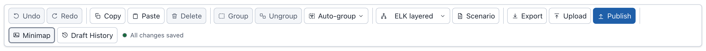
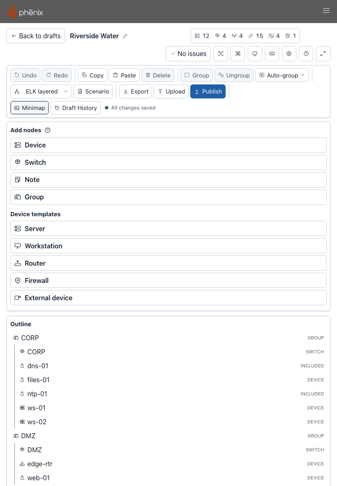
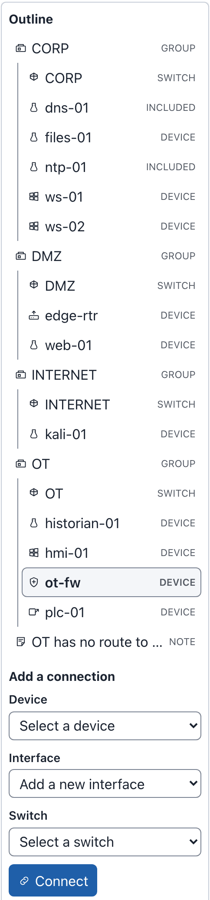
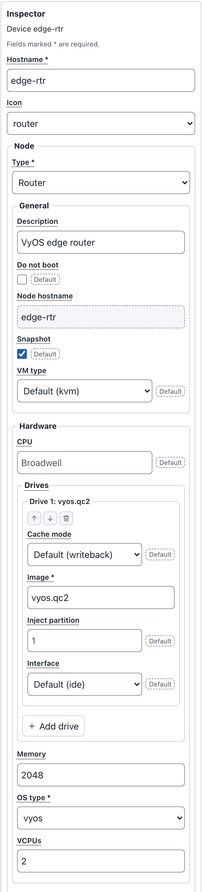
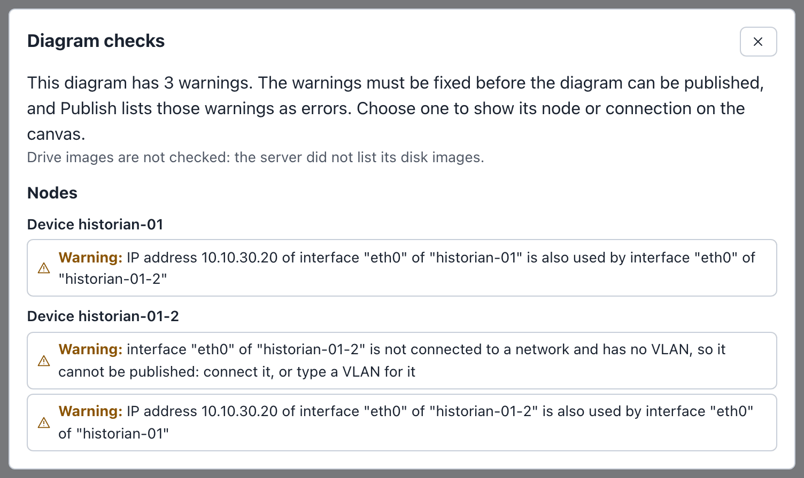
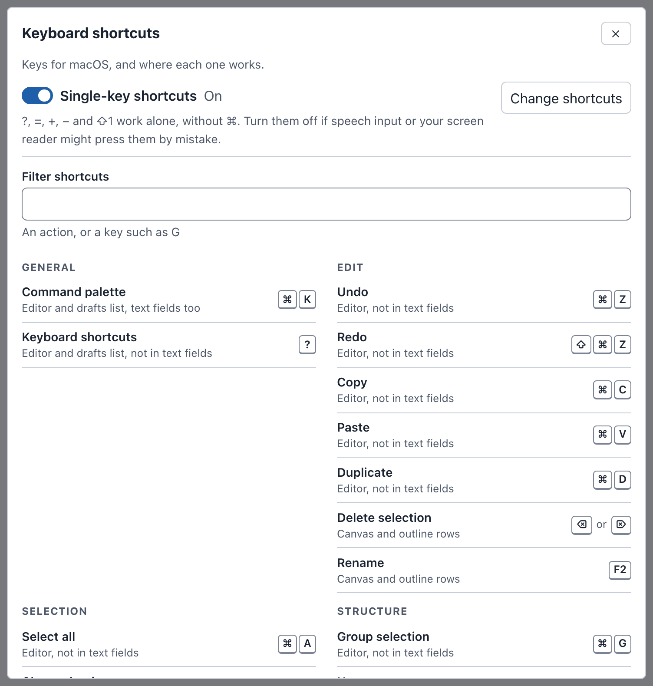
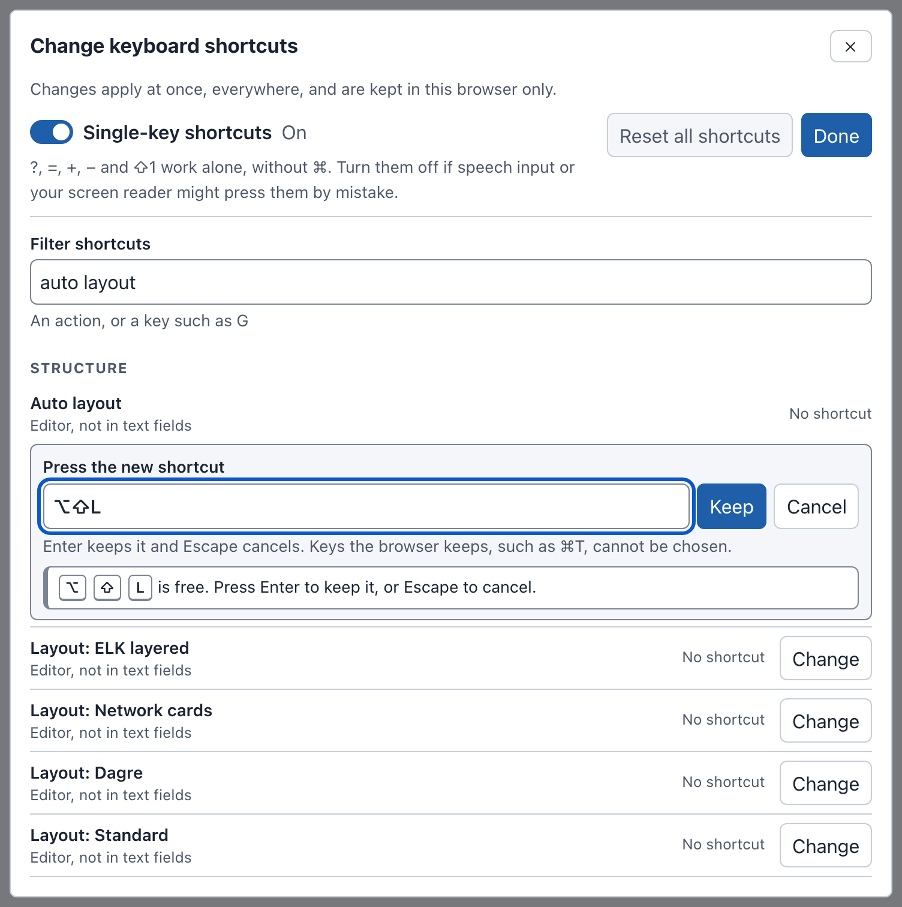
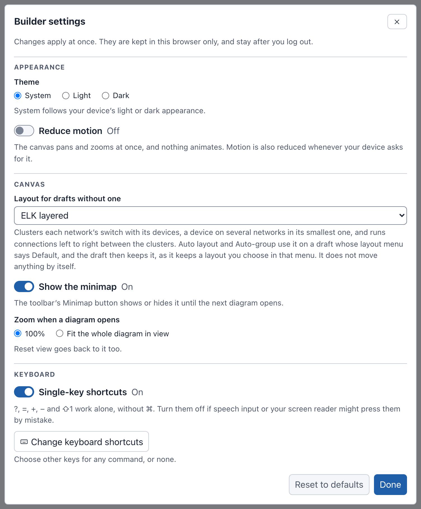

# The Editor

The editor is where you draw and change a diagram. It opens when you open a
draft from the drafts page (see [Opening a draft](drafts.md#opening-a-draft)).
This page describes each part of the editor, its keys and its settings. For
step-by-step tasks, such as adding devices and connecting them, see
[Building a Diagram](diagrams.md).

The examples on this page use the Riverside Water draft of the
[example lab](index.md#the-example-lab).

The editor has five areas:

1. The [header](#header), with the diagram name, its counts, the checks and
   the view buttons.
2. The [toolbar](#toolbar), with the editing, layout, export and publish
   buttons, and the save state.
3. The left column, with **Add nodes** and the [Outline](#outline).
4. The [canvas](#canvas), where the diagram is drawn.
5. The [Inspector](#inspector), where you change what is selected.

## Header

From left to right, the header holds:

- **Back to drafts**: returns to the drafts page without waiting for
  changes to be sent: they keep saving in the background, and the draft's
  card shows how that goes. The button says **Saving…** first only when this
  browser cannot keep your changes, and **Loading…** while the drafts list
  loads, when the list does not show the draft yet.
- The diagram name. A long name is cut off; point at it to see it whole.
- **Edit diagram name** (the pencil): renames the diagram. It is not shown
  when you can only view the draft.
- "Shared by e2e-admin · Can view" (or "Can edit"), on a draft someone
  shared with you (see
  [What the people you share with see](drafts.md#what-the-people-you-share-with-see)).
- The counts: devices, switches, networks, connections, groups and notes.
  Point at a count, or move to it with <kbd>Tab</kbd> and the arrow keys,
  to see its name, for example "12 devices".
- The checks button: **No issues**, or the number of errors and warnings,
  for example **3 warnings**. It opens the **Diagram checks** dialog (see
  [Checks and warnings](#checks-and-warnings)).
- **Reset view**: puts back the column widths, the zoom, the minimap and the
  scroll positions (see [Canvas](#canvas)). It does not change the diagram.
- **Commands**: opens the [command palette](#command-palette).
- The theme button: switches the theme (see [Themes](#themes)).
- **Shortcuts**: opens the [keyboard shortcuts](#keyboard-shortcuts) sheet.
- **Settings**: opens **Builder settings** (see [Settings](#settings)).
- **Help**: opens this Builder v2 documentation in a new tab.
- **Focus mode**: hides the phenix navigation bar (see
  [Focus mode](#focus-mode)).

In a narrower window, the buttons after the checks button show only their
icons. Point at a button, or move focus to it, to see its name in a tooltip.

### Renaming the diagram

To rename the Riverside Water diagram to "Riverside Water lab":

1. Select **Edit diagram name** (the pencil after the name). A field
   replaces the name, with the name selected.
2. Type `Riverside Water lab`.
3. Press <kbd>Enter</kbd>. The header shows the new name.

Press <kbd>Esc</kbd> instead to keep the old name. Leaving the field also
renames the diagram. **Undo** puts the old name back.

The **Name** field of the [Inspector](#with-nothing-selected) changes the
same name. The diagram name is not the name of the topology: you choose
that when you publish (see [Publishing](publishing.md)).

## Toolbar

The toolbar's buttons, from left to right:

| Button | What it does | More |
|---|---|---|
| **Undo**, **Redo** | Undo or redo the last change. | [Undo and redo](diagrams.md#undo-and-redo) |
| **Copy**, **Paste** | Copy the selection, and paste a copy of it 40 pixels down and to the right of the original. Each further paste goes 40 pixels further. | [Copy, paste, duplicate and delete](diagrams.md#copy-paste-duplicate-and-delete) |
| **Delete** | Delete the selected nodes and connections. | [Copy, paste, duplicate and delete](diagrams.md#copy-paste-duplicate-and-delete) |
| **Group**, **Ungroup** | Put the selected nodes in a new group, or take a selected group apart. | [Groups](diagrams.md#groups) |
| **Auto-group** | A menu: **By network** or **By name**. | [Auto-group](diagrams.md#auto-group) |
| Layout menu | Lays the diagram out. It shows the draft's layout, or **Default** when no layout has run. | [Layouts](diagrams.md#layouts) |
| **Scenario** | Attach a scenario to the diagram. | [Attaching a scenario](diagrams.md#attaching-a-scenario) |
| **Export** | Save the diagram as a file. | [Exporting](import-export.md#exporting) |
| **Upload** | Open a Builder document as a new draft. | [Uploading a Builder document](import-export.md#uploading-a-builder-document) |
| **Publish** | Write Topology, Scenario and Experiment configs. | [Publishing](publishing.md) |
| **Share** | Choose who can open the draft. Shown to the owner when phenix has sign-in enabled and their role has `configs` `update`. Shown, unavailable, to the people the draft is shared with. | [Sharing a draft](drafts.md#sharing-a-draft) |
| **Minimap** | Show or hide the minimap. | [Canvas](#canvas) |
| **Draft History** | List the draft's snapshots, and restore one. | [Draft History](drafts.md#draft-history) |

After **Draft History** comes the save state, for example "All changes
saved". A **Retry saving** button follows it when a save fails. See
[How drafts save](drafts.md#how-drafts-save).

A button that does not apply now is unavailable. For example, **Ungroup**
is unavailable until you select a group. When you can only view a draft,
the editing buttons are unavailable.

Point at a button to see its keyboard shortcut in a tooltip, for example
"Undo (⌘Z)" on macOS and "Undo (Ctrl+Z)" on Windows and Linux.

## Canvas

The canvas shows the diagram: devices, switches, notes and groups, and the
connections between devices and switches.

- **Select** a node or connection: click it. Shift-click adds a node to the
  selection or takes it out. Click an empty spot to clear the selection.
- **Move** a node: drag it. Nodes snap to a 16-pixel grid. Dragging a group
  moves the nodes in it.
- **Pan**: drag an empty spot of the canvas.
- **Zoom**: use the mouse wheel, or the zoom controls at the bottom left:
  **Zoom in**, **Zoom out** and **Fit diagram to view**. After a fit, the
  third button is named **Restore previous view** and puts back the zoom and
  position from before the fit.
- **Connect**: drag from a device's connection point to a switch (see
  [Connecting interfaces](diagrams.md#connecting-interfaces)).

A device shows its hostname, its kind, its number of interfaces and its
description. Point at a device to see its whole description. A device from
an included topology has a dashed border and says where it comes from, for
example "Included from corp-services" on dns-01 and ntp-01 (see
[Included topologies](diagrams.md#included-topologies)). A node with a
warning has a warning mark at its top left corner (see
[Checks and warnings](#checks-and-warnings)).

The minimap at the bottom right shows the whole diagram, with the visible
part outlined. To resize it, drag the **Resize minimap** handle at its top
left corner. **Minimap** in the toolbar shows or hides it until the next
diagram opens. The Settings choose whether it shows at first (see
[Settings](#settings)).

**Keyboard help**, under the canvas, lists the keys that work on the canvas.
Its **Show all keyboard shortcuts** button opens the full list (see
[Keyboard shortcuts](#keyboard-shortcuts)).

**Reset view** in the header sets the zoom back to how diagrams open (100%,
or the whole diagram, as the Settings say). It also shows the minimap at its
default size (unless the Settings turn it off), shows both side columns at
their default widths, closes the sections you opened, and scrolls the
columns back to the top. It does not change the diagram.

## Side columns

The left column holds **Add nodes** and the **Outline**. The right column
holds the **Inspector**. Beside each column are two toggles:

- **Widen Add nodes and Outline** and **Widen Inspector** make the column as
  wide as it can be. Select the toggle again to go back.
- **Hide Add nodes and Outline** and **Hide Inspector** fold the column into
  a narrow strip, which gives the canvas more room. The strip holds the
  toggle that shows the column again.

To set a width yourself, drag the splitter between the column and the
canvas (**Resize Add nodes and Outline**, **Resize Inspector**). Double-click
it to go back to the default width.

Selecting a node or connection on the canvas shows a hidden Inspector.
The browser remembers the widths and the hidden columns.

In a window narrower than about 900 pixels, the columns stack: the toolbar,
**Add nodes** and the **Outline** come first, then the canvas and the
**Inspector**. Every column shows, and the page scrolls.

## Add nodes

**Add nodes** lists what you can add: **Device**, **Switch**, **Note** and
**Group**, then the **Device templates** **Server**, **Workstation**,
**Router**, **Firewall** and **External device**. Select an item to add it
to the diagram, or drag it onto the canvas. The new node is placed in free
space and selected. See [Adding devices](diagrams.md#adding-devices).

## Outline

{ width="242" }

The **Outline** lists every node of the diagram as a tree: each group with
the nodes in it, then the nodes that are in no group. Each row shows what
the node is: GROUP, SWITCH, DEVICE, INCLUDED (a device from an included
topology) or NOTE. Selecting a row selects the node on the canvas, and the
canvas shows it.

Keys in the Outline:

- <kbd>↑</kbd> and <kbd>↓</kbd> move between rows; <kbd>Home</kbd> and
  <kbd>End</kbd> go to the first and last row.
- <kbd>Enter</kbd> or <kbd>Space</kbd> selects a row, or deselects it when
  it is the only one selected. <kbd>Shift</kbd>+<kbd>Enter</kbd> adds a row
  to the selection or takes it out.
- <kbd>F2</kbd> renames the node in place, in a field on its row.
  <kbd>Enter</kbd> keeps the new name, and <kbd>Esc</kbd> cancels. (On the
  canvas, <kbd>F2</kbd> moves focus to the name in the Inspector instead.)
- <kbd>Delete</kbd> removes the row, or the selection it is in.

Below the tree, the Outline has three more parts:

- **Add a connection**: connects a device to a switch without dragging (see
  [Connecting interfaces](diagrams.md#connecting-interfaces)).
- **Move to a group**: puts a node in a group, or takes it out with **No
  group** (see [Groups](diagrams.md#groups)).
- **Networks**: each network, with its VLAN alias (or "no alias"), the
  number of devices on it, and a button to remove it (see
  [Adding switches and networks](diagrams.md#adding-switches-and-networks)).

## Inspector

The **Inspector** shows the fields of what is selected, and changes them.
It works on one node or one connection at a time. With nothing selected, or
with several items selected, it shows the diagram itself.

### With nothing selected

{ width="354" }

The **Diagram** section has:

- **Name** and **Description** of the diagram. Select **Apply** to keep a
  change.
- **Annotations**: for a draft imported from a config, the annotations of
  that config, under "From Topology riverside-water, imported" and the
  date. They are shown only: publishing does not write them. A diagram
  drawn in the editor has no such list. See
  [What an import keeps](import-export.md#what-an-import-keeps).
- **Scenario**: "No scenario." and **Add scenario**, or the attached scenario
  ("Stored scenario riverside-water"). Under **Apps and their hosts**, each
  app of the scenario is listed with the hosts it runs on: vrouter on
  edge-rtr, and ntp on ntp-01, ws-01, ws-02, hmi-01 and historian-01.
  **Edit scenario** opens the **Scenario** dialog (see
  [Attaching a scenario](diagrams.md#attaching-a-scenario)).

### Editing a node

{ width="354" }

Select a node to see its fields. A device has these sections:

- **Hostname** and **Icon**.
- **Node**: **Type**, and **General** (**Description**, **Do not boot**,
  **Node hostname**, **Snapshot**, **VM type**).
- **Hardware**: **CPU**, **Drives** (**Image** and more for each drive),
  **Memory**, **OS type** and **VCPUs**.
- **Network**: **Interfaces**, **OSPF**, **Routes** and **Rulesets**.
- **More settings**: **Commands**, **Delay**, **Injections**, **Advanced
  settings**, **Labels** and **Annotations**.
- **Connection points**: the interfaces with a handle on the canvas.
- **Position**: **X** and **Y**, and **Move**.

Fields marked \* are required. An empty optional field shows the value phenix
uses in its place, marked as the default, for example "Default (kvm)" for
**VM type**.

Changes in the Inspector take effect when you apply them:

1. Change one or more fields. A bar at the bottom of the Inspector says
   "Unapplied changes", with **Apply** and **Cancel**.
2. Select **Apply**, or press <kbd>Enter</kbd> in a field. The diagram
   changes, and the change is saved.

**Cancel** drops the changes. **Apply** is unavailable while a field you
changed has an error; the bar then says "Fix the fields marked with errors".

For example, to change the description of ws-01:

1. In the **Outline**, select ws-01.
2. In **Description**, replace "Engineering workstation" with
   `Engineering workstation, CAD`.
3. Press <kbd>Enter</kbd>. The change is applied.

If you select another node before you apply, the Inspector applies your
changes when they are valid, and drops them when they are not. Applied
changes appear in Draft History, for example as "Applied changes to Device
ws-01". Leaving the draft,
publishing or exporting also saves changes you did not apply. They appear
in Draft History as "Saved unapplied changes to" and the node's name.

**Connection points** are the exception: adding, disconnecting or removing
one takes effect at once, without **Apply**.

The fields come from the phenix server, so they match what it accepts. When
the server cannot send them, the Inspector says so, for example "Could not
load this server's form fields. … The Inspector shows the fields built into
the Builder instead, which may differ from what this server accepts." See
[Permissions](administration.md#permissions).

### Other kinds of nodes

- A switch is one network. Its Inspector ("Network CORP") has **Name**,
  **VLAN alias**, **Description**, **Color** and **Position**. See
  [Adding switches and networks](diagrams.md#adding-switches-and-networks).
- A note has **Text**, **Color** and **Position** (see
  [Notes](diagrams.md#notes)).
- A group has **Title**, **Color** and **Position** (see
  [Groups](diagrams.md#groups)).
- A connection has **Label** (by default, the network's name) and **Color**.
  Its Inspector names it, for example "Connection from ntp-01 (eth0) to
  CORP".

### Fields you cannot change

Some fields are read only:

- A device from an included topology says "Defined by included topology
  corp-services, so it is read only here. Change it in corp-services, then
  import it again from the drafts page. It can still be moved."
- A network that an included device is on cannot be renamed. For CORP the
  Inspector says "Network CORP cannot be renamed: ntp-01 from included
  topology corp-services is on it. Its other fields can still change."
- Every field is read only in a draft you can only view, and in a published
  diagram (see [Published diagrams](drafts.md#published-diagrams)).

## Checks and warnings

Builder v2 checks the diagram as you edit it. The checks button in the
header shows the result: **No issues**, or a count such as **3 warnings**.

To see and fix the warnings of the Riverside Water expansion draft:

1. Open the Riverside Water expansion draft. The checks button says
   **3 warnings**.
2. Select **3 warnings**. The **Diagram checks** dialog lists the warnings
   under **Nodes**, by device.
3. Select the warning "Warning: interface "eth0" of "historian-01-2" is not
   connected to a network and has no VLAN, so it cannot be published:
   connect it, or type a VLAN for it". The dialog closes and the canvas
   selects historian-01-2.
4. The Inspector lists the device's own warnings under "Checks: 2 warnings".
   Fix them there (see
   [What blocks publishing](publishing.md#what-blocks-publishing) for this
   example).

There are two levels:

- **Errors**, such as a required field left empty. The diagram cannot be
  published until they are fixed.
- **Warnings**. Three kinds also stop the diagram from being published: an
  interface with no VLAN (on a device that is not external), an IP or MAC
  address that two interfaces use, and a hostname phenix refuses.
  **Publish** lists those as errors. The dialog says so, for example "The
  warnings must be fixed before the diagram can be published, and Publish
  lists those warnings as errors." Other warnings, such as a device with no
  interfaces, do not stop publishing.

Each node with a problem has a warning mark on the canvas. Devices from
included topologies get no warnings: they belong to their own topology. This
diagram's devices are still checked against them: a hostname an included
device also uses is an error, and an address it also uses is a warning.

When the server lists no disk images, the dialog says "Drive images are not
checked: the server did not list its disk images." Otherwise a drive image
the server does not have is a warning.

## Command palette

The command palette runs any command by name, and finds nodes and networks.

To open it, select **Commands** in the header, or press
<kbd>⌘</kbd>+<kbd>K</kbd> on macOS or <kbd>Ctrl</kbd>+<kbd>K</kbd> on Windows
and Linux. The keys work in text fields too. The palette also works on the
drafts page.

The field says "Type a command, @ for nodes, # for networks":

- Type words to find commands, for example `layout`. Commands are listed in
  groups such as **General**, **Structure**, **Add**, **Go to**, **View**
  and **Draft**. A command shows its keys, if it has any.
- With a selection, the first group, for example "Selected: historian-01",
  holds commands for it, such as "Rename historian-01" and **Duplicate**.
- When you open the palette, a **Recent** group lists the commands you ran
  last.
- A command that does not apply now says why, for example "Unavailable:
  There is no earlier layout to restore."
- A command marked **›** takes a second step. For example, **Add device**
  then lists the templates: **Device**, **Server**, **Workstation**,
  **Router**, **Firewall** and **External device**. Press
  <kbd>⌫</kbd> (<kbd>Backspace</kbd>) in the empty field to go back a step.
- Type `@` and a name, an image, a network or an address to find nodes.
  `@10.10.30.20` finds historian-01.
- Type `#` to list the networks, found by name or VLAN alias. Choose one to
  select its switch.

Press <kbd>↑</kbd> and <kbd>↓</kbd> to move, <kbd>Enter</kbd> to run, and
<kbd>Esc</kbd> to close. On a node, <kbd>Shift</kbd>+<kbd>Enter</kbd> adds it
to the selection.

For example, to find the historian:

1. Press <kbd>⌘</kbd>+<kbd>K</kbd> (<kbd>Ctrl</kbd>+<kbd>K</kbd>).
2. Type `@hist`. The palette lists historian-01 ("Device · ubuntu.qc2 · in
   OT · OT") and the note that names it.
3. Press <kbd>Enter</kbd>. The canvas selects historian-01, and the
   Inspector shows it.

<kbd>⇧</kbd>+<kbd>⌘</kbd>+<kbd>O</kbd> (<kbd>Ctrl</kbd>+<kbd>Shift</kbd>+<kbd>O</kbd>)
opens the palette at **Go to node**, which lists every node.

## Keyboard shortcuts

To see every shortcut, select **Shortcuts** in the header, or press
<kbd>?</kbd> outside a text field. The sheet shows the keys of your
platform ("Keys for macOS, and where each one works." or "Keys for Windows
and Linux, and where each one works."). Type in **Filter shortcuts** to find
an action, or a key such as `G`.

The default shortcuts:

| Action | Where it works | macOS | Windows and Linux |
|---|---|---|---|
| Command palette | Editor and drafts list, text fields too | <kbd>⌘</kbd>+<kbd>K</kbd> | <kbd>Ctrl</kbd>+<kbd>K</kbd> |
| Keyboard shortcuts | Editor and drafts list, not in text fields | <kbd>?</kbd> | <kbd>?</kbd> |
| Undo | Editor, not in text fields | <kbd>⌘</kbd>+<kbd>Z</kbd> | <kbd>Ctrl</kbd>+<kbd>Z</kbd> |
| Redo | Editor, not in text fields | <kbd>⇧</kbd>+<kbd>⌘</kbd>+<kbd>Z</kbd> | <kbd>Ctrl</kbd>+<kbd>Shift</kbd>+<kbd>Z</kbd> or <kbd>Ctrl</kbd>+<kbd>Y</kbd> |
| Copy | Editor, not in text fields | <kbd>⌘</kbd>+<kbd>C</kbd> | <kbd>Ctrl</kbd>+<kbd>C</kbd> |
| Paste | Editor, not in text fields | <kbd>⌘</kbd>+<kbd>V</kbd> | <kbd>Ctrl</kbd>+<kbd>V</kbd> |
| Duplicate | Editor, not in text fields | <kbd>⌘</kbd>+<kbd>D</kbd> | <kbd>Ctrl</kbd>+<kbd>D</kbd> |
| Delete selection | Canvas and outline rows | <kbd>⌫</kbd> or <kbd>⌦</kbd> | <kbd>Delete</kbd> or <kbd>Backspace</kbd> |
| Rename | Canvas and outline rows | <kbd>F2</kbd> | <kbd>F2</kbd> |
| Select all | Editor, not in text fields | <kbd>⌘</kbd>+<kbd>A</kbd> | <kbd>Ctrl</kbd>+<kbd>A</kbd> |
| Clear selection | Canvas | <kbd>esc</kbd> | <kbd>Esc</kbd> |
| Select or deselect the focused item | Canvas and outline rows | <kbd>↩</kbd> or <kbd>Space</kbd> | <kbd>Enter</kbd> or <kbd>Space</kbd> |
| Add the focused item to the selection, or take it out | Canvas and outline rows | <kbd>⇧</kbd>+<kbd>↩</kbd> | <kbd>Shift</kbd>+<kbd>Enter</kbd> |
| Move to the nearest node that way | Canvas | <kbd>←</kbd> <kbd>↑</kbd> <kbd>→</kbd> <kbd>↓</kbd> | <kbd>←</kbd> <kbd>↑</kbd> <kbd>→</kbd> <kbd>↓</kbd> |
| Move through the focused node's connections | Canvas | <kbd>⇟</kbd> or <kbd>⇞</kbd> | <kbd>PgDn</kbd> or <kbd>PgUp</kbd> |
| Move the selected nodes 10 pixels | Canvas | <kbd>⇧</kbd> with an arrow key | <kbd>Shift</kbd> with an arrow key |
| Resize the selected group 10 pixels | Canvas | <kbd>⌥</kbd>+<kbd>⇧</kbd> with an arrow key | <kbd>Alt</kbd>+<kbd>Shift</kbd> with an arrow key |
| Move between outline rows | Outline rows | <kbd>↑</kbd> <kbd>↓</kbd> <kbd>↖</kbd> <kbd>↘</kbd> | <kbd>↑</kbd> <kbd>↓</kbd> <kbd>Home</kbd> <kbd>End</kbd> |
| Group selection | Editor, not in text fields | <kbd>⌘</kbd>+<kbd>G</kbd> | <kbd>Ctrl</kbd>+<kbd>G</kbd> |
| Ungroup | Editor, not in text fields | <kbd>⇧</kbd>+<kbd>⌘</kbd>+<kbd>G</kbd> | <kbd>Ctrl</kbd>+<kbd>Shift</kbd>+<kbd>G</kbd> |
| Go to node | Editor, not in text fields | <kbd>⇧</kbd>+<kbd>⌘</kbd>+<kbd>O</kbd> | <kbd>Ctrl</kbd>+<kbd>Shift</kbd>+<kbd>O</kbd> |
| Zoom in | Canvas | <kbd>=</kbd> or <kbd>+</kbd> | <kbd>=</kbd> or <kbd>+</kbd> |
| Zoom out | Canvas | <kbd>−</kbd> | <kbd>−</kbd> |
| Fit diagram to view | Canvas | <kbd>⇧</kbd>+<kbd>1</kbd> | <kbd>Shift</kbd>+<kbd>1</kbd> |
| Focus mode | Editor and drafts list, text fields too | <kbd>⇧</kbd>+<kbd>⌘</kbd>+<kbd>F</kbd> | <kbd>Ctrl</kbd>+<kbd>Shift</kbd>+<kbd>F</kbd> |
| Save now | Editor, text fields too | <kbd>⌘</kbd>+<kbd>S</kbd> | <kbd>Ctrl</kbd>+<kbd>S</kbd> |

On a Mac keyboard without these keys, <kbd>⇟</kbd> and <kbd>⇞</kbd> are
<kbd>Fn</kbd> with <kbd>↓</kbd> and <kbd>↑</kbd>, and <kbd>↖</kbd> and
<kbd>↘</kbd> (Home and End) are <kbd>Fn</kbd> with <kbd>←</kbd> and
<kbd>→</kbd>. <kbd>⌫</kbd> is Delete and <kbd>⌦</kbd> is Forward Delete.

Other commands, such as **Auto layout** and **Settings…**, have no keys
until you give them some.

### Single-key shortcuts

<kbd>?</kbd>, <kbd>=</kbd>, <kbd>+</kbd>, <kbd>−</kbd> and
<kbd>⇧</kbd>+<kbd>1</kbd> work alone, without <kbd>⌘</kbd> or
<kbd>Ctrl</kbd>. Turn off **Single-key shortcuts** in the sheet or in
Settings if speech input or your screen reader might press them by mistake.
The palette and the buttons still run those commands.

### Customizing shortcuts

You can give any command other keys, or none. For example, to run
**Auto layout** with <kbd>⌥</kbd>+<kbd>⇧</kbd>+<kbd>L</kbd>
(<kbd>Alt</kbd>+<kbd>Shift</kbd>+<kbd>L</kbd> on Windows and Linux):

1. Select **Shortcuts** in the header.
2. Select **Change shortcuts**. The sheet is now named **Change keyboard
   shortcuts**, and it lists every command, with or without keys.
3. In **Filter shortcuts**, type `auto layout`.
4. On the **Auto layout** row, select **Change**. The row says "Press the
   new shortcut".
5. Press <kbd>⌥</kbd>+<kbd>⇧</kbd>+<kbd>L</kbd>. The row shows the keys and
   says they are free: "Press Enter to keep it, or Escape to cancel."
6. Press <kbd>Enter</kbd>, or select **Keep**.
7. Select **Done**, then close the sheet.

The sheet after step 5:

Now open the Metro Campus draft, click an empty spot of the canvas, and press
<kbd>⌥</kbd>+<kbd>⇧</kbd>+<kbd>L</kbd>. The draft is laid out with **ELK
layered**, the layout Settings chooses for a draft that has none (see
[Layouts](diagrams.md#layouts)).

When you press keys that another command uses, the row says so, for
example that <kbd>⌘</kbd>+<kbd>G</kbd> "already runs Group selection". Select
**Use for** and the command's name, for example **Use for Layout: Network
cards**, to move the keys to this command, or press other keys. Keys the
browser keeps, such as <kbd>⌘</kbd>+<kbd>T</kbd>, cannot be chosen.

Each changed row has **Remove** (no keys) and **Reset** (its default keys).
**Reset all shortcuts** puts every command back to its default keys. The
tooltips, the palette and **Keyboard help** show your keys. The browser
keeps them, and they stay after you log out.

## Settings

Select **Settings** in the header to open **Builder settings**. Changes
apply at once. The browser keeps them, and they stay after you log out.

- **Theme**: **System**, **Light** or **Dark**. System follows your
  device's light or dark appearance.
- **Reduce motion**: the canvas pans and zooms at once, and nothing
  animates. Motion is also reduced whenever your device asks for it.
- **Layout for drafts without one**: **ELK layered** (the default),
  **Network cards**, **Dagre** or **Standard**. **Auto layout** and
  **Auto-group** use it on a draft whose layout menu says **Default**, and
  the draft then keeps it. It does not move anything by itself.
- **Show the minimap**: on by default. The toolbar's **Minimap** button
  shows or hides it until the next diagram opens.
- **Zoom when a diagram opens**: **100%** (the default) or **Fit the whole
  diagram in view**. **Reset view** goes back to it too.
- **Single-key shortcuts**: see [Single-key shortcuts](#single-key-shortcuts).
- **Change keyboard shortcuts**: see
  [Customizing shortcuts](#customizing-shortcuts).

**Reset to defaults** puts every setting back. It does not change custom
shortcut keys; **Reset all shortcuts** in the shortcuts sheet does that.
Select **Done** to close the dialog.

## Focus mode

Focus mode hides the phenix navigation bar, so Builder v2 fills the
window. Select **Focus mode** in the header, or press
<kbd>⇧</kbd>+<kbd>⌘</kbd>+<kbd>F</kbd>
(<kbd>Ctrl</kbd>+<kbd>Shift</kbd>+<kbd>F</kbd>). The button is then named
**Exit focus mode**; select it or press the same keys to show the
navigation bar again.

Focus mode stays on when you go between the drafts page and the editor. It
ends when you leave Builder v2.

## Themes

Builder v2 has a light and a dark theme. The theme button in the header
shows the theme in use: **System**, **Light** or **Dark**. Each press
switches to the next one, and its tooltip says which, for example "Theme:
System. Switch to Dark theme". On a device with a light appearance the
order is System, Dark, Light; on a dark one it is System, Light, Dark.
**Theme** in [Settings](#settings) sets the same choice.

The theme changes Builder v2 only, not the rest of phenix. PNG and SVG
exports use the background of the theme in use.

## Accessibility

You can use Builder v2 with a keyboard only, and with a screen reader.

- Press <kbd>Tab</kbd> from the top of the page to reach **Skip to diagram
  canvas**, which moves focus to the canvas.
- The diagram is one <kbd>Tab</kbd> stop. The arrow keys move to the
  nearest node that way; from the canvas itself they go to the node nearest
  the middle of the view. <kbd>PgDn</kbd> and <kbd>PgUp</kbd> move through
  the focused node's connections.
- <kbd>Enter</kbd> or <kbd>Space</kbd> selects the focused item.
  <kbd>Shift</kbd> with an arrow key moves the selection. <kbd>Delete</kbd>
  deletes it.
- The toolbar is one <kbd>Tab</kbd> stop too: the arrow keys,
  <kbd>Home</kbd> and <kbd>End</kbd> move between its buttons.
- To add nodes and connect them without a pointer, use **Add nodes** and the
  Outline's **Add a connection**.
- A screen reader announces what each change did, for example "Updated
  device ws-01." With a screen reader, turn on its focus mode (forms mode in
  JAWS) for the canvas keys, or use the Outline, which lists every node.
- **Reduce motion** in Settings stops the animations.
- In a narrow window, or at a high browser zoom, the columns stack (see
  [Side columns](#side-columns)).

Builder v2 aims to meet WCAG 2.2 level AA.
