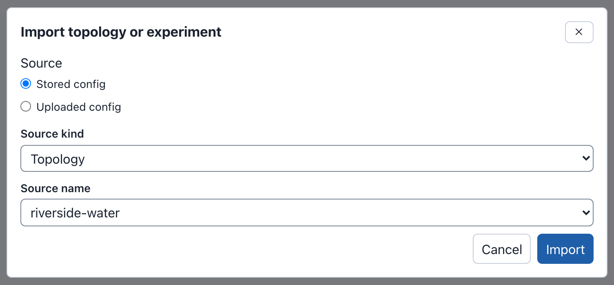
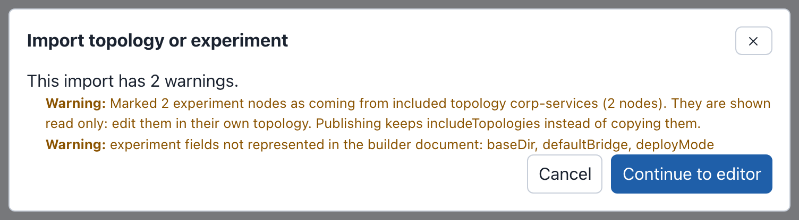
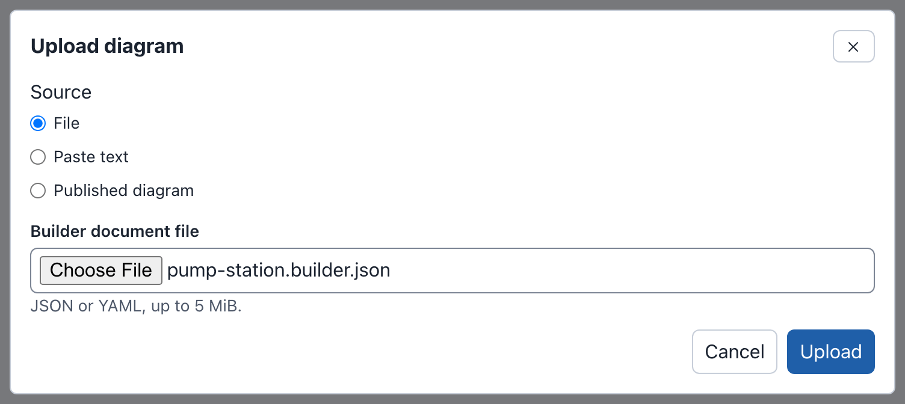
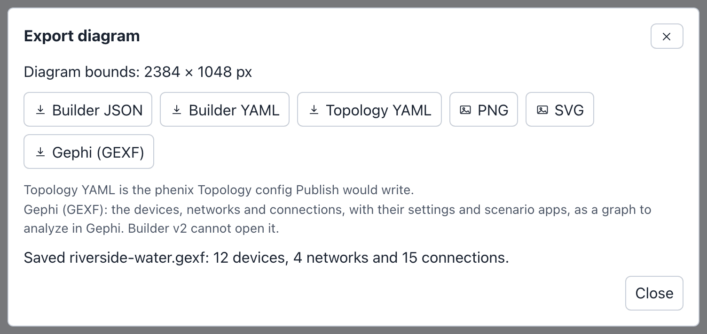

# Import and Export

Builder v2 can start a draft from a phenix config or from a Builder v2
file, and it can save a diagram as a file in six formats. None of this
changes a config on the phenix server: only **Publish** writes configs (see
[Publishing](publishing.md)).

| To | Use | Where | Result |
|---|---|---|---|
| Start from a Topology or Experiment config | **Import** | Drafts page | A new draft |
| Open a Builder document, or a published diagram | **Upload** | Drafts page and editor toolbar | A new draft |
| Save the diagram as a file | **Export** | Editor toolbar | A file |

The examples on this page use the [example lab](index.md#the-example-lab).

## Importing a topology or experiment

**Import** makes a draft from a Topology or Experiment config. The config can
be one stored in phenix, or a file you upload. The phenix server converts
the config, so the draft holds what phenix would read from it.

### From a stored config

To import the riverside-water topology:

1. On the drafts page, select **Import**. The **Import topology or
   experiment** dialog opens.
2. Keep **Source** set to **Stored config**, and **Source kind** set to
   **Topology**.
3. In **Source name**, choose `riverside-water`.
4. Select **Import**. The dialog says "This import has 1 warning." and lists
   it: "Added 2 nodes from included topology corp-services (2 nodes). They
   are shown read only: edit them in their own topology. Publishing keeps
   includeTopologies instead of copying them."
5. Select **Continue to editor**.

The dialog in step 3:



The editor opens a new draft named riverside-water. The header counts 12
devices, 4 switches, 4 networks and 15 connections. The layout menu says
**Default**: the devices are in rows on a grid, with the switches below
them. Choose a layout to arrange them (see [Layouts](diagrams.md#layouts)).

To stop at step 5, select **Cancel**: the dialog closes and no draft is
made. An import without warnings opens the editor at once, without step 5.

### Importing an experiment

An experiment imports the same way. To import the riverside experiment:

1. Select **Import**.
2. Keep **Stored config**. Set **Source kind** to **Experiment**, and choose
   `riverside` in **Source name**.
3. Select **Import**. The dialog says "This import has 2 warnings."
4. Select **Continue to editor**. The new draft is named riverside.

The warnings in step 3:



An imported experiment differs from an imported topology in these ways:

- The draft keeps the experiment's scenario. When your role can list the
  stored Scenario that the experiment names, the draft refers to it: the
  Inspector says "Stored scenario riverside-water". Otherwise the draft
  keeps the experiment's own copy of the scenario, as an uploaded scenario,
  and the import warns: "scenario "riverside-water" is not available on this
  server, so the experiment's copy of it is attached as an uploaded
  scenario".
- The experiment's VLAN aliases become the **VLAN alias** of each network.
- Some experiment fields have no place in a diagram. The import names them,
  for example "experiment fields not represented in the builder document:
  baseDir, defaultBridge, deployMode". The experiment's VLAN range is not
  kept either.
- The files that the experiment's apps injected into VMs when it started
  are left out, without a warning. The topology's own injections are kept.

### Importing an uploaded config

An uploaded config does not need to be stored in phenix first. To import
the pump station of the example lab from
[pump-station.topology.yaml](examples/pump-station.topology.yaml):

1. Select **Import**.
2. Set **Source** to **Uploaded config**.
3. In **Topology or Experiment config**, choose `pump-station.topology.yaml`.
   The file can be JSON or YAML, up to 5 MiB.
4. Select **Import**.

This config has no warnings, so the editor opens at once. The new draft is
named pump-station, after the config. It has 3 devices (station-rtr, rtu-01
and eng-ws-01), 2 switches, 2 networks (WAN and STATION) and 4 connections.

Importing an uploaded config needs the `configs` `create` permission. A
draft made from an uploaded config can publish a new topology. It cannot
update a stored config, even one with the same name (see
[Publishing](publishing.md)).

An uploaded Experiment config always keeps its own copy of its scenario, and
the import says so: "the uploaded experiment's copy of scenario
"riverside-water" is attached as an uploaded scenario, not this server's
stored scenario of that name".

phenix reads an uploaded config as it reads one created with
`phenix config create`. That includes `${NAME}` and `${NAME:default}`, which
phenix fills in from the environment of the phenix server. For example, this
interface in pump-station.topology.yaml:

```yaml
          - name: eth0
            type: ethernet
            vlan: WAN
            proto: static
            address: ${STATION_WAN_ADDRESS:198.51.100.20}
            mask: 24
            gateway: 198.51.100.1
```

imports with the address `198.51.100.20` when the server has no
`STATION_WAN_ADDRESS` variable.

!!! warning
    Anyone who may create configs can read the phenix server's environment
    variables this way, as with `phenix config create`. See
    [sandialabs/sceptre-phenix#436](https://github.com/sandialabs/sceptre-phenix/pull/436).

### What an import keeps

- Every node, as a device, with all of its settings: hardware, interfaces,
  routes, rulesets, labels, annotations, injections and the rest.
- One network, and one switch, for each VLAN the interfaces use. Each
  interface with a VLAN is connected to that network's switch. An interface
  without a VLAN is kept, but not connected.
- The devices of included topologies, read only (see
  [Included topologies](diagrams.md#included-topologies)). For
  riverside-water these are dns-01 and ntp-01 from corp-services.
- The annotations of the config itself, such as `maintainer: range-team`
  and `purpose: Water utility training range` on riverside-water. The
  Inspector shows them with nothing selected, under "From Topology
  riverside-water, imported" and the date. They are shown only: publishing
  does not write them. Annotations whose names start with `builder-` are
  left out. A draft keeps at most 100 annotations, and 256 KiB of them in
  all; the import warns about the rest.
- No positions: an import is always laid out on the **Default** grid.

A warning names anything else the import left out or changed.

Import makes a draft, which needs the `configs` `create` permission.
Importing a stored config also needs permission to read it. See
[Permissions](administration.md#permissions).

## Uploading a Builder document

A Builder document is Builder v2's own file: the diagram with all its
settings, positions, groups, notes and scenario. **Builder JSON** and
**Builder YAML** export one (see [Builder JSON and YAML](#builder-json-and-yaml)).
**Upload** opens a Builder document as a new draft. The draft you have open,
if any, does not change.

To upload the pump station as a Builder document, from
[pump-station.builder.json](examples/pump-station.builder.json):

1. Select **Upload**, on the drafts page or in the editor toolbar. The
   **Upload diagram** dialog opens.
2. Keep **Source** set to **File**. In **Builder document file**, choose
   `pump-station.builder.json`.
3. Select **Upload**. The editor opens a new draft named "Pump station",
   the name the document gives the diagram.

The dialog in step 2:



The dialog has two other sources:

- **Paste text**: paste the document into **Document text (JSON or YAML)**,
  then select **Upload**.
- **Published diagram**: choose a diagram in **Published diagram** ("Select
  a diagram"), then select **Open**. This opens your draft of that published
  diagram, or makes one the first time, as **Edit as a draft** does (see
  [Published diagrams](drafts.md#published-diagrams)).

**Upload** refuses a file it cannot use, and says why:

- A Topology or Experiment config, for example: "A Topology config is not a
  Builder document. Use Import on the drafts page so the server can convert
  it." Import it instead (see
  [Importing an uploaded config](#importing-an-uploaded-config)).
- A file that is not JSON or YAML, such as a GEXF file: "Could not parse the
  document: …".
- A file over 5 MiB: "The uploaded file is larger than the 5 MiB limit."

A Builder document keeps everything, so an export and an upload give the
same diagram. For example, export Riverside Water as **Builder YAML**, then
upload `riverside-water.yaml`: the new draft has the same 12 devices,
4 groups and note, the same **ELK layered** layout, and the same scenario.

Upload makes a draft, which needs the `configs` `create` permission.

## Exporting

To export the Riverside Water diagram:

1. Open the Riverside Water draft.
2. Select **Export** in the toolbar. The **Export diagram** dialog opens. It
   shows the size of the whole diagram: "Diagram bounds: 2384 × 1048 px".
3. Select a format. The browser saves the file, and the dialog says so, for
   example "Saved riverside-water.json."
4. Select **Close**.



| Button | File for Riverside Water | What it holds | Open it with |
|---|---|---|---|
| **Builder JSON** | `riverside-water.json` | The whole Builder document | **Upload** |
| **Builder YAML** | `riverside-water.yaml` | The same, as YAML | **Upload** |
| **Topology YAML** | `riverside-water.topology.yaml` | The Topology config **Publish** would write | `phenix config create`, or **Import** as an uploaded config |
| **PNG** | `riverside-water.png` | A picture of the whole diagram | An image viewer |
| **SVG** | `riverside-water.svg` | The same picture, as SVG | A web browser |
| **Gephi (GEXF)** | `riverside-water.gexf` | The devices, networks and connections as a graph | Gephi |

The file name is the diagram name in lower case, with a hyphen for each run
of other characters than letters, digits, `.`, `_` and `-`. "Riverside Water"
gives `riverside-water`.

Export works in every draft you can open, including one you can only view,
and in a published diagram. Before the dialog opens, Builder v2 saves the
changes you made in the Inspector but did not apply. When it cannot apply
them, the dialog says why, for example "Your changes to Device ws-01 in the
Inspector cannot be exported until Hostname is fixed. Fix or cancel them
first.", and no export is made.

### Builder JSON and YAML

Builder JSON and Builder YAML hold the whole Builder document: every node
with its settings and position, the networks, the connections, the groups
and notes, the layout, the scenario and where the diagram was imported
from. The YAML file begins like this:

```yaml
$schema: https://phenix.sandia.gov/schemas/builder/v1
revision: 1
id: 35923065-de11-56bc-9e1d-a307308716a7
name: Riverside Water
description: 'Water utility training range: internet edge, DMZ, corporate and OT networks.'
nodes:
  - id: 017b57e6-1d23-5555-a576-d0cdc682109a
    kind: device
    label: edge-rtr
```

Use them to keep a copy of a draft, to move a diagram to another phenix
server, or to hand it to someone. **Upload** opens them as a new draft (see
[Uploading a Builder document](#uploading-a-builder-document)). The phenix
server describes the format as a JSON Schema at `/api/v1/schemas/builder-v2/v1`.

### Topology YAML

**Topology YAML** is the phenix Topology config that **Publish** would write
for the diagram. The phenix server makes it the way **Publish** does, and
checks it the same way. Nothing is written on the server.

The Riverside Water diagram exports as this Topology (the first node shown;
the file has ten):

```yaml
apiVersion: phenix.sandia.gov/v1
kind: Topology
metadata:
    name: Riverside-Water
spec:
    includeTopologies:
        - corp-services
    nodes:
        - annotations:
            vrouter/enable-ssh: eth2
          general:
            description: VyOS edge router
            hostname: edge-rtr
          hardware:
            drives:
                - image: vyos.qc2
            memory: 2048
            os_type: vyos
            vcpus: 2
          labels:
            zone: edge
          network:
            interfaces:
                - address: 203.0.113.2
                  gateway: 203.0.113.1
                  mask: 24
                  name: eth0
                  proto: static
                  type: ethernet
                  vlan: INTERNET
                - address: 172.16.10.1
                  mask: 24
                  name: eth1
                  proto: static
                  type: ethernet
                  vlan: DMZ
                - address: 10.10.20.1
                  mask: 24
                  name: eth2
                  proto: static
                  type: ethernet
                  vlan: CORP
            routes:
                - cost: 1
                  destination: 10.10.30.0/24
                  next: 10.10.20.254
          type: Router
```

What to note in the file:

- `metadata.name` is the topology name the Publish dialog proposes: the
  diagram name with a hyphen for each run of characters a config name
  cannot hold. "Riverside Water" gives `Riverside-Water`. Change it in the
  file to load the file under another name.
- The metadata holds no annotations: neither those of an imported config
  nor the one publishing adds to name the published diagram.
- The devices of included topologies (dns-01 and ntp-01) are not in
  `nodes`. `includeTopologies` names corp-services instead, as publishing
  does.
- Each interface's `vlan` is the name of the network it is connected to.
- Notes, groups, colors and positions are not in the file.

To store the file in phenix as a Topology config named `Riverside-Water`:

```bash
phenix config create riverside-water.topology.yaml
```

A topology stored this way is a plain Topology config: Builder v2 did not
publish it, so editing it from **Configs** does not open Builder v2.

When the diagram cannot be published yet, the file is still saved, and the
dialog lists every reason. The Riverside Water expansion draft gives:
"Saved riverside-water-expansion.topology.yaml. This topology cannot be
published yet: interface "eth0" of device "historian-01-2" has no VLAN:
connect it to a network, or type a VLAN for it; IP address 10.10.30.20 is
used by interface "eth0" of device "historian-01" and interface "eth0" of
device "historian-01-2"."


This makes **Topology YAML** a quick way to see every problem that
publishing would report (see
[What blocks publishing](publishing.md#what-blocks-publishing)). When
phenix could not accept the config at all, the dialog shows the error and no
file is saved.

Topology YAML needs the `configs` `get` permission.

### PNG and SVG

**PNG** and **SVG** draw the whole diagram, not only the part in view. The
picture covers the diagram bounds that the dialog shows, and is scaled to
at most 4096 pixels on its longer side. The Riverside Water PNG is 4096 ×
1801 pixels.

The picture leaves out what is only there for editing: the selection, the
connection points and the warning marks. Its background follows the theme:
white in the light theme, dark in the dark theme (see
[Themes](editor.md#themes)).

The SVG holds the diagram as HTML inside the SVG. Web browsers show it; some
drawing programs cannot.

### Gephi (GEXF)

**Gephi (GEXF)** saves the network as a graph for
[Gephi](https://gephi.org/) and other tools that read GEXF 1.3. Builder v2
cannot open this file.

The graph has:

- A node for each device, and one for each network. All the switches of a
  network are one node.
- An edge for each connection, from the device to its network. The edge
  label is the interface and its address, for example "eth0
  10.10.30.20/24".
- The colors and positions of the diagram. Colors written in hex or `rgb()`
  are kept; a color written as a name, such as `red`, is not.

Notes and groups are not nodes. A node's groups are in its **Group** and
**Groups** columns instead.

Each node and edge carries columns with its settings. A column is in the
file only when some node or edge has a value for it. For Riverside Water:

- Node columns: **Node kind** (device or switch), **Hostname**,
  **Description**, **Device type**, **OS type**, **vCPUs**, **Memory (MB)**,
  **Disk images**, **External**, **Icon**, **Included from**, **Group**,
  **Groups**, **Interfaces**, **Interfaces (text)**, **Interface count**,
  **VLANs**, **VLANs (text)**, **IP addresses**, **IP addresses (CIDR)**,
  **Gateways**, **Routes**, **Route count**, **Rulesets**, **Injection
  count**, **Scenario apps**, **Scenario apps (text)**, **Scenario app
  count**, **Labels**, **Labels (text)**, **Network** and **Attached
  interfaces** (for networks), and one column for each label and annotation
  name, such as **Label: zone** and **Annotation: vrouter/enable-ssh**.
- Edge columns: **Device**, **Network**, **Interface**, **Interface type**,
  **Protocol**, **IP address**, **Prefix length**, **IP address (CIDR)**,
  **Gateway**, **Ruleset in**, **QinQ** and **Autostart**.

Other diagrams can have more, such as **MAC addresses**, **VLAN alias** and
**Disabled scenario apps**.

The **Scenario apps** columns list the apps of the diagram's scenario that
run on each device: historian-01 has `ntp`. For a stored scenario, Export
reads the scenario from the server first. When it cannot, the file has no
app columns, and the dialog says why, for example "It lists no scenario
apps: your role cannot read scenario riverside-water."

The dialog counts what it saved: "Saved riverside-water.gexf: 12 devices, 4
networks and 15 connections."

#### Opening the file in Gephi

These steps use the menu names of Gephi 0.10 and 0.11.

1. In Gephi, select **File** > **Open**, and choose `riverside-water.gexf`.
2. The **Import report** shows **# of Nodes:** 16 (12 devices and 4
   networks), **# of Edges:** 15 and **Graph Type:** Undirected. Select
   **OK**.
3. Select **Data Laboratory** to see the columns of the nodes and edges.

#### Filtering by network or address

To show only the connections on the OT network:

1. In **Overview**, open the **Filters** panel.
2. In **Library**, open **Attributes** > **Equal**.
3. Drag the edges' **Network** column (listed as "Network String (Edge)")
   into **Queries**.
4. Type `OT` in its field, then select **Filter**.

To show the connections with an address in 10.10.30.0/24, use the edges'
**IP address** column instead, select **Use regex**, and type
`10\.10\.30\..*`. The expression must match the whole value.

To find devices by VLAN, use the nodes' **VLANs (text)** column. It holds
the VLANs of a device separated by `|`, for example `INTERNET|DMZ|CORP` for
edge-rtr. Select **Use regex** and type `(.*\|)?OT(\|.*)?` to keep the
devices on OT and the OT network itself.
