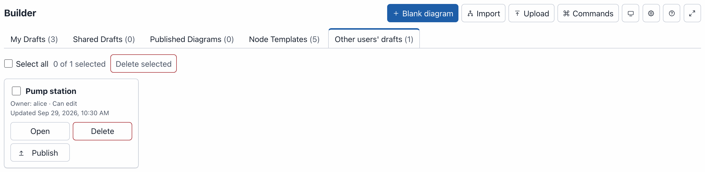

# Administration

This page is for phenix administrators. It covers the permissions the
Builder's users need, the built-in Builder role, where it keeps drafts,
published diagrams and libraries, the `builder-doc` annotation, Builder
documents kept in files, its REST API, and what to do when something goes
wrong.

## Availability

The Builder is part of every phenix server. There is nothing to enable, and
no setting turns it off. Roles control who can use it (see
[Permissions](#permissions)):

- the navigation bar shows **Builder** to users whose role has `configs`
  `list`;
- the editor is at `/builder`;
- the Builder API routes answer under `/api/v1/builder` (see
  [REST API](#rest-api)).

Builder works over plain HTTP. Only **Copy link** in the Share dialog
needs HTTPS (see `--tls-key` and `--tls-cert` in `phenix ui --help`), or a
phenix opened as `localhost`: otherwise it shows the link for the user to
copy by hand.

## Permissions

Builder gives a user no more than their role's config permissions, with
one exception: a role that is limited to some topology names does not limit
which Builder files its users can read (see
[Who can read a Builder file](#who-can-read-a-builder-file)).
Every Builder request needs the `configs` permission of the same verb:
`list` to list drafts, `get` to open one, `create` to make one, `update` to
save a change, and `delete` to delete one. See
[Resource: `configs`](../user-administration.md#resource-configs) and
[Roles](../user-administration.md#roles).

How the users of a server see Builder depends on its authentication
mode (see [User Authn/Authz in phenix](../user-administration.md)):

- With authentication disabled, everyone works as the same user,
  `global-admin`, with the Global Admin role. Everyone sees and changes the
  same drafts, under **My Drafts**. No one can share a draft, because
  sharing needs user accounts.
- With authentication enabled, each user has their own drafts and can share
  them.

Of the built-in roles, three have `configs` permissions:

- **Global Admin** can do everything, including opening, changing and
  deleting every user's drafts, and publishing templates server-wide.
- **Builder** holds every Builder permission (see
  [The Builder role](#the-builder-role)).
- **Global Viewer** can open every draft and published diagram, read only.
  Other users' drafts appear under **Other users' drafts** with **Can
  view**.

The Experiment and VM roles have no `configs` permissions, so their users do
not see Builder. Give Builder users the Builder role, or a role such as the
[example roles](#example-roles) below.

### The Builder role

phenix has a built-in role for the people who draw and publish topologies:
**Builder** (`builder`). It holds every Builder permission:

- `configs` `list`, `get`, `create`, `update` and `delete`, on Topology,
  Scenario and Experiment configs only (`Topology/*`, `Scenario/*` and
  `Experiment/*`). It gives no access to User, Role or Image configs, so a
  Builder user cannot read accounts or change roles;
- `builder-drafts` `list`, `get`, `update` and `delete`, on every draft: it
  lists, opens, changes and deletes other users' drafts (see
  [Other users' drafts](#other-users-drafts));
- `builder-templates` `publish`: it publishes templates server-wide, and
  takes back any user's server-wide template (see
  [Server-wide templates](#server-wide-templates));
- `builder-icons` `update` and `delete`: it renames and deletes the icons
  other users uploaded (see [Icons of other users](#icons-of-other-users));
- `schemas` `get`, for the Inspector's fields;
- `topologies` and `scenarios` `list` and `get`, `experiments` `list`,
  `get`, `create` and `update`, and `disks` `list`, for Import, Publish and
  the drive image suggestions.

```yaml
apiVersion: phenix.sandia.gov/v1
kind: Role
metadata:
  name: builder
spec:
  roleName: Builder
  policies:
  - resources:
    - configs
    resourceNames:
    - "Topology/*"
    - "Scenario/*"
    - "Experiment/*"
    verbs:
    - list
    - get
    - create
    - update
    - delete
  - resources:
    - builder-drafts
    resourceNames:
    - "*"
    - "*/*"
    verbs:
    - list
    - get
    - update
    - delete
  - resources:
    - builder-templates
    verbs:
    - publish
  - resources:
    - builder-icons
    verbs:
    - update
    - delete
  - resources:
    - schemas
    resourceNames:
    - "*"
    verbs:
    - get
  - resources:
    - topologies
    - scenarios
    resourceNames:
    - "*"
    verbs:
    - list
    - get
  - resources:
    - experiments
    resourceNames:
    - "*"
    verbs:
    - list
    - get
    - create
    - update
  - resources:
    - disks
    resourceNames:
    - "*"
    verbs:
    - list
```

Each time `phenix ui` starts, it makes sure the role exists:

- On a store with no role named `builder`, and none whose role name is
  `Builder`, it creates the role above. So a store made before the role
  existed gets it too, and a deleted role comes back at the next start.
- A role of that name that is already stored, such as one an administrator
  made, keeps its policies. If it cannot publish templates server-wide, or
  rename or delete other users' icons, it gains the `builder-templates`
  `publish` or `builder-icons` `update` and `delete` policy it lacks, and so
  do the users it is assigned to. Nothing else in it changes.

Assign the role to a user on the **Users** page (see
[Updating Users](../user-administration.md#updating-users)). For a site
that wants its users to have less, such as no access to other users' drafts
or no server-wide templates, use the [example roles](#example-roles)
instead.

### What each task needs

| Task | Permissions |
|---|---|
| See the **Builder** tab, and list drafts and published diagrams | `configs` `list` |
| Open a draft or a published diagram | `configs` `get`; for a published diagram, or the diagram of a topology that names a Builder file, on that topology, such as `Topology/riverside-water`. The topology's name does not protect the file itself (see [Who can read a Builder file](#who-can-read-a-builder-file)) |
| Make a draft: **Blank diagram**, **Import**, **Upload**, **Edit as a draft**, **Save my history as a new draft** | `configs` `create` |
| Import a stored config | Also `configs` `get` on the config, such as `Topology/riverside-water`, and `topologies` `list` (or `experiments` `list`) on its name |
| Import a config file | `configs` `create` |
| Convert a legacy Builder diagram with **Upload** | `configs` `get` and `configs` `create` |
| Open a topology in Builder from the **Configs** page | `configs` `list`, and `configs` `get` on the topology; to import it, also `configs` `create` |
| Save changes, undo, redo, and restore or delete a snapshot | `configs` `update` |
| Delete your own draft | `configs` `delete` |
| Share your own draft | `configs` `update`, and authentication enabled |
| Publish from a draft's card on the drafts page | As **Publish** in the editor |
| See **Exp**, which opens the experiment a publication made | `experiments` `get` on that experiment |
| Add a stored scenario to a diagram | `configs` `list` and `scenarios` `list` |
| Store a scenario file from the **Scenarios** dialog | `configs` `create` on `Scenario/<name>`; to replace a scenario of that name, `configs` `get` and `configs` `update` on it |
| See the apps of a diagram's scenario in the Inspector | `configs` `get` on `Scenario/<name>` |
| Download **Topology YAML** | `configs` `get` |
| Use the **Publish** button | `configs` `update` |
| Publish a topology | `configs` `create` on `Topology/<name>` for a new topology, `configs` `update` to update one. For a draft imported from a stored config, also `configs` `get` and `topologies` `get` (or `experiments` `get`) on that config |
| Publish an experiment | `experiments` `create` and `configs` `create` on `Experiment/<name>`; `update` of both to update one |
| Publish a diagram that lists scenarios | `configs` `get` and `scenarios` `list` on each `Scenario/<name>` it lists, and `configs` `update` on each whose `topology` annotation does not name the topology yet |
| Delete a published topology | `configs` `delete` on `Topology/<name>` |
| Get the Inspector's fields from the server | `schemas` `get` on `builder` |
| Get drive image suggestions and missing-image checks | `disks` `list` |
| List, open, change or delete other users' drafts | `builder-drafts` (see [Other users' drafts](#other-users-drafts)) |
| See and use the server's icons | `configs` `list` |
| Upload an icon, and add a diagram's icons to the server with **Upload** | `configs` `create` |
| Rename an icon you uploaded | `configs` `update` |
| Delete an icon you uploaded | `configs` `delete` |
| Rename or delete another user's icon | Also `builder-icons` `update` or `delete` (see [Icons of other users](#icons-of-other-users)) |
| See the **Node Templates** tab, use templates, and **Export** them | `configs` `list` |
| Add templates and collections, **Save to library**, **Copy to my library**, **Import templates** | `configs` `create` |
| Edit templates and collections, add to and remove from a collection | `configs` `update` |
| Delete templates and collections | `configs` `delete` |
| Share templates and collections with users | `configs` `update`, and authentication enabled |
| Publish templates and collections server-wide | `configs` `update` and `builder-templates` `publish` (see [Server-wide templates](#server-wide-templates)) |
| Take back another user's server-wide template | `configs` `update` and `builder-templates` `publish` |

Import and Publish read included topologies, such as `corp-services`, with
the user's `configs` `get` and `topologies` `list` permissions. An include
the user cannot read is reported as a warning.

phenix reads an imported config file as it reads a new config on the Configs
page: it fills in `${NAME}` and `${NAME:default}` from the server's
environment. So anyone whose role may create configs can read the server's
environment variables this way (see
[sandialabs/sceptre-phenix#436](https://github.com/sandialabs/sceptre-phenix/pull/436)).

A share does not replace these permissions. A user with a **Can view** share
still needs `configs` `get` to open the draft, and a user with **Can edit**
also needs `configs` `update` to save changes and the publish permissions to
publish.

!!! note
    Publishing adds the topology to the `topology` annotation of each
    scenario the diagram lists, in either mode, which needs `configs`
    `update` on a scenario that does not name the topology yet. When a role
    may create topologies but not update `Scenario/riverside-water`,
    publishing the Riverside Water diagram as `riverside-water-b` fails, and
    the Publish dialog says "Could not publish the diagram. Adding topology
    riverside-water-b to scenario riverside-water not allowed for", followed
    by the user's name. A scenario that names the topology already needs no
    update. A listed scenario the role cannot read is refused as one that
    does not exist: "Scenario NAME does not exist."

### Other users' drafts

A user always sees their own drafts and the drafts shared with them. The
`builder-drafts` resource lets a role reach other users' drafts too, for
example to help a user or to clean up after someone leaves:

| Verb | What it allows |
|---|---|
| `list` | List other users' drafts under **Other users' drafts** |
| `get` | Open another user's draft, read only |
| `update` | Change another user's draft (shown as **Can edit**) |
| `delete` | Delete another user's draft: **Delete** on its card, under **Other users' drafts**, or `DELETE /api/v1/builder/drafts/{owner}/{draft}` |

`builder-drafts` has no `create` verb, and no verb lets a role share another
user's draft: only the owner shares a draft. The `configs` permission of the
same verb is still needed.

The resource names are `<owner>/<draft id>`. Use `"*/*"` for every draft, or
`alice/*` for the drafts of one user. A bare `"*"` matches no draft, because
`*` does not match the `/` in the name.

This policy lets a role list, open, change and delete every user's drafts:

```yaml
- resources:
  - builder-drafts
  resourceNames:
  - "*/*"
  verbs:
  - list
  - get
  - update
  - delete
```

This one lets a role list and open the drafts of `alice` only:

```yaml
- resources:
  - builder-drafts
  resourceNames:
  - "alice/*"
  verbs:
  - list
  - get
```



### Server-wide templates

Users keep device templates in their own template library on the server
(see [Node Templates](templates.md)).
They can share templates and collections with named users, which needs
`configs` `update` and authentication enabled, or publish them
server-wide, for every user of the server. Everyone with `configs` `list`
sees server-wide templates. With authentication disabled there is one user, so
the Node Templates tab offers no **Share**.

Publishing server-wide needs the `builder-templates` resource with the verb
`publish`, besides `configs` `update`. It takes no resource names:

```yaml
- resources:
  - builder-templates
  verbs:
  - publish
```

A role with it can also take back any user's server-wide template or
collection. The owner of an item can take it back without it. Of the
built-in roles, Global Admin and Builder have it.

A user's template library is their own: no role, not even Global Admin or
one with `builder-drafts`, reads or changes another user's library. Taking
back a server-wide item is the one exception. The security log records each
change of who an item is shared with, each server-wide publication and its
removal, and each request for another user's library.

### Icons of other users

The server keeps one icon library, which every user with `configs` `list`
sees and uses (see [Custom icons](diagrams.md#custom-icons)). The user who
uploaded an icon can rename it, with `configs` `update`, and delete it, with
`configs` `delete`. The `builder-icons` resource lets a role rename and
delete every user's icons, for example to tidy up names or to remove an icon
that should not be there:

| Verb | What it allows |
|---|---|
| `update` | Rename another user's icon. Its old name keeps naming it |
| `delete` | Delete another user's icon, with all its names |

It takes no resource names, and the `configs` permission of the same verb is
still needed:

```yaml
- resources:
  - builder-icons
  verbs:
  - update
  - delete
```

Of the built-in roles, Global Admin and Builder have it. Without it, the
Custom icons dialog shows no **Rename** or **Delete** on another user's icon,
and the server answers 403. The server logs each upload, rename and delete
of an icon with the user who made it.

### Example roles

The [Builder role](#the-builder-role) gives its users everything. For a site
that wants less, two example roles cover the usual needs. Download them from
[topology-designer.role.yaml](examples/roles/topology-designer.role.yaml)
and [topology-reviewer.role.yaml](examples/roles/topology-reviewer.role.yaml).

**Topology Designer** creates drafts, imports and uploads, and publishes
topologies, scenarios and experiments. It sees only its own drafts and the
drafts shared with it. It keeps its own template library and shares
templates with users, but cannot publish them server-wide:

```yaml
apiVersion: phenix.sandia.gov/v1
kind: Role
metadata:
  name: topology-designer
spec:
  roleName: Topology Designer
  policies:
  - resources:
    - configs
    resourceNames:
    - "Topology/*"
    - "Scenario/*"
    - "Experiment/*"
    verbs:
    - list
    - get
    - create
    - update
    - delete
  - resources:
    - topologies
    - scenarios
    resourceNames:
    - "*"
    verbs:
    - list
    - get
  - resources:
    - experiments
    resourceNames:
    - "*"
    verbs:
    - list
    - get
    - create
    - update
  - resources:
    - disks
    resourceNames:
    - "*"
    verbs:
    - list
  - resources:
    - schemas
    resourceNames:
    - "*"
    verbs:
    - get
```

**Topology Reviewer** opens drafts shared with it and published diagrams. It
cannot create drafts, import, upload or publish. It lists the templates
shared with it and the server-wide ones, and can view them, but cannot copy,
share or publish them:

```yaml
apiVersion: phenix.sandia.gov/v1
kind: Role
metadata:
  name: topology-reviewer
spec:
  roleName: Topology Reviewer
  policies:
  - resources:
    - configs
    resourceNames:
    - "Topology/*"
    - "Scenario/*"
    - "Experiment/*"
    verbs:
    - list
    - get
  - resources:
    - topologies
    - scenarios
    - experiments
    resourceNames:
    - "*"
    verbs:
    - list
    - get
  - resources:
    - schemas
    resourceNames:
    - "*"
    verbs:
    - get
```

Both name the three config kinds the Builder uses, `Topology/*`,
`Scenario/*` and `Experiment/*`, for `configs`. Do not use `"*/*"` there:
it also matches User and Role configs, so a user could read password hashes
and change accounts and roles. To let
Topology Designer manage every user's drafts, add the `builder-drafts`
policy from [Other users' drafts](#other-users-drafts). To let it publish
templates server-wide, add the `builder-templates` policy from
[Server-wide templates](#server-wide-templates).

To add the roles, store them as configs:

```bash
phenix config create topology-designer.role.yaml topology-reviewer.role.yaml
```

Then assign a role to a user on the **Users** page (see
[Updating Users](../user-administration.md#updating-users)).

!!! note
    phenix copies a role's policies into a user when you assign the role.
    After you change a Role config, assign the role to its users again.

### What users without a permission see

Builder hides or turns off what a user's role does not allow. The
server still checks every request.

- Without `configs` `list`, the navigation bar has no **Builder** tab.
- Without `configs` `create`, the drafts page has no **Blank diagram**,
  **Import** and **Upload** buttons. It shows the note "Your role can open
  drafts and published diagrams, but not create drafts." An empty **My
  Drafts** tab says "You have no drafts." In the editor, **Upload** is
  unavailable. The command palette still lists **Blank diagram**, marked
  "Unavailable: Your role cannot create drafts."
- Without `configs` `update`, **Publish** is unavailable, and the command
  palette gives the reason "Your role cannot publish diagrams." The user
  cannot share their own drafts: **Share** is not shown on them. On a draft
  shared with the user, the toolbar shows **Share**, unavailable.
- Without `schemas` `get`, the Inspector shows a message that starts "Could
  not load this server's form fields." and ends "The Inspector shows the
  fields built into the Builder instead, which may differ from what this
  server accepts." The Inspector still works, with those built-in fields.
- Without `disks` `list`, the Inspector does not suggest drive images, and
  the **Diagram checks** dialog says "Drive images are not checked: the
  server did not list its disk images." The dialog says the same when the
  server lists no images, for example while minimega is not running.
- On the **Node Templates** tab, **New template** and **New collection**
  need `configs` `create`, **Edit** needs `configs` `update`, and
  **Delete** needs `configs` `delete`. A role without them sees the
  templates but not those buttons.
- In the **Custom icons** dialog, **Rename** and **Delete** show on the
  icons the user uploaded, with `configs` `update` and `delete`, and on
  every icon with `builder-icons` too.
- Without `experiments` `get` on the experiment a publication made, there
  is no **Exp** button for it.

For example, bob's role, Topology Reviewer, cannot create drafts. His drafts page looks like this:


The server does not tell a user whether another user's draft exists: a draft
the user cannot see answers 404, as a missing draft does. A request that the
user's role or share does not allow answers 403, with a message such as
"deleting a builder draft not allowed for bob".

## Storage

Drafts are records in the phenix store (the `store.endpoint` setting, bolt or
etcd), apart from configs. `phenix config list` and the Configs page do not
list them. Limits:

- A draft keeps at most 50 snapshots and 50 MiB of them. Past either limit,
  the oldest snapshots are dropped.
- A diagram (a Builder document) can be at most 5 MiB. It can hold at most
  50 custom icons, 50 device templates and 100 notes of its own.
- A draft can be shared with at most 25 people.

A diagram names its custom icons, which the server's icon library holds, so
a draft carries no image data. It carries a copy of an icon only when it was
uploaded from a file whose icon the server lacks under that name or holds
with another image; each snapshot of a draft holds such copies again.

The server has one icon library, and each user a template library. They are
records in the phenix store too:

| Library | Records | Limits |
|---|---|---|
| Icons | Namespace `builder.icons`, one record per icon under `name/` and its name in lower case, and one per other name of an icon | 2,000 icons in all, and 64 icons and 1 MiB of PNG data per uploader. An icon is a PNG of at most 96 × 96 pixels and 40,960 bytes, and a record is about 1.4 times the size of its PNG |
| Templates | Namespace `builder.templates`, one record per user, under `lib/` and the SHA-256 of the user name | 512 KiB per user: at most 200 templates, 50 collections and 200 templates in a collection. A template's name is at most 128 bytes, its description 1024 bytes, and its device 16 KiB as JSON. A template or collection is shared with at most 25 people |

An icon stays when the account of the user who uploaded it is deleted, and
counts towards that user name's 64 icons. At start, phenix deletes the icon
records an earlier version kept per user, under the SHA-256 of the user
name, and logs how many it removed; diagrams that named them by their old
keys show their built-in icons.

The server collections that phenix reads from its template files are not in
the store: phenix holds them in memory, and reads the directory again at its
next start (see [Template files on the server](#template-files-on-the-server)).

Sharing and server-wide publishing also write small records under `in/` and
`pub/` in `builder.templates`, which are never removed. A library belongs to
a user name, as drafts do: deleting a user account removes nothing, and a new
account with the same name gets the library. With authentication disabled,
the one library belongs to `global-admin`. A user who never changed their
template library has the five built-in templates; the first change stores
them as ordinary templates, which the user can edit and delete.

Publishing stores a copy of the diagram that never changes, the published
document, and names it in the topology's `builder-doc` annotation (see
[The builder-doc annotation](#the-builder-doc-annotation)). Published
documents are records in the phenix store too, apart from configs. The
**Published Diagrams** tab lists the topologies that name one, and the
topologies that name a Builder file instead (see
[Builder documents in files](#builder-documents-in-files)). After a publish,
older published documents of the same topology are removed once they are
more than an hour old.

Deleting the topology removes its published documents too, however it is
deleted: with **Delete** on its **Published Diagrams** card, on the
**Configs** page, through the REST API or with `phenix config delete`.
Deleting it anywhere but the **Published Diagrams** card keeps a document
stored after the topology was last written, if it is less than an hour old: a
publish of the topology may still be under way. A later publish of the
topology, or `phenix ui` starting, removes such a document once it is more
than an hour old.

Renaming the topology, on the **Configs** page, through the REST API or with
`phenix config edit`, removes its published documents the same way. The
renamed topology is no longer listed under **Published Diagrams** until it is
published again, unless its annotation names a Builder file: the `path`
stays, and the topology is then read from that file (see
[Renaming and copying a topology](#renaming-and-copying-a-topology)).

Deleting or renaming a topology never reads, changes or removes a Builder
file.

The browser keeps some Builder data too:

- Changes not yet saved to the server wait in the browser's IndexedDB
  database `phenix-builder` until the server stores them.
- Preferences stay in localStorage: `phenix.builder.theme`,
  `phenix.builder.panes`, `phenix.builder.minimap`,
  `phenix.builder.shortcuts` and `phenix.builder.settings`.
- Logging out clears the rest: the unsaved changes, the recent commands and
  the last **Auto-group** name pattern.
  Signing in as another user on the same browser clears them as well. Before
  it clears unsaved changes, logging out tries to send them, and warns when
  some remain (see [Logging out](drafts.md#logging-out)).

### etcd

Every Builder edit writes to the store. etcd keeps every earlier version
of every key until its history is compacted, and a Builder user makes
many edits. So when phenix uses etcd, it compacts the etcd history itself.
It keeps one hour of history by default. The `compaction-retention`
parameter of the store endpoint changes that, as a Go duration. `0` turns
compaction off, for clusters that you compact yourself:

```yaml
store:
  endpoint: etcd://localhost:2379?compaction-retention=30m
```

!!! warning
    Compaction applies to the whole etcd cluster, not only to phenix's keys.
    If other programs share the cluster and read older revisions, set a
    retention long enough for them, or `0`.

When etcd reaches its space quota, it refuses every write, config writes
included. phenix then answers 507 with the message "etcd is out of space:
phenix cannot save changes until an administrator frees space (compact and
defragment etcd, then clear its NOSPACE alarm)". The editor keeps the user's
changes in the browser and retries: its save state says "Could not save your
changes.", gives the message, and says "Saving retries automatically."
Publish reports the stages that failed. To recover, compact and defragment
etcd, then clear its `NOSPACE` alarm (see
[etcd maintenance](https://etcd.io/docs/latest/op-guide/maintenance/)).

## Template files on the server

To give everyone on a server the same node templates, put template files in
the server's template directory. When `phenix ui` starts, it reads every
file there as one collection of templates, which every user with `configs`
`list` sees under its name, read only (see
[Server collections](templates.md#server-collections)). A file is the
format the Node Templates tab exports, so an exported file can go in the
directory as it is (see
[Exporting and importing templates](templates.md#exporting-and-importing-templates)
for the format, and the example
[node-templates.yaml](examples/node-templates.yaml)).

The directory is `<base-dir.phenix>/builder/templates` (by default
`/phenix/builder/templates`). The setting `base-dir.builder-templates`
changes it: the root flag `--base-dir.builder-templates`, the environment
variable `PHENIX_BASE_DIR_BUILDER_TEMPLATES`, or the key in the phenix
config file (see [Settings](../settings.md)). For example, in the config
file:

```yaml
base-dir:
  builder-templates: /etc/phenix/builder-templates
```

phenix reads:

- the files directly in the directory whose names end in `.yaml`, `.yml`
  or `.json` (in any case), at most 50, in the order of their names;
  subdirectories and files whose names start with `.` are not read;
- each file as JSON or YAML, by its content, at most 8 MiB. It must be a
  regular file: a symbolic link is followed only when it stays in the
  directory, as for [Builder files](#which-files-phenix-reads);
- each file whole: a file that is not valid is skipped, and the others are
  read.

A skipped file is logged as a warning, `skipping builder template file`,
with the `directory`, the `file` and the `reason`, for example `is not a
valid template file: templates[1].name: template name "plc" is also the
name of templates[0], ignoring case`. A directory that does not exist is no
error: phenix logs it at debug level only and has no server collections. A
path that cannot be opened as a directory, such as a regular file, is logged
as a warning, `builder template directory cannot be read`, and phenix has no
server collections; the Builder starts either way. At the end, phenix logs
`read builder template files` with how many collections it read and how
many files it skipped.

The custom icons a file carries are added to the server's icon library when
the library lacks them, under their names. They have no owner, so no
account, whatever its name, owns them: the icon dialog lists them as from
"Server", and only holders of the `builder-icons` permissions rename or
delete them. They do not count towards what a user may upload. They fill
the library to at most 1000 of its 2000 icons, leaving the rest to users;
the icons past that are skipped, and phenix logs one warning, `builder icon
library has no room for more template file icons`, with how many it
skipped. An icon whose name the library holds with another picture keeps
the library's picture, and phenix logs `builder template file icon differs
from the icon library's, which is kept` with the `file`, the `icon` and the
`owner` of the library's icon (`the server` for one added from a template
file).

phenix reads the directory only when it starts: restart `phenix ui` after
adding, changing or removing a file. The collections are held in memory and
never written to the store; only the icons the library lacked are. Each
collection and template has an id made from the file's name and the
template's name, so it stays the same from one start to the next. Renaming
a file gives its collection a new id. No route changes or deletes a server
collection or its templates: a request that names one answers 409.

## The builder-doc annotation

A topology names its diagram in the `builder-doc` annotation of its Topology
config. The annotation is a map with up to three keys:

```yaml
apiVersion: phenix.sandia.gov/v1
kind: Topology
metadata:
  name: pump-station
  annotations:
    builder-doc:
      digest: sha256:1c92d3b0c95588fbb20926c1e58bb0452903c4e2cb0ffbf12fcdc19f72717732
      id: fd063e784604f43e5c39cc9959501cf117b4dc2be895e92f9bb98e23f8465c4b
      path: /phenix/topologies/pump-station/pump-station.builder.json
```

| Key | What it holds |
|---|---|
| `digest` | The digest of the Builder document: `sha256:` and 64 lowercase hex digits. It names the published document with that content that phenix stores for this topology. Beside `path`, it also says which content the file must hold. |
| `id` | The ID of a published document in the phenix store. It counts only for the topology that document was published to. |
| `path` | The absolute path of a Builder file on the phenix server (see [Builder documents in files](#builder-documents-in-files)). |

Each key is optional, but the map must have at least one, and no other key.
**Publish** and `phenix builder publish` write `digest` and `id`. You write
`path` yourself, or `phenix builder publish --record-path` writes it. A
publish keeps a `path` the topology already has.

`builder-doc` is the only annotation that is a map: every other annotation
of a config is text. In the JSON of a config it is an object:

```json
"annotations": {
  "builder-doc": {
    "digest": "sha256:1ff0029f39e932995bffdc1335c03683dc7ff94bead6b943b788431187d861db",
    "id": "87d5f9c5e686bdf96898b772f1b8f863b7d3c0f3e7ece332629a03f3849badcb"
  },
  "maintainer": "range-team",
  "purpose": "Water utility training range"
}
```

### Which diagram a topology shows

1. The published document in the store, when the annotation names one: by
   `id`, or by `digest` when there is no `id`. The document must have been
   published to this topology, and when the annotation has a `digest`, the
   document must have that digest.
2. Otherwise the Builder file at `path`, when the annotation has one. With a
   `digest` beside it, the file must hold the document with that digest.
3. Otherwise none. The topology is not listed under **Published Diagrams**.
   It still has the tag `builder` on the **Configs** page. Its tag and edit
   button open the **Import** dialog, set to the topology, with "Topology
   pump-station has no Builder diagram to open. Import it to make one."

The stored document comes first because it is the diagram the stored
topology was published from. The file may have changed since.

### What phenix checks

phenix checks the annotation whenever a Topology config is created or
updated, by any means: `phenix config create` and `phenix config edit`, the
**Configs** page, and the REST API. It refuses a config whose `builder-doc`
is not valid. With `phenix config create`, the reason is in the log line
before the error:

```console
$ phenix config create pump-station.topology.yaml
2026-10-01 21:52:35.595 ERR calling config hook: config validation failed: topology pump-station: builder: invalid request: builder-doc.path: must be an absolute path type=SYSTEM uuid=197b8a05-ccb3-4162-994a-c39d8ebc1dc5
Error: Unable to create configuration from pump-station.topology.yaml (search error logs for 197b8a05-ccb3-4162-994a-c39d8ebc1dc5)
```

The reasons are:

| Reason | What is wrong |
|---|---|
| `value must be an object` | `builder-doc` is text, not a map |
| `property "file" is unsupported` | A key other than `digest`, `id` and `path` |
| `there must be at least 1 properties` | The map is empty |
| `builder-doc: digest is not a sha256 digest` | `digest` is not `sha256:` and 64 lowercase hex digits |
| `builder-doc.path: must be an absolute path` | `path` does not start with `/` |
| `builder-doc.path: must be a clean path, with no ".", "..", "//" or trailing "/"` | `path` has one of these |
| `builder-doc.path: must end in .json, .yaml or .yml` | `path` has another ending. An ending in capitals, such as `.JSON`, is refused too. |

A `path` can be at most 1024 bytes long. phenix does not look for the file
when it stores the config: the file is read only when someone opens the
diagram.

`phenix config edit` changes the keys of an annotation but cannot remove an
annotation. To remove `builder-doc` from a topology, send the config without
the annotation with `PUT /api/v1/configs/topology/<name>`, or delete the
topology and create it again without the annotation.

### Renaming and copying a topology

A published document belongs to one topology name. When a topology is stored
under another name (renamed, or its config copied and created under a new
name), the `id` and `digest` that a publish wrote no longer name a document
of that topology, so phenix drops them:

- Without a `path`, the whole annotation is removed. The topology is then a
  plain Topology config until it is published again.
- With a `path`, the `id` is removed. The `path` and the `digest` stay, so
  the topology is read from the file, and the file must still hold the
  document with that digest.

## Builder documents in files

A topology can name a Builder document that is a file on the phenix server,
instead of a published document in the store. This suits topologies kept in
a repository that is checked out on the server: the Topology config and its
diagram sit side by side as files, and the diagram opens in Builder
without anyone publishing it first.

### Example

The directory `/phenix/topologies/pump-station/` holds two files:

- `pump-station.builder.json`, the Builder document (the example file
  [pump-station.builder.json](examples/pump-station.builder.json)).
- `pump-station.topology.yaml`, the Topology config that the document
  publishes, with a `builder-doc` annotation that names the document:

    ```yaml
    apiVersion: phenix.sandia.gov/v1
    kind: Topology
    metadata:
        name: pump-station
        annotations:
            builder-doc:
                path: /phenix/topologies/pump-station/pump-station.builder.json
    spec:
        nodes:
            - general:
                description: Field engineering laptop
                hostname: eng-ws-01
            # ... the rest of the nodes
    ```

To make the Topology config, open the document in Builder and select
**Download** > **Topology YAML** (see
[Topology YAML](import-upload-download.md#topology-yaml)). Then set
`metadata.name` and add the annotation. Use the downloaded `spec` as it is: when the topology
differs from what the document publishes, Builder says so, and a draft
made from the file cannot update the topology (see
[Editing and publishing](#editing-and-publishing)).

Do not use the example file
[pump-station.topology.yaml](examples/pump-station.topology.yaml) for this,
although it has the same name. It is the config the diagram was imported
from, and it lists its nodes in another order than the document publishes
them in, so Builder says the topology differs from the file.

Store the config:

```console
$ phenix config create /phenix/topologies/pump-station/pump-station.topology.yaml
2026-10-01 21:52:35.788 INF configuration created type=SYSTEM kind=Topology name=pump-station
```

The **Published Diagrams** tab now lists `pump-station` with the tag
**File** and "Read from
/phenix/topologies/pump-station/pump-station.builder.json" (see
[Diagrams read from a file](drafts.md#diagrams-read-from-a-file)). **Open**
shows the diagram read only.

After a `git pull` changes the Builder file, the next **Open** shows the new
diagram: phenix reads the file each time, and keeps no copy. The stored
Topology config does not change with the file. Create the config again, or
publish a draft made from the file, to bring the topology in step.

### Which files phenix reads

phenix reads a Builder file only when all of this holds:

- The file is below the phenix base directory: `/phenix`, or the directory
  the `base-dir.phenix` setting names (see [Settings](../settings.md)).
- It is not below the directory where VM file systems are mounted:
  `/phenix/mounts`, or the directory the `mount-dir` setting names.
- It is a regular file, not a directory, a device or a pipe. A symbolic
  link is followed only when its target is a relative path that stays below
  the base directory and outside the mount directory. A link with an
  absolute target, as `ln -s /phenix/topologies/a.json b.json` makes, is
  refused, even when the target is below the base directory.
- It is at most 5 MiB.
- It holds one valid Builder document, as JSON or YAML. The content
  decides which, not the file name. A YAML file may not use anchors,
  aliases, merge keys or more than one document.

`${NAME}` in the `path` of a config is filled in from the environment when
the config is created, as everywhere in a config. `${NAME}` inside the
Builder file is left as it is.

The path is resolved on the server that runs `phenix ui`. When several
phenix servers share one store, each reads its own file system.

The file is read when someone opens the diagram, makes a draft from it, or
publishes such a draft to the topology. Listing the **Published Diagrams**
tab reads no file, so a card is listed even when its file is missing or not
valid. Creating, editing, renaming and deleting the config read no file
either, and neither does any `phenix` command: `phenix builder publish`
reads only the file you give it.

### Who can read a Builder file

Anyone whose role has `configs` `get` on the topology can open its diagram.
The `path` itself is part of the config, so everyone who can list the
config can see it.

!!! warning
    A Builder file is not protected by the name of the topology that names
    it. A user whose role has `configs` `create` or `update` on any one
    topology name, and `get` on that name, can store a topology there whose
    `path` names any Builder file below the base directory, and then open
    that file's diagram.

    For example, a role limited to `Topology/teama-*` keeps its users from
    the topologies and published diagrams of team B. It does not keep them
    from a Builder file of team B: they store `teama-x` with the `path` of
    that file and open the diagram of `teama-x`. They need the file's path,
    which a fixed layout such as `/phenix/topologies/<name>/` makes easy to
    guess.

    Keep a Builder file below the base directory only when every user who
    can create or update a topology may read it. Published diagrams do not
    have this gap: a published document belongs to the topology it was
    published to.

### Pinning the file with a digest

With `path` alone, the topology shows whatever document the file holds. Add
`digest` to accept one document only:

```yaml
    builder-doc:
      digest: sha256:1c92d3b0c95588fbb20926c1e58bb0452903c4e2cb0ffbf12fcdc19f72717732
      path: /phenix/topologies/pump-station/pump-station.builder.json
```

When the file holds another document, the diagram does not open: "Builder
file /phenix/topologies/pump-station/pump-station.builder.json does not
match the digest topology pump-station records for it."

The digest is the SHA-256 of the document as phenix writes it, not of the
file. `sha256sum pump-station.builder.yaml` gives another value: a YAML
file, or a JSON file with other spacing, key order or a final line break,
has other bytes than the document phenix writes. To get the digest, use
either of these:

- `phenix builder publish --dry-run`, which writes nothing:

    ```console
    $ phenix builder publish /phenix/topologies/pump-station/pump-station.builder.json --dry-run
    Document:     Pump station
    File:         /phenix/topologies/pump-station/pump-station.builder.json
    Digest:       sha256:1c92d3b0c95588fbb20926c1e58bb0452903c4e2cb0ffbf12fcdc19f72717732
    Document ID:  730b1f91c47dfcecd644e07b61dd22896d34381a505426652b826e94423347fd
    Topology:     Pump-station (would be created)
    Nodes:        3
    Nothing was written.
    ```

- The REST API, for a topology that already names the file (see
  [Examples](#examples)).

### When the file cannot be used

Opening the diagram then fails with "Could not open the diagram of topology
pump-station." and one of these sentences. Each names the path and nothing
of what the file holds. The REST API answers with the same sentence as
`message`.

| Message | Status | Why |
|---|---|---|
| "Builder file … is outside /phenix, the directory phenix reads Builder files from." | 422 | The path is not below the base directory, or it is below the mount directory |
| "Builder file … does not exist on this phenix server." | 404 | No file is at the path, also when a part of the path is a file and not a directory |
| "Builder file … cannot be read by phenix." | 422 | phenix has no permission to read it, a symbolic link leaves the base directory or has an absolute target, or reading failed |
| "Builder file … is not a regular file." | 422 | The path is a directory, a device or a pipe |
| "Builder file … is larger than 5 MiB." | 413 | The file is too large |
| "Builder file … is not a valid Builder document. Upload it in the Builder to see why." | 422 | The file is not JSON or YAML, or not a valid Builder document. **Upload** the file to see what is wrong with it (see [Uploading a Builder document](import-upload-download.md#uploading-a-builder-document)) |
| "Builder file … does not match the digest topology pump-station records for it." | 422 | The annotation has a `digest`, and the file holds another document |

The phenix log has a line for each failure: `builder document file not
usable`, with the topology, the path and the reason.

### Editing and publishing

**Edit as a draft** on the diagram makes a draft from the file, as it does
from a published diagram (see
[Diagrams read from a file](drafts.md#diagrams-read-from-a-file)).

The draft can update the topology while both of these hold:

- The file still holds the document the draft was made from.
- The topology is still what that document publishes: no one changed the
  config by hand.

Otherwise Publish refuses the update, and the draft can still be published
under a new topology name. A diagram that was itself imported from a config
is also held to the rule for an imported draft, under any name (see
[When the source config changed](publishing.md#when-the-source-config-changed)).

**Publish never writes the file.** It stores the diagram as a published
document, as every publish does, and writes `digest` and `id` beside the
`path`:

```yaml
    builder-doc:
      digest: sha256:4ba9ae46494bb7d2498f5119b55996f332c52c1b95d79502361afbf50707cbc3
      id: 89f0a9779c2e5892da9f7a9ae2ed5c58c564fe57ea86f50f4452f174cb68ad93
      path: /phenix/topologies/pump-station/pump-station.builder.json
```

From then on the topology shows the published document, and its
**Published Diagrams** card has no **File** tag. The file is now behind, and
the Publish dialog warns: "Topology pump-station names the Builder file
/phenix/topologies/pump-station/pump-station.builder.json, which Publish
does not change. Download the diagram and replace the file to keep it in
step." To do that, select **Download** > **Builder JSON** (or **Builder
YAML**) in the draft, and replace the file with the downloaded one.

The `path` stays because it still helps where the published document is
missing: on another phenix server that gets this Topology config, the
diagram is read from the file there, and only when the file holds the
document with that `digest`.

## REST API

Scripts use Builder's REST API, which the web UI uses too. All routes
are under `/api/v1`. The interactive API docs of a running server, at
`/docs/`, describe every request and response under the **Builder** tag (see
[Interactive API Docs](../api.md#interactive-api-docs-swaggeropenapi)).

`phenix builder publish` makes a topology from a Builder file (see
[From the command line](import-upload-download.md#from-the-command-line)),
and `phenix builder drafts` and `phenix builder templates` list, export,
check and import drafts and Node Templates through this API (see
[Command Line](cli.md)). Sharing, publishing a draft and everything else
are in the web UI and the REST API only. The REST API has no single
request that publishes a Builder file: create a draft from the document,
then publish the draft.

The unix socket of `phenix ui` (`--unix-socket`) serves the Builder routes
too, besides the workflow routes. Every request on it acts as
`global-admin`; the socket's file mode decides who may connect.

Each route needs the `configs` permission its column names, and the
checks of [Permissions](#permissions) on top of it: a share or
`builder-drafts` for another user's draft, the permissions of each config
for Import and Publish.

| Route | What it does | `configs` permission |
|---|---|---|
| `GET /schemas/builder/v1` | The JSON Schema of the Builder document | None: `schemas` `get` on `builder` |
| `GET /schemas/builder/templates/v1` | The JSON Schema of a template file | None: `schemas` `get` on `builder` |
| `GET /schemas/builder/package/v1` | The JSON Schema of a Builder package | None: `schemas` `get` on `builder` |
| `GET /builder/drafts` | List your drafts (`drafts`), other users' drafts you can see (`shared`), and drafts this server cannot read (`damaged`) | `list` |
| `POST /builder/drafts` | Create a draft | `create` |
| `GET /builder/drafts/{owner}/{draft}` | Read a draft, with its current document | `get` |
| `DELETE /builder/drafts/{owner}/{draft}` | Delete a draft | `delete` |
| `GET /builder/drafts/{owner}/{draft}/snapshots` | List a draft's snapshots | `get` |
| `POST /builder/drafts/{owner}/{draft}/snapshots` | Save a new version of the document | `update` |
| `GET /builder/drafts/{owner}/{draft}/snapshots/{snapshot}` | Read one snapshot's document (`current` for the current one) | `get` |
| `DELETE /builder/drafts/{owner}/{draft}/snapshots/{snapshot}` | Delete a snapshot other than the current one | `update` |
| `PATCH` or `PUT /builder/drafts/{owner}/{draft}/cursor` | Undo and redo: choose the current snapshot | `update` |
| `POST /builder/drafts/{owner}/{draft}/publish` | Create or update the Topology and Experiment configs, and add the topology to the `topology` annotation of each scenario the document lists | `update`, and each config's own |
| `GET`, `PUT /builder/drafts/{owner}/{draft}/shares` | Read or replace who a draft is shared with (owner only) | `get`, `update` |
| `GET /builder/drafts/{owner}/{draft}/shares/candidates` | The users a draft can be shared with | `update` |
| `GET /builder/sources` | The configs a document can be made from or published with | `list` |
| `POST /builder/generate` | Make a document from a stored Topology or Experiment config, or from a config file, with the [import options](import-upload-download.md#import-options) (`includes`, `copy`, `name`) | `get`; `create` for a config file |
| `POST /builder/legacy` | Convert a [legacy Builder](legacy.md) diagram, or a Topology config file that holds one, into a document (writes nothing) | `get` and `create` |
| `POST /builder/export/topology` | The Topology YAML a document would publish as (writes nothing) | `get` |
| `POST /builder/package` | The [Builder package](import-upload-download.md#moving-a-diagram-with-a-builder-package) of a document, with the sections `include` names (writes nothing) | `get`, and for each config it carries `get` with `scenarios` or `topologies` `list` |
| `POST /builder/package/resolve` | Which of what a package's diagram needs this server has: `present`, `missing`, `different` or `unknown` (writes nothing) | `get`; `list` for icons, `disks` `list` for disk images, `applications` `list` for apps |
| `GET /builder/documents` | List the published documents (`source` `store`), and the topologies that name a Builder file instead (`source` `file`, with the `path` and no `id`) | `list` |
| `GET /builder/documents/{document}` | Read a published document | `get` on its topology |
| `DELETE /builder/documents/{document}` | Delete a published topology and its published documents | `delete` on the topology |
| `GET /builder/topologies/{topology}/document` | Read the diagram a topology names in `builder-doc`, from the store or from its Builder file | `get` on the topology |
| `GET /builder/icons` | List the server's icon library, with how many icons and bytes you uploaded | `list` |
| `POST /builder/icons` | Upload a PNG under a name | `create` |
| `GET /builder/icons/{icon}` | Read an icon, by its name or another name of it | `get` |
| `PUT /builder/icons/{icon}` | Rename an icon; its old name keeps naming it | `update`; for another user's icon, also `builder-icons` `update` |
| `DELETE /builder/icons/{icon}` | Delete an icon and all its names | `delete`; for another user's icon, also `builder-icons` `delete` |
| `GET /builder/templates` | List the templates and collections you can use: yours, those shared with you, the server-wide ones, and the server collections (`preloaded`) | `list` |
| `GET /builder/templates/candidates` | The users your templates can be shared with | `update`, and authentication enabled |
| `POST /builder/templates/{owner}/items` | Add templates to your library | `create` |
| `PUT /builder/templates/{owner}/items/{template}` | Replace a template of your library | `update` |
| `POST /builder/templates/{owner}/collections` | Add a collection to your library | `create` |
| `PUT /builder/templates/{owner}/collections/{collection}` | Replace a collection of your library | `update` |
| `POST /builder/templates/{owner}/delete` | Delete templates and collections of your library | `delete` |
| `POST /builder/templates/{owner}/share` | Add or remove users your templates and collections are shared with | `update`, and authentication enabled |
| `POST /builder/templates/{owner}/publish` | Publish templates and collections server-wide, or take them back | `update`; to publish, and to take back another user's, also `builder-templates` `publish` |

`{owner}` in a template route is your own user name: a library is changed by
its owner only, and any other name answers 404. The one exception is taking
back another user's server-wide item, with `builder-templates` `publish`. A
template route that names a template or a collection of a server collection
answers 409: they are read only.

With authentication enabled, send a token in the `X-Phenix-Auth-Token`
header, as `Bearer <token>` (see
[Generating User Authentication Tokens](../user-administration.md#generating-user-authentication-tokens)).
With authentication disabled, no header is needed.

Every change to an existing draft needs an `If-Match` header with the draft's
current ETag, as the last response returned it. A request without one answers
400, and one with an older ETag answers 412: read the draft again, and retry
with its new ETag. Draft responses also have the ETag in their body, as
`etag`. Use that one: a proxy that compresses responses can change the
`ETag` header.

A refused request answers with a JSON body whose `code` names the failure,
such as `publish.topology.exists` or `request.stale`; a document that does
not validate, and a draft that only publishing refuses, also list each
problem in `issues`, each with its own code. Warnings and failures of a
publication are issues too. [Error Codes](error-codes.md) lists every code.

### Response headers

Every response of a Builder route, `/api/v1/schemas/builder/v1` and
`/api/v1/schemas/builder/templates/v1` included, has the header
`X-Content-Type-Options: nosniff`: each is JSON, and says so.
The responses of the icon routes, which carry the images users uploaded as
base64 inside the JSON, also have
`Content-Security-Policy: default-src 'none'; frame-ancestors 'none'`. A
browser that showed one as a page would load, run and frame nothing.

phenix sets no Content-Security-Policy on the application page itself, the
page that holds the Builder and the rest of the web UI. If a proxy in front
of phenix adds one, it must still let the Builder start workers from
phenix's own address (the layout engine and **Auto-group** by name pattern
run in them) and show `data:` images (custom icons are drawn from them).

### Examples

These examples use the example lab (see
[The example lab](index.md#the-example-lab)) and `jq`. Set the server and
your token first:

```bash
PHENIX=http://localhost:3000
TOKEN='your-token'   # a token from the Users page
```

List your drafts:

```bash
curl -s -H "X-Phenix-Auth-Token: Bearer $TOKEN" "$PHENIX/api/v1/builder/drafts" \
  | jq '.drafts[] | {title, owner, id, etag}'
```

```json
{
  "title": "Metro Campus",
  "owner": "e2e-admin",
  "id": "4f049bec-cf47-4fbb-979d-8baea1aa033f",
  "etag": "\"6\""
}
{
  "title": "Riverside Water",
  "owner": "e2e-admin",
  "id": "6290aef3-24a3-4126-b90a-308cbf561f17",
  "etag": "\"10\""
}
{
  "title": "Riverside Water expansion",
  "owner": "e2e-admin",
  "id": "829f7ef6-f8e8-48b1-b1a3-e744a29c6561",
  "etag": "\"4\""
}
```

Import the stored topology `riverside-water` as a new draft, as **Import**
does. `POST /builder/generate` makes the document and writes nothing; `POST
/builder/drafts` stores it as a draft:

```bash
curl -s -X POST -H "X-Phenix-Auth-Token: Bearer $TOKEN" -H 'Content-Type: application/json' \
  -d '{"source":"Topology/riverside-water"}' "$PHENIX/api/v1/builder/generate" > generated.json
jq '{name: .document.metadata.name, source: .source.fullName, warnings}' generated.json
```

```json
{
  "name": "riverside-water",
  "source": "Topology/riverside-water",
  "warnings": [
    "Added 2 nodes from included topology corp-services (2 nodes). They are shown read only: edit them in their own topology. Publishing keeps includeTopologies instead of copying them."
  ]
}
```

```bash
jq '{title: .document.metadata.name, sourceToken: .source.fullName, document}' generated.json \
  | curl -s -X POST -H "X-Phenix-Auth-Token: Bearer $TOKEN" -H 'Content-Type: application/json' \
      -d @- "$PHENIX/api/v1/builder/drafts" > created.json
jq '{id, owner, title, etag}' created.json
```

```json
{
  "id": "6b471c7d-dd32-44e7-ae85-a889f377747f",
  "owner": "e2e-admin",
  "title": "riverside-water",
  "etag": "\"14\""
}
```

The `sourceToken` ties the draft to the topology it came from, so the draft
can later publish back to `riverside-water`.

Convert a diagram of the [legacy Builder](legacy.md), as **Upload** does.
`content` is the text of the file: the diagram's XML, or a Topology config
that holds it in `builder-xml`. `name` names a diagram that comes without a
topology. Nothing is written:

```bash
jq -Rs '{content: ., name: "plant"}' plant.xml \
  | curl -s -X POST -H "X-Phenix-Auth-Token: Bearer $TOKEN" -H 'Content-Type: application/json' \
      -d @- "$PHENIX/api/v1/builder/legacy" > converted.json
jq '{name: .document.metadata.name, warnings}' converted.json
```

The answer has the same form as that of `POST /builder/generate`. Create a
draft from its `document` as above.

The server writes who made and last saved the diagram into the `metadata` of
the document it stores (see
[Who made and last saved a diagram](import-upload-download.md#who-made-and-last-saved-a-diagram)).
The answers to creating a draft and to saving one have no document, so they
return these four values as `stamp`:

```bash
jq .stamp created.json
```

```json
{
  "createdBy": "e2e-admin",
  "createdAt": "2026-10-02T03:53:41Z",
  "updatedBy": "e2e-admin",
  "updatedAt": "2026-10-02T03:53:41Z"
}
```

A draft made from an uploaded file can carry the file's name, which the
Inspector shows as **Source file**: send it as `sourceFile` beside
`document`, for example `"sourceFile": "riverside-water.builder.json"`. It
must be a plain file name of at most 255 bytes, with no `/` or `\`.

Delete that draft, with its current ETag. The owner and ID come from
`created.json`. The owner is your user name, or `global-admin` when
authentication is disabled:

```bash
OWNER=$(jq -r .owner created.json)
ID=$(jq -r .id created.json)
ETAG=$(curl -s -H "X-Phenix-Auth-Token: Bearer $TOKEN" "$PHENIX/api/v1/builder/drafts/$OWNER/$ID" | jq -r .etag)
curl -s -X DELETE -H "X-Phenix-Auth-Token: Bearer $TOKEN" -H "If-Match: $ETAG" \
  "$PHENIX/api/v1/builder/drafts/$OWNER/$ID"
```

The delete answers 204 with no body. Without `If-Match`, it answers:

```json
{"cause":"","message":"an If-Match header is required for this request"}
```

Read the diagram of a topology, wherever it is kept. This is the topology
`pump-station` of [Builder documents in files](#builder-documents-in-files);
`jq` leaves out the document itself:

```bash
curl -s -H "X-Phenix-Auth-Token: Bearer $TOKEN" \
  "$PHENIX/api/v1/builder/topologies/pump-station/document" | jq 'del(.document)'
```

```json
{
  "source": "file",
  "digest": "sha256:1c92d3b0c95588fbb20926c1e58bb0452903c4e2cb0ffbf12fcdc19f72717732",
  "size": 6517,
  "target": "pump-station",
  "kind": "Topology",
  "config": "Topology/pump-station",
  "path": "/phenix/topologies/pump-station/pump-station.builder.json"
}
```

`digest` is the digest to write beside `path` (see
[Pinning the file with a digest](#pinning-the-file-with-a-digest)). For a
file, the answer also has `"topologyDiffers": true` when the stored topology
is not what the document publishes. For a published document, `source` is
`store`, and the answer has the document's `id` and who published it and
when (`createdBy`, `createdAt`) instead of a `path`.

## Troubleshooting

| What you see | Why | What to do |
|---|---|---|
| No **Builder** tab | The user's role has no `configs` `list` | Give the role `configs` `list` |
| "Your role can open drafts and published diagrams, but not create drafts." | The role has no `configs` `create` | Give the role `configs` `create`, or leave it as a reviewer role |
| **Publish** is unavailable | The role has no `configs` `update`, or the draft is read only (shared with **Can view**, or a published diagram) | Give the role `configs` `update`; for a read-only draft, see [Drafts](drafts.md) |
| "Could not publish the diagram. Adding topology riverside-water-b to scenario riverside-water not allowed for …" | The diagram lists that scenario, and the role cannot update it to add the topology | Give the role `configs` `update` on `Scenario/riverside-water`, or remove the scenario from the diagram (see [What each task needs](#what-each-task-needs)) |
| "Could not publish the diagram. Scenario riverside-water does not exist." | The diagram lists a scenario the server does not have, or the role cannot read it | Store the scenario, give the role `configs` `get` and `scenarios` `list` on it, or remove it from the diagram (see [Scenarios](diagrams.md#scenarios)) |
| "Could not load this server's form fields. …" in the Inspector | The role has no `schemas` `get` on `builder` | Give the role `schemas` `get` |
| "Drive images are not checked: the server did not list its disk images." | The role has no `disks` `list`, or the server lists no images (minimega not running) | Give the role `disks` `list`, or start minimega |
| The Publish dialog says the topology "already exists, and this diagram cannot update it" | The draft was not imported from that topology, opened from its published diagram, or published to it | Publish under another name, or import the topology and make your changes in that draft (see [Publishing](publishing.md)) |
| The Publish dialog says the topology "changed after this diagram published it" | Someone changed the topology after this draft published it | Import the topology again, or publish under another name (see [Publishing again](publishing.md#publishing-again)) |
| The Publish dialog says a topology the legacy Builder saved "already exists, and this diagram cannot update it" | Only the draft imported from that topology can replace its legacy diagram | Import the topology and publish that draft (see [Legacy Builder](legacy.md#converting-a-stored-topology)), or publish under another name |
| "Could not convert the legacy diagram. …" | The file is not a diagram the legacy Builder saved, or a Topology config without `builder-xml` | See [Converting a file](legacy.md#converting-a-file) |
| "Could not open the diagram of topology pump-station. Builder file … " | The topology names a Builder file that phenix cannot use | See [When the file cannot be used](#when-the-file-cannot-be-used) |
| "Topology … has no Builder diagram, and your role cannot create drafts to import it. Select its name in Configs to view it." | A link from the **Configs** page named a topology without a diagram, and the role has no `configs` `create` | Give the role `configs` `create`, or view the topology on the **Configs** page (see [Which diagram a topology shows](#which-diagram-a-topology-shows)) |
| "Topology … does not exist, or you may not read it." | The topology was deleted, or the role cannot list it | Give the role `configs` `list` and `topologies` `list` on the topology |
| `phenix config create` skips a file with "skipped Builder document; use phenix builder publish", or refuses it as "a Builder document, not a configuration" | The file is a Builder document, not a config | Publish it with `phenix builder publish` (see [From the command line](import-upload-download.md#from-the-command-line)) |
| `phenix builder publish --update` says the topology "was changed after it was published" | Someone changed the topology after its diagram was published | See [Updating a topology](import-upload-download.md#updating-a-topology) |
| **Copy link** shows a **Link to this draft** field and "Press ⌘C to copy the link." ("Press Ctrl+C to copy the link." on Windows and Linux) | The page is served over plain HTTP, where the browser does not allow the clipboard | Copy the selected link with <kbd>⌘</kbd>+<kbd>C</kbd> on macOS or <kbd>Ctrl</kbd>+<kbd>C</kbd> on Windows and Linux, or serve phenix over HTTPS |
| The save state says "Offline: …" | The browser cannot reach the server | Keep the tab open: saving retries when the server answers (see [Working offline](drafts.md#working-offline)) |
| "This draft changed on the server" | Someone saved a newer version of the draft before your changes reached the server | Builder merges the changes that do not clash and asks only about the fields you both changed: choose which version to keep of each, or another way to keep your changes (see [When the draft changed on the server](drafts.md#when-the-draft-changed-on-the-server)) |
| The save state says "Could not save your changes. Etcd is out of space: …" | etcd reached its space quota | Free space in etcd (see [etcd](#etcd)); the editor retries on its own |
| The **Sign in again** dialog | The user's session ended (the token lifetime, `--jwt-lifetime`, is 24 hours by default) | Enter the password; changes not yet saved are sent after sign-in (see [Signing in again](drafts.md#signing-in-again)) |
| A draft card says "This draft cannot be read, so it cannot be opened. A newer version of phenix may have saved it." | A newer phenix saved the draft | Open it with that phenix version, or delete it (see [Damaged drafts](drafts.md#damaged-drafts)) |
| "Auto layout failed. The layout engine could not start.", or "The pattern could not be checked. Reload the page to try again." in **Auto-group by name pattern** | The browser could not start the layout worker or the pattern worker, scripts that phenix serves from its own address. A proxy or a content security policy may block them | Reload the page. Let the proxy serve phenix's scripts, and let the content security policy allow workers from the same origin (see [Response headers](#response-headers)) |
| "This image could not be converted. Save it as a PNG and upload it again." | The browser could not turn the file into a PNG icon, for example an SVG that draws nothing on its own | Save the picture as a PNG and upload that |
| "Your library cannot be read. A newer version of phenix may have saved it." on the **Node Templates** tab | A newer phenix saved the user's template library | Use that phenix version. The templates other users share are still listed |
