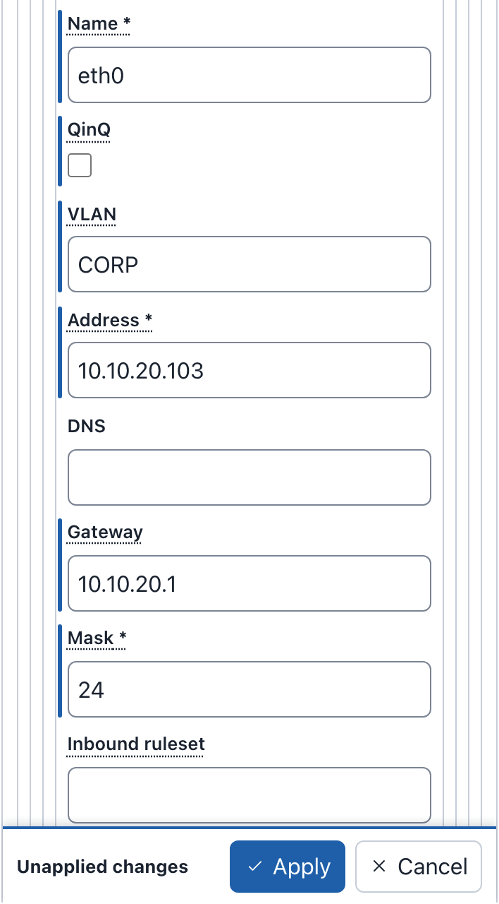
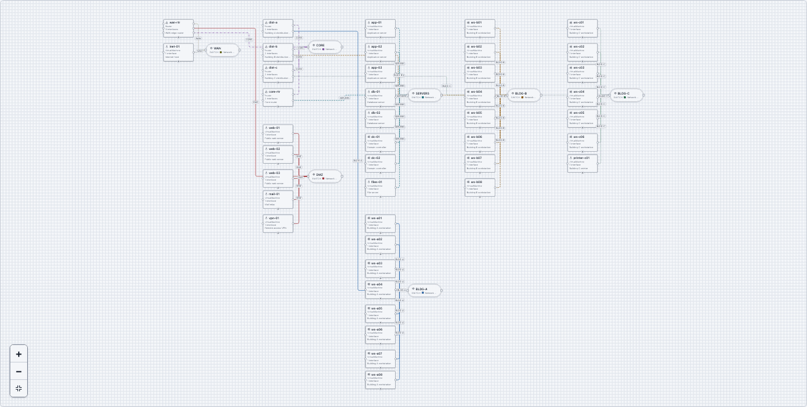

# Building a Diagram

This page shows how to draw and change a diagram: devices, switches and the
connections between them, device settings, groups, notes, shapes, icons and
lines, colors, line styles, custom icons, layouts and the scenarios. For the parts of the editor that these tasks use, see
[The Editor](editor.md).

The examples on this page use the Riverside Water draft of the
[example lab](index.md#the-drafts-on-these-pages).

## Devices, switches and connections

A diagram describes one phenix Topology config. Each part of the diagram maps
to the topology like this:

| In the diagram | In the published topology |
|---|---|
| A device | A node in `spec.nodes`, with all its settings, its notes in `general.notes` |
| A switch | A network. The network's name is the VLAN of every interface on it; the switch's notes stay in the diagram |
| A connection from a device to a switch | An interface of the device, whose `vlan` is the network's name |
| A device from an included topology | Nothing: `includeTopologies` names that topology |
| A note or a group | Nothing: notes and groups only help people read the diagram |
| A shape, an icon or a line | Nothing: they are drawings in the diagram |
| Colors, line styles, icon sizes, custom icons and the diagram's templates | Nothing: they stay in the Builder document |

For example, the connection from ws-01 to the CORP switch is this interface
of ws-01:

```yaml
network:
  interfaces:
    - name: eth0
      type: ethernet
      vlan: CORP
      proto: static
      address: 10.10.20.101
      mask: 24
      gateway: 10.10.20.1
```

A connection always joins a device to a switch. Devices never connect to
each other directly: drawing a connection from one device to another adds a
switch between them (see [Connecting interfaces](#connecting-interfaces)).

## Adding devices

**Add nodes**, at the top of the left column, lists what you can add. To add
a device:

- Select the item. The device appears in free space on the canvas, and is
  selected, so the Inspector shows its fields.
- Or drag the item to where you want it on the canvas.
- Or, in the command palette, choose **Add device**, then a template (see
  [Command palette](editor.md#command-palette)).

**Device** adds a device with default settings. The **Device templates**
fill in more. Every template library starts with the five built-in
templates of this table:

| Item | Hostname | Type | OS type | Image | Description (its tooltip) |
|---|---|---|---|---|---|
| **Device** | node | VirtualMachine | linux | `ubuntu.qc2` | A virtual machine, container or external device |
| **Server** | server | VirtualMachine | linux | `ubuntu.qc2` | Generic Linux server |
| **Workstation** | workstation | VirtualMachine | windows | `windows10.qc2` | Operator workstation |
| **Router** | router | Router | minirouter | `minirouter.qc2` | Layer 3 router |
| **Firewall** | firewall | Firewall | vyos | `vyos.qc2` | Perimeter firewall |
| **External device** | external | HIL (external) | None | None | Hardware in the loop device |

A template's description is its tooltip in **Add nodes** only: the device it
makes has no description. You can change and delete the built-in templates,
and make templates of your own, in a diagram or in your library (see
[Node Templates](templates.md)). The templates of **Add nodes** are in
groups: **This diagram**, **My library**, **Shared with me** and
**Server-wide**.

When the hostname is taken, the new device gets a number, for example
server-2. A new device has no interfaces, so the checks warn "device
"workstation" has no interfaces" until you add one. A device made from a
template keeps no link to it: changing or deleting the template later
changes no device.

For example, to add an engineering workstation to Riverside Water:

1. Under **Device templates**, select **Workstation**. A device named
   workstation appears.
2. In the Inspector, set **Hostname** to `ws-03` and **Description** to
   `CAD workstation`.
3. Select **Apply**.

To connect ws-03 to the CORP network, see
[Connecting interfaces](#connecting-interfaces).

### Routers and firewalls

The **Router** template runs minirouter, on `minirouter.qc2`. The
**Firewall** template runs VyOS: **OS type** `vyos` and the image
`vyos.qc2`. phenix's `vrouter` app configures the interfaces, routes and
rulesets of a device whose type is Router or Firewall (see
[vrouter App](../apps.md#vrouter-app)). For a VyOS router, such as
edge-rtr, set **OS type** to `vyos` and the drive's **Image** to `vyos.qc2`.

### External devices

An external device is hardware that the experiment connects to, such as
plc-01, the pump station PLC of the example lab. phenix does not start a VM
for it, so it has no image. Give it interfaces as for any other device: they
tell phenix which VLANs the hardware is on. See
[External Nodes](../configuration.md#external-nodes).

## Adding switches and networks

A switch is one network. To add a network:

1. Under **Add nodes**, select **Switch**. A switch appears, with a new
   network named EXP (EXP-2 for the next one, and so on).
2. In the Inspector, set **Name** to the network's name, for example
   `SCADA`, and select **Apply**.

Renaming a network changes the VLAN of every interface on it.

The Inspector of a switch, for example "Network CORP", has these fields:

- **Name**: the network's name, which is the VLAN of the interfaces on it.
- **VLAN alias**: an optional number from 1 to 4094. When you publish the
  diagram with an experiment, it becomes that network's entry in the
  experiment's `vlans.aliases` (see
  [Publishing a topology and an experiment](publishing.md#publishing-a-topology-and-an-experiment)).
- **Description**.
- **Edge Color**, the network's color, and **Line style**, the pattern of
  its connections (see [Colors](#colors) and [Line styles](#line-styles)).
- **Outline Color** and **Fill Color** of this switch.
- **Position**.

For example, to give CORP the VLAN alias 120, select the CORP switch, type
`120` in **VLAN alias**, and select **Apply**.

{ width="354" }

A network that a device from an included topology is on cannot be renamed or
removed. Its other fields can still change. In Riverside Water, that is CORP,
where ntp-01 and dns-01 are.

**Networks**, at the bottom of the Outline, lists every network with its VLAN
alias (or "no alias") and the number of devices on it. Each network's
remove button (**Remove network** and the name) removes the network, its
switches and their connections. Deleting a switch on the canvas keeps its network in this list.
A network can have more than one switch on the canvas: a pasted switch, for
example, is another switch of the same network.

## Connecting interfaces

A connection puts a device's interface on a network. There are three ways to
make one. Each example connects ws-03 (see
[Adding devices](#adding-devices)) to the CORP network.

### Drag on the canvas

1. Point at ws-03. Each interface has a connection point (a circle) on the
   device's sides, and a **+** handle at its bottom ("Drag to connect ws-03
   on a new interface").
2. Drag from the **+** handle, or from an unconnected connection point, to
   the CORP switch.

Dragging from **+** adds a new interface to the device. The new connection
appears on the canvas.

Dragging from one device to another adds a new switch between them, with a
new network named EXP, and connects both devices to it. Rename the network
in the switch's Inspector. Two switches cannot be connected, because each
switch is one network.

### Add a connection without dragging

To connect without dragging, select **Add connection** in the toolbar, or
**Add a connection…** in the [command palette](editor.md#command-palette).
The **Add a connection** dialog opens with the selection filled in: a
selected device in **Device**, a selected switch in **Switch**.

1. In **Device**, choose `ws-03`.
2. Keep **Interface** set to **Add a new interface**, or choose an interface
   that has no connection yet.
3. In **Switch**, choose **CORP (CORP)**.
4. Select **Connect**.

The dialog closes and focus returns to **Add connection**. With a field
empty, **Connect** says which one and moves focus to it, and a connection
Builder cannot make says why; the dialog stays open. **Cancel** or
<kbd>Esc</kbd> closes it without a change.

### Type the VLAN in the Inspector

Typing a network's name in an interface's **VLAN** field connects the
interface to that network's switch when you apply it. This is how the
[quick start](index.md#quick-start) connects ws-03:

1. Select ws-03.
2. In the Inspector, under **Network**, select **Add interface**.
3. Set **Interface kind** to **Static or OSPF**, and select **Switch and
   clear** when Builder asks "Switch Interface kind to Static or
   OSPF?".
4. Enter **Name** `eth0`, **VLAN** `CORP`, **Address** `10.10.20.103`,
   **Mask** `24` and **Gateway** `10.10.20.1`.
5. Select **Apply**. eth0 connects to the CORP switch. **Draft History**
   names the change "Updated device ws-03 and connected eth0 to network
   CORP".

The interface before step 5:

{ width="354" }

The VLAN matches a network's name in any case. Typing another network's name
moves the connection to that network. A VLAN that names no network of the
diagram is kept, but the interface stays unconnected.

### Disconnecting

- In the Inspector's **Connection points**, select **Disconnect** next to
  the interface, for example "eth0 — network CORP".
- Or select the connection on the canvas and press <kbd>⌫</kbd> on macOS or
  <kbd>Delete</kbd> on Windows and Linux.

The interface stays, with no VLAN. An interface with no VLAN blocks
publishing (see [What blocks publishing](publishing.md#what-blocks-publishing)),
so connect it again, type a VLAN for it, or remove it: the trash button next
to it in **Connection points** (**Remove connection point** and its name)
removes the interface. **Add connection point** adds an interface without a
connection. The buttons under **Connection points** take effect at once,
without **Apply**.

## Editing device settings

Select a device to change its settings in the Inspector. Change the fields,
then select **Apply**, or press <kbd>Enter</kbd> in a field. See
[Editing a node](editor.md#editing-a-node) for how the fields and **Apply**
work.

An interface has an **Interface kind**:

- **Static or OSPF**: an address that you give, with **Address**, **Mask**
  and **Gateway**.
- **DHCP or manual**: the address comes from DHCP, or is set inside the VM.
  A new interface starts as this kind.
- **Serial**: a serial link.

Changing the kind asks "Switch Interface kind to Static or OSPF?" (or the
kind you chose), because "Switching clears the Interface kind values entered
so far." **Switch and clear** changes the kind and empties that interface's
fields, **Name** and **VLAN** included. **Keep current value** leaves it as
it was. So set the kind first, then fill in the other fields.

### Duplicating a device

**Duplicate** copies the selected nodes and pastes the copy next to them.
Press <kbd>⌘</kbd>+<kbd>D</kbd> on macOS or <kbd>Ctrl</kbd>+<kbd>D</kbd> on
Windows and Linux. The copy keeps every setting, addresses included, but not
its connections.

For example, to add a second historian:

1. Select historian-01.
2. Press <kbd>⌘</kbd>+<kbd>D</kbd> (<kbd>Ctrl</kbd>+<kbd>D</kbd>). A copy
   named historian-01-2 appears, with the address 10.10.30.20 and an eth0
   that is not connected.
3. The header now says **3 warnings**: both historians use 10.10.30.20, and
   eth0 of historian-01-2 has no VLAN (see
   [Checks and warnings](editor.md#checks-and-warnings)).

The Riverside Water expansion draft is a copy of Riverside Water after
step 2 (see [The drafts on these pages](index.md#the-drafts-on-these-pages)).
To keep Riverside Water unchanged, select **Undo** after step 3. To fix the
warnings, give the copy its own hostname and address, and connect it: see
[Example: Riverside Water expansion](publishing.md#example-riverside-water-expansion).

### Drive images

Each drive has an **Image**. When your role can list the server's disk
images, the field suggests them, and a drive image that the server does not
have is a warning. The checks do not look at images when the server lists
none (see [Checks and warnings](editor.md#checks-and-warnings)).

### Routes and rulesets

**Routes** and **Rulesets** are under **Network**. For example:

- edge-rtr has **Route 1: 10.10.30.0/24**, with **Destination**
  `10.10.30.0/24`, **Next hop** `10.10.20.254` (ot-fw) and **Cost** `1`.
  **Add route** adds another.
- ot-fw has **Ruleset 1: corp-to-ot**, with **Default** `drop` and **Rule 1:
  HTTPS to the historian**, which accepts `tcp` from `10.10.20.0/24` to
  `10.10.30.20` port `443`. The ruleset is used by eth0, whose **Inbound
  ruleset** is `corp-to-ot`.

The `vrouter` app applies them when the experiment starts (see
[vrouter App](../apps.md#vrouter-app)).

## Labels and annotations

A device's labels and annotations are under **More settings**, at the bottom
of its fields. The summary line counts them, for example "Labels (2),
Annotations (1)". Each row has a **Name** and a **Value**, and a remove
button.

For example, web-01 has the labels `zone: dmz` and `role: web`, and the
annotation `phenix/startup-autotunnel` with the value `["8080:80"]`:


To add a label:

1. Select web-01, and open **More settings**.
2. Under **Labels**, select **Add label**.
3. Enter **Name** `team` and **Value** `blue`, and select **Apply**.

**Add annotation** works the same way. An annotation's value is read as
YAML: `true`, `false` and numbers become those values, and `["8080:80"]` is
a list. Apps read annotations to configure a node; see
[Apps](../apps.md).

## Notes

A note is text on the canvas. Publishing ignores it.

1. Under **Add nodes**, select **Note**.
2. In the Inspector, enter the **Text**, for example `OT has no route to the
   internet. From CORP, only HTTPS to historian-01 passes ot-fw.`
3. Select **Apply**.

The Outline names a note after its first line. A note also has a **Color**
(see [Colors](#colors)).

### Notes on devices and switches

A device or a switch can carry notes of its own, which the canvas shows in a
card below the node: one line for each note, each cut off after three lines,
and at most five notes, then "+N more". The card moves and is selected with
the node. The node's info tooltip lists the notes, and screen readers read
them as part of the node's description.

1. Select the device or the switch.
2. In the Inspector, under **Notes** (for a device, in the **General**
   section), select **Add note** and type the note. Each note has a box of
   its own, and **Remove** takes one away.
3. Select **Apply**.

A device's notes are its node's `general.notes`: publishing writes them to
the topology, and a new experiment copies them to the VM's notes (see
[Publishing](publishing.md)). A switch is not part of the topology, so its
notes stay in the diagram. A device or a switch holds at most 100 notes of at
most 4096 bytes each. **Show node notes** in the Settings, or **Show or hide
node notes** in the command palette, hides the cards (see
[Settings](editor.md#settings)); a layout leaves room for them while they
show.

## Groups

A group is a box around nodes, with a title. Publishing ignores it. Moving a
group moves the nodes in it.

To group nodes:

1. Select the nodes: click the first, then Shift-click the others.
2. Select **Group** in the toolbar, or press <kbd>⌘</kbd>+<kbd>G</kbd> on
   macOS or <kbd>Ctrl</kbd>+<kbd>G</kbd> on Windows and Linux.

The new group is named "Group", or "Group 2" and so on when that name is
taken. Select the group to change its fields in the Inspector, then select
**Apply**:

- **Title**: shown at the top of the group.
- **Description**: shown under the title on the canvas, on one line.
  Screen readers read it after the group's name.
- **Color** (see [Colors](#colors)).
- **Border pattern**: **Dashed** (the default), **Solid**, **Dotted** or
  **Double**.
- **Icon**: the icon beside the title, from the built-in icons. The default
  is the container icon.
- **Custom icon**: an image of your own, drawn in place of the icon (see
  [Custom icons](#custom-icons)).

To take a group apart, select it and select **Ungroup**
(<kbd>⇧</kbd>+<kbd>⌘</kbd>+<kbd>G</kbd> or
<kbd>Ctrl</kbd>+<kbd>Shift</kbd>+<kbd>G</kbd>). Its nodes stay where they are.

**Group** under **Add nodes** adds an empty group. Dragging a node onto a
group does not put it in the group. Select **Move to group** in the toolbar
instead, or **Move to a group…** in the
[command palette](editor.md#command-palette). The **Move to a group**
dialog opens on the selected node, and **Group** shows the group it is in:

1. In **Node**, choose the node, for example `web-01 (device)`.
2. In **Group**, choose the group, or **No group** to take the node out of
   its group.
3. Select **Move**. The dialog closes and focus returns to **Move to
   group**.

To resize a selected group, drag the handles on its corners and sides, or
press <kbd>⌥</kbd>+<kbd>⇧</kbd> (<kbd>Alt</kbd>+<kbd>Shift</kbd>) with an
arrow key. A group never gets smaller than its members need. Notes resize
the same way.

## Shapes, icons and lines

Rectangles, circles, icons and lines are drawings: they help people read the
diagram, and publishing ignores them, as it ignores notes and groups. They
take no connections. Add one under **Add nodes** (**Rectangle**,
**Circle**, **Icon** or **Line**) or with the command palette's **Add
rectangle**, **Add circle**, **Add icon** and **Add line**. Like any node,
a drawing can be moved, put in a group, copied, duplicated and deleted, and
the layouts leave it where it is: one in a group moves with its group, and
the group grows to hold it when the layout makes it smaller.

Select a drawing to change it in the Inspector, then select **Apply**:

- A **rectangle** or a **circle** (**Shape**) fills its box; a circle in a
  box that is not square is an ellipse. It has a **Label** at its center, a
  **Fill Color** (see-through without one), an **Outline Color**, a **Border
  pattern** (**Solid**, the default, **Dashed**, **Dotted** or **Double**),
  and a **Width** and **Height**.
- An **icon** shows one of the built-in icons (**Icon**) or an image of your
  own (**Custom icon**, see [Custom icons](#custom-icons)), scaled to its
  box, with an optional **Label** under it, and a **Width** and **Height**.
- A **line** joins no node or network. It has a **Label** at its middle, a
  **Color** and **Line style** like a connection's (solid without one), an
  **Arrowhead at the start** and an **Arrowhead at the end**, and its
  **Points**, from its start to its end, each with an **X** and **Y** on the
  canvas: 2 to 64 of them. A new line runs 160 pixels across.

Rectangles, circles and lines lie under the devices and switches, also
while they are selected, so a drawing never hides a device or its
connection points. The handles of a selected drawing are drawn over
everything.

To resize a selected rectangle, circle or icon, drag the handles on its
corners and sides, or press <kbd>⌥</kbd>+<kbd>⇧</kbd>
(<kbd>Alt</kbd>+<kbd>Shift</kbd>) with an arrow key. A selected line shows
a handle on each point: a circle on each end and a square on each bend.
Drag a handle to move its point, and double-click the line to add a bend
there. After you click a handle, the arrow keys move its point by a grid
step (by a pixel with <kbd>⇧</kbd>), <kbd>Delete</kbd> or
<kbd>Backspace</kbd> removes it, and <kbd>Esc</kbd> returns to the line; a
line keeps at least two points. Each of these is one step for **Undo**.

Without a mouse, edit the points in the Inspector's **Points**: change a
point's **X** and **Y**, **Add point** adds a new end, **Remove point N**
removes a point, and **Insert point after point N** adds a bend halfway to
the next point. Select **Apply** to make the changes, as one step for
**Undo**.

## Auto-group

**Auto-group** in the toolbar puts nodes into new groups for you:

- **By network**: "Each network’s switch with its devices". A device on
  several networks goes with the smallest of them.
- **By name**: "Devices with names like web-01 and web-02". Devices whose
  hostnames share a stem go together. Switches stay out.
- **By name pattern…**: "Nodes whose names match a regular expression".
  See [Grouping by a name pattern](#grouping-by-a-name-pattern).

Auto-group groups only the devices and switches that are in no group yet,
and it leaves existing groups as they are. When nodes are selected, it
groups only those. A group needs at least two members. After grouping, it
lays the diagram out with the draft's layout, or with the Settings layout on
a draft without one (see [Layouts](#layouts)), so the groups do not overlap.

For example, **By network** on the imported riverside-water makes the groups
CORP, DMZ, INTERNET and OT, as in the Riverside Water draft. **By name** on
Metro Campus makes six groups: app, db, dc, dist, web and ws. When there is
nothing left to group, Auto-group changes nothing.

<kbd>⌥</kbd>+<kbd>⇧</kbd>+<kbd>G</kbd> on macOS, or
<kbd>Alt</kbd>+<kbd>Shift</kbd>+<kbd>G</kbd> on Windows and Linux, groups by
network without opening the menu. The command palette has **Auto-group by
network**, **Auto-group by name** and **Auto-group by name pattern…**.

**Undo** removes the groups again.

### Grouping by a name pattern

**By name pattern…** opens the **Auto-group by name pattern** dialog. Type a
JavaScript regular expression in **Name pattern**, and select **Group**. The
pattern is matched against each name, ignoring case: a device's hostname and
a switch's name. Names with the same matched text go in one group, named
after that text. When the pattern has parentheses, the text of the first
pair is used.

For example:

- `^[a-z]+` puts web-01 and web-02 in group web, and db-01 and db-02 in
  group db.
- `^(\w+)-(east|west)` groups by the part of the name before the site.
- `-(\d)\d$` groups by the tens digit of the number at the end.

As with the other rules, it groups only devices and switches that are in no
group, only the selected ones when nodes are selected, and at least two
nodes to a group. One **Undo** removes all the groups it made.

Limits:

- A pattern has at most 200 characters.
- Only the first 255 characters of a name are matched.
- A group's name is cut to 80 characters.
- A pattern that takes more than 2 seconds is stopped, with "This pattern
  takes too long to match. Use a simpler one."

When nothing can be grouped, the dialog says why, for example "Nothing to
group: the pattern matches no ungrouped device or switch." The dialog offers
the pattern you used last. The browser keeps it until you log out; it is not
saved in the diagram or sent to the server. The command has no default key.

The pattern runs in a separate script that phenix serves. When that script
cannot start, the dialog says "The pattern could not be checked. Reload the
page to try again."

## Colors

Each kind of node and connection has its own color fields:

| Where | Field | What it colors | Values |
|---|---|---|---|
| Switch | **Edge Color** | The network: its switch's swatch and its connections | Any CSS color |
| Connection | **Color** | This connection, in place of its network's color | Any CSS color |
| Device, switch | **Outline Color** | The node's border | `#rrggbb` only |
| Device, switch | **Fill Color** | The node's background | `#rrggbb` only |
| Note, group | **Color** | The note or the group | Any CSS color |
| Rectangle, circle | **Outline Color**, **Fill Color** | The shape's border and inside | `#rrggbb` only |
| Line | **Color** | The line and its arrowheads | `#rrggbb` only |

To set a color:

- Select the swatch button before the field to pick a color: one of the
  suggested colors (Blue, Orange, Green, Purple, Red, Teal, Olive and Plum),
  **Custom color**, or **No color**.
- Or type a color in the field, for example `#1f7a5a`, or `teal` where any
  CSS color is allowed.

**Outline Color** and **Fill Color** take a hex color such as `#2f6fbf`
only: no color names, no short form and no transparency. Anything else shows
"Outline Color must be a hex color, such as #2f6fbf" (or "Fill Color …") and
is not applied. On a device they take effect at once, without **Apply**. On
a switch they wait for **Apply**, and they belong to that switch: two
switches of one network can differ.

How the canvas draws them:

- On a fill, the text and the icon are black or white, whichever reads
  better (a contrast of at least 4.5 to 1).
- An outline close to the canvas color gets a thin ring, so the node stays
  visible in both themes.
- A selected node shows the selection's border in place of its outline.
- In a Windows contrast theme (forced colors), the system's colors are
  drawn, not the chosen ones.

A new network gets the suggested color that the fewest networks use. The
suggested colors keep their contrast in the light and the dark theme.

## Line styles

A connection is drawn with a line pattern. **Line style** sets it, on a
network (in the switch's Inspector, for all its connections) or on one
connection (in place of its network's):

- **Auto**: the pattern Builder picks from the network's place in the
  diagram, so that networks differ without color. The choice names that
  pattern, for example "Auto (Solid)". On a connection, **Auto** follows
  its network.
- **Solid**, **Dashed**, **Dotted** or **Dash-dot**.

A chosen pattern may repeat on several networks. The connection's label, the
switch it joins and its name for screen readers still name its network.
**Line style** waits for **Apply**.

## Icon size

Devices, switches and groups draw their icons at one of three sizes:
**Small** (16 pixels), **Medium** (24 pixels) or **Large** (32 pixels). Set
the size for the whole diagram under **Icon size** in the Inspector's
**Diagram** section (select an empty part of the canvas). It takes effect at
once, as one step of **Undo**. A new diagram draws **Small** icons.

A device, a switch or a group can have a size of its own: **Icon size** in
its Inspector offers **Diagram default**, which names the diagram's size, for
example "Diagram default (Large)", and the three sizes. On a device it takes
effect at once, as a device's icon and colors do; on a switch or a group it
waits for **Apply**.

Nodes keep their size on the canvas. A **Small** icon sits before the node's
name. A **Medium** or **Large** icon stands left of the node's lines, which
make a column beside it: centered on a device or a switch, and at the top
left of a group, beside its title and description. Text that no longer fits
ends with an ellipsis, as before; the Inspector and the node's tooltip show
it whole. PNG and SVG downloads draw the icons at their sizes. Icon sizes
stay in the Builder document: publishing writes none of them.

At **Medium** and **Large**, a switch's second line, which names its network
(for example "Network CORP, VLAN alias 120"), shows fewer characters than at
**Small** before its ellipsis, because the icon takes part of its width. The
network's name stays in the switch's label, in its tooltip and in the
Inspector.

## Custom icons

A device, a group or an icon can show an image of your own in place of its
built-in icon. To choose one:

1. Select the device, the group or the icon.
2. Under **Custom icon** in the Inspector, select **Choose…**. The **Custom
   icons** dialog opens.
3. Select **Upload icon…** and choose an image file, or select **Use** on an
   icon the dialog lists.

The field then shows the icon, its name, **Change…** and **Remove**. On a
device, the change takes effect at once, without **Apply**, as one step of
**Undo**. On a group, it waits for **Apply**. A switch and a note have no
custom icon.

The phenix server keeps one icon library, which every user of the server
shares. A node names its custom icon, and the node shows the server's icon
of that name. When the server has no icon of that name (it was deleted, or
the diagram came from another server), the field says "(not found: the
built-in icon is shown)" after the name, and the node shows its built-in
icon until an icon of that name is uploaded.

The dialog lists:

- **In this diagram**: copies of icons the diagram carries, from a file it
  was uploaded from (see [The diagram and its icons](#the-diagram-and-its-icons)).
  Each has **Use**, and **Add to server** when the server lacks it; "On the
  server" says the server has it as it is.
- **Server icons**: every icon on the server, with who uploaded it, its
  size and its other names, and how many of them you uploaded, for example
  "You uploaded 2 of 64 icons, 3.0 KiB of 1 MiB." **Filter icons** narrows
  the list by name, other name or uploader. Each icon has **Use**, and
  **Rename** and **Delete** when you may change it.

### Uploading an icon

**Upload icon…** takes a PNG, JPEG, GIF, WebP or SVG file of at most 5 MiB.
The browser converts it to a PNG of at most 96 by 96 pixels, in the
picture's own proportions. A small picture is not enlarged; an SVG is drawn
as large as an icon may be. The dialog then asks for the icon's name,
proposed from the file's name, and **Add icon** uploads it to the server.

A name is 1 to 64 letters, digits, `_`, `@`, `.` or `-`, and is unique on
the server, ignoring case: the first upload of a name keeps it. A name the
server already has for another image is refused with who uploaded that icon,
for example "icon name "plc" is taken by an icon alice uploaded; choose
another name". Uploading the same image under its own name again says "The
server already has this icon as" and its name.

An SVG is drawn on its own: nothing it refers to outside its own file
(style sheets, images, fonts) is loaded, so those parts are missing from the
icon. When nothing of it can be drawn, or (in Chrome) when it embeds HTML,
the dialog says "This image could not be converted. Save it as a PNG and
upload it again." Browsers differ on such files: save the picture as a PNG.

An icon is drawn at the node's [icon size](#icon-size) on the canvas (16,
24 or 32 pixels; 14 in the Outline), in its own colors, the same in the light
and the dark theme. Choose one that reads on both, or give the node a **Fill
Color**.

### The diagram and its icons

A draft names its icons and carries no image of them, so a draft saved on
the server stays small. A download as Builder JSON or YAML carries a copy
of each icon the diagram names, at most 50, so the file shows its icons on
another phenix server; PNG and SVG downloads draw them. A name the server
has no icon of is left out of the file, and the download says so. The
**Download** that logging out offers for changes the server does not have
yet carries the icons too.

Uploading a file that carries icons, or editing as a draft the diagram of a
topology read from its Builder file, adds each one the server lacks to the
server's library, as uploaded by you, and the draft names it. A copy the
server already has under its name, with the same image, is dropped. The
draft keeps its own copy of an icon when the server has another image under
that name, or when the server could not take it (your share of the library
is full, for example), and the Builder says so; the copy is shown in place of
the server's icon. **Add to server** in the dialog adds a kept copy later.
An icon that no node or template of the diagram uses any more leaves the
diagram with the edit that removed its last use; **Undo** brings it back.

Copy and paste carry the copies of the nodes' icons the diagram carries,
also into another diagram in the same browser tab.

### Renaming and deleting icons

The user who uploaded an icon can rename and delete it. A role with the
`builder-icons` permissions can rename (`update`) and delete (`delete`)
every user's icons (see
[Icons of other users](administration.md#icons-of-other-users)).

**Rename** asks for the new name. The old name keeps naming the icon, so
diagrams and templates that use it keep showing it: "Renamed OLD to NEW. OLD
keeps working as another name of it." The icon lists its other names.

**Delete** asks "Delete icon?" and says "Delete NAME from the server?
Diagrams and templates that use it, by any of its names, will show their
built-in icon instead." Deleting an icon removes its other names too, and
changes no diagram: its nodes keep the name.

Each user may upload at most 64 icons and 1 MiB of them, and the server
holds at most 2,000 icons. There is no `phenix` command for the icon
library: use the editor or the REST API.

## Layouts

The layout menu in the toolbar arranges the whole diagram. It shows the
layout that last arranged the draft, or **Default** when none has. An
imported, uploaded or blank draft starts at **Default**: an import places
its devices in rows on a grid, with the switches below them.

{ width="287" }

| Layout | Menu summary | What it does |
|---|---|---|
| **ELK layered** | Clusters by network, left to right | Clusters each network's switch with its devices, a device on several networks in its smallest one, and runs connections left to right between the clusters. |
| **Network cards** | A card per network, on a grid | A card per network, its devices in a column grouped by name with the switch at their head, and the cards on a grid. |
| **Dagre** | Networks in layers, left to right | Each network's devices in a column beside their switch, and the networks in layers along the connections between them. |
| **Standard** | Devices above switches, top to bottom | Every device in a row above the switches, from top to bottom. |

**ELK layered** suits most diagrams. The **Default layout** setting
describes each layout the same way.

Layouts keep groups together: a group's members stay inside it, and no other
node goes in.

For example, Metro Campus has 42 devices on 7 networks. Imported, it uses
the **Default** grid:


Open the layout menu and choose **ELK layered**:



The draft keeps the layout, and the menu then shows it. Right after a layout
runs, the menu also offers **Restore previous layout** ("Put every node back
where it was"), until you change the diagram some other way. **Undo** puts
the nodes back too.

**Auto layout** in the command palette runs the draft's layout again, or the
Settings layout on a draft at **Default**. Its keys are
<kbd>⌥</kbd>+<kbd>⇧</kbd>+<kbd>L</kbd> on macOS and
<kbd>Alt</kbd>+<kbd>Shift</kbd>+<kbd>L</kbd> on Windows and Linux.
**Default layout** in [Settings](editor.md#settings) chooses that layout.
**ELK layered** is the default.

Publishing, and a download as Topology YAML, ignore positions and layouts.

## Arranging by hand

- Drag a node, or several selected nodes. Nodes snap to a 16-pixel grid.
- Press <kbd>⇧</kbd> (<kbd>Shift</kbd>) with an arrow key to move the
  selected nodes 10 pixels.
- Type a position: under **Position** in the Inspector, enter **X** and
  **Y**, then select **Move**. For example, move the note of Riverside Water
  to **X** `1248` and **Y** `880`.

A move by hand does not change the layout that the layout menu shows.

## Copy, paste, duplicate and delete

**Copy**, **Paste** and **Delete** are in the toolbar, and **Duplicate** is
in the command palette. Their keys are <kbd>⌘</kbd>+<kbd>C</kbd>,
<kbd>⌘</kbd>+<kbd>V</kbd>, <kbd>⌫</kbd> and <kbd>⌘</kbd>+<kbd>D</kbd> on
macOS, and <kbd>Ctrl</kbd>+<kbd>C</kbd>, <kbd>Ctrl</kbd>+<kbd>V</kbd>,
<kbd>Delete</kbd> and <kbd>Ctrl</kbd>+<kbd>D</kbd> on Windows and Linux (see
[Keyboard shortcuts](editor.md#keyboard-shortcuts)).

**Copy** and **Paste** use Builder's own clipboard, not the system
clipboard, so they work between drafts that you open one after the other in
the same browser tab. **Duplicate** copies and pastes in one step.

- A paste lands 40 pixels down and to the right of the original, and each
  further paste 40 pixels further. The pasted nodes are selected.
- A pasted device gets a free hostname, such as server-2, and keeps its
  settings. Connections are pasted only when both ends are copied: copy a
  device with its switch to keep the connection. A pasted device without
  its connection has interfaces with no VLAN.
- Copying a group copies the nodes in it.

**Delete** deletes the selected nodes and connections. Deleting a device
deletes its connections too. Devices from included topologies and their
connections cannot be deleted: Builder says, for example, "dns-01 comes
from included topology corp-services, so it is read only here. Change it in
corp-services."

## Undo and redo

**Undo** and **Redo** in the toolbar step back and forward through your
changes: <kbd>⌘</kbd>+<kbd>Z</kbd> and <kbd>⇧</kbd>+<kbd>⌘</kbd>+<kbd>Z</kbd>
on macOS, <kbd>Ctrl</kbd>+<kbd>Z</kbd> and
<kbd>Ctrl</kbd>+<kbd>Shift</kbd>+<kbd>Z</kbd> (or <kbd>Ctrl</kbd>+<kbd>Y</kbd>)
on Windows and Linux. Each change is a snapshot of the draft on the server,
so undo moves the draft itself back. To go back further than this tab's
changes, use **Draft History** (see [Draft History](drafts.md#draft-history)).

## Scenarios

A diagram lists the Scenario configs it is used with, which say which apps
run on which devices: up to 20, by name. The diagram holds only their names;
the scenarios themselves are configs on the server. Publishing adds the
topology to each one's `topology` annotation, and an experiment published
with the topology uses one of them (see
[Scenarios](publishing.md#scenarios)).

The Riverside Water draft lists the stored scenario riverside-water. To add
it to another diagram, such as your
[quick start](index.md#quick-start) draft:

1. Select **Scenarios** in the toolbar. With nothing selected, **Add
   scenario** (or **Edit scenarios**) in the Inspector does the same.
2. In **Add a stored scenario**, choose `riverside-water`, and select
   **Add**. It is listed under **Scenarios of this diagram**.
3. Select **Save scenarios**.

With nothing selected, the Inspector now lists "Scenario riverside-water",
with each app and its hosts under **Apps and their hosts**: vrouter on
edge-rtr, and ntp on ntp-01, ws-01, ws-02, hmi-01 and historian-01 (see
[With nothing selected](editor.md#with-nothing-selected)).

To add a scenario you have as a file, choose it in **Upload a scenario
file**: a `phenix.sandia.gov/v2` Scenario config in JSON or YAML, up to
5 MiB. The dialog proposes the file's `metadata.name` as **Scenario name**,
or the file name made a config name, which you can change. **Store and add**
stores it on the server as a Scenario config and lists it. When the server
already has a scenario of that name, the hint under the name says storing
replaces its spec and keeps its annotations, and Builder asks "Replace
scenario NAME?" first. The replaced scenario takes the file's spec and keeps
its own annotations, with those of the file added: its `topology`
annotation keeps every topology it named and gains those the file names, so
experiments of those topologies can still use it. Storing needs `configs`
`create` for a new scenario, and `configs` `get` and `update` to replace
one; the dialog shows what the server says when it refuses. A name the list
already has in another letter case, such as `Riverside-Water` for
`riverside-water`, is not listed twice: the list takes the stored
scenario's spelling.

**Remove** takes a scenario off the list; the scenario on the server does
not change. **Save scenarios** writes the list into the diagram, as one step
that **Undo** reverts. **Cancel** leaves the list as it was, but a scenario
stored meanwhile stays on the server.

## Included topologies

riverside-water includes the topology corp-services, so dns-01 and ntp-01
are in the diagram:

- They have a dashed border and say "Included from corp-services". The
  Outline marks them INCLUDED.
- Their fields are read only (see
  [Fields you cannot change](editor.md#fields-you-cannot-change)), but you
  can move them.
- They cannot be deleted or connected, and their connections cannot be
  deleted.
- The networks they are on (CORP) cannot be renamed or removed.
- The checks give them no warnings, but a device of this diagram that reuses
  their hostname is an error, and one that reuses one of their addresses gets
  a warning.

To change dns-01, change the topology corp-services, then import
riverside-water again (see
[Importing a topology or experiment](import-upload-download.md#importing-a-topology-or-experiment)),
or make the included devices part of a new diagram (see
[Making included devices editable](#making-included-devices-editable)).
Publishing does not copy included devices: the published topology names
corp-services in `includeTopologies` (see
[Included topologies](publishing.md#included-topologies)).

### Making included devices editable

To change included devices in the diagram itself, make a copy of the diagram
in which they are its own nodes:

- When you import the topology, choose **Combine into one new topology**
  under **Included topologies** (see
  [Importing a topology or experiment](import-upload-download.md#importing-a-topology-or-experiment)).
- In a draft that is open, run **Combine included nodes into a new draft**
  from the command palette, or select an included device and select
  **Combine into a new draft** in the Inspector.

The command makes a new draft and opens it. The draft you had open stays as
it is. The new draft is named after the diagram, with "-combined" at the
end, for example Riverside-Water-combined, and gets a number when a topology
or one of your drafts already has that name. Builder says, for example,
"Combined 2 included nodes into new draft Riverside-Water-combined. Draft
Riverside Water is unchanged."

In the new draft, the included devices are ordinary devices: you can change,
delete and connect them, and the checks look at them too. The draft is not
linked to riverside-water, so publishing it makes a new topology. An
included topology whose nodes the diagram never had stays named in
`includeTopologies`, and Builder says so: "It still includes", the
topology's name, and "whose nodes are not in the diagram." A role that
cannot create drafts cannot combine.
