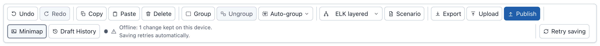
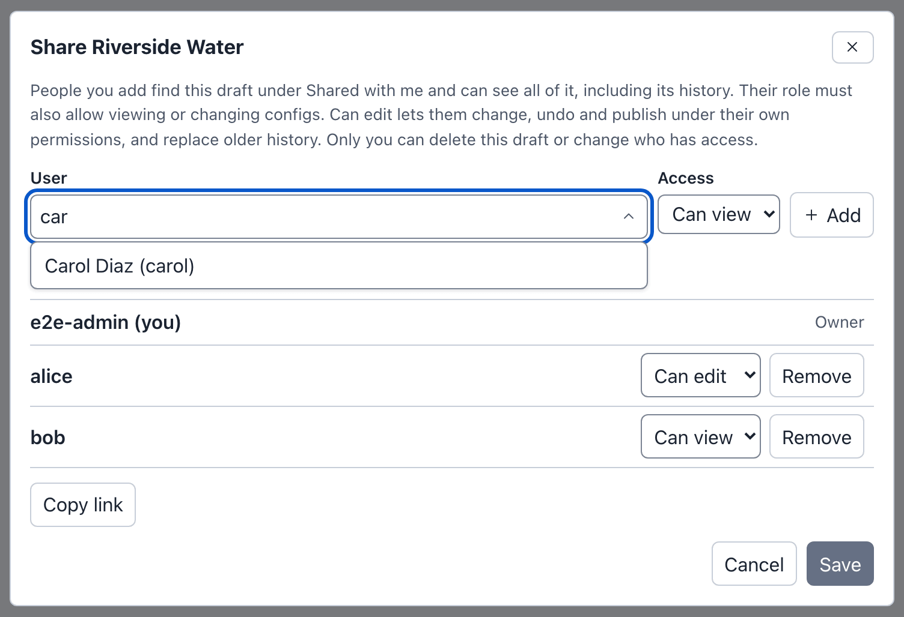
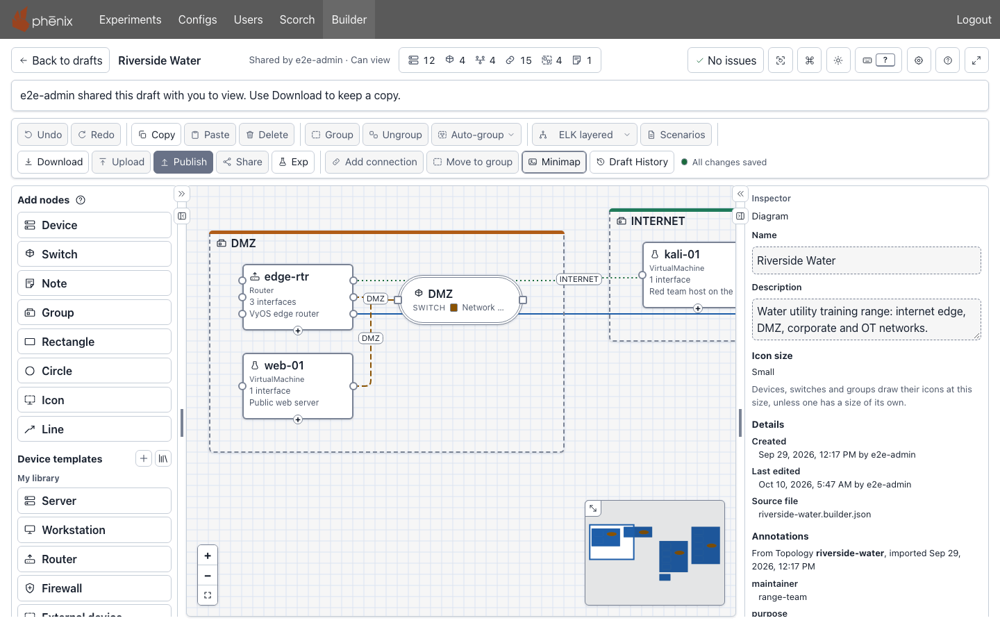
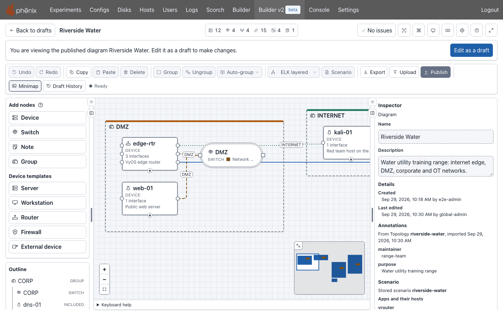

# Drafts

Every diagram in Builder is a draft. A draft lives on the phenix server,
apart from the phenix configs. Builder saves each change to the draft as
you make it. Only **Publish** writes Topology and Experiment configs and adds
the topology to the diagram's scenarios (see [Publishing](publishing.md)).

## The drafts page

Select **Builder** in the phenix navigation bar. The drafts page opens.


The buttons at the top right are:

- **Blank diagram**: starts a new, empty draft.
- **Import**: starts a draft from a Topology or Experiment config (see
  [Import](#import)).
- **Upload**: starts a draft from a diagram you have: a Builder document,
  or a legacy Builder diagram (see [Upload](#upload)).
- **Commands**: opens the command palette (<kbd>⌘</kbd>+<kbd>K</kbd> on
  macOS, <kbd>Ctrl</kbd>+<kbd>K</kbd> on Windows and Linux). See
  [Command palette](editor.md#command-palette).
- The theme, **Settings**, **Help** and **Focus mode** buttons, as in the
  editor (see [Header](editor.md#header)). **Help** opens this Builder
  documentation in a new tab. **Settings** also opens with
  <kbd>⌥</kbd>+<kbd>⇧</kbd>+<kbd>S</kbd> on macOS and
  <kbd>Alt</kbd>+<kbd>Shift</kbd>+<kbd>S</kbd> on Windows and Linux, and
  <kbd>?</kbd> lists the keyboard shortcuts.

The tabs below them list what you can open. Each tab shows how many items it
holds, for example **My Drafts (3)**.

- **My Drafts**: the drafts you own.
- **Shared Drafts**: drafts other users shared with you, the most recently
  changed first (see [Sharing a draft](#sharing-a-draft)).
- **Published Diagrams**: the topologies that have a Builder diagram
  (see [Published diagrams](#published-diagrams)).
- **Node Templates**: your library of device templates. Its count is the
  number of your own templates (see
  [The template library](templates.md#the-template-library)).
- **Other users' drafts**: other users' drafts that your role lets you see.
  This tab appears only when your role has the `builder-drafts` permission
  and there is such a draft (see
  [Permissions](administration.md#permissions)).

Each draft is a card with, one line each:

- The draft's name.
- The owner, for example "Owner: e2e-admin". On the other tabs, what you may
  do follows: "Owner: e2e-admin · Can view" or "· Can edit".
- When the draft last changed, for example "Updated Sep 29, 2026, 12:52 PM".
  When someone you shared the draft with made the last change, the line adds
  their name: "Updated Sep 29, 2026, 1:02 PM by alice".
- On your own shared drafts, who has access: "Shared with alice and bob".
- The buttons, all of one size: **Open**; for your own drafts **Share** (when
  phenix has user sign-in) and **Delete**; and **Publish** on a draft you may
  change (see [Publishing from the drafts page](#publishing-from-the-drafts-page)).

A card you may delete, or on **My Drafts** share, also has a checkbox, for
acting on several drafts at once (see
[Selecting several drafts](#selecting-several-drafts)).

"Updated" on a card is the last activity on the draft: an edit, but also an
undo, a restore, a deleted snapshot or a publish. It is not the same as
**Last edited** in the Inspector, which says when the content you see was
saved, and by whom (see
[With nothing selected](editor.md#with-nothing-selected)). After an edit
the two agree. After an undo, for example, the card says when you undid,
and the Inspector says when the version you went back to was saved.

A role without the `configs` `create` permission sees no **Blank diagram**,
**Import** or **Upload**, and the page says "Your role can open drafts and
published diagrams, but not create drafts."

## Creating a draft

### Blank diagram

Select **Blank diagram**. A new draft named "Untitled topology" opens in the
editor. When you already have a draft of that name, the new one is named
"Untitled topology 2", and so on.

To rename it, for example to `Pump station`, select **Edit diagram name**
(the pencil after the name in the header), type the name and press
<kbd>Enter</kbd> (see [Renaming the diagram](editor.md#renaming-the-diagram)).
The drafts page then lists the draft under its new name.

### Import

**Import** makes a draft from a Topology or Experiment config, stored in
phenix or in a config file. The draft is named after the config, for
example riverside-water. For a topology, Import can also make the draft a
copy with a new topology name, or combine the topologies it includes into
one (see
[Making included devices editable](diagrams.md#making-included-devices-editable)).
See
[Importing a topology or experiment](import-upload-download.md#importing-a-topology-or-experiment).

### Upload

**Upload** makes a draft from a diagram you have: a Builder JSON or YAML file
that **Download** saved, pasted text, a published diagram, or a legacy
Builder diagram (**Legacy Builder diagram or Topology**, see
[Legacy Builder](legacy.md)). Uploading always makes a new draft. See
[Import, Upload and Download](import-upload-download.md).

### From a published diagram

Open a card on the **Published Diagrams** tab and select **Edit as a draft**
(see [Published diagrams](#published-diagrams)). Editing a Builder
topology on the **Configs** page does the same (see
[Editing a published topology](publishing.md#editing-a-published-topology)).
The draft starts as the published diagram, unchanged: the Inspector still
shows who made it and who edited it last, until your first change.

Builder also makes a draft when it keeps your changes apart from a draft
you can no longer save to. That draft is named after the diagram, with
" (local copy)" at the end, for example "Riverside Water (local copy)" (see
[When the draft changed on the server](#when-the-draft-changed-on-the-server)).

## Opening a draft

On the drafts page, select **Open** on the draft's card. The button says
**Opening…** until the diagram shows.

You can also open a draft from the command palette:

1. Select **Commands**.
2. Type `open draft` and press <kbd>Enter</kbd>. The palette lists your
   drafts, the published diagrams and the other drafts you can open, each
   with its tab and owner, for example "Metro Campus" with
   "My Drafts · Owner: e2e-admin".
3. Type part of the name, for example `metro`, and press <kbd>Enter</kbd>.

To go back to the list, select **Back to drafts** in the editor header. It
does not wait for changes to be sent (the button says **Saving…** first only
when this browser cannot keep your changes, and **Loading…** while the lists
load, when they do not show the draft yet). Changes that are still waiting
keep being sent in the background, and the draft's card says how that goes.
For example, a draft you left while offline says "Offline: 1 change kept on
this device. Saving retries automatically.", and then "All changes saved."
once the server has the change.

### Links to a draft

A link to a draft has the form `<phenix address>/builder?draft=<owner>/<draft id>`,
for example:

```text
https://phenix.example.com/builder?draft=e2e-admin/968d2b25-04ec-489c-874c-2d53bfbfc8f1
```

**Copy link** in the Share dialog copies it (see
[Sharing a draft](#sharing-a-draft)). The link opens the draft for anyone who
can see it: its owner, the people it is shared with, and roles with the
`builder-drafts` permission. Opening a topology from the **Configs** page
also puts a link like this in the address bar, so a reload reopens the same
draft.

## Publishing from the drafts page

**Publish** on a draft's card publishes the draft without opening the
editor. It is on your own drafts, on drafts shared with you with **Can
edit**, and on other users' drafts your role may change.

1. On the Riverside Water card, select **Publish**. The button says
   **Loading…** while Builder loads the draft.
2. The **Publish Riverside Water** dialog opens over the drafts page. It is
   the editor's **Publish diagram** dialog, with the same choices and checks
   (see [Publishing](publishing.md)).
3. Choose what to publish, and select the dialog's publish button.

The dialog has one more button, **Open draft**, which opens the draft in the
editor instead. When the diagram has errors, the dialog lists them and says
"Open the draft to fix the errors, then publish." When the draft has changes
the server does not hold yet (while offline, for example), it is not
published, and the dialog adds "Open the draft to resolve it."

Closing the dialog hands the draft back to the drafts page: changes that are
still being saved keep saving in the background, as after **Back to
drafts**. Closing it while it publishes does not stop the publish.

## How drafts save

### Autosave and the save state

Builder saves every change to the draft on the server as you make it.
Each saved change is a snapshot in [Draft History](#draft-history). There is
no Save button. To send the changes at once, press
<kbd>⌘</kbd>+<kbd>S</kbd> on macOS or <kbd>Ctrl</kbd>+<kbd>S</kbd> on
Windows and Linux (**Save now**). **Save now** also applies the Inspector
changes you have not applied yet, when they are valid.

The save state, after **Draft History** at the end of the toolbar, says
where your changes are:

| Save state | What it means | What to do |
|---|---|---|
| All changes saved | The server has every change. | Nothing. |
| Saving changes, Saving 2 changes | Builder is sending changes. | Wait. |
| 2 unsaved changes | Changes wait to be sent. | Wait, or press **Save now**. |
| Offline: 1 change kept on this device. Saving retries automatically. | The server cannot be reached. The changes are kept in this browser. | Keep working. See [Working offline](#working-offline). |
| Offline: 2 changes not stored anywhere yet. Keep this tab open; saving retries automatically. | The server cannot be reached, and the browser could not store the changes either. | Keep the tab open until the save state says All changes saved. |
| Offline: no unsaved changes | The server cannot be reached, and nothing is waiting. | Nothing. |
| 1 change not saved yet. Choose which changes to save. | Another tab of this browser also has changes to this draft. | See [One draft in several tabs](#one-draft-in-several-tabs). |
| This draft changed on the server | Someone saved a newer version first, and Builder is merging it with your changes, or some of your changes clash with theirs. | See [When the draft changed on the server](#when-the-draft-changed-on-the-server). |
| Not saved: you chose another tab's changes | You chose to save another tab's changes. | Builder keeps this tab's changes as a new draft. |
| You cannot save changes to this draft | You lost access to the draft. | See [When access changes](#when-access-changes). |
| Not saved: your session has ended. Sign in again to save your changes. | Your sign-in expired. | See [Signing in again](#signing-in-again). |
| Could not save your last change. … Fix the diagram and it saves again. | The server refused the diagram, for example because two devices have the same hostname. The message names the problem. | Fix it (see [Checks and warnings](editor.md#checks-and-warnings)). The next change saves the diagram. |
| Could not save your changes. … Saving retries automatically. | The server refused the save for another reason, which the message names. | Wait, or select **Retry saving**. |

**Retry saving** appears after the save state when a save failed for a
reason that trying again can fix, or the browser is offline. It sends the waiting changes at once.

### Working offline

When the server cannot be reached, Builder keeps your changes in this
browser and sends them when the server answers again. You can keep editing
meanwhile.

For example, open the Riverside Water expansion draft, and suppose the
network between your browser and the server goes down:

1. Under **Device templates**, select **Server**. A device named server
   appears. The save state says "Offline: 1 change kept on this device.
   Saving retries automatically.", and **Retry saving** appears.
2. When the server answers again, the save state says "All changes saved"
   within a few seconds. **Retry saving** sends the changes at once instead
   of waiting for the next try.

The save state in step 1:



The changes stay in this browser even if you close the tab. The next time
you open the draft in this browser, Builder sends them. Logging out
deletes changes that are still waiting (see [Logging out](#logging-out)).

### One draft in several tabs

You can open a draft in more than one tab of the same browser. Each tab shows
a notice under the header:


While every tab saves as it goes, nothing more happens. When more than one
tab holds changes that are not saved yet (after working offline, for
example), only one tab's changes can be saved to the draft. The notice then
says how many changes the other tab has, and **Choose which to save**
appears. Builder opens the **Choose which changes to save** dialog:

1. Under **Version to save**, choose a version, for example "This tab: 1
   change, last at Sep 29, 2026, 1:01:26 PM" or "Another tab: 2 changes,
   last at Sep 29, 2026, 1:01:28 PM". **Download** next to this tab's version
   saves a copy of it as a file.
2. Select **Save this version**.

The version you chose is saved to the draft. Each other version is saved as a
new draft named after the diagram with " (local copy)", for example
"Riverside Water expansion (local copy)", and the tab that held it switches
to that draft. **Decide later** closes the dialog: nothing is sent until you
choose, and **Choose which to save** opens the dialog again.

### When the draft changed on the server

Someone else can save a newer version of the draft before your changes reach
the server. This happens, for example, when two people edit a draft shared
with **Can edit** at the same time, or when you work offline and the other
person edits it meanwhile. Builder then merges their changes with yours,
field by field:

- A change only one of you made is kept. Changes to different devices, or to
  different fields of one device, are both kept: if alice moves router-1 and
  you rename it, router-1 is moved and renamed.
- Devices, switches, connections and other items one of you added are kept.
  An item one of you deleted is deleted, unless the other changed it.
- Scenarios either of you added are added, and scenarios either of you
  removed are removed.
- Your view of the canvas (its zoom and position) stays as it is.

When nothing clashes, Builder saves the merged diagram on top of the newer
version and announces "Merged alice's changes with yours." The changes made
in another tab of yours are named "another tab's changes". Draft History
lists the save as "Merged changes from alice". Undo goes back to alice's
version, without your changes, and Redo brings the merged diagram back.

A field you both changed to different values clashes, and so does an item
one of you deleted while the other changed it. A device's name, its
hostname and the hostname in its settings are one choice: when any of them
clashes, **Keep mine** or **Keep theirs** keeps all three as that version
has them. When something clashes, or the merged diagram would have an error
(two devices with the same hostname, for example), a panel opens under the
header:

> **This draft changed on the server**
>
> alice saved a newer version of this draft, so your changes cannot be
> written over it.
>
> Your 1 unsaved change is kept on this device. Choose how to keep your work:
> edits you make now are not saved until you choose.
>
> 1 change of yours clashes with alice's. Review and merge to choose which
> to keep.

Choose one:

- **Review and merge**: opens the **Merge changes from alice** dialog, which
  lists each clash, for example "router-1 name", with **Keep mine** and
  **Keep theirs** and the value each keeps. Choose one for every clash, or
  select **Keep all mine** or **Keep all theirs**; the count, for example
  "2 of 3 chosen", says how many have a choice. **Save merged** saves the
  merged diagram on top of the newer version, with every change that does not
  clash. If the merged diagram has an error, such as two devices with the same
  hostname, the dialog lists it and stays open. If Builder is already merging
  again with a newer version when you select **Save merged**, nothing is saved
  and the dialog says "Another change arrived; the merge is being redone."
  **Cancel** goes back to the panel.
- **Save my history as a new draft**: saves your version as a new draft of
  your own, named for example "Riverside Water (local copy)", and opens it.
  The draft that changed on the server stays as it is.
- **Discard mine and load the server version**: asks "Discard your unsaved
  changes?". Select **Discard and load the server version** to delete your
  changes and load the newer version. This cannot be undone.

A role that cannot create drafts gets **Download** instead of **Save my
history as a new draft**: download a copy of your work before you load the
server version.

Merging needs the version your changes started from. When the server no
longer keeps it (a draft keeps its last 50 snapshots), it cannot be read, or
the server does not send it within 15 seconds, the panel says "Merging is
not available" and offers only the other choices. If the merge itself fails,
the panel says "Merging failed" with the reason, and offers the same
choices. If a third person saves while the merged diagram is being saved,
Builder merges again with their version.

### When the server is out of space

When the phenix store has no room left (an etcd store at its space quota, for
example), the save state says "Could not save your changes." with the
server's reason. Your changes stay in this browser, and saving retries
automatically until the server has room again. See
[Storage](administration.md#storage).

## Draft History

Each change saved to a draft is a snapshot. **Draft History** lists them, and
restores an earlier one.

For example, in the Riverside Water draft:

1. Under **Device templates**, select **Server**.
2. In the Inspector, set **Hostname** to `files-02` and select **Apply**.
3. Select **Draft History** in the toolbar.


The table lists the snapshots newest first, with these columns:

- **#**: the snapshot's number. 1 is the oldest, the draft as it was made.
- **Name**: what the change did, for example "Draft created", "Added device"
  and "Updated device files-02".
- **Date** and **User**: when the snapshot was saved, and who saved it. They
  are what the Inspector shows as **Last edited** while that snapshot is the
  current one. Snapshot 1 of a draft made with **Edit as a draft** is the
  exception: its row says when you made the draft, and the Inspector says
  who last edited the diagram before that.
- The Restore and Delete buttons.

The draft's current snapshot is marked **Current**. It can be neither restored
nor deleted. Screen readers announce how many snapshots there are, for
example "3 snapshots, newest first."

### Restoring a snapshot

To go back to the draft as it was made:

1. Select the name **Draft created**, or its Restore button.
2. The dialog closes and the canvas shows the draft without files-02. The
   row of "Draft created" is now marked **Current**.

Riverside Water is now as you uploaded it, as the other pages expect.

Restoring does not delete the newer snapshots. They stay in **Draft
History**, and you can restore one of them the same way.

**Undo** and **Redo** in the toolbar move the draft's current snapshot too,
one change at a time. They reach only the changes you made since you opened
the draft in this tab, or since your last restore. To go back further, use
**Draft History**. The keys are <kbd>⌘</kbd>+<kbd>Z</kbd> and
<kbd>⇧</kbd>+<kbd>⌘</kbd>+<kbd>Z</kbd> on macOS, and
<kbd>Ctrl</kbd>+<kbd>Z</kbd> and <kbd>Ctrl</kbd>+<kbd>Shift</kbd>+<kbd>Z</kbd>
(or <kbd>Ctrl</kbd>+<kbd>Y</kbd>) on Windows and Linux.

!!! warning
    A change made after you restore or undo removes every newer snapshot. In
    the example, adding a note after restoring "Draft created" removes
    "Added device" and "Updated device files-02", and the note becomes
    snapshot 2.

### Deleting a snapshot

1. Select the Delete button of the snapshot.
2. Builder asks "Delete snapshot?" and names it, for example "Draft
   created, Sep 29, 2026, 12:52:40 PM is removed from the draft history. This
   cannot be undone."
3. Select **Delete snapshot**.

**Undo** and **Redo** skip a deleted snapshot.

### Automatic snapshots

When you leave a draft, publish it or download it while the Inspector holds
changes you have not applied, Builder applies and saves them for you.
Their snapshot is named for the node, for example "Saved unapplied changes to
Device web-01", and marked **Automatic**. A line under the table says
"Automatic: changes you had not applied in the Inspector, saved for you before
you left, published or downloaded the diagram."

### Limits

A draft keeps at most 50 snapshots and 50 MiB of them. Past either limit,
Builder drops the oldest snapshots. A user who can only view the draft
sees its history without the Restore and Delete buttons. A published diagram
has no history: its **Draft History** says "A published diagram has no draft
history. Edit it as a draft to keep one." For a
[diagram read from a file](#diagrams-read-from-a-file) it says "A diagram
read from a Builder file has no draft history. Edit it as a draft to keep
one."

## Sharing a draft

You can share your own drafts with other phenix users. Sharing needs user
sign-in on the phenix server, and a role with the `configs` `update`
permission. Each person gets one of two kinds of access:

| Access | What the person can do |
|---|---|
| **Can view** | Open the draft and its history, and download it. |
| **Can edit** | Also change it, undo and redo, restore and delete snapshots, and publish it under their own permissions. |

Neither kind lets the person delete the draft or change who has access. The
person's role must also allow it: they still need `configs` `get` to open the
draft, and `configs` `update` to change it (see
[Permissions](administration.md#permissions)).

The example below shares the Riverside Water draft with carol. The example
lab has three users: alice (Alice Nguyen), bob (Bob Martin) and carol (Carol
Diaz), and Riverside Water is already shared with alice (**Can edit**) and bob
(**Can view**). Use your own users' names.

1. On the Riverside Water card, select **Share**. In the editor, **Share** is
   in the toolbar. The **Share Riverside Water** dialog opens and lists
   **People with access**: you as **Owner**, then alice and bob.
2. Select the **User** field and type `car`. The list offers
   "Carol Diaz (carol)". Choose it.
3. Under **Access**, choose **Can edit**.
4. Select **Add**. carol appears under **People with access**, marked
   **New**.
5. Select **Save**. The dialog closes, and the card says "Shared with alice,
   bob and carol".

The dialog in step 2:



In the dialog:

- The **User** list holds the users the draft can be shared with, shown as
  "Name (username)". It filters as you type, and leaves out the people
  already listed. When no one is left, it says "No other users to share
  with."
- Each person's access select changes their access. Their row is then
  marked **Changed**.
- **Remove** marks a person "Removed when you save". **Keep** undoes that.
- Nothing changes until you select **Save**. **Cancel** with changes asks,
  for example, "Discard 1 unsaved change?", with **Keep editing** and
  **Discard**.
- A draft can be shared with at most 25 people.
- **Copy link** copies the link to the draft (see
  [Links to a draft](#links-to-a-draft)) and says "Link copied.". Over plain
  HTTP the browser allows no clipboard: the dialog shows the link in a
  **Link to this draft** field, selected, and says "Press ⌘C to copy the
  link." on macOS or "Press Ctrl+C to copy the link." on Windows and Linux.
- The people you add find the draft under **Shared Drafts**. They see all
  of it, including its history.

### What the people you share with see

The draft appears on their **Shared Drafts** tab, with the owner and their
access, for example "Owner: e2e-admin · Can view", and on the next line
"Updated Sep 29, 2026, 12:52 PM". A draft shared with you has a checkbox,
for **Download selected** (see
[Selecting several drafts](#selecting-several-drafts)), but no **Share** or
**Delete**.

When bob (**Can view**) opens Riverside Water, the header says "Shared by
e2e-admin · Can view", and a notice says "e2e-admin shared this draft with
you to view. Use Download to keep a copy." The buttons that change the
diagram are unavailable. **Share** is unavailable too; its tooltip says "Only
e2e-admin can change who has access".



When alice (**Can edit**) opens it, the header says "Shared by e2e-admin ·
Can edit", and she edits it as you do. Her changes go to the same draft, and
the owner's card then says "Updated … by alice".

When a draft is shared with **Can edit** but the person's role cannot change
configs, their card says "Can edit (your role allows viewing only)", and the
draft opens with the notice "You were given edit access, but your role cannot
change configs, so this draft opens view only."

### When access changes

When the owner changes someone's access to **Can view**, removes them, or
deletes the draft while they have it open, their next save fails. The save
state says "You cannot save changes to this draft", and a panel opens under
the header: **Your access to this draft changed**. It says why, for example
"You can no longer edit this draft. e2e-admin changed your access to view
only." or "This draft is no longer shared with you, or it was deleted."

To keep changes that were not saved:

- **Save my history as a new draft**: saves the work as a new draft of their
  own.
- **Download**: saves a copy as a file (see
  [Downloading](import-upload-download.md#downloading)).

## Published diagrams

The **Published Diagrams** tab lists each topology that has a Builder
diagram, by topology name:

- A topology published from Builder, or with `phenix builder publish`
  (see [From the command line](import-upload-download.md#from-the-command-line)),
  with when it was published, for example riverside-water with "Published
  Sep 29, 2026, 10:30 AM".
- A topology whose diagram is read from a file on the phenix server, with
  the tag **File** and where the file is (see
  [Diagrams read from a file](#diagrams-read-from-a-file)).


To see one:

1. Select the **Published Diagrams** tab.
2. Select **Open** on the riverside-water card. The diagram opens read only,
   with the notice "You are viewing the published diagram Riverside Water.
   Edit it as a draft to make changes."



To change it, select **Edit as a draft**. Builder makes a draft from the
published diagram and opens it. The next time you do this, it reopens that
draft instead of making another. A draft made this way can publish to the topology again (see
[Publishing again](publishing.md#publishing-again)).

A role that cannot create drafts gets no **Edit as a draft**. Its notice says
"Your role cannot create drafts, so it cannot be edited. Use Download to keep
a copy."

A published diagram keeps who made it and who edited it last, as they were
in the draft when it was published. The Inspector shows them under
**Details** (see [With nothing selected](editor.md#with-nothing-selected)).

### Opening the experiment

When a diagram was published with an experiment (see
[Publishing a topology and an experiment](publishing.md#publishing-a-topology-and-an-experiment)),
its card on **Published Diagrams** has **Exp**, and so has the editor's
toolbar, after **Share**. Its tooltip names the experiment, for example
"Open experiment riverside-lab". **Exp** opens the experiment's page in the
same tab, and leaves the editor as any link out of Builder does. The
command palette has the same command, **Open experiment**.

**Exp** shows only while the experiment exists and your role has
`experiments` `get` on it. It follows a renamed experiment. An experiment
made by hand from the topology, or a topology published with
`phenix builder publish`, has none. When one publication made several
experiments, **Exp** opens one of them; the others are on the
**Experiments** page.

### Diagrams read from a file

A topology can name a Builder file on the phenix server as its diagram,
without anyone publishing it (an administrator sets this up, see
[Builder documents in files](administration.md#builder-documents-in-files)).
Its card on the **Published Diagrams** tab differs from a published
diagram's card:

- It has the tag **File**, and says where the file is, for example "Read
  from /phenix/topologies/pump-station/pump-station.builder.json".
- It has no **Delete**. Delete the topology on the **Configs** page instead.

**Open** reads the file and shows its diagram read only, with the notice
"You are viewing the diagram of topology pump-station, read from
/phenix/topologies/pump-station/pump-station.builder.json on the phenix
server. Edit it as a draft to make changes."

When the stored topology is not what the diagram in the file publishes (the
file or the topology changed), the notice adds: "It differs from topology
pump-station as stored. A draft made from it can be published as a new
topology, not as an update of pump-station."

**Edit as a draft** makes a draft from the diagram in the file. The next
time, it reopens that draft while the file still holds the same diagram.
After the file changes, it makes a new draft from the new diagram. Such a
draft can update the topology (see
[Publishing to a topology that names a Builder file](publishing.md#publishing-to-a-topology-that-names-a-builder-file)).

When phenix cannot use the file, the diagram does not open, and the page
says why, for example "Could not open the diagram of topology pump-station.
Builder file /phenix/topologies/pump-station/pump-station.builder.json does
not exist on this phenix server." See
[When the file cannot be used](administration.md#when-the-file-cannot-be-used).
When the file changes between **Open** and **Edit as a draft**, no draft is
made: "Could not create the draft. The Builder file of topology pump-station
changed since it was opened. Open its diagram again."

### Deleting a published topology

**Delete** on a **Published Diagrams** card deletes the Topology config from
phenix. It needs the `configs` `delete` permission on the topology. A card
with the tag **File** has no **Delete** (see
[Diagrams read from a file](#diagrams-read-from-a-file)).

1. Select the **Published Diagrams** tab.
2. Select **Delete** on the riverside-water card.
3. Builder asks "Delete topology riverside-water?" and says "The
   topology is deleted from phēnix. Drafts and experiments made from it are
   not changed."
4. Select **Delete topology**. The card goes from the tab.

A draft that published the topology, was imported from it, or was opened from
its published diagram creates the topology again the next time it publishes
to that name.

To delete several topologies at once, select their cards' checkboxes and
select **Delete selected** (see
[Selecting several drafts](#selecting-several-drafts)).

## Deleting a draft

1. On the **My Drafts** tab, select **Delete** on the draft's card, for
   example Metro Campus.
2. Builder asks "Delete draft Metro Campus, updated Sep 29, 2026, 12:52
   PM?" and says "The draft and its whole history are removed from the
   server. This cannot be undone."
3. Select **Delete draft**.

When the draft is shared, the message also names who loses access, for
example "alice, bob and carol will lose access too." Deleting a draft does not
change the configs it published.

**Delete** is on your own drafts, and needs the `configs` `delete`
permission. On the **Other users' drafts** tab, a draft has **Delete** when
your role has both `builder-drafts` `delete` and `configs` `delete` for it
(see [Other users' drafts](administration.md#other-users-drafts)). The
question then names the owner. A draft shared with you never has
**Delete**.

## Selecting several drafts

Every tab of cards lets you act on several items at once. A card has a
checkbox when one of these actions can act on it:

- **Download selected** on **My Drafts**, **Shared Drafts** and
  **Published Diagrams**.
- **Share selected** on **My Drafts**, when phenix has user sign-in.
- **Delete selected** on **My Drafts**, **Published Diagrams** and **Other
  users' drafts**, for the cards you may delete.

Above the cards, a row holds **Select all**, which selects every card that
has a checkbox, or none (it shows a mixed state when only some cards are
selected), how many cards are selected, for example "2 of 3 selected", and
the actions. On **Published Diagrams**, a topology whose diagram is read
from a file has no checkbox. Each tab keeps its own selection.

### Selecting with the keyboard

The cards of a tab are one stop of the Tab key: Tab moves to the card you
were last on, and the keys below work there. A focused card has a focus
ring.

| Key | What it does |
|---|---|
| Arrow keys | Move to the next or previous card, also to the card above or below |
| Home, End | Move to the first or last card |
| Space | Select the focused card, or clear it |
| Shift+Space, Shift and an arrow key | Select the cards from the card you last selected or cleared to the focused card, also when you cleared that card |
| ⌘A (macOS), Ctrl+A | Select every card |
| Escape | Clear the selection |
| Delete (Backspace on macOS too) | Ask to delete the selected cards, where **Delete selected** can |

A checkbox pressed with Shift held makes the same range match it: checking
it selects the cards from the card you last selected or cleared to it, and
clearing it clears them. After **Select all**, ⌘A or Escape, a checkbox
pressed with Shift changes only its own card. Each change of the selection
is announced to screen readers, for example "3 of 12 selected."

### Downloading several drafts

1. Select the cards, for example of Metro Campus and Riverside Water
   expansion.
2. Select **Download selected**.

Builder saves a Builder JSON file for each, one after another, as
**Download** saves the diagram open in the editor, with the custom icons it
uses. A draft is saved as the server has it. Your browser may ask you to
allow the page to download several files. When every file is saved, Builder
says so, for example "Downloaded 2 drafts." On **Published Diagrams**, it
saves each published diagram ("Downloaded 2 diagrams."). A card whose draft
or diagram could not be saved, for example because it was deleted since
the list was read, is listed with the reason in a summary under the row,
as for **Delete selected**.

### Deleting several drafts

1. Select the checkboxes of the drafts, for example Metro Campus and
   Riverside Water expansion.
2. Select **Delete selected**. Builder asks once: "Delete 2 drafts?", names
   the drafts, and says "The drafts and their whole histories are removed
   from the server." When some of them are shared, it says how many: the
   people with access lose it too. On **Other users' drafts**, it names the
   owners.
3. Select **Delete 2 drafts**.

On **Published Diagrams**, **Delete selected** deletes the topologies of the
selected cards: "Delete 2 topologies?", then **Delete 2 topologies**. Drafts
and experiments made from them are not changed.

While the drafts are deleted, the row says how far it is, for example
"Deleting 1 of 2…". When every item is deleted, Builder says so, for example
"Deleted 2 drafts." When some cannot be deleted, a summary under the row
lists each with the reason, for example "1 of 2 drafts could not be deleted.
The other 1 was deleted." The items that failed stay selected. **Dismiss**
removes the summary.

### Sharing several drafts

1. On **My Drafts**, select the checkboxes of the drafts.
2. Select **Share selected**. The **Share 2 drafts** dialog opens.
3. Add people in **User**, as in the Share dialog (see
   [Sharing a draft](#sharing-a-draft)), and choose one **Access** for all
   of them: **Can view** or **Can edit**.
4. Select **Share 2 drafts**.

Sharing several drafts only adds people:

- Everyone who already has access to a draft keeps it.
- Someone you add who is already on a draft gets the access you chose, which
  can lower **Can edit** to **Can view**.
- No one is removed.

A draft that would be shared with more than 25 people is left as it was,
and listed in the summary with the reason. A damaged draft in the selection
is left out, and the dialog says how many. When every draft is shared, the
dialog closes and Builder says so, for example "Shared 2 drafts with carol
(can edit)." When some fail, the dialog lists them, and the drafts that
were shared are no longer selected.

When your session ends, or the server cannot be reached, while Builder
deletes, shares or downloads several items, it stops, and lists the rest as
"Not attempted." Each item is deleted, shared or read with its own request,
under your permissions for that item.

## Damaged drafts

A draft that this phenix server can no longer read (because a newer version
of phenix saved it, for example) stays on the list. Its card says "This
draft cannot be read, so it cannot be opened. A newer version of phenix may
have saved it." It has no **Open**, only **Delete**. Open it with the phenix
version that saved it, or delete it.

## Session expiry

### Signing in again

When phenix has user sign-in, your session ends after a while (see
[Troubleshooting](administration.md#troubleshooting)). When that happens
while Builder is open, the **Sign in again** dialog opens: "Your session
has ended. Sign in again to keep working; changes not saved yet stay in this
browser until then."

{ width="432" }

1. Enter your password in **Password**. **Username** shows your user name and
   cannot be changed.
2. Select **Sign in**. Builder sends the changes that waited.

A wrong password shows "The password is incorrect." To sign in as someone
else, select **Cancel**, then log out.

**Cancel** keeps your changes in this browser. A notice then says "Your
session has ended. Changes not saved yet stay in this browser until you sign
in again." Select **Sign in again** in the notice to open the dialog again.

### Logging out

When you select **Logout** in the phenix navigation bar, Builder first
sends the changes that are still waiting. If some cannot be sent (while
offline, for example), it warns you:

> **Log out with unsaved changes?**
>
> 1 change to Builder drafts has not reached the server. Logging out
> deletes it from this browser. Use Download to keep a copy.

- **Download**: saves each draft with unsent changes as a file.
- **Stay signed in**: closes the warning. Builder keeps sending.
- **Log out anyway**: logs out and deletes the unsent changes from this
  browser.

After a long time without activity, phenix logs you out by itself. The
warning then says "You will be logged out" and counts down, and its button
is **Log out now**.

Logging out, or signing in as another user in the same browser, deletes
Builder's unsent changes, recent commands, last Auto-group name pattern and
the Preflight checks you last ticked from the browser. Your
preferences stay: the theme, column widths, minimap size, keyboard shortcuts
and settings (see [Storage](administration.md#storage)).
