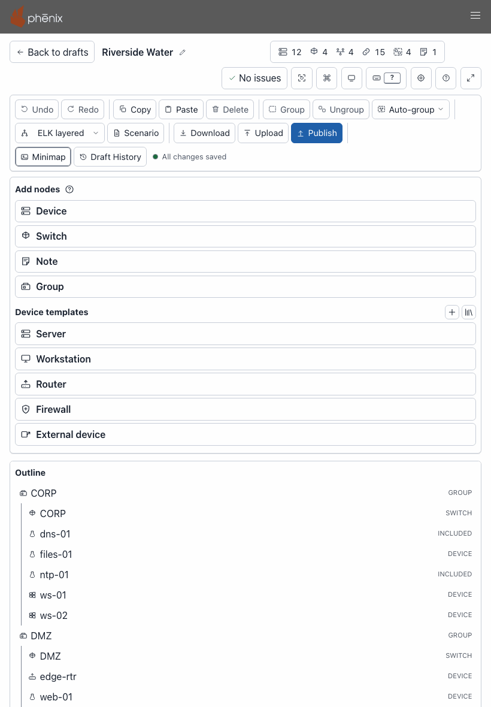
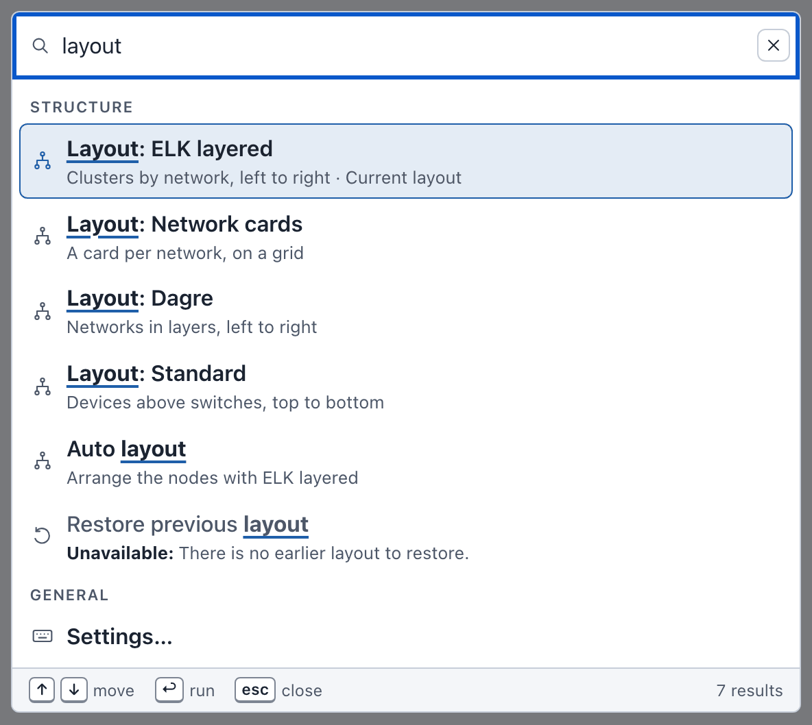
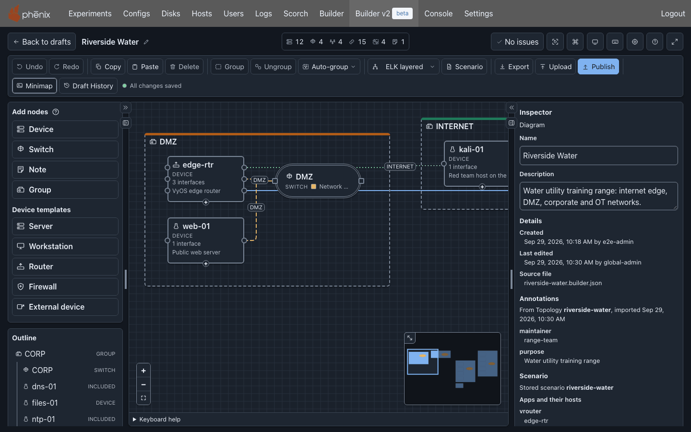

# The Editor

The editor is where you draw and change a diagram. It opens when you open a
draft from the drafts page (see [Opening a draft](drafts.md#opening-a-draft)).
This page describes each part of the editor, its keys and its settings. For
step-by-step tasks, such as adding devices and connecting them, see
[Building a Diagram](diagrams.md).

The examples on this page use the Riverside Water draft of the
[example lab](index.md#the-example-lab).

The editor has five areas:

1. The [header](#header), with the diagram name, its counts, the checks and
   the view buttons.
2. The [toolbar](#toolbar), with the editing, layout, download and publish
   buttons, and the save state.
3. The left column, with **Add nodes** and the [Outline](#outline).
4. The [canvas](#canvas), where the diagram is drawn.
5. The [Inspector](#inspector), where you change what is selected.

## Header

From left to right, the header holds:

- **Back to drafts**: returns to the drafts page without waiting for
  changes to be sent: they keep saving in the background, and the draft's
  card shows how that goes. The button says **Saving…** first only when this
  browser cannot keep your changes, and **Loading…** while the drafts list
  loads, when the list does not show the draft yet.
- The diagram name. A long name is cut off; point at it to see it whole.
- **Edit diagram name** (the pencil): renames the diagram. It is not shown
  when you can only view the draft.
- "Shared by e2e-admin · Can view" (or "Can edit"), on a draft someone
  shared with you (see
  [What the people you share with see](drafts.md#what-the-people-you-share-with-see)).
- The counts: devices, switches, networks, connections, groups and notes,
  each a number after a 17-pixel icon of its kind. Each count is a button
  that selects every item of its kind on the canvas, in place of the
  selection (see [Selecting by kind](#selecting-by-kind)).
- The checks button: **No issues**, or the number of errors and warnings,
  for example **3 warnings**. It opens the **Diagram checks** dialog (see
  [Checks and warnings](#checks-and-warnings)).
- **Reset view**: puts back the column widths, the zoom, the minimap and the
  scroll positions (see [Canvas](#canvas)). It does not change the diagram.
- **Commands**: opens the [command palette](#command-palette).
- The theme button: switches the theme (see [Themes](#themes)).
- **Shortcuts**: opens the [keyboard shortcuts](#keyboard-shortcuts) sheet.
  The button shows the key that opens the sheet: <kbd>?</kbd>, or the key
  you gave it. With **Single-key shortcuts** off and no other key, it shows
  none.
- **Settings**: opens **Builder settings** (see [Settings](#settings)). Its
  key is <kbd>⌥</kbd>+<kbd>⇧</kbd>+<kbd>S</kbd> on macOS and
  <kbd>Alt</kbd>+<kbd>Shift</kbd>+<kbd>S</kbd> on Windows and Linux, and its
  tooltip shows it: "Builder settings (⌥⇧S)" or "Builder settings
  (Alt+Shift+S)".
- **Help**: opens this Builder documentation in a new tab.
- **Focus mode**: hides the phenix navigation bar (see
  [Focus mode](#focus-mode)).

In a narrower window, the buttons after the checks button show only their
icons; **Shortcuts** keeps its key. Point at a button, or move focus to it,
to see its name in a tooltip.

### Selecting by kind

Select a count to select every item of that kind on the canvas, in place of
the selection you had. Focus stays on the count. For example, select
**12 devices** in Riverside Water: the 12 devices are selected, and Builder
announces "Selected 12 devices."

- The networks count selects the switches of the networks, because a network
  is drawn as its switch. Its tooltip says "Select the switches of all 4
  networks".
- The connections count selects the connections and no nodes.
- A count of 0 selects nothing, and says so, for example "There are no notes
  to select."

Point at a count, or move to it with <kbd>Tab</kbd>, to see what it
selects, for example "Select all 12 devices". The counts are one
<kbd>Tab</kbd> stop: the arrow keys, <kbd>Home</kbd> and <kbd>End</kbd>
move between them, and <kbd>Enter</kbd> or <kbd>Space</kbd> selects.

### Renaming the diagram

To rename the Riverside Water diagram to "Riverside Water lab":

1. Select **Edit diagram name** (the pencil after the name). A field
   replaces the name, with the name selected.
2. Type `Riverside Water lab`.
3. Press <kbd>Enter</kbd>. The header shows the new name.

Press <kbd>Esc</kbd> instead to keep the old name. Leaving the field also
renames the diagram. **Undo** puts the old name back.

The **Name** field of the [Inspector](#with-nothing-selected) changes the
same name. The diagram name is not the name of the topology: you choose
that when you publish (see [Publishing](publishing.md)).

## Toolbar

The toolbar's buttons, from left to right:

| Button | What it does | More |
|---|---|---|
| **Undo**, **Redo** | Undo or redo the last change. | [Undo and redo](diagrams.md#undo-and-redo) |
| **Copy**, **Paste** | Copy the selection, and paste a copy of it 40 pixels down and to the right of the original. Each further paste goes 40 pixels further. | [Copy, paste, duplicate and delete](diagrams.md#copy-paste-duplicate-and-delete) |
| **Delete** | Delete the selected nodes and connections. | [Copy, paste, duplicate and delete](diagrams.md#copy-paste-duplicate-and-delete) |
| **Group**, **Ungroup** | Put the selected nodes in a new group, or take a selected group apart. | [Groups](diagrams.md#groups) |
| **Auto-group** | A menu: **By network**, **By name** or **By name pattern…**. | [Auto-group](diagrams.md#auto-group) |
| Layout menu | Lays the diagram out. It shows the draft's layout, or **Default** when no layout has run. | [Layouts](diagrams.md#layouts) |
| **Scenarios** | List the scenarios the diagram is used with: stored ones, or a scenario file stored on the server from here. | [Scenarios](diagrams.md#scenarios) |
| **Download** | Save the diagram as a file. | [Downloading](import-upload-download.md#downloading) |
| **Upload** | Open a diagram you have as a new draft: a Builder document, a published diagram, or a legacy Builder diagram. | [Import, Upload and Download](import-upload-download.md) |
| **Publish** | Write Topology and Experiment configs, and add the topology to the diagram's scenarios. | [Publishing](publishing.md) |
| **Share** | Choose who can open the draft. Shown to the owner when phenix has sign-in enabled and their role has `configs` `update`. Shown, unavailable, to the people the draft is shared with. | [Sharing a draft](drafts.md#sharing-a-draft) |
| **Exp** | Open the experiment the diagram was published with. Shown only while that experiment exists and your role can read it. | [Opening the experiment](drafts.md#opening-the-experiment) |
| **Add connection** | Open the **Add a connection** dialog, which connects a device to a switch without dragging. | [Add a connection without dragging](diagrams.md#add-a-connection-without-dragging) |
| **Move to group** | Open the **Move to a group** dialog, which puts a node in a group, or takes it out of one, without dragging. | [Groups](diagrams.md#groups) |
| **Minimap** | Show or hide the minimap. | [Canvas](#canvas) |
| **Draft History** | List the draft's snapshots, and restore one. | [Draft History](drafts.md#draft-history) |

After **Draft History** comes the save state, for example "All changes
saved". A **Retry saving** button follows it when a save fails. See
[How drafts save](drafts.md#how-drafts-save).

A button that does not apply now is unavailable. For example, **Ungroup**
is unavailable until you select a group. When you can only view a draft,
the editing buttons are unavailable.

Point at a button to see its keyboard shortcut in a tooltip, for example
"Undo (⌘Z)" on macOS and "Undo (Ctrl+Z)" on Windows and Linux. The two
menus name the keys that run them without opening them: the layout menu's
tooltip says "Choose a layout. ⌥⇧L runs ELK layered, the Settings default",
and the **Auto-group** tooltip says "Group the ungrouped nodes
automatically. ⌥⇧G groups by network".

## Canvas

The canvas shows the diagram: devices, switches, notes, groups and
drawings (rectangles, circles, icons and lines; see
[Shapes, icons and lines](diagrams.md#shapes-icons-and-lines)), and the
connections between devices and switches. Rectangles, circles and lines
lie under the devices and switches, also while they are selected, so they
never hide a device or its connection points.

- **Select** a node or connection: click it. Shift-click adds a node to the
  selection or takes it out. Click an empty spot to clear the selection.
- **Move** a node: drag it. A drag puts nodes on a 16-pixel grid. Dragging
  a group moves the nodes in it. Shift and an arrow key move the selected
  nodes 10 pixels and do not snap them to the grid. The canvas draws every
  node where the diagram puts it, also when the diagram opens again.
- **Pan**: drag an empty spot of the canvas.
- **Zoom**: use the mouse wheel, or the zoom controls at the bottom left:
  **Zoom in**, **Zoom out** and **Fit diagram to view**. After a fit, the
  third button is named **Restore previous view** and puts back the zoom and
  position from before the fit.
- **Connect**: drag from a device's connection point to a switch (see
  [Connecting interfaces](diagrams.md#connecting-interfaces)).

A device shows its icon, its hostname, its node type, its number of
interfaces and its description. The node type is the device's **Type** as
it is stored, for example VirtualMachine, Router or Firewall. An external
device shows External, and a device with no type shows Device. A device from
an included topology has a dashed border and says where it comes from in
place of its type, for example "Included from corp-services" on dns-01 and
ntp-01 (see [Included topologies](diagrams.md#included-topologies)). A node
with a warning has a warning mark at its top left corner (see
[Checks and warnings](#checks-and-warnings)).

Devices and switches can have colors and icons of their own (see
[Colors](diagrams.md#colors) and [Custom icons](diagrams.md#custom-icons)),
and notes, which show in a card below the node (see
[Notes on devices and switches](diagrams.md#notes-on-devices-and-switches)).

### Info tooltips

Rest the pointer on a device or a switch for a moment, or move keyboard
focus to it, to see an info tooltip:

| Node | Rows of the tooltip |
|---|---|
| Device | **Description**, cut to 80 characters. **Interfaces**: each interface with its address, for example "eth0 — 10.10.20.101/24", or "DHCP". **OS type**. |
| Switch | **Network**: the network's name. **VLAN alias**, or "no alias". **Description**, cut to 80 characters. **Connected devices**, with their number: each device connected to this switch, with the address of the interface it connects on. |

A device or a switch with notes has a last row, **Notes**, with their number:
each note on one line, cut to 80 characters. A list shows its first 8
entries, then "+N more". An empty row says "None", and a device with no OS
type says "Not set".

The tooltip stays while the pointer is on the node or on the tooltip, and
while the node has keyboard focus. <kbd>Esc</kbd> closes it and keeps the
selection; a second <kbd>Esc</kbd> clears the selection. Notes, groups,
drawings and connections have no tooltip, and PNG and SVG downloads do not
show it.
Screen readers read the same facts as the node's description, with the
notes the card below the node shows: its first five notes, each in full (a
note longer than the card's three lines can hold at the node's width is cut
past that), then how many more there are.

The minimap at the bottom right shows the whole diagram, with the visible
part outlined. To resize it, drag the **Resize minimap** handle at its top
left corner. **Minimap** in the toolbar shows or hides it until the next
diagram opens. The Settings choose whether it shows at first (see
[Settings](#settings)).

The keys that work on the canvas are in
[Keys on the canvas](#keys-on-the-canvas).

**Reset view** in the header sets the zoom back to how diagrams open (100%,
the whole diagram, or your custom percentage, as the Settings say). It also
shows the minimap at its
default size (unless the Settings turn it off), shows both side columns at
their default widths, closes the sections you opened, and scrolls the
columns back to the top. It does not change the diagram.

## Side columns

The left column holds **Add nodes** and the **Outline**. The right column
holds the **Inspector**. Beside each column are two toggles:

- **Widen Add nodes and Outline** and **Widen Inspector** make the column as
  wide as it can be. Select the toggle again to go back.
- **Hide Add nodes and Outline** and **Hide Inspector** fold the column into
  a narrow strip, which gives the canvas more room. The strip holds the
  toggle that shows the column again.

To set a width yourself, drag the splitter between the column and the
canvas (**Resize Add nodes and Outline**, **Resize Inspector**). Double-click
it to go back to the default width.

Selecting a node or connection on the canvas shows a hidden Inspector.
The browser remembers the widths and the hidden columns.

In a window narrower than about 900 pixels, the columns stack: the toolbar,
**Add nodes** and the **Outline** come first, then the canvas and the
**Inspector**. Every column shows, and the page scrolls.

## Add nodes

**Add nodes** lists what you can add: **Device**, **Switch**, **Note**,
**Group**, and the drawings **Rectangle**, **Circle**, **Icon** and **Line**
(see [Shapes, icons and lines](diagrams.md#shapes-icons-and-lines)), then
the **Device templates**, such as **Server**,
**Workstation**, **Router**, **Firewall** and **External device**. Select an
item to add it to the diagram, or drag it onto the canvas. The new node is
placed in free space and selected. Point at an item to see its description.
See [Adding devices](diagrams.md#adding-devices).

Two buttons follow the **Device templates** heading:

- **New device template** (the **+**): opens the template editor on a new
  template of this diagram (see
  [Diagram templates](templates.md#diagram-templates)).
- **Node Templates library**: leaves the draft, as **Back to drafts** does,
  and shows the **Node Templates** tab of the drafts page (see
  [The template library](templates.md#the-template-library)).

The device templates are in groups: **This diagram**, **My library**,
**Shared with me** and **Server-wide**. A group's name shows only when two
groups or more have templates. See
[Templates in Add nodes](templates.md#templates-in-add-nodes).

## Outline

{ width="240" }

The **Outline** lists every node of the diagram as a tree: each group with
the nodes in it, then the nodes that are in no group. Each row shows what
the node is: GROUP, SWITCH, DEVICE, INCLUDED (a device from an included
topology), NOTE, or for a drawing SHAPE (a rectangle or a circle), ICON or
LINE. Selecting a row selects the node on the canvas, and the canvas shows
it.

Keys in the Outline:

- <kbd>↑</kbd> and <kbd>↓</kbd> move between rows; <kbd>Home</kbd> and
  <kbd>End</kbd> go to the first and last row.
- <kbd>Enter</kbd> or <kbd>Space</kbd> selects a row, or deselects it when
  it is the only one selected. <kbd>Shift</kbd>+<kbd>Enter</kbd> adds a row
  to the selection or takes it out.
- <kbd>F2</kbd> renames the node in place, in a field on its row.
  <kbd>Enter</kbd> keeps the new name, and <kbd>Esc</kbd> cancels. (On the
  canvas, <kbd>F2</kbd> moves focus to the name in the Inspector instead.)
- <kbd>Delete</kbd> removes the row, or the selection it is in.

Below the tree, the Outline lists the **Networks**: each network, with its
VLAN alias (or "no alias"), the number of devices on it, and a button to
remove it (see
[Adding switches and networks](diagrams.md#adding-switches-and-networks)).

To connect a device to a switch, or move a node into or out of a group,
without dragging, use the toolbar's **Add connection** and **Move to
group** (see [Toolbar](#toolbar)).

## Inspector

The **Inspector** shows the fields of what is selected, and changes them.
It works on one node or one connection at a time. With nothing selected, or
with several items selected, it shows the diagram itself.

### With nothing selected

![The Inspector with nothing selected: the diagram's Name and Description; Icon size Small (16 pixels) with its hint; Details, with Created Sep 29, 2026, 12:17 PM by e2e-admin, Last edited Oct 9, 2026, 10:51 PM by global-admin and Source file riverside-water.builder.json; the Annotations imported from Topology riverside-water (maintainer and purpose); Scenarios, with Scenario riverside-water, its vrouter and ntp apps with their hosts, and an Edit scenarios button; and Notes, with No notes. and an Add note button.](../images/builder/inspector-diagram.png){ width="352" }

The **Diagram** section has:

- **Name** and **Description** of the diagram. Select **Apply** to keep a
  change.
- **Icon size**: **Small**, **Medium** or **Large**, the size devices,
  switches and groups draw their icons at unless one has a size of its own
  (see [Icon size](diagrams.md#icon-size)). A choice takes effect at once,
  as one step of **Undo**. In a draft you can only view, the size is shown
  as text.
- **Details**, which you cannot change here:
    - **Created**: when the diagram was made, and by whom.
    - **Last edited**: when the content you see was saved, and by whom. It
      changes with each change you make, once the server has saved it. After
      **Undo** or **Restore** it shows the save of the earlier version you
      went back to.
    - **Source file**: the name of the file the draft was made from, for a
      draft made by **Upload** of a file or by **Import** of a config
      file.

    In the picture, the draft was made by uploading a Builder file named
    `riverside-water.builder.json` that names `e2e-admin` as the maker of
    the diagram (its `createdBy`), and **Upload** keeps it. The upload itself is the
    last edit. Its user is `global-admin`, the user everyone has on a phenix
    server with authentication disabled. The times are shown in US Mountain
    Time: **Created** is the time the file gives, and **Last edited** the
    time of the upload. A row is left out when the diagram does not have its
    value. See
    [Who made and last saved a diagram](import-upload-download.md#who-made-and-last-saved-a-diagram).
- **Annotations**: for a draft imported from a config, the annotations of
  that config, under "From Topology riverside-water, imported" and the
  date. They are shown only: publishing does not write them. A diagram
  drawn in the editor has no such list. See
  [What an import keeps](import-upload-download.md#what-an-import-keeps).
- **Scenarios**: "No scenarios." and **Add scenario**, or each scenario the
  diagram lists ("Scenario riverside-water"). Under **Apps and their
  hosts**, each app of the scenario is listed with the hosts it runs on:
  vrouter on edge-rtr, and ntp on ntp-01, ws-01, ws-02, hmi-01 and
  historian-01. The apps are read from the server, which needs `configs`
  `get` on the scenario; otherwise the Inspector says it cannot read them.
  **Edit scenarios** opens the **Scenarios** dialog (see
  [Scenarios](diagrams.md#scenarios)).
- **Notes**: free text about the diagram as a whole, one box for each note,
  or "No notes.". **Add note** adds an empty box and moves the focus to it.
  A note is saved when you leave its box, as one step that **Undo** takes
  back. Leave a box empty to remove its note, or select its **Delete**
  button. A diagram holds at most 100 notes of at most 4096 bytes each
  (in UTF-8, so fewer characters outside ASCII); at 100, **Add note** is
  unavailable and says so. A note that is too long, or that holds a control
  character other than a line break or a tab, shows an error under its box
  and is not saved: the diagram keeps the note as it was until you fix the
  text. In a draft you can only
  view, the notes are shown as text. The notes are part of the diagram and
  travel with it in Builder JSON and YAML, but publishing writes them to no
  config.

### Editing a node

{ width="352" }

Select a node to see its fields. A device has these sections:

- **Hostname**, **Icon**, **Custom icon**, **Icon size**, **Outline Color**
  and **Fill Color** (see [Colors](diagrams.md#colors),
  [Icon size](diagrams.md#icon-size) and
  [Custom icons](diagrams.md#custom-icons)).
- **Node**: **Type**, and **General** (**Description**, **Do not boot**,
  **Node hostname**, **Notes**, **Snapshot**, **VM type**). Each note has a
  text area of its own; **Add note** adds one. The canvas shows the notes
  below the device, and a new experiment copies them to its VM's notes.
- **Hardware**: **CPU**, **Drives** (**Image** and more for each drive),
  **Memory**, **OS type** and **VCPUs**.
- **Network**: **Interfaces**, **OSPF**, **Routes** and **Rulesets**.
- **More settings**: **Commands**, **Delay**, **Injections**, **Advanced
  settings**, **Labels** and **Annotations**.
- **Connection points**: the interfaces with a handle on the canvas.
- **Position**: **X** and **Y**, and **Move**.

Fields marked \* are required. An empty optional field shows the value phenix
uses in its place, marked as the default, for example "Default (kvm)" for
**VM type**.

Changes in the Inspector take effect when you apply them:

1. Change one or more fields. A bar at the bottom of the Inspector says
   "Unapplied changes", with **Apply** and **Cancel**.
2. Select **Apply**, or press <kbd>Enter</kbd> in a field. The diagram
   changes, and the change is saved.

**Cancel** drops the changes. **Apply** is unavailable while a field you
changed has an error; the bar then says "Fix the fields marked with errors".
A change that reaches the diagram while you edit, such as a layout that
finishes, keeps the text you are typing and your unapplied changes, and
shows what it changed in the other fields.

For example, to change the description of ws-01:

1. In the **Outline**, select ws-01.
2. In **Description**, replace "Engineering workstation" with
   `Engineering workstation, CAD`.
3. Press <kbd>Enter</kbd>. The change is applied.

If you select another node before you apply, the Inspector applies your
changes when they are valid, and drops them when they are not. Applied
changes appear in Draft History, for example as "Applied changes to Device
ws-01". Leaving the draft,
publishing or downloading also saves changes you did not apply. They appear
in Draft History as "Saved unapplied changes to" and the node's name.

Some fields of a device take effect at once, without **Apply**:

- **Icon**, **Custom icon**, **Icon size**, **Outline Color** and **Fill
  Color**. Each change is one step of **Undo**, for example "Changed the
  fill color of Device web-01 to #2f6fbf".
- **Connection points**: adding, disconnecting or removing one.

The fields come from the phenix server, so they match what it accepts. When
the server cannot send them, the Inspector says so, for example "Could not
load this server's form fields. … The Inspector shows the fields built into
the Builder instead, which may differ from what this server accepts." See
[Permissions](administration.md#permissions).

### Other kinds of nodes

- A switch is one network. Its Inspector ("Network CORP") has **Name**,
  **VLAN alias**, **Description**, **Edge Color**, **Line style**,
  **Outline Color**, **Fill Color**, **Icon size**, **Notes** and
  **Position**. See
  [Adding switches and networks](diagrams.md#adding-switches-and-networks).
  The switch's notes are edited as a device's are, and stay in the diagram
  (see
  [Notes on devices and switches](diagrams.md#notes-on-devices-and-switches)).
- A note has **Text**, **Color** and **Position** (see
  [Notes](diagrams.md#notes)).
- A group has **Title**, **Description**, **Color**, **Border pattern**,
  **Icon**, **Custom icon**, **Icon size** and **Position** (see
  [Groups](diagrams.md#groups)).
- A connection has **Label** (by default, the network's name), **Color** and
  **Line style**. Its Inspector names it, for example "Connection from
  ntp-01 (eth0) to CORP".
- A rectangle or a circle has **Shape**, **Label**, **Fill Color**,
  **Outline Color**, **Border pattern**, **Width** and **Height**; an icon
  has **Icon**, **Custom icon**, **Label**, **Width** and **Height**; and a
  line has **Label**, **Color**, **Line style**, **Arrowhead at the start**,
  **Arrowhead at the end** and **Points**, each point's **X** and **Y** on
  the canvas (see
  [Shapes, icons and lines](diagrams.md#shapes-icons-and-lines)).

These fields wait for **Apply**, the colors, icons and icon sizes of
switches and groups too. Only a device's icons, icon size and colors take
effect at once.

### Fields you cannot change

Some fields are read only:

- A device from an included topology says "Defined by included topology
  corp-services, so it is read only here. Change it in corp-services and
  import again, or combine the included nodes into a new draft to edit them
  here. It can still be moved." Under the note, **Combine into a new draft**
  makes a copy of the diagram in which the included devices are its own (see
  [Making included devices editable](diagrams.md#making-included-devices-editable)).
  A role that cannot create drafts does not get the button.
- A network that an included device is on cannot be renamed. For CORP the
  Inspector says "Network CORP cannot be renamed: ntp-01 from included
  topology corp-services is on it. Its other fields can still change."
- Every field is read only in a draft you can only view, and in a published
  diagram (see [Published diagrams](drafts.md#published-diagrams)).

## Checks and warnings

Builder checks the diagram as you edit it. The checks button in the
header shows the result: **No issues**, or a count such as **3 warnings**.

To see and fix the warnings of the Riverside Water expansion draft:

1. Open the Riverside Water expansion draft. The checks button says
   **1 warning**.
2. Select **1 warning**. The **Diagram checks** dialog lists the errors
   first, then the warnings, each group under a heading that counts it,
   such as "1 warning". In each group the issues follow the order of the
   nodes and connections they are about. Each issue names its device,
   switch or connection, and has a **Go to** button.
3. Select **Go to** beside the warning "interface "eth0" of
   "historian-01-2" is not connected to a network and has no VLAN, so it
   cannot be published: connect it, or type a VLAN for it". The dialog
   closes, the canvas selects historian-01-2, and the Inspector opens on it.
4. The Inspector lists the device's own warnings under "Checks: 1 warning".
   **Go to** beside a warning there moves focus to its field. Fix them there
   (see [What blocks publishing](publishing.md#what-blocks-publishing) for
   this example).

**Go to** shows the Inspector if it is hidden, and brings the node into
view. An issue about a network goes to the network's switch. An issue that
names no field moves focus to its node or connection on the canvas. An issue
about the diagram as a whole, or about a network with no switch, has no
**Go to**.

There are two levels:

- **Errors**, such as a required field left empty. The diagram cannot be
  published until they are fixed.
- **Warnings**. Three kinds also stop the diagram from being published: an
  interface with no VLAN (on a device that is not external), an IP or MAC
  address that two interfaces on the same network use, and a hostname phenix
  refuses.
  **Publish** lists those as errors. The dialog says so, for example "The
  warnings must be fixed before the diagram can be published, and Publish
  lists those warnings as errors." Other warnings, such as a device with no
  interfaces, do not stop publishing.

Each node with a problem has a warning mark on the canvas. Devices from
included topologies get no warnings: they belong to their own topology. This
diagram's devices are still checked against them: a hostname an included
device also uses is an error, and an address it also uses is a warning.

When the server lists no disk images, the dialog says "Drive images are not
checked: the server did not list its disk images." Otherwise a drive image
the server does not have is a warning.

### Preflight

The **Preflight** section of the **Diagram checks** dialog asks the phenix
server to check the saved draft against the server and its cluster before
you start an experiment from it. The checks only read: they write nothing
and start no VM or experiment. No check is ticked at first. The dialog
remembers the checks you last ticked in this browser until you log out.

| Check | What it looks at |
|---|---|
| **Host capacity** | The CPUs and memory of every device but an external one (`hardware.vcpus` and `hardware.memory`; 1 vCPU and 512 MB when unset), against what the schedulable cluster hosts have free. Each device must fit on one host, with its vCPUs and its memory both within that host's CPUs and memory: a device that fits on no single host fails the check, as does too little free memory. Too few free CPUs is a warning, since VMs can share CPUs. |
| **Networks** | The VLANs the devices use, and the networks' VLAN aliases, against the VLAN range of the experiment you name (no range applies without one, or when the experiment sets none); the aliases against the VLANs that the running experiments your role may list use (when a running experiment your role may not list is left out, the summary says "running experiments your role may not list were not compared", and names none of them); and the bridges the interfaces name, and the experiment's default bridge (`phenix` without an experiment), against the bridges of the schedulable hosts. A bridge a host does not have yet is a warning: minimega creates it when the experiment starts. |
| **Disk images** | Each drive image, by file name, against the server's disk images, and its kind: a VM or ISO image for a kvm device, a container image for a container. The server reuses its list of disk images for 10 seconds, so an image added in that time may not be found yet. |
| **Scenario apps** | Each app the diagram's scenarios run (apps a scenario disables are left out), against the default apps, the built-in apps and the user apps on the server's `PATH`. |

To check the Riverside Water expansion draft before starting it as the
`riverside` experiment:

1. Open the draft and select the checks button in the header.
2. Under **Preflight**, tick **Host capacity**, **Networks**, **Disk
   images** and **Scenario apps**.
3. Type `riverside` in **Experiment (optional)**. The field suggests the
   experiments the server lists.
4. Select **Run**. Builder saves your latest changes first, as **Publish**
   does. When the checks are done, the dialog says, for example,
   "Preflight: 3 passed, 1 unavailable", and lists each check with
   **Passed**, **Failed** or **Unavailable** and a summary, such as
   "Needed: 6 vCPUs and 6144 MB of memory for 4 devices. Free: 30 vCPUs and
   57344 MB on 2 schedulable hosts."
5. Each issue of a check has its code and, when it is about a device or a
   network, **Go to**, as the other issues do.

On a phenix server where minimega is not running, the report of step 4
says "Preflight: 1 passed, 3 unavailable":

![The Preflight section after Run, with the four checks ticked and riverside in Experiment (optional): it says Preflight: 1 passed, 3 unavailable. Host capacity: Unavailable, because the cluster hosts cannot be read; Networks: Unavailable, with 4 VLANs, no VLAN range in experiment riverside, and the bridges not checked; Disk images: Unavailable, because the server listed no disk images; each of these with its warning and the code preflight.unavailable; and Scenario apps: Passed, Found: 2 of 2 apps, named by 1 scenario.](../images/builder/preflight-report.png)

A check is **Unavailable** when it, or a part of it, could not be made, and
an issue says why: your role lacks the permission it needs (see
[Administration](administration.md#what-each-task-needs)), minimega cannot
be reached, the server lists no disk images, or the check took longer than
20 seconds. The other checks are still made. The report stays when the
dialog closes and opens again, and is cleared when the diagram changes.

## Command palette

The command palette runs any command by name, and finds nodes and networks.

To open it, select **Commands** in the header, or press
<kbd>⌘</kbd>+<kbd>K</kbd> on macOS or <kbd>Ctrl</kbd>+<kbd>K</kbd> on Windows
and Linux. The keys work in text fields too. The palette also works on the
drafts page.

The field says "Type a command, @ for nodes, # for networks":

- Type words to find commands, for example `layout`. Commands are listed in
  groups such as **General**, **Structure**, **Add**, **Go to**, **View**
  and **Draft**. A command shows its keys, if it has any.
- With a selection, the first group, for example "Selected: historian-01",
  holds commands for it, such as "Rename historian-01" and **Duplicate**.
- When you open the palette, a **Recent** group lists the commands you ran
  last.
- A command that does not apply now says why, for example "Unavailable:
  There is no earlier layout to restore."
- Some commands are also found by another word. Type `export` to list every
  download format, or `send` to find **Share…**.
- Each download format is a command of its own: **Download Builder JSON**,
  **Download Builder YAML**, **Download Topology YAML**, **Download PNG**,
  **Download SVG** and **Download Gephi (GEXF)**. Each opens the **Download
  diagram** dialog and starts that download at once (see
  [Downloading](import-upload-download.md#downloading)).
- A command marked **›** takes a second step. For example, **Add device**
  then lists **Device** and every device template of
  [Add nodes](#add-nodes), each with its group and image, for example
  **Server** with "My library · ubuntu.qc2". Press
  <kbd>⌫</kbd> (<kbd>Backspace</kbd>) in the empty field to go back a step.
- Type `@` and a name, an image, a network or an address to find nodes.
  `@10.10.30.20` finds historian-01.
- Type `#` to list the networks, found by name or VLAN alias. Choose one to
  select its switch.

Press <kbd>↑</kbd> and <kbd>↓</kbd> to move, <kbd>Enter</kbd> to run, and
<kbd>Esc</kbd> to close. On a node, <kbd>Shift</kbd>+<kbd>Enter</kbd> adds it
to the selection.

For example, to find the historian:

1. Press <kbd>⌘</kbd>+<kbd>K</kbd> (<kbd>Ctrl</kbd>+<kbd>K</kbd>).
2. Type `@hist`. The palette lists historian-01 ("Device · ubuntu.qc2 · in
   OT · OT") and the note that names it.
3. Press <kbd>Enter</kbd>. The canvas selects historian-01, and the
   Inspector shows it.

<kbd>⇧</kbd>+<kbd>⌘</kbd>+<kbd>O</kbd> (<kbd>Ctrl</kbd>+<kbd>Shift</kbd>+<kbd>O</kbd>)
opens the palette at **Go to node**, which lists every node.

## Keyboard shortcuts

To see every shortcut, select **Shortcuts** in the header, or press
<kbd>?</kbd> outside a text field. The **Shortcuts** button shows the key
that opens the sheet. The sheet shows the keys of your platform ("Keys for
macOS, and where each one works." or "Keys for Windows and Linux, and where
each one works."). Type in **Filter shortcuts** to find an action, or a key
such as `G`.

The sheet sets its groups in columns: three in a wide window, two in a
narrower one, and one in a narrow one.

The default shortcuts:

| Action | Where it works | macOS | Windows and Linux |
|---|---|---|---|
| Command palette | Editor and drafts list, text fields too | <kbd>⌘</kbd>+<kbd>K</kbd> | <kbd>Ctrl</kbd>+<kbd>K</kbd> |
| Keyboard shortcuts | Editor and drafts list, not in text fields | <kbd>?</kbd> | <kbd>?</kbd> |
| Settings… | Editor and drafts list, not in text fields | <kbd>⌥</kbd>+<kbd>⇧</kbd>+<kbd>S</kbd> | <kbd>Alt</kbd>+<kbd>Shift</kbd>+<kbd>S</kbd> |
| Undo | Editor, not in text fields | <kbd>⌘</kbd>+<kbd>Z</kbd> | <kbd>Ctrl</kbd>+<kbd>Z</kbd> |
| Redo | Editor, not in text fields | <kbd>⇧</kbd>+<kbd>⌘</kbd>+<kbd>Z</kbd> | <kbd>Ctrl</kbd>+<kbd>Shift</kbd>+<kbd>Z</kbd> or <kbd>Ctrl</kbd>+<kbd>Y</kbd> |
| Copy | Editor, not in text fields | <kbd>⌘</kbd>+<kbd>C</kbd> | <kbd>Ctrl</kbd>+<kbd>C</kbd> |
| Paste | Editor, not in text fields | <kbd>⌘</kbd>+<kbd>V</kbd> | <kbd>Ctrl</kbd>+<kbd>V</kbd> |
| Duplicate | Editor, not in text fields | <kbd>⌘</kbd>+<kbd>D</kbd> | <kbd>Ctrl</kbd>+<kbd>D</kbd> |
| Delete selection | Canvas and outline rows | <kbd>⌫</kbd> or <kbd>⌦</kbd> | <kbd>Delete</kbd> or <kbd>Backspace</kbd> |
| Rename | Canvas and outline rows | <kbd>F2</kbd> | <kbd>F2</kbd> |
| Select all | Editor, not in text fields | <kbd>⌘</kbd>+<kbd>A</kbd> | <kbd>Ctrl</kbd>+<kbd>A</kbd> |
| Clear selection | Canvas | <kbd>esc</kbd> | <kbd>Esc</kbd> |
| Select or deselect the focused item | Canvas and outline rows | <kbd>↩</kbd> or <kbd>Space</kbd> | <kbd>Enter</kbd> or <kbd>Space</kbd> |
| Add the focused item to the selection, or take it out | Canvas and outline rows | <kbd>⇧</kbd>+<kbd>↩</kbd> | <kbd>Shift</kbd>+<kbd>Enter</kbd> |
| Move to the nearest node that way | Canvas | <kbd>←</kbd> <kbd>↑</kbd> <kbd>→</kbd> <kbd>↓</kbd> | <kbd>←</kbd> <kbd>↑</kbd> <kbd>→</kbd> <kbd>↓</kbd> |
| Move through the focused node’s connections | Canvas | <kbd>⇟</kbd> or <kbd>⇞</kbd> | <kbd>PgDn</kbd> or <kbd>PgUp</kbd> |
| Move the selected nodes 10 pixels | Canvas | <kbd>⇧</kbd> with an arrow key | <kbd>Shift</kbd> with an arrow key |
| Resize the selected group, note, shape or icon 10 pixels | Canvas | <kbd>⌥</kbd>+<kbd>⇧</kbd> with an arrow key | <kbd>Alt</kbd>+<kbd>Shift</kbd> with an arrow key |
| Move between outline rows | Outline rows | <kbd>↑</kbd> <kbd>↓</kbd> <kbd>↖</kbd> <kbd>↘</kbd> | <kbd>↑</kbd> <kbd>↓</kbd> <kbd>Home</kbd> <kbd>End</kbd> |
| Group selection | Editor, not in text fields | <kbd>⌘</kbd>+<kbd>G</kbd> | <kbd>Ctrl</kbd>+<kbd>G</kbd> |
| Ungroup | Editor, not in text fields | <kbd>⇧</kbd>+<kbd>⌘</kbd>+<kbd>G</kbd> | <kbd>Ctrl</kbd>+<kbd>Shift</kbd>+<kbd>G</kbd> |
| Auto-group by network | Editor, not in text fields | <kbd>⌥</kbd>+<kbd>⇧</kbd>+<kbd>G</kbd> | <kbd>Alt</kbd>+<kbd>Shift</kbd>+<kbd>G</kbd> |
| Auto layout | Editor, not in text fields | <kbd>⌥</kbd>+<kbd>⇧</kbd>+<kbd>L</kbd> | <kbd>Alt</kbd>+<kbd>Shift</kbd>+<kbd>L</kbd> |
| Add device | Canvas | <kbd>N</kbd> | <kbd>N</kbd> |
| Go to node | Editor, not in text fields | <kbd>⇧</kbd>+<kbd>⌘</kbd>+<kbd>O</kbd> | <kbd>Ctrl</kbd>+<kbd>Shift</kbd>+<kbd>O</kbd> |
| Zoom in | Canvas | <kbd>=</kbd> or <kbd>+</kbd> | <kbd>=</kbd> or <kbd>+</kbd> |
| Zoom out | Canvas | <kbd>−</kbd> | <kbd>−</kbd> |
| Fit diagram to view | Canvas | <kbd>⇧</kbd>+<kbd>1</kbd> | <kbd>Shift</kbd>+<kbd>1</kbd> |
| Focus mode | Editor and drafts list, text fields too | <kbd>⇧</kbd>+<kbd>⌘</kbd>+<kbd>F</kbd> | <kbd>Ctrl</kbd>+<kbd>Shift</kbd>+<kbd>F</kbd> |
| Save now | Editor, text fields too | <kbd>⌘</kbd>+<kbd>S</kbd> | <kbd>Ctrl</kbd>+<kbd>S</kbd> |

<kbd>N</kbd> on the canvas adds a plain Device, as **Device** under **Add
nodes** does, at a free spot in the part of the canvas in view. The new
device is selected and takes focus, so <kbd>N</kbd> again adds another. In
the command palette, **Add device** asks for a template first. A read-only
draft adds nothing.

On a Mac keyboard without these keys, <kbd>⇟</kbd> and <kbd>⇞</kbd> are
<kbd>Fn</kbd> with <kbd>↓</kbd> and <kbd>↑</kbd>, and <kbd>↖</kbd> and
<kbd>↘</kbd> (Home and End) are <kbd>Fn</kbd> with <kbd>←</kbd> and
<kbd>→</kbd>. <kbd>⌫</kbd> is Delete and <kbd>⌦</kbd> is Forward Delete.

Other commands, such as **Reset view** and **Download…**, have no keys
until you give them some (see [Customizing shortcuts](#customizing-shortcuts)).

"Not in text fields" means the keys do nothing while focus is in a field
you type in, or in any field of the Inspector. On the drafts page,
**Settings…** and **Keyboard shortcuts** also work while a card's checkbox
or **Select all** has focus.

### Keys on the canvas

The diagram is one <kbd>Tab</kbd> stop. These keys work on the canvas itself,
on its nodes and on its connections, not on the zoom buttons:

- The arrow keys move to the nearest node that way. From the canvas itself,
  they go to the node nearest the middle of the view.
- <kbd>PgDn</kbd> and <kbd>PgUp</kbd> move through the focused node's
  connections (on a Mac, <kbd>Fn</kbd> with <kbd>↓</kbd> and <kbd>↑</kbd>).
- <kbd>Enter</kbd> or <kbd>Space</kbd> (<kbd>↩</kbd> or <kbd>Space</kbd>)
  selects the focused item alone, or deselects it when it is the only
  selected item. <kbd>Shift</kbd>+<kbd>Enter</kbd>
  (<kbd>⇧</kbd>+<kbd>↩</kbd>) adds it to the selection or takes it out.
- <kbd>Esc</kbd> clears the selection. When the focused node shows its
  [info tooltip](#info-tooltips), the first <kbd>Esc</kbd> closes the
  tooltip, and the second clears the selection.
- <kbd>Shift</kbd> with an arrow key moves the selected nodes 10 pixels.
  For an exact position, use **Position** in the Inspector.
- <kbd>Alt</kbd>+<kbd>Shift</kbd> (<kbd>⌥</kbd>+<kbd>⇧</kbd>) with an arrow
  key resizes the selected group, note, shape or icon 10 pixels:
  <kbd>→</kbd> and <kbd>↓</kbd> grow it, <kbd>←</kbd> and <kbd>↑</kbd>
  shrink it. With the mouse, drag the handles on its corners and sides.
- <kbd>Delete</kbd> or <kbd>Backspace</kbd> (<kbd>⌫</kbd> or <kbd>⌦</kbd>)
  deletes the focused item, or the whole selection when the focused item is
  part of it.
- <kbd>F2</kbd> moves focus to the name of the focused item in the
  Inspector.
- <kbd>=</kbd> or <kbd>+</kbd> zooms in, and <kbd>−</kbd> zooms out.
  <kbd>Shift</kbd>+<kbd>1</kbd> (<kbd>⇧</kbd>+<kbd>1</kbd>) fits the
  diagram to the view, and a second press restores the view from before.

Anywhere in the editor but a text field, the keys of the table select
everything, copy, paste, duplicate, undo, redo, group, ungroup, go to a
node, open Settings, run Auto layout, auto-group by network, and open the
shortcut sheet. The command palette, **Save now** and focus mode work in
text fields too. In a draft you can only view, you can select items and copy
them, but not change them.

To add nodes or connect them without a pointer, use **Add nodes** and the
Outline. With a screen reader, turn on its focus mode (forms mode in JAWS)
for the canvas keys, or use the Outline (see
[Accessibility](#accessibility)).

A key you removed does nothing, and so does a single key while
[Single-key shortcuts](#single-key-shortcuts) are off. The tooltips, the
palette and the sheet show the keys you have.

### Single-key shortcuts

<kbd>?</kbd>, <kbd>N</kbd>, <kbd>=</kbd>, <kbd>+</kbd>, <kbd>−</kbd> and
<kbd>⇧</kbd>+<kbd>1</kbd> work alone, without <kbd>⌘</kbd> or
<kbd>Ctrl</kbd>. Turn off **Single-key shortcuts** in the sheet or in
Settings if speech input or your screen reader might press them by mistake.
The palette and the buttons still run those commands.

### Customizing shortcuts

You can give any command other keys, or none. For example, to run
**Reset view** with <kbd>⌥</kbd>+<kbd>⇧</kbd>+<kbd>R</kbd>
(<kbd>Alt</kbd>+<kbd>Shift</kbd>+<kbd>R</kbd> on Windows and Linux):

1. Select **Shortcuts** in the header.
2. Select **Change shortcuts**. The sheet is now named **Change keyboard
   shortcuts**, and it lists every command, with or without keys.
3. In **Filter shortcuts**, type `reset view`.
4. On the **Reset view** row, select **Change**. The row says "Press the
   new shortcut".
5. Press <kbd>⌥</kbd>+<kbd>⇧</kbd>+<kbd>R</kbd>. The row shows the keys and
   says they are free: "Press Enter to keep it, or Escape to cancel."
6. Press <kbd>Enter</kbd>, or select **Keep**.
7. Select **Done**, then close the sheet.

The sheet after step 5:

Now zoom the canvas, widen the Inspector, click an empty spot of the canvas,
and press <kbd>⌥</kbd>+<kbd>⇧</kbd>+<kbd>R</kbd>: the zoom and the columns
go back to how a diagram opens.

When you press keys that another command uses, the row says so, for
example that <kbd>⌘</kbd>+<kbd>G</kbd> "already runs Group selection". Select
**Use for** and the command's name, for example **Use for Reset view**, to
move the keys to this command, or press other keys. Keys the
browser keeps, such as <kbd>⌘</kbd>+<kbd>T</kbd>, cannot be chosen.

Each changed row has **Remove** (no keys) and **Reset** (its default keys).
**Reset all shortcuts** puts every command back to its default keys. The
tooltips and the palette show your keys. The browser keeps them, and they
stay after you log out.

## Settings

Select **Settings** in the header to open **Builder settings**, or press
<kbd>⌥</kbd>+<kbd>⇧</kbd>+<kbd>S</kbd> on macOS or
<kbd>Alt</kbd>+<kbd>Shift</kbd>+<kbd>S</kbd> on Windows and Linux, in the
editor or on the drafts page. Changes apply at once. The browser keeps them,
and they stay after you log out.

- **Theme**: **System**, **Light** or **Dark**. System follows your
  device's light or dark appearance.
- **Reduce motion**: the canvas pans and zooms at once, and nothing
  animates. Motion is also reduced whenever your device asks for it.
- **Default layout**: **ELK layered** (the default), **Network cards**,
  **Dagre** or **Standard**. **Auto layout** and **Auto-group** use it on a
  draft whose layout menu says **Default**, and the draft then keeps it. It
  does not move anything by itself.
- **Show the minimap**: on by default. The toolbar's **Minimap** button
  shows or hides it until the next diagram opens.
- **Show node notes**: on by default. Devices and switches show their notes
  below them on the canvas and in PNG and SVG downloads, and **Auto layout**
  leaves room for them (see
  [Notes on devices and switches](diagrams.md#notes-on-devices-and-switches)).
  **Show or hide node notes** in the command palette changes it too.
- **Zoom when a diagram opens**: **100%** (the default), **Fit the whole
  diagram in view**, or **Custom** with a percentage from 20 to 200. A
  percentage is rounded to a multiple of 5, and typing one chooses
  **Custom**; a number out of range says "Enter a number from 20 to 200."
  A custom zoom shows the same part of the diagram first as 100% does.
  **Reset view** goes back to it too.
- **Single-key shortcuts**: see [Single-key shortcuts](#single-key-shortcuts).
- **Change keyboard shortcuts**: see
  [Customizing shortcuts](#customizing-shortcuts).

**Reset to defaults** puts every setting back. It does not change custom
shortcut keys; **Reset all shortcuts** in the shortcuts sheet does that.
Select **Done** to close the dialog.

## Focus mode

Focus mode hides the phenix navigation bar, so Builder fills the
window. Select **Focus mode** in the header, or press
<kbd>⇧</kbd>+<kbd>⌘</kbd>+<kbd>F</kbd>
(<kbd>Ctrl</kbd>+<kbd>Shift</kbd>+<kbd>F</kbd>). The button is then named
**Exit focus mode**; select it or press the same keys to show the
navigation bar again.

Focus mode stays on when you go between the drafts page and the editor. It
ends when you leave Builder.

## Themes

Builder has a light and a dark theme. The theme button in the header
shows the theme in use: **System**, **Light** or **Dark**. Each press
switches to the next one, and its tooltip says which, for example "Theme:
System. Switch to Dark theme". On a device with a light appearance the
order is System, Dark, Light; on a dark one it is System, Light, Dark.
**Theme** in [Settings](#settings) sets the same choice.

The theme changes Builder only, not the rest of phenix. PNG and SVG
downloads use the background of the theme in use.

## Accessibility

You can use Builder with a keyboard only, and with a screen reader.

- Press <kbd>Tab</kbd> from the top of the page to reach **Skip to diagram
  canvas**, which moves focus to the canvas.
- The diagram is one <kbd>Tab</kbd> stop. The arrow keys move to the
  nearest node that way; from the canvas itself they go to the node nearest
  the middle of the view. <kbd>PgDn</kbd> and <kbd>PgUp</kbd> move through
  the focused node's connections.
- <kbd>Enter</kbd> or <kbd>Space</kbd> selects the focused item.
  <kbd>Shift</kbd> with an arrow key moves the selection. <kbd>Delete</kbd>
  deletes it. See [Keys on the canvas](#keys-on-the-canvas).
- A device or a switch with keyboard focus shows its
  [info tooltip](#info-tooltips), and screen readers read the same facts as
  its description. While the node has focus, the pointer resting on another
  node shows that node's tooltip, and the focused node's comes back when the
  pointer leaves. <kbd>Esc</kbd> closes the tooltip until focus moves.
- The toolbar is one <kbd>Tab</kbd> stop too: the arrow keys,
  <kbd>Home</kbd> and <kbd>End</kbd> move between its buttons. So are the
  header's counts (see [Selecting by kind](#selecting-by-kind)).
- A custom icon is decoration: a node's name, its type and what screen
  readers say of it do not change with its icon.
- To add nodes and connect them without a pointer, use **Add nodes** and the
  toolbar's **Add connection**; **Move to group** puts a node in a group.
  The [command palette](#command-palette) opens the same dialogs: type
  `connect` for **Add a connection…** or `group` for **Move to a group…**.
  Each dialog starts from the selection, and <kbd>Esc</kbd> closes it and
  returns focus to where it was opened from.
- A screen reader announces what each change did, for example "Updated
  device ws-01." With a screen reader, turn on its focus mode (forms mode in
  JAWS) for the canvas keys, or use the Outline, which lists every node.
- **Reduce motion** in Settings stops the animations.
- In a narrow window, or at a high browser zoom, the columns stack (see
  [Side columns](#side-columns)).

Builder aims to meet WCAG 2.2 level AA.
