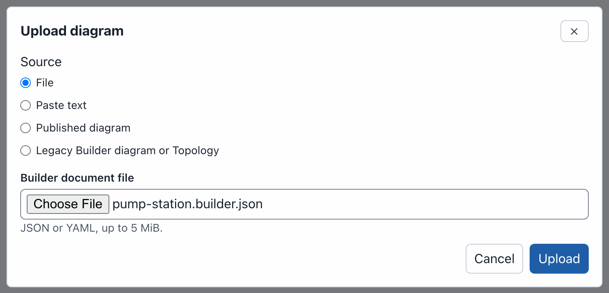
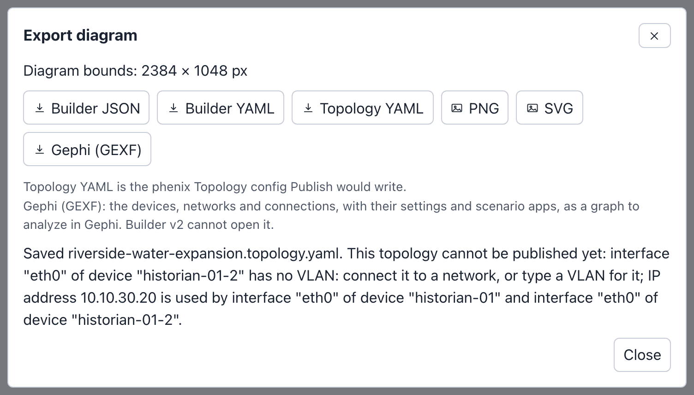

# Import, Upload and Download

Builder can start a draft from a phenix config or from a file you have, and
it can save a diagram as a file in six formats. Three words name these, and
these pages use them the same way everywhere:

- **Import** makes a draft from a phenix config: a Topology or Experiment
  config stored in phenix, or a config file. The phenix server converts the
  config into a diagram.
- **Upload** opens a file you have that is already a diagram: a Builder
  document, such as a draft you downloaded, or a diagram of the
  [legacy Builder](legacy.md). Its **Published diagram** source opens a
  diagram published on the server.
- **Download** saves the open diagram as a file.

None of this changes a config on the phenix server: in the web UI, only
**Publish** writes configs (see [Publishing](publishing.md)). On the command
line, `phenix builder publish` makes a topology from a Builder file.

| To | Use | Where | Result |
|---|---|---|---|
| Start from a Topology or Experiment config | **Import** | Drafts page, and the **Configs** page | A new draft |
| Open a Builder document, a published diagram, or a legacy Builder diagram | **Upload** | Drafts page and editor toolbar | A new draft |
| Save the diagram as a file | **Download** | Editor toolbar | A file |
| Make a topology from a Builder file | `phenix builder publish` | Command line | A Topology config (see [From the command line](#from-the-command-line)) |
| Show the diagram of a topology kept in files | A `builder-doc` annotation with a `path` | The Topology config | A card under **Published Diagrams** (see [A Builder file beside a topology](#a-builder-file-beside-a-topology)) |

The examples on this page use the [example lab](index.md#the-example-lab).

## Importing a topology or experiment

**Import** makes a draft from a Topology or Experiment config. The config can
be one stored in phenix, or a config file. The phenix server converts the
config, so the draft holds what phenix would read from it.

### From a stored config

To import the riverside-water topology:

1. On the drafts page, select **Import**. The **Import topology or
   experiment** dialog opens.
2. Keep **Source** set to **Stored config**, and **Source kind** set to
   **Topology**.
3. In **Source name**, choose `riverside-water`. Because riverside-water
   includes corp-services, the dialog shows **Included topologies**:
   "riverside-water includes 1 other topology." Keep
   **Keep included nodes read only**, and leave
   **Create a new topology as a copy** clear (see
   [Import options](#import-options)).
4. Select **Import**. The dialog says "This import has 1 warning." and lists
   it: "Added 2 nodes from included topology corp-services (2 nodes). They
   are shown read only: edit them in their own topology. Publishing keeps
   includeTopologies instead of copying them."
5. Select **Continue to editor**.

The dialog in step 3:


The editor opens a new draft named riverside-water. The header counts 12
devices, 4 switches, 4 networks and 15 connections. The layout menu says
**Default**: the devices are in rows on a grid, with the switches below
them. Choose a layout to arrange them (see [Layouts](diagrams.md#layouts)).

To stop at step 5, select **Cancel**: the dialog closes and no draft is
made. An import without warnings opens the editor at once, without step 5.

A topology that the [legacy Builder](legacy.md) saved is marked
"(legacy Builder diagram)" in **Source name**. Importing it converts its
diagram, and publishing the draft to the same topology replaces the legacy
diagram (see
[Converting a stored topology](legacy.md#converting-a-stored-topology)).

### Importing an experiment

An experiment imports the same way. To import the riverside experiment:

1. Select **Import**.
2. Keep **Stored config**. Set **Source kind** to **Experiment**, and choose
   `riverside` in **Source name**.
3. Select **Import**. The dialog says "This import has 2 warnings."
4. Select **Continue to editor**. The new draft is named riverside.

The warnings in step 3:


An imported experiment differs from an imported topology in these ways:

- When your role can list the stored Scenario that the experiment names,
  the draft lists it: the Inspector says "Scenario riverside-water".
  Otherwise the draft lists no scenario, and the import warns: "the
  experiment's scenario "riverside-water" is not a stored Scenario config
  and was not attached". The copy of the scenario the experiment holds is
  never kept: a diagram names its scenarios and holds none.
- The experiment's VLAN aliases become the **VLAN alias** of each network.
- Some experiment fields have no place in a diagram. The import names them,
  for example "experiment fields not represented in the builder document:
  baseDir, defaultBridge, deployMode". The experiment's VLAN range is not
  kept either.
- The files that the experiment's apps injected into VMs when it started
  are left out, without a warning. The topology's own injections are kept.

### Importing a config file

A config file does not need to be stored in phenix first. To import
the pump station of the example lab from
[pump-station.topology.yaml](examples/pump-station.topology.yaml):

1. Select **Import**.
2. Set **Source** to **Config file**.
3. In **Topology or Experiment config**, choose `pump-station.topology.yaml`.
   The file can be JSON or YAML, up to 5 MiB.
4. Select **Import**.

This config has no warnings, so the editor opens at once. The new draft is
named pump-station, after the config. It has 3 devices (station-rtr, rtu-01
and eng-ws-01), 2 switches, 2 networks (WAN and STATION) and 4 connections.
The draft remembers the name of the file: with nothing selected, the
Inspector shows "Source file pump-station.topology.yaml" under **Details**
(see [With nothing selected](editor.md#with-nothing-selected)).

Importing a config file needs the `configs` `create` permission. A
draft made from a config file can publish a new topology. It cannot
update a stored config, even one with the same name (see
[Publishing](publishing.md)). So the dialog offers no copy for a config
file, but it offers **Included topologies** when the file's topology
includes others (see [Import options](#import-options)). The file must name
its config in `metadata.name`.

An Experiment config file's scenario is found the same way, by name, among
the stored Scenarios your role can list. When the draft lists it, the import
says so, as the file's own copy may differ: "scenario "riverside-water" is
this server's Scenario config of that name, not the copy the experiment
file holds".

phenix reads a config file as it reads one created with
`phenix config create`. That includes `${NAME}` and `${NAME:default}`, which
phenix fills in from the environment of the phenix server. For example, this
interface in pump-station.topology.yaml:

```yaml
          - name: eth0
            type: ethernet
            vlan: WAN
            proto: static
            address: ${STATION_WAN_ADDRESS:198.51.100.20}
            mask: 24
            gateway: 198.51.100.1
```

imports with the address `198.51.100.20` when the server has no
`STATION_WAN_ADDRESS` variable.

!!! warning
    Anyone who may create configs can read the phenix server's environment
    variables this way, as with `phenix config create`. See
    [sandialabs/sceptre-phenix#436](https://github.com/sandialabs/sceptre-phenix/pull/436).

### Import options

The dialog shows more choices after the source when they apply. An
Experiment has none.

**Included topologies** shows when the topology includes other topologies
(its `includeTopologies`), stored or in a config file. The text above the
choices says how many, for example "riverside-water includes 1 other
topology.":

- **Keep included nodes read only** (the default): "Their nodes are shown
  but cannot be changed here. Publishing keeps the includes." This is the
  import described above (see
  [Included topologies](diagrams.md#included-topologies)).
- **Combine into one new topology**: "Their nodes are copied into the
  diagram and can be changed. Publishing creates a new topology." For
  riverside-water the import warns: "Copied 2 nodes from included topology
  corp-services (2 nodes). They are ordinary nodes of this diagram now:
  changes here do not reach that topology, and later changes there do not
  reach this diagram." An included topology that you may not read, or that
  is not stored in phenix, is not combined: the draft still includes it, and
  the import warns, for example "Included topology site-b was not combined
  and stays in includeTopologies: publishing keeps the reference."

**Create a new topology as a copy** shows for a stored topology, while
**Combine into one new topology** is not chosen (combining makes a new
topology already). Its hint says "The draft is not linked to
riverside-water. Publishing creates a new topology and leaves
riverside-water as it is." Included nodes stay read only.

With either one, **New topology name** asks for the name of the new
topology. It proposes the topology's name with `-copy` or `-combined`, such
as `riverside-water-copy`, with a number added when a topology has that name
already. The name follows the config name rule (see
[Publishing a topology](publishing.md#publishing-a-topology)), can be at most
512 bytes long, and cannot be the name of an existing topology: "A topology
named riverside-water already exists. Enter another name."

A copy, or a combined draft, is named after the new topology and is linked
to no config. **Publish** proposes the new name and creates a new topology
("A new topology will be created."). It cannot update the topology it came
from, and later changes to that topology, or to the topologies combined
into it, do not reach the draft.

To make the included nodes of a draft you already have editable, without
importing again, use **Combine included nodes into a new draft** (see
[Included topologies](diagrams.md#included-topologies)).

### From the Configs page

The **Configs** page links each topology to the Builder. A topology with a
Builder diagram has the tag `builder`; one the legacy Builder saved has
`builder legacy`. The tag is a link, and the viewer that opens when you
select a topology's name has a button left of **Edit Config**:

| Topology | Tag (its tooltip) | Viewer button | What opens |
|---|---|---|---|
| Has a Builder diagram (`builder-doc`) | `builder` ("open in Builder") | **Open in Builder** | The diagram, in a draft (see [Editing a published topology](publishing.md#editing-a-published-topology)) |
| Has a legacy Builder diagram (`builder-xml`) | `builder legacy` ("import into Builder") | **Import into Builder** | The **Import** dialog, set to the topology: "Topology riverside-water has a legacy Builder diagram. Import it to convert the diagram." |
| Has no diagram | None | **Import into Builder** | The **Import** dialog, set to the topology: "Topology riverside-water has no Builder diagram to open. Import it to make one." |

The dialog makes nothing until you select **Import**, and offers the
[import options](#import-options).

The tag is a link for a role with `configs` `list` and `configs` `get` on
the topology. The import controls also need `configs` `create`; without it,
the tag is plain text and the viewer has no button. When the Builder cannot
go on, it says why: "Topology riverside-water does not exist, or you may not
read it.", or "Topology riverside-water has no Builder diagram, and your
role cannot create drafts to import it. Select its name in Configs to view
it."

The edit button of a `builder` topology, and **Edit Config** in its viewer,
open the Builder too. Any other topology, `builder legacy` included, opens
in the text editor (see [Legacy Builder](legacy.md#what-changed)).

### What an import keeps

- Every node, as a device, with all of its settings: hardware, interfaces,
  routes, rulesets, labels, annotations, injections and the rest.
- One network, and one switch, for each VLAN the interfaces use. Each
  interface with a VLAN is connected to that network's switch. An interface
  without a VLAN is kept, but not connected.
- The devices of included topologies, read only (see
  [Included topologies](diagrams.md#included-topologies)), unless you
  combine them (see [Import options](#import-options)). For
  riverside-water these are dns-01 and ntp-01 from corp-services.
- The annotations of the config itself, such as `maintainer: range-team`
  and `purpose: Water utility training range` on riverside-water. The
  Inspector shows them with nothing selected, under "From Topology
  riverside-water, imported" and the date. They are shown only: publishing
  does not write them. Annotations whose names start with `builder-` are
  left out. A draft keeps at most 100 annotations, and 256 KiB of them in
  all; the import warns about the rest.
- No positions: an import is always laid out on the **Default** grid.

A warning names anything else the import left out or changed.

Import makes a draft, which needs the `configs` `create` permission.
Importing a stored config also needs permission to read it. See
[Permissions](administration.md#permissions).

## Uploading a Builder document

A Builder document is Builder's own file: the diagram with all its
settings, positions, groups, notes and the names of its scenarios.
**Download** saves one as
**Builder JSON** or **Builder YAML** (see
[Builder JSON and YAML](#builder-json-and-yaml)).
**Upload** opens a Builder document as a new draft. The draft you have open,
if any, does not change.

To upload the pump station as a Builder document, from
[pump-station.builder.json](examples/pump-station.builder.json):

1. Select **Upload**, on the drafts page or in the editor toolbar. The
   **Upload diagram** dialog opens.
2. Keep **Source** set to **File**. In **Builder document file**, choose
   `pump-station.builder.json`.
3. Select **Upload**. The editor opens a new draft named "Pump station",
   the name the document gives the diagram. With nothing selected, the
   Inspector shows where the draft came from under **Details**: "Source
   file pump-station.builder.json" (see
   [With nothing selected](editor.md#with-nothing-selected)).

The dialog in step 2:



The dialog has three other sources:

- **Paste text**: paste the document into **Document text (JSON or YAML)**,
  then select **Upload**. A draft made from pasted text has no source file.
- **Published diagram**: choose a diagram in **Published diagram** ("Select
  a diagram"), then select **Open**. This opens the draft that published
  the diagram, when it is yours or shared with you to edit, else your draft
  of it, or makes one the first time, as **Edit as a draft** does (see
  [Published diagrams](drafts.md#published-diagrams)). A topology whose
  diagram is read from a file on the server is listed with "(File)" after
  its name.
- **Legacy Builder diagram or Topology**: choose a diagram file that the
  legacy Builder saved, or a Topology config file that holds one in its
  `builder-xml` annotation, in **Legacy diagram or Topology file**, then
  select **Convert**. The server converts the diagram into a new draft. See
  [Converting a file](legacy.md#converting-a-file).

**Upload** refuses a file it cannot use, and says why:

- A Topology or Experiment config, for example: "A Topology config is not a
  Builder document. Use Import on the drafts page so the server can convert
  it." Import it instead (see
  [Importing a config file](#importing-a-config-file)).
- A file that is not JSON or YAML: "Could not parse the document: …".
- An XML file, such as a legacy Builder diagram or a GEXF file: "This looks
  like a legacy Builder diagram (XML). Choose "Legacy Builder diagram or
  Topology" to convert it." A GEXF file cannot be converted either.
- A file over 5 MiB: "The uploaded file is larger than the 5 MiB limit."

A Builder document keeps everything, so a download and an upload give the
same diagram. For example, download Riverside Water as **Builder YAML**, then
upload `riverside-water.yaml`: the new draft has the same 12 devices,
4 groups and note, the same **ELK layered** layout, and the same scenario
`riverside-water` listed.

A Builder document also says who made the diagram and who saved it last
(see [Who made and last saved a diagram](#who-made-and-last-saved-a-diagram)).
An uploaded draft keeps the maker (`createdBy`) and the creation time the
document names, and you are the one who saved it last. The example file
names `e2e-admin` as its maker. So after alice uploads it, the Inspector
shows these **Details**:

- **Created**: "Sep 29, 2026, 12:38 PM by e2e-admin", as the file says. The
  time is shown in the time zone of your browser, here US Mountain Time.
- **Last edited**: the time of the upload, and "by alice".
- **Source file**: "pump-station.builder.json".

A document that names no maker gets you as its maker, and the time of the
upload as its creation time.

Upload makes a draft, which needs the `configs` `create` permission.

## Downloading

To download the Riverside Water diagram:

1. Open the Riverside Water draft.
2. Select **Download** in the toolbar. The **Download diagram** dialog opens.
   It shows the size of the whole diagram: "Diagram bounds: 2384 × 1048 px".
3. Select a format. The buttons are in two rows: **Builder JSON**,
   **Builder YAML** and **Topology YAML**, then **PNG**, **SVG** and
   **Gephi (GEXF)**. The browser saves the file, and the dialog says so, for
   example "Saved riverside-water.json."
4. Select **Close**.


The command palette has a command for each format, such as
**Download PNG** or **Download Topology YAML**: it opens the dialog and
starts that download. Typing `export` in the palette finds them all (see
[Command palette](editor.md#command-palette)).

| Button | File for Riverside Water | What it holds | Open it with |
|---|---|---|---|
| **Builder JSON** | `riverside-water.json` | The whole Builder document | **Upload** |
| **Builder YAML** | `riverside-water.yaml` | The same, as YAML | **Upload** |
| **Topology YAML** | `riverside-water.topology.yaml` | The Topology config **Publish** would write | `phenix config create`, or **Import** as a config file |
| **PNG** | `riverside-water.png` | A picture of the whole diagram | An image viewer |
| **SVG** | `riverside-water.svg` | The same picture, as SVG | A web browser |
| **Gephi (GEXF)** | `riverside-water.gexf` | The devices, networks and connections as a graph | Gephi |

The file name is the diagram name in lower case, with a hyphen for each run
of other characters than letters, digits, `.`, `_` and `-`. "Riverside Water"
gives `riverside-water`.

Download works in every draft you can open, including one you can only view,
and in a published diagram. Before the dialog opens, Builder saves the
changes you made in the Inspector but did not apply. When it cannot apply
them, the dialog says why, for example "Your changes to Device ws-01 in the
Inspector cannot be downloaded until Hostname is fixed. Fix or cancel them
first.", and no file is saved.

### Builder JSON and YAML

Builder JSON and Builder YAML hold the whole Builder document: every node
with its settings and position, the networks, the connections, the groups
and notes, the layout, the names of its scenarios (`scenarios`), where the
diagram was imported from,
and under `metadata` the diagram's name, description and notes and who made
and last saved it. They also hold how the diagram looks: the
colors and line styles of nodes and connections, the description, border
pattern and icon of each group, the diagram's own device templates
(`templates`), and a copy of each custom icon the diagram uses (`icons`),
so the file opens the same on another phenix server. The example file
`riverside-water.builder.json` begins like this as YAML:

```yaml
$schema: https://phenix.sandia.gov/schemas/builder/v1
revision: 1
metadata:
  id: 35923065-de11-56bc-9e1d-a307308716a7
  name: Riverside Water
  description: 'Water utility training range: internet edge, DMZ, corporate and OT networks.'
  createdBy: e2e-admin
  createdAt: '2026-09-29T18:17:59Z'
  updatedBy: e2e-admin
  updatedAt: '2026-09-29T18:31:44Z'
nodes:
  - id: 017b57e6-1d23-5555-a576-d0cdc682109a
    kind: device
    label: edge-rtr
```

Use them to keep a copy of a draft, to move a diagram to another phenix
server, or to hand it to someone. **Upload** opens them as a new draft (see
[Uploading a Builder document](#uploading-a-builder-document)), and
`phenix builder publish` makes a topology from them (see
[From the command line](#from-the-command-line)). The phenix
server describes the format as a JSON Schema at `/api/v1/schemas/builder/v1`,
with a title, a description and examples for every field.

#### The metadata of a diagram

The `metadata` object at the top of the document holds what the document
says of itself. It is required, and it holds only these fields:

| Field | What it holds |
|---|---|
| `id` | The document's identifier, which every document needs |
| `name` | The diagram name, at most 512 bytes; a draft takes it as its title |
| `description` | Free text about the diagram |
| `createdBy`, `createdAt`, `updatedBy`, `updatedAt` | Who made the diagram and who saved it last (see below) |
| `notes` | The diagram's notes, which the Inspector lists under **Notes**: at most 100, each not blank and at most 4096 bytes, with no control characters but line breaks and tabs |

A document that still has one of these fields at its top level, outside
`metadata`, is refused, as is a field `metadata` does not list. None of the
metadata is written to a config.

#### Who made and last saved a diagram

Four fields of the document's `metadata` say who made the diagram and who
saved it last. The phenix server writes them each time it saves a draft;
the editor never does. The Inspector shows them under **Details** (see
[With nothing selected](editor.md#with-nothing-selected)).

| Field | What it holds | Set |
|---|---|---|
| `createdBy` | The user who made the diagram | When a draft is created: the `createdBy` the document already names, else the user who creates the draft. Every later save keeps it. |
| `createdAt` | When the diagram was made | With `createdBy`, the same way |
| `updatedBy` | The user whose save stored this content | On every save: the user who saves |
| `updatedAt` | When that save was | On every save: the time of the save |

The times are in UTC, to the second, in the form `2026-09-29T18:17:59Z`. A
user name is at most 256 bytes. All four fields are optional: a document
written by hand may have none. Opened read only from a file, such a diagram
shows no **Details**.

What this means for each way of making a draft:

- **Blank diagram**, **Import**, and a legacy diagram converted with
  **Upload**: you made the diagram, and it is created now.
- **Upload**: the `createdBy` and `createdAt` the file names are kept. When
  the file names none, you made the diagram.
- **Edit as a draft** on a published diagram or on a diagram read from a
  file: the draft starts as that document, unchanged, so all four fields
  are the document's. Your first edit makes you the one who saved it last.
- A draft shared with **Can edit**: `createdBy` stays, and a save by the
  other person names that person in `updatedBy`.
- **Undo**, **Redo** and **Restore** go back to an earlier snapshot, which
  holds the `updatedBy` and `updatedAt` of the save that made it.

**Publish** and `phenix builder publish` store the document as it is, with
the four fields it has. They are part of the document, so they count in its
digest.

!!! note
    `createdBy` and `createdAt` are what the document says. Someone who
    uploads a document can name anyone in it. The server writes `updatedBy` and
    `updatedAt` on every save it makes. A document that phenix takes
    unchanged from a file keeps all four fields as the file has them: a
    diagram read from a Builder file, the draft **Edit as a draft** makes
    from it, which can be published before its first edit, and a document
    stored by `phenix builder publish`. Those values are only as trustworthy
    as whoever can write the file.

`source.updatedAt`, further down in a document made by **Import**, is a
different time: when the imported config was last changed.

### Topology YAML

**Topology YAML** is the phenix Topology config that **Publish** would write
for the diagram. The phenix server makes it the way **Publish** does, and
checks it the same way. Nothing is written on the server.

The Riverside Water diagram downloads as this Topology (the first node shown;
the file has ten):

```yaml
apiVersion: phenix.sandia.gov/v1
kind: Topology
metadata:
    name: Riverside-Water
spec:
    includeTopologies:
        - corp-services
    nodes:
        - annotations:
            vrouter/enable-ssh: eth2
          general:
            description: VyOS edge router
            hostname: edge-rtr
          hardware:
            drives:
                - image: vyos.qc2
            memory: 2048
            os_type: vyos
            vcpus: 2
          labels:
            zone: edge
          network:
            interfaces:
                - address: 203.0.113.2
                  gateway: 203.0.113.1
                  mask: 24
                  name: eth0
                  proto: static
                  type: ethernet
                  vlan: INTERNET
                - address: 172.16.10.1
                  mask: 24
                  name: eth1
                  proto: static
                  type: ethernet
                  vlan: DMZ
                - address: 10.10.20.1
                  mask: 24
                  name: eth2
                  proto: static
                  type: ethernet
                  vlan: CORP
            routes:
                - cost: 1
                  destination: 10.10.30.0/24
                  next: 10.10.20.254
          type: Router
```

What to note in the file:

- `metadata.name` is the topology name the Publish dialog proposes: the
  diagram name with a hyphen for each run of characters a config name
  cannot hold. "Riverside Water" gives `Riverside-Water`. Change it in the
  file to load the file under another name.
- The metadata holds no annotations: neither those of an imported config
  nor the one publishing adds to name the published diagram.
- The devices of included topologies (dns-01 and ntp-01) are not in
  `nodes`. `includeTopologies` names corp-services instead, as publishing
  does.
- Each interface's `vlan` is the name of the network it is connected to.
- Notes, groups, drawings (rectangles, circles, icons and lines), colors,
  line styles, icons, device templates and positions are not in the file.

To store the file in phenix as a Topology config named `Riverside-Water`:

```bash
phenix config create riverside-water.topology.yaml
```

A topology stored this way is a plain Topology config: Builder did not
publish it, so editing it from **Configs** does not open Builder. To
store the topology with its diagram instead, publish the Builder file with
`phenix builder publish` (see [From the command line](#from-the-command-line)),
or name the Builder file in the config (see
[A Builder file beside a topology](#a-builder-file-beside-a-topology)).

When the diagram cannot be published yet, the file is still saved, and the
dialog lists every reason. The Riverside Water expansion draft gives:
"Saved riverside-water-expansion.topology.yaml. This topology cannot be
published yet: interface "eth0" of device "historian-01-2" has no VLAN:
connect it to a network, or type a VLAN for it; IP address 10.10.30.20 is
used by interface "eth0" of device "historian-01" and interface "eth0" of
device "historian-01-2"."



This makes **Topology YAML** a quick way to see every problem that
publishing would report (see
[What blocks publishing](publishing.md#what-blocks-publishing)). When
phenix could not accept the config at all, the dialog shows the error and no
file is saved.

Topology YAML needs the `configs` `get` permission.

### PNG and SVG

**PNG** and **SVG** draw the whole diagram, not only the part in view. The
picture covers the diagram bounds that the dialog shows, and is scaled to
at most 4096 pixels on its longer side. The Riverside Water PNG is 4096 ×
1801 pixels.

The picture shows colors, line styles, group borders, custom icons and the
drawings (rectangles, circles, icons, and lines with their arrowheads) as
the canvas draws them. It leaves out what is only there for editing: the
selection, the connection points, the handles that resize a node or move
the points of a line, the warning marks and the info tooltips. Its
background follows the theme:
white in the light theme, dark in the dark theme (see
[Themes](editor.md#themes)).

The SVG holds the diagram as HTML inside the SVG, and each custom icon as a
PNG inside it. Web browsers show it; some drawing programs cannot.

### Gephi (GEXF)

**Gephi (GEXF)** saves the network as a graph for
[Gephi](https://gephi.org/) and other tools that read GEXF 1.3. Builder
cannot open this file.

The graph has:

- A node for each device, and one for each network. All the switches of a
  network are one node.
- An edge for each connection, from the device to its network. The edge
  label is the interface and its address, for example "eth0
  10.10.30.20/24".
- The colors and positions of the diagram. A device has its fill color, else
  its outline color, else the color of its type; a network has its
  **Edge Color**. Colors written in hex or `rgb()` are kept; a color written
  as a name, such as `red`, is not.

Notes, groups and drawings (rectangles, circles, icons and lines) are not
nodes. A node's groups are in its **Group** and **Groups** columns instead.

Each node and edge carries columns with its settings. A column is in the
file only when some node or edge has a value for it. For Riverside Water:

- Node columns: **Node kind** (device or switch), **Hostname**,
  **Description**, **Device type**, **OS type**, **vCPUs**, **Memory (MB)**,
  **Disk images**, **External**, **Icon**, **Included from**, **Group**,
  **Groups**, **Interfaces**, **Interfaces (text)**, **Interface count**,
  **VLANs**, **VLANs (text)**, **IP addresses**, **IP addresses (CIDR)**,
  **Gateways**, **Routes**, **Route count**, **Rulesets**, **Injection
  count**, **Scenario apps**, **Scenario apps (text)**, **Scenario app
  count**, **Labels**, **Labels (text)**, **Network** and **Attached
  interfaces** (for networks), and one column for each label and annotation
  name, such as **Label: zone** and **Annotation: vrouter/enable-ssh**.
- Edge columns: **Device**, **Network**, **Interface**, **Interface type**,
  **Protocol**, **IP address**, **Prefix length**, **IP address (CIDR)**,
  **Gateway**, **Ruleset in**, **QinQ** and **Autostart**.

Other diagrams can have more, such as **MAC addresses**, **VLAN alias** and
**Disabled scenario apps**.

The **Scenario apps** columns list the apps of the diagram's scenarios that
run on each device: historian-01 has `ntp`. Download reads each scenario the
diagram lists from the server first. When it cannot read one, the file has
no app columns, and the dialog says why, for example "It lists no scenario
apps: your role cannot read scenario riverside-water."

The dialog counts what it saved: "Saved riverside-water.gexf: 12 devices, 4
networks and 15 connections."

#### Opening the file in Gephi

These steps use the menu names of Gephi 0.10 and 0.11.

1. In Gephi, select **File** > **Open**, and choose `riverside-water.gexf`.
2. The **Import report** shows **# of Nodes:** 16 (12 devices and 4
   networks), **# of Edges:** 15 and **Graph Type:** Undirected. Select
   **OK**.
3. Select **Data Laboratory** to see the columns of the nodes and edges.

#### Filtering by network or address

To show only the connections on the OT network:

1. In **Overview**, open the **Filters** panel.
2. In **Library**, open **Attributes** > **Equal**.
3. Drag the edges' **Network** column (listed as "Network String (Edge)")
   into **Queries**.
4. Type `OT` in its field, then select **Filter**.

To show the connections with an address in 10.10.30.0/24, use the edges'
**IP address** column instead, select **Use regex**, and type
`10\.10\.30\..*`. The expression must match the whole value.

To find devices by VLAN, use the nodes' **VLANs (text)** column. It holds
the VLANs of a device separated by `|`, for example `INTERNET|DMZ|CORP` for
edge-rtr. Select **Use regex** and type `(.*\|)?OT(\|.*)?` to keep the
devices on OT and the OT network itself.

## From the command line

`phenix builder publish` makes a Topology config from a Builder document
file (Builder JSON or Builder YAML), without the web UI. It checks the
document as **Publish** does, stores the topology, and stores the document
with it as the topology's published diagram. The topology then opens in
Builder like one published there: it is listed under **Published
Diagrams**, and **Edit as a draft** works on it.

```bash
phenix builder publish </path/to/document> [--name <topology>] [--update] [--dry-run] [--user <user>] [--record-path]
```

The command takes one file. It writes to the phenix store itself, as
`phenix config create` does, so run it where the other `phenix` commands
run. With Docker, the file must be where the container can read it, for
example below `/phenix`:

```bash
docker exec phenix phenix builder publish /phenix/topologies/pump-station/pump-station.builder.json
```

### Creating a topology

To publish the example file
[pump-station.builder.json](examples/pump-station.builder.json):

```console
$ phenix builder publish pump-station.builder.json
2026-10-01 21:51:06.342 INF topology created type=SYSTEM name=Pump-station document=730b1f91c47dfcecd644e07b61dd22896d34381a505426652b826e94423347fd digest=sha256:1c92d3b0c95588fbb20926c1e58bb0452903c4e2cb0ffbf12fcdc19f72717732
```

The topology is named after the diagram, the way the Publish dialog
proposes a name: "Pump station" gives `Pump-station`. `--name` (or `-n`)
sets another name, which must be a valid config name:

```bash
phenix builder publish pump-station.builder.json --name pump-lab
```

The new Topology config names the stored document in its `builder-doc`
annotation (see
[The builder-doc annotation](administration.md#the-builder-doc-annotation)):

```console
$ phenix config get topology/Pump-station
apiVersion: phenix.sandia.gov/v1
kind: Topology
metadata:
    name: Pump-station
    created: "2026-10-01T21:51:06-06:00"
    updated: "2026-10-01T21:51:06-06:00"
    annotations:
        builder-doc:
            digest: sha256:1c92d3b0c95588fbb20926c1e58bb0452903c4e2cb0ffbf12fcdc19f72717732
            id: 730b1f91c47dfcecd644e07b61dd22896d34381a505426652b826e94423347fd
spec:
    nodes:
        - general:
            description: Field engineering laptop
            hostname: eng-ws-01
```

The output goes on with the rest of the three nodes: eng-ws-01, rtu-01 and
station-rtr.

Publishing the same document again changes nothing, so a script can run the
command each time:

```console
$ phenix builder publish pump-station.builder.json
2026-10-01 21:51:06.527 INF topology already up to date type=SYSTEM name=Pump-station document=730b1f91c47dfcecd644e07b61dd22896d34381a505426652b826e94423347fd digest=sha256:1c92d3b0c95588fbb20926c1e58bb0452903c4e2cb0ffbf12fcdc19f72717732
```

The command exits with 0 when the topology was created, updated or already
up to date, and with 1 otherwise. Results and warnings are log lines on
standard error; only `--dry-run` writes to standard output.

### Checking without writing

`--dry-run` runs every check and reports what the command would do. It
writes nothing. Here the example file is in
`/phenix/topologies/riverside-water`, and the
[example configs are loaded](index.md#load-the-example-configs):

```console
$ cd /phenix/topologies/riverside-water
$ phenix builder publish riverside-water.builder.json --dry-run
Document:     Riverside Water
File:         /phenix/topologies/riverside-water/riverside-water.builder.json
Digest:       sha256:a3c6569728e1ea77cc3519c48c904cf2e300f2ed535821cb50d05963c17cc1f5
Document ID:  0dff463189b8e26b702884a420105cf01fb91130338892a98feb45b3786e8583
Topology:     Riverside-Water (would be created)
Nodes:        10
Warnings:
  - The document's scenario is not changed: only the topology is published.
Nothing was written.
```

The **Topology** line says "(would be created)", "(would be updated)" or
"(would be left as it is: it already holds this document)". A document that
cannot be published prints the reason as an error instead, and the command
exits with 1. This makes `--dry-run` a check for a repository's CI.

### Updating a topology

The command replaces an existing topology only with `--update`:

```console
$ phenix builder publish pump-station.builder.json
Error: topology Pump-station already exists; use --update to replace it
$ phenix builder publish pump-station.builder.json --update
2026-10-01 21:51:06.957 INF topology updated type=SYSTEM name=Pump-station document=01211d6f143060dd6ef56d26cb67e86770671b059e263060f73ee344f4fc4362 digest=sha256:4ba9ae46494bb7d2498f5119b55996f332c52c1b95d79502361afbf50707cbc3
```

Here the file was changed after it was first published: the description of
rtu-01 is now "Remote terminal unit, pump 2". An update keeps the topology's
other annotations.

`--update` never discards someone else's change. It replaces the topology
in two cases only:

- The topology is still exactly what its stored published document
  publishes: nothing changed it since Builder or this command published
  it.
- The document was made from the topology as it is now: imported from it in
  Builder and downloaded, with the topology unchanged since. The example
  file `riverside-water.builder.json` was made from `riverside-water` this
  way, so this works after you
  [load the example configs](index.md#load-the-example-configs):

    ```console
    $ phenix builder publish riverside-water.builder.json --name riverside-water --update
    2026-10-01 21:51:07.132 WRN The document's scenario is not changed: only the topology is published. type=SYSTEM topology=riverside-water
    2026-10-01 21:51:07.132 INF topology updated type=SYSTEM name=riverside-water document=9b8b4b74fb6835c64b543443ad341b21c4812e185c40e7221f292995fead6761 digest=sha256:a3c6569728e1ea77cc3519c48c904cf2e300f2ed535821cb50d05963c17cc1f5
    ```

!!! note
    This update changes `riverside-water`, as a publish from a draft does.
    Drafts made from `riverside-water` before, such as Riverside Water on
    these pages, can then no longer publish (see
    [When the source config changed](publishing.md#when-the-source-config-changed)).
    Add `--dry-run` to try the command without changing the topology.

In every other case the command refuses:

| Error | Why | What to do |
|---|---|---|
| `topology Pump-station was changed after it was published, and replacing it would discard that change` | The topology was changed after its document was published, with `phenix config edit` for example | Import the topology in Builder and publish that draft, or delete the topology and publish the file again |
| `topology corp-services was not published from a Builder document that is still stored, and this document was not made from the topology as it is now` | The topology has no stored published document (a plain topology, a topology the legacy Builder saved, or one that only names a Builder file), and the document was not imported from it as it is now | The same |

There is no flag to force an update.

A topology that the [legacy Builder](legacy.md) saved is updated like any
other: import it in the Builder, download the draft as **Builder JSON**,
and publish the file with `--update` while the topology is unchanged. The
update removes the topology's `builder-xml` annotation, writes `builder-doc`,
and warns "The legacy Builder diagram of topology old-lab was replaced by
this diagram."

### What blocks publishing

The command refuses what **Publish** refuses (see
[What blocks publishing](publishing.md#what-blocks-publishing)), and lists
every problem at once:

```console
$ phenix builder publish blocked.builder.json
Error: the document cannot be published as topology Pump-station:
  interface "eth0" of device "eng-ws-01" has no VLAN: connect it to a network, or type a VLAN for it
  IP address 10.40.1.10 is used by interface "eth0" of device "rtu-01" and interface "eth1" of device "station-rtr"
```

Here `blocked.builder.json` is the pump station with eth0 of eng-ws-01
disconnected, and with the address of rtu-01 given to eth1 of station-rtr
too.

A file that is not a valid Builder document is refused with the reason, for
example for a Topology config:

```console
$ phenix builder publish pump-station.topology.yaml
Error: pump-station.topology.yaml is not a valid Builder document: decoding builder document: json: unknown field "apiVersion"
```

The file can be at most 5 MiB. Its content decides whether it is read as
JSON or YAML, not its name. `${NAME}` in the file is not filled in from the
environment.

### What the command does not do

- **Scenarios and experiments.** It writes a Topology config only, and does
  not add the topology to the scenarios the document lists. A document that
  lists scenarios publishes its topology, with the warning "The document's
  scenario is not changed: only the topology is published." ("The
  document's 2 scenarios are not changed: …" for more than one). To publish
  an experiment with a scenario, use **Publish** in Builder, or create the
  experiment from the topology with `phenix experiment create`.
- **VLAN aliases.** A topology holds none, so a network's **VLAN alias** is
  not written: "The document's VLAN alias is not published: a topology
  holds none."
- **Included topologies from files.** An included topology is checked for
  duplicate hostnames only when it is stored in phenix. Otherwise the
  command warns, for example "Included topology corp-services was not
  checked for duplicate hostnames: no stored topology has that name."
- **Drafts.** The command makes no draft. To edit the diagram, open the
  topology in Builder and select **Edit as a draft**.
- **Import, Upload and the libraries.** No `phenix` command imports a
  config, converts a [legacy Builder](legacy.md) diagram, or manages the
  icon library or the template library. Use the web UI, or the REST API
  (see [REST API](administration.md#rest-api)).

The document is stored as the file holds it. The command does not change
who made or last saved the diagram (see
[Who made and last saved a diagram](#who-made-and-last-saved-a-diagram)). It
records who published: the user that `--user` names, else the user who ran
`sudo`, else the operating system account that ran the command. In the
Docker deployment that is `root`. The name is a record only: it gives no
permission.

### With a running phenix server

The command writes to the phenix store itself, as `phenix config create`
does. It does not talk to the running `phenix ui`, so:

- A web page that is already open shows the new topology after a reload.
- Publishing the same topology from the command line and from Builder
  at the same moment is not coordinated: the config that is written last
  wins. Nothing is damaged, and the other published document is removed
  later.
- A Builder draft that was made from the topology before the command
  changed it can no longer publish (see
  [When the source config changed](publishing.md#when-the-source-config-changed)).

### Recording the file's path

`--record-path` also writes the absolute path of the file into the
annotation, as `path`. Here no topology `pump-station` exists yet:

```console
$ cd /phenix/topologies/pump-station
$ phenix builder publish pump-station.builder.json --name pump-station --record-path
2026-10-01 21:51:22.878 INF topology created type=SYSTEM name=pump-station document=fd063e784604f43e5c39cc9959501cf117b4dc2be895e92f9bb98e23f8465c4b digest=sha256:1c92d3b0c95588fbb20926c1e58bb0452903c4e2cb0ffbf12fcdc19f72717732
```

```yaml
    annotations:
        builder-doc:
            digest: sha256:1c92d3b0c95588fbb20926c1e58bb0452903c4e2cb0ffbf12fcdc19f72717732
            id: fd063e784604f43e5c39cc9959501cf117b4dc2be895e92f9bb98e23f8465c4b
            path: /phenix/topologies/pump-station/pump-station.builder.json
```

On this server the topology shows the stored document. The path matters
when the Topology config is used where that document is not stored, for
example on another phenix server with the same files: the diagram is then
read from the file (see
[Builder documents in files](administration.md#builder-documents-in-files)).

The file name must end in `.json`, `.yaml` or `.yml`. phenix reads Builder
files only below its base directory, so for a file elsewhere the command
still publishes, and warns:

```console
$ cd /home/alice
$ phenix builder publish pump-station.builder.json --name pump-home --record-path
2026-10-01 21:51:08.761 WRN The phenix server does not read Builder files from /home/alice/pump-station.builder.json: it reads them below /phenix, except below /phenix/mounts. The topology opens from the stored document. type=SYSTEM topology=pump-home
2026-10-01 21:51:08.761 INF topology created type=SYSTEM name=pump-home document=6978dcd05cb671ffd6c547d994d01d69eac9f76bac85503809750cd42db05e19 digest=sha256:1c92d3b0c95588fbb20926c1e58bb0452903c4e2cb0ffbf12fcdc19f72717732
```

A later `--update` from another file keeps the recorded path, and warns
that the file it names was not changed: "Topology pump-station names the
Builder file /phenix/topologies/pump-station/pump-station.builder.json,
which was not read or changed. Replace that file with the published document
to keep it in step." `--update --record-path` replaces the recorded path.

### Builder documents and phenix config create

A Builder document is not a config. `phenix config create` refuses one named
on the command line, and skips one it finds in a directory:

```console
$ phenix config create pump-station.builder.json
Error: pump-station.builder.json is a Builder document, not a configuration: use "phenix builder publish pump-station.builder.json" to create its topology
$ phenix config create examples
2026-10-01 21:51:05.923 INF configuration created type=SYSTEM kind=Topology name=corp-services
2026-10-01 21:51:05.962 INF configuration created type=SYSTEM kind=Topology name=metro-campus
2026-10-01 21:51:05.962 INF skipped Builder document; use phenix builder publish type=SYSTEM path=examples/pump-station.builder.json
2026-10-01 21:51:05.994 INF configuration created type=SYSTEM kind=Topology name=pump-station
2026-10-01 21:51:05.994 INF skipped Builder document; use phenix builder publish type=SYSTEM path=examples/riverside-water.builder.json
2026-10-01 21:51:06.023 INF configuration created type=SYSTEM kind=Scenario name=riverside-water
2026-10-01 21:51:06.057 INF configuration created type=SYSTEM kind=Topology name=riverside-water
2026-10-01 21:51:06.086 INF configuration created type=SYSTEM kind=Role name=topology-designer
2026-10-01 21:51:06.115 INF configuration created type=SYSTEM kind=Role name=topology-reviewer
```

Here `examples` is a directory with every
[example file](index.md#load-the-example-configs) of these pages.

## A Builder file beside a topology

A topology that lives in a repository can keep its diagram there too, as a
Builder JSON or Builder YAML file next to the Topology config. Name the
file in the config's `builder-doc` annotation:

```yaml
metadata:
    name: pump-station
    annotations:
        builder-doc:
            path: /phenix/topologies/pump-station/pump-station.builder.json
```

After `phenix config create`, the **Published Diagrams** tab lists the
topology with the tag **File**, and its diagram opens from the file, with
nothing published first. The file must be on the phenix server, below
`/phenix`. See
[Builder documents in files](administration.md#builder-documents-in-files)
for the example in full, the rules, and what **Publish** does with such a
topology.
