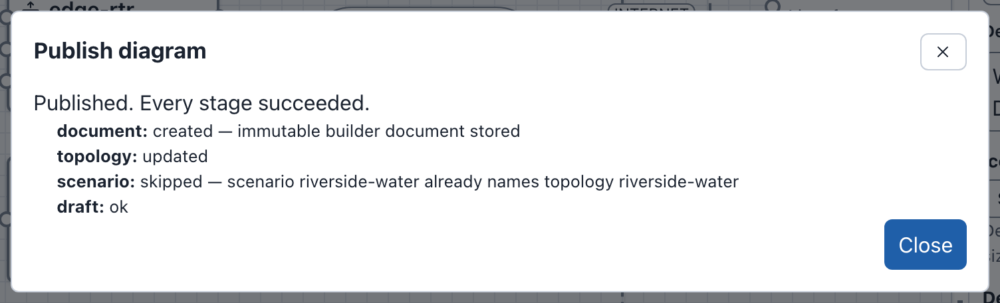

# Publishing

A draft is not a phenix config. **Publish** writes these configs:

- A Topology config.
- The name of the topology, in the `topology` annotation of each scenario
  that the diagram lists.
- Optionally, an Experiment config with one of those scenarios.

The only other part of Builder that writes a config is the
[Scenarios](diagrams.md#scenarios) dialog, which stores a scenario file.
Publish does not send the diagram. The server reads the last saved snapshot
of the draft, checks it again, and writes the configs from it.

The examples on this page publish the Riverside Water draft (see
[The drafts on these pages](index.md#the-drafts-on-these-pages)). It lists
the scenario `riverside-water`.

!!! note
    The Riverside Water draft comes from `riverside-water` as the example
    file loads it. If you published `riverside-water` in the
    [quick start](index.md#quick-start), this draft cannot publish (see
    [When the source config changed](#when-the-source-config-changed)). Use
    your quick start draft for these examples instead, after you add the
    scenario `riverside-water` to it (see [Scenarios](diagrams.md#scenarios)).
    Its counts are one device and one connection higher.

## Before you publish

- Fix the errors, and the three kinds of warnings, that block publishing
  (see [What blocks publishing](#what-blocks-publishing)).
- Apply or cancel your changes in the Inspector. Publish applies and saves
  valid changes for you (see
  [Automatic snapshots](drafts.md#automatic-snapshots)). Changes that it
  cannot apply block publishing, and the dialog says which. For example, for
  an address that is not valid on ws-a01 in Metro Campus: "Your changes to
  Device ws-a01 in the Inspector cannot be published until Address
  (Interface 1) is fixed. Fix or cancel them first."
- Check your permissions. **Publish** is unavailable when the draft is read
  only or your role cannot update configs. Each config also needs its own
  permission (see [What each task needs](administration.md#what-each-task-needs)).

**Publish** is in the toolbar. The command palette has it too, as
**Publish…**. On the drafts page, the card of each draft that you can change
has a **Publish** button. It opens the same dialog without the editor (see
[Publishing from the drafts page](drafts.md#publishing-from-the-drafts-page)).

## Publishing a topology

To update the topology `riverside-water` from the Riverside Water draft:

1. Open the Riverside Water draft and select **Publish** in the toolbar. The
   **Publish diagram** dialog opens.
2. Under **What to publish**, keep **Topology only**.
3. **Topology name** starts as the diagram name made into a config name:
   `Riverside-Water`. The hint under it says "A new topology will be
   created." Replace the name with `riverside-water`. The hint changes to "A
   topology with this name exists and will be updated.", and the button to
   **Update topology**.
4. Read **Checks**. For Riverside Water it says "10 devices, 4 switches, 4
   networks and 13 connections are ready to publish. The 2 devices from
   included topologies and their 2 connections are not copied: the topology
   includes them by reference."
5. Select **Update topology**. Builder asks "Replace topology
   riverside-water?".
6. Select **Update topology** again. The dialog shows the result.
7. Select **Close**.

The confirmation in step 5, and the result in step 6:




Config names can use only letters, numbers, underscores (_), at signs (@),
periods (.) and hyphens (-). Spaces are not allowed. The dialog shows this
rule only while a name breaks it. Under the field, it says why, then gives
the rule, for example "This name is not allowed: it contains a space. Names
can use only …". The reason names spaces, and up to five characters that
the rule does not allow, quoted: "it contains characters that are not
allowed: "/", "#"". If you publish a name that breaks the rule, the refusal
shows on its field, with the reason and a valid form of the name. For
example: "The topology name "Riverside Water" is not allowed: it contains a
space. … For example: Riverside-Water". The experiment name, and the new
topology name of an [import](import-upload-download.md#import-options),
work the same way.

!!! tip
    The dialog proposes a topology name made from the diagram name each time
    it opens. To update the same topology again, enter its name again, or
    rename the diagram to match it (see
    [Renaming the diagram](editor.md#renaming-the-diagram)).

### What publishing changes

Above the buttons, **What publishing changes** lists what publishing to the
names in the form would change, compared with what the server holds now. The
server finds these changes from the last saved snapshot of the draft, with
the same checks as Publish, and writes nothing. The part updates when you
change the form and after each save. It never makes **Publish**
unavailable.

Each list gives its changes in words:

- **Configs**: "Creates Topology config riverside-water", "Updates Topology
  config riverside-water", or "Topology config riverside-water is unchanged:
  it already holds this diagram" when it already holds the saved snapshot.
  With an experiment, the same for the Experiment config.
- **Included topologies**: "Adds included topology corp-services",
  "Removes included topology …" or "Keeps included topology …", compared with
  the topology's `includeTopologies` now.
- **Scenarios**: "Adds topology riverside-water to Scenario riverside-water",
  or "Scenario riverside-water already names topology riverside-water".
- **Disk images**: each image the devices use, compared with those the
  topology's devices use now, and the devices that use it: "Disk image
  ubuntu.qc2 is new (used by web-01 and ws-01)", "… is still used (by …)" or
  "… is no longer used (was used by …)". When your role can list the disk
  images of the server, the line ends "; the server has it" or "; the server
  does not have it". The line has neither ending when minimega is not
  running, when your role does not have the `disks` `list` permission, or
  for an image whose name your role cannot list. The server keeps its list
  of disk images for 10 seconds. An image added in that time may not show as
  on the server yet.
- **VLAN aliases**, with an experiment: "VLAN alias for network CORP is set to
  120", "VLAN alias for network OT changes from 101 to 120", "VLAN alias 5
  for network DMZ is removed" or "VLAN alias for network EXP stays 0". A new
  experiment gets every alias.

For the Riverside Water draft and the topology name `riverside-water`, on a
server without minimega running:


When there are no included topologies, scenarios, disk images or VLAN
aliases, it says "Nothing outside the Topology changes." Below the lists, it
shows the warnings that publishing would give, each with the server's code,
under a heading such as "1 warning". For example: "The legacy Builder
diagram of topology riverside-water was replaced by this diagram."
(`publish.legacy.replaced`).

When the server would refuse the publish, the part lists the reasons first,
under a heading such as "1 error blocks publishing". It does not repeat a
problem that **Checks** lists. While errors under **Checks** block
publishing, it says "Publishing is blocked by the errors listed under
Checks." It then lists only the other problems that the server finds, such
as a hostname that an included topology also uses, or a scenario that does
not exist. When the server cannot answer, the part says so. While the
button is available, it also says that you can still publish.

### Create or update

The hint under **Topology name** says what publishing does with that name.
The button then names the action. An update replaces the config on the
server, so its hint is a warning. The hint under **Experiment name** is
also a warning when the experiment will be updated.

| Hint | Button |
|---|---|
| "A new topology will be created." | **Create topology** |
| "A topology with this name exists and will be updated." | **Update topology** |
| "A topology with this name already exists, and this diagram cannot update it: the diagram was not imported from it, opened from its published diagram or published to it. Enter another name to create a new topology." | Publishing is refused. Enter another name. |
| "A topology with this name changed after this diagram published it, and publishing would overwrite that change. Import the topology again to edit it as it is now, or enter another name to create a new topology." | Publishing is refused. See [Publishing again](#publishing-again). |
| "A topology with this name exists and will be updated. Its legacy Builder diagram is replaced by this diagram." | **Update topology**. See [Replacing a legacy Builder diagram](#replacing-a-legacy-builder-diagram). |
| "A topology with this name exists and will be updated. Its legacy Builder diagram could not be read and is removed." | **Update topology**. The same section. |

A draft can update a topology in these cases:

- The topology holds a diagram that the draft published.
- The draft was imported from the stored topology. An import from a config
  file, a copy, and an import with combined included topologies cannot
  update it (see [Import options](import-upload-download.md#import-options)).
- The draft was uploaded as a Builder document downloaded from such a
  draft, such as `riverside-water.builder.json`.
- The draft was opened from the published diagram of the topology
  (**Edit as a draft**, or the edit button on the **Configs** page).
- The draft was opened from the Builder file that the topology names as its
  diagram (see
  [Publishing to a topology that names a Builder file](#publishing-to-a-topology-that-names-a-builder-file)).
- The draft was saved as a new draft from the history of a draft that could
  update the topology (**Save my history as a new draft**).
- The draft was imported from an experiment made from the topology. This
  does not apply to a topology that still has a legacy Builder diagram.

### Replacing a config

Before an update, Builder asks for confirmation, and names each config it
replaces:

> **Replace topology riverside-water?**
>
> Publishing replaces the topology "riverside-water" on the server with this
> diagram. This cannot be undone.

Its button repeats the action, for example **Update topology**. phenix keeps
no earlier version of a config. To go back, restore an earlier snapshot in
[Draft History](drafts.md#draft-history) and publish again.

An update keeps the topology's own annotations, such as `maintainer` and
`purpose` on `riverside-water`, and adds `builder-doc`, which names the
published diagram (see
[The builder-doc annotation](administration.md#the-builder-doc-annotation)).
A new topology gets only `builder-doc`. Publish does not write the
annotations that the Inspector shows from an imported config.

### Replacing a legacy Builder diagram

Only the draft imported from a topology that the [legacy Builder](legacy.md)
saved can update that topology. The update replaces `builder-xml` with
`builder-doc`, keeps the other annotations, and warns "The legacy Builder
diagram of topology NAME was replaced by this diagram." See
[Converting a stored topology](legacy.md#converting-a-stored-topology).

### The result

The dialog lists each stage and how it went, for example:

```text
Published. Every stage succeeded.
document: created — immutable builder document stored
topology: updated
scenario: skipped — scenario riverside-water already names topology riverside-water
draft: ok
```

- **document**: the published copy of the diagram, which the
  **Published Diagrams** tab lists. It is the last saved snapshot of the
  draft, so it keeps who made the diagram and who edited it last (see
  [Who made and last saved a diagram](import-upload-download.md#who-made-and-last-saved-a-diagram)).
- **topology**, **experiment**: `created` or `updated`. `skipped` means that
  the config already holds this snapshot, so nothing was written.
- **scenario**, for a diagram that lists scenarios: `updated`, with the
  scenarios that the topology was added to. `skipped` means that each
  scenario already names the topology (see [Scenarios](#scenarios)).
- **draft**: the draft records what it published.

When a stage fails, the dialog says "Published with failures. Some configs
were written; the failed stages are listed below.", or "Publish failed. No
configs were written." **Back** goes back to the form, and **Close** closes
the dialog. When the server refuses the publish before it writes anything,
the form stays open and gives the reason under **Checks**, starting "Could
not publish the diagram."

## Publishing a topology and an experiment

To update `riverside-water` and create the experiment `riverside-lab` from it:

1. Open the Riverside Water draft and select **Publish**.
2. Under **What to publish**, choose **Topology and an experiment**.
3. Set **Topology name** to `riverside-water` ("A topology with this name
   exists and will be updated.").
4. Enter `riverside-lab` in **Experiment name**. The hint says "A new
   experiment will be created."
5. **Experiment scenario** is `riverside-water`, the first scenario the
   diagram lists. The button now says **Update topology and create
   experiment**.
6. Select **Update topology and create experiment**. Builder asks
   "Replace topology riverside-water?". Select **Update topology and create
   experiment** again.
7. The dialog says "Published. Every stage succeeded." and lists the
   stages. The topology stage says `skipped`, because
   [Publishing a topology](#publishing-a-topology) already wrote this
   snapshot to `riverside-water`. If you changed the diagram after that, or
   did not do that section, it says `updated`.

    ```text
    document: created — immutable builder document stored
    topology: skipped
    scenario: skipped — scenario riverside-water already names topology riverside-water
    experiment: created
    draft: ok
    ```

8. Select **Close**.

The dialog in step 5:

![The Publish diagram dialog set to Topology and an experiment: Topology name riverside-water with the warning A topology with this name exists and will be updated., Experiment name riverside-lab to be created, Experiment scenario riverside-water with the hint that publishing adds this topology to the topology annotation of the scenario riverside-water, the checks summary, What publishing changes, which says that Topology config riverside-water is unchanged because it already holds this diagram, that publishing creates Experiment config riverside-lab and keeps included topology corp-services, that scenario riverside-water already names the topology and that each disk image is still used, and the Update topology and create experiment button.](../images/builder/publish-experiment.png)

The Experiment config `riverside-lab` now uses the topology `riverside-water`
and the scenario `riverside-water`. Start it from the **Experiments** page
(see **Starting / Stopping Experiments** in [Experiments](../experiments.md)).

While that experiment exists, the **Exp** button in the toolbar opens it
(see [Opening the experiment](drafts.md#opening-the-experiment)).

Each network's **VLAN alias** (see
[Adding switches and networks](diagrams.md#adding-switches-and-networks)) is
written to the experiment's `vlans.aliases`. With the VLAN alias `120` on the
CORP switch, `riverside-lab` has:

```yaml
spec:
  vlans:
    aliases:
      CORP: 120
      DMZ: 0
      INTERNET: 0
      OT: 0
    max: 0
    min: 0
```

### Scenarios

A diagram lists the Scenario configs that it is used with (see
[Scenarios](diagrams.md#scenarios)). Publishing, in either mode, adds the
topology to the `topology` annotation of each listed scenario that does not
name it yet. It changes nothing else in the scenarios. The **Scenarios**
part of the dialog says so. The scenario stage of the result covers all
the scenarios. It says `updated` and which scenarios it changed, or
`skipped` when each scenario already names the topology.

For example, after you publish Riverside Water with the topology name
`riverside-water-b`, the annotation of `riverside-water` is
`topology: riverside-water,riverside-water-b`. The stage says "added
topology riverside-water-b to scenario riverside-water". The annotation
names topologies separated by commas. Only a name equal to the name of the
topology counts: `riverside-water-old` does not name the topology
`riverside-water`.

With an experiment, **Experiment scenario** selects the scenario that the
experiment uses. It is one of the scenarios that the diagram lists (the
first, unless you choose another), or **No scenario**. A diagram that lists
no scenarios has no **Scenarios** part, and its experiment has no scenario.

Publish refuses before it writes anything in these cases:

- A listed scenario does not exist on the server, or your role cannot read
  it ("Scenario NAME does not exist.").
- Your role cannot update a listed scenario whose annotation needs the
  topology (see
  [What each task needs](administration.md#what-each-task-needs)).

Remove such a scenario from the list, or store it again from the dialog.

### Experiment names

An experiment name follows the config name rule, and also:

- It cannot be `all`, in any case: "The experiment name "all" is reserved:
  phenix uses it to mean every experiment. Enter another name."
- When the server names each experiment's bridge after the experiment (auto
  bridge mode), it can be at most 15 characters long.

### Updating an experiment

A draft can update an experiment it was imported from (see
[Importing an experiment](import-upload-download.md#importing-an-experiment)) or
published before. For any other experiment, the hint says "An experiment
with this name already exists, and this diagram cannot update it: the diagram
was not imported from it or published to it. Enter another name to create a
new experiment." The experiment `riverside`, which was created outside
Builder, is one of these.

To update `riverside-lab` after further edits, repeat the steps above with
the same names. The button says **Update topology and experiment**, and the
confirmation "Replace topology riverside-water and experiment riverside-lab?".

An update runs the configure stage of the apps, as saving an Experiment
config does. When the configure stage fails, or the experiment is running,
the experiment does not change, and the dialog says "Published with failures. Some
configs were written; the failed stages are listed below." Stop the
experiment before you update it.

## What blocks publishing

Errors block publishing, for example a hostname that two devices use. An
error about a duplicate names the other device, not its place in the
document.

The checks also show three kinds of problems as warnings while you edit (see
[Checks and warnings](editor.md#checks-and-warnings)). The draft saves with
them, but the Publish dialog lists them as errors. Its button is unavailable
until you fix them. phenix would store such a topology, but the experiment
would fail or operate incorrectly when it starts.

- **An interface with no VLAN**: an interface of a device that is not
  external, not connected to a network and with no VLAN typed. minimega
  refuses the interface when the experiment starts. Connect the interface,
  or type a VLAN for it (see
  [Connecting interfaces](diagrams.md#connecting-interfaces)).
- **A shared IP or MAC address**: two interfaces on the same network with the
  same IP address or the same MAC address. Two interfaces are on the same
  network when they have the same VLAN and the same bridge. The VLAN is the
  network that the interface is connected to, or else the VLAN typed for it.
  A blank bridge and `phenix` are the default bridge of the experiment.
  Interfaces on different networks, such as isolated networks `ISOLATED-1`
  and `ISOLATED-2`, can use the same addresses. Interfaces with no VLAN are
  compared with each other.
  IP addresses are compared without the prefix length. MAC addresses are
  compared in any case and with any separators, so `aa:bb:cc:dd:ee:ff` and
  `AA-BB-CC-DD-EE-FF` are the same. Blank values, the IP addresses of
  interfaces whose protocol is `dhcp` or `manual`, and the MAC addresses of
  external devices are not compared.
- **A hostname phenix refuses**: a hostname that is one character long,
  `all`, all digits, or `phenix` on a device whose OS type is `windows`.
  External devices are not checked. Other casings of `all`, such as `All`,
  and `phenix` on a device that is not Windows, give plain warnings that do
  not block publishing.

Under **Checks**, the Publish dialog lists the errors first, under a heading
such as "2 errors block publishing". The warnings follow, under a heading
such as "1 warning". Each issue has a **Go to** button (see
[Checks and warnings](editor.md#checks-and-warnings)). From the **Publish**
button of a draft on the drafts page, **Go to** opens the draft in the
editor first.

When the server refuses a publish, the dialog shows the reason and lists
the errors and warnings of the server in the same way, with their codes.
A refusal about the topology, experiment or scenario name also marks that
field.

!!! tip
    **Download** > **Topology YAML** saves the topology Publish would write, and
    lists every problem that blocks publishing at once (see
    [Topology YAML](import-upload-download.md#topology-yaml)).

### Example: Riverside Water expansion

The Riverside Water expansion draft has a copy of `historian-01`, made with
**Duplicate** (see [Duplicating a device](diagrams.md#duplicating-a-device)).
The copy, `historian-01-2`, keeps the address 10.10.30.20, and its eth0 is not
connected. Select **Publish**. Under **Checks**, the dialog lists one error
under "1 error blocks publishing", with the device it is about, its code and
**Go to**, and **Create topology** is unavailable:

```text
1 error blocks publishing
Error: interface "eth0" of "historian-01-2" is not connected to a network and has no VLAN, so it cannot be published: connect it, or type a VLAN for it
  Device historian-01-2  interface.vlan.missing
```

**What publishing changes** lists the same problem in the server's words,
as the reason the server would refuse to publish.

The address is not an error yet, because historian-01-2 is on no network.
Once its eth0 is on OT, the network of historian-01, the two would share
10.10.30.20 there.

![The Publish diagram dialog for Riverside Water expansion: Topology only, Topology name Riverside-Water-expansion with the hint A new topology will be created., the Scenarios part, and under Checks the summary and, under 1 error blocks publishing, the error that interface eth0 of historian-01-2 is not connected to a network and has no VLAN, with Device historian-01-2, the code interface.vlan.missing and Go to; What publishing changes lists the server's refusal, that eth0 of historian-01-2 has no VLAN, under 1 error blocks publishing; and the Create topology button is unavailable.](../images/builder/publish-blocked.png)

To fix it, and give the copy its own hostname and address:

1. Select **Go to** beside the error. The dialog closes, the canvas selects
   historian-01-2, and the Inspector opens on it.
2. The Inspector says "Checks: 1 warning".
3. Set **Hostname** to `historian-02`.
4. Under **Network**, in the eth0 interface, set **VLAN** to `OT` and
   **Address** to `10.10.30.21`.
5. Select **Apply**. Typing the VLAN connects eth0 to the OT switch. The
   header now says **No issues**.
6. Select **Publish** again. **Checks** now says "11 devices, 4 switches, 4
   networks and 14 connections are ready to publish.", and **Create
   topology** is available.

This example stops at the checks: select **Cancel**. The expansion draft
was made from `riverside-water` as the example file loads it. After another
draft published `riverside-water` (Riverside Water in
[Publishing a topology](#publishing-a-topology), or the quick start draft),
the expansion draft cannot publish, even under a new topology name (see
[When the source config changed](#when-the-source-config-changed)).

## Included topologies

Riverside Water includes the topology `corp-services`, so `dns-01` and
`ntp-01` are read-only devices in the diagram (see
[Included topologies](diagrams.md#included-topologies)). Publishing does not
copy them. The published topology names `corp-services` instead, and the
**Checks** summary counts them separately:

```yaml
spec:
  includeTopologies:
    - corp-services
  nodes:
    # edge-rtr, files-01, historian-01, hmi-01, kali-01, ot-fw, plc-01,
    # web-01, ws-01 and ws-02; no dns-01 or ntp-01
```

A diagram imported with **Combine into one new topology** has the included
nodes as its own nodes, and publishes them (see
[Import options](import-upload-download.md#import-options)). The included
topologies that it could not combine stay in `includeTopologies`, and the
**Checks** summary says so, for example "The published topology also
includes site-b by reference."

A device cannot use a hostname that an included topology also defines (see
[Checks and warnings](editor.md#checks-and-warnings)). When the included
topology gets such a hostname after the import, Publish refuses, for
example "topology riverside-water cannot be
published: node dns-01 is defined both here and in its included topology
corp-services; phenix rejects duplicate hostnames, so rename the node here
or in corp-services".

## Publishing again

Publish again after each set of edits, with the same names. The draft
remembers what it published, even after **Draft History** deletes that
snapshot, so it can update the same topology and experiment. Enter the
topology name again: the dialog proposes a name made from the diagram name
each time.

Another user, or another draft, can change the topology after your
publication:

- When another draft published the topology after your publication (for
  example, someone used the edit button on the **Configs** page and
  published), the topology no longer holds your publication. The hint says
  "A topology with this name already exists, and this diagram cannot update
  it: …".
- When the topology was changed outside Builder (with
  `phenix config edit`, for example), Publish refuses. For a draft that was
  not made from the topology, such as a **Blank diagram** published as
  `water-tower`, it says "Could not publish the diagram. The topology
  "water-tower" changed after this diagram published it, and publishing would
  overwrite that change. Import the topology again to edit it as it is now, or
  enter another name to create a new topology.", and the hint under
  **Topology name** says the same. For a draft made from the topology, it
  gives the message in
  [When the source config changed](#when-the-source-config-changed).

In both cases, make your changes in a draft of the topology as it is now
(see [Editing a published topology](#editing-a-published-topology)), or
publish under another name.

## When the source config changed

A draft made from a config remembers that config. This includes a draft
imported from the config, uploaded as a Builder document made from it, or
opened from its published diagram. Publish refuses the draft when the
config changed after the draft was made. It does not refuse when the
config still holds the publication of this draft, or the published diagram
that the draft was opened from. It refuses even when you publish under a
new name:

> Could not publish the diagram. Builder source Topology/riverside-water
> changed after this draft was imported.

For example, the quick start updates `riverside-water`. After that, the
Riverside Water draft, made from `riverside-water` before the change, cannot
publish.

To keep the work of such a draft:

1. Make a draft of the config as it is now: select the topology's edit
   button on the **Configs** page, or import it again (see
   [Importing a topology or experiment](import-upload-download.md#importing-a-topology-or-experiment)).
2. Copy the devices you changed from the old draft, and paste them into the
   new one. **Copy** and **Paste** work between drafts opened one after the
   other in the same browser tab.
3. Connect the pasted devices again. A pasted device keeps its settings but
   not its connections, so its interfaces have no VLAN.

A config that was deleted after the draft was made does not stop the draft.
The draft publishes as a new diagram does.

## Publishing to a topology that names a Builder file

A topology can name a Builder file on the phenix server as its diagram (see
[Diagrams read from a file](drafts.md#diagrams-read-from-a-file)). A draft
made with **Edit as a draft** from that diagram can update the topology
while both of these hold:

- The file still holds the diagram the draft was made from.
- The topology is still what that diagram publishes.

Otherwise the form stays open and gives the reason. You can publish under a
new topology name instead:

- "Could not publish the diagram. Topology pump-station or its Builder file
  changed after this draft was opened from the file."
- "Could not publish the diagram. Topology pump-station is not what its
  Builder file publishes, so this draft cannot update it."

A diagram in a file can come from an import of a config. For example, the
example file `pump-station.builder.json` came from `pump-station`. The rule
for an imported draft then also applies to its draft, under any topology
name (see [When the source config changed](#when-the-source-config-changed)).

The hint under **Topology name** cannot tell these cases apart. It says "A
topology with this name exists and will be updated." for every draft made
from the file, and the server refuses when you select **Update topology**.

Publish does not write the file. It stores the published diagram in
phenix, and the topology shows that diagram from then on. Its **Published
Diagrams** card no longer has the tag **File**. The result lists a warning:

```text
Warning: Topology pump-station names the Builder file /phenix/topologies/pump-station/pump-station.builder.json, which Publish does not change. Download the diagram and replace the file to keep it in step.
```

To keep the file in step, select **Download** > **Builder JSON** in the draft
and replace the file on the server with the downloaded one. See
[Editing and publishing](administration.md#editing-and-publishing) for what
is written to the topology.

## Editing a published topology

On the **Configs** page, the tag `builder` opens a topology with a Builder
diagram in Builder. Other controls do the same (see
[From the Configs page](import-upload-download.md#from-the-configs-page)).

1. Select **Configs** in the phenix navigation bar.
2. In the row of `riverside-water`, select the tag `builder` (its tooltip
   says **open in Builder**).
3. Builder opens the diagram in a draft that can update the topology.

Builder opens, in this order:

1. The draft that published the topology, when it is yours.
2. The draft that published the topology, when its owner shared it with you
   with **Can edit**.
3. Your earlier draft of the published diagram of the topology.
4. A new draft of the published diagram, the first time.

The address bar then holds a link to the draft (see
[Links to a draft](drafts.md#links-to-a-draft)). A role that cannot create
drafts sees the published diagram read only, unless it already has a draft
of it. For a topology whose diagram is read from a Builder file, Builder
opens your draft made from the file, or makes one. For a topology without
a Builder diagram, the same controls open the **Import** dialog.

**Edit as a draft** on the **Published Diagrams** tab opens the same draft
(see [Published diagrams](drafts.md#published-diagrams)).

To delete a published topology, use **Delete** on its **Published
Diagrams** card (see
[Deleting a published topology](drafts.md#deleting-a-published-topology)).
