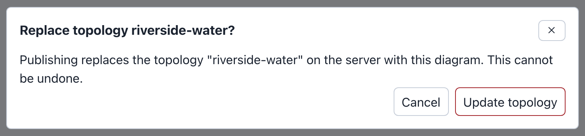
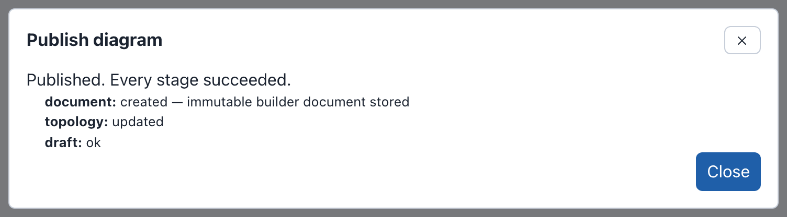
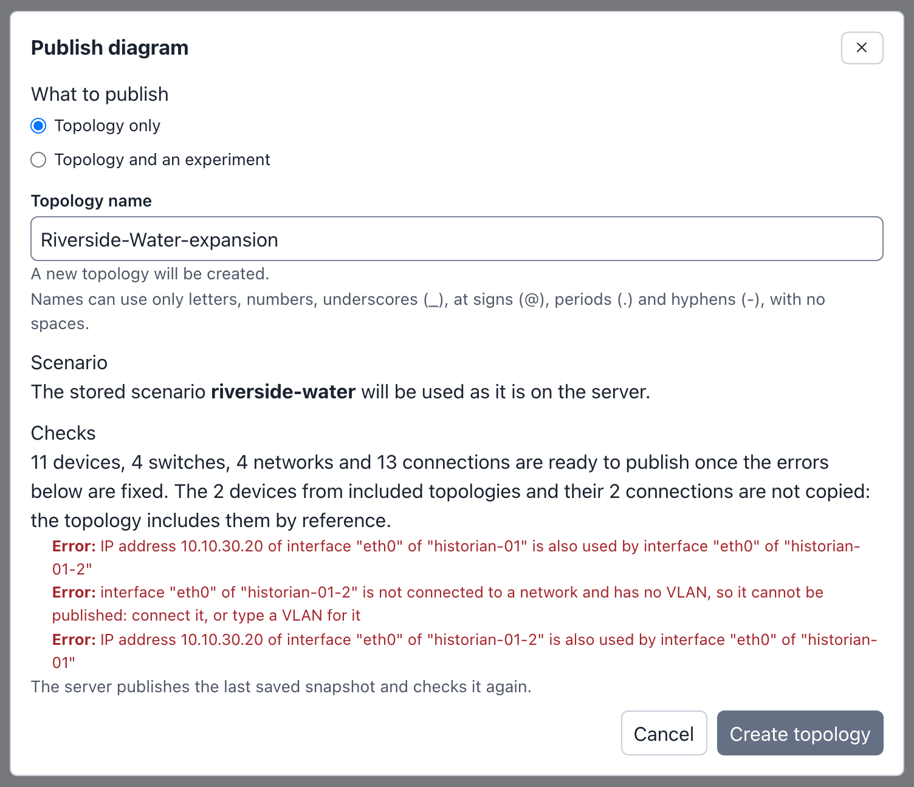

# Publishing

A draft is not a phenix config. **Publish** writes the configs: a Topology
config, and optionally an Experiment config with its scenario. Nothing else
in Builder writes configs. Publish sends no diagram: the server reads
the draft's last saved snapshot, checks it again, and writes the configs from
it.

Without the web UI, the `phenix builder publish` command writes a Topology
config from a Builder file (see
[From the command line](import-upload-download.md#from-the-command-line)).

The examples on this page publish the Riverside Water draft (see
[The drafts on these pages](index.md#the-drafts-on-these-pages)). It has the
scenario `riverside-water` attached.

!!! note
    A draft made from a config can publish only while that config is
    unchanged, apart from the draft's own publications (see
    [When the source config changed](#when-the-source-config-changed)). The
    Riverside Water draft comes from `riverside-water` as the example file
    loads it. If you published `riverside-water` in the
    [quick start](index.md#quick-start), use your quick start draft for these
    examples instead, after you attach the scenario `riverside-water` to it
    (see [Attaching a scenario](diagrams.md#attaching-a-scenario)). Its counts
    are one device and one connection higher.

## Before you publish

- Fix the problems that block publishing. The checks button in the header
  says **No issues**, or how many errors and warnings the diagram has. Publish
  refuses errors, and three kinds of warnings (see
  [What blocks publishing](#what-blocks-publishing)). Other warnings, such as
  a device with no interfaces, do not block it.
- Apply or cancel your changes in the Inspector. Publish applies and saves
  valid changes for you, as an **Automatic** snapshot in
  [Draft History](drafts.md#automatic-snapshots). Changes it cannot apply
  block publishing, and the dialog says which. For example, with an address
  that is not valid typed for ws-a01 in Metro Campus: "Your changes to Device
  ws-a01 in the Inspector cannot be published until Address (Interface 1) is
  fixed. Fix or cancel them first."
- Check your permissions. **Publish** is unavailable when the draft is read
  only or your role cannot update configs. Each config also needs its own
  permission (see [What each task needs](administration.md#what-each-task-needs)).

**Publish** is in the toolbar. The command palette has it too, as
**Publish…**.

## Publishing a topology

To update the topology `riverside-water` from the Riverside Water draft:

1. Open the Riverside Water draft and select **Publish** in the toolbar. The
   **Publish diagram** dialog opens.
2. Under **What to publish**, keep **Topology only**.
3. **Topology name** starts as the diagram name made into a config name:
   `Riverside-Water`. The hint under it says "A new topology will be
   created." Replace the name with `riverside-water`. The hint changes to "A
   topology with this name exists and will be updated.", and the button to
   **Update topology**.
4. Read **Checks**. For Riverside Water it says "10 devices, 4 switches, 4
   networks and 13 connections are ready to publish. The 2 devices from
   included topologies and their 2 connections are not copied: the topology
   includes them by reference."
5. Select **Update topology**. Builder asks "Replace topology
   riverside-water?".
6. Select **Update topology** again. The dialog shows the result.
7. Select **Close**.

The confirmation in step 5, and the result in step 6:





Config names can use only letters, numbers, underscores (_), at signs (@),
periods (.) and hyphens (-), with no spaces. A name that breaks the rule is
refused on its field with a valid form of it, for example "The topology name
"Riverside Water" is not allowed. … For example: Riverside-Water".

!!! tip
    The dialog proposes a topology name made from the diagram name each time
    it opens. To update the same topology again, enter its name again, or
    rename the diagram to match it (see
    [Renaming the diagram](editor.md#renaming-the-diagram)).

### Create or update

The hint under **Topology name** says what publishing does with that name.
The button then names the action.

| Hint | Button |
|---|---|
| "A new topology will be created." | **Create topology** |
| "A topology with this name exists and will be updated." | **Update topology** |
| "A topology with this name already exists, and this diagram cannot update it: the diagram was not imported from it, opened from its published diagram or published to it. Enter another name to create a new topology." | Publishing is refused. Enter another name. |
| "A topology with this name changed after this diagram published it, and publishing would overwrite that change. Import the topology again to edit it as it is now, or enter another name to create a new topology." | Publishing is refused. See [Publishing again](#publishing-again). |
| "A topology with this name belongs to the legacy XML Builder and cannot be updated here. Enter another name to create a new topology." | Publishing is refused. Enter another name. |

A draft can update a topology when the topology currently holds a diagram
that draft published, or when the draft was made from the topology:

- imported from the stored topology (not from a config file), or
  uploaded as a Builder document that was downloaded from such a draft, such
  as `riverside-water.builder.json`,
- opened from its published diagram (**Edit as a draft**, or the edit
  button on the **Configs** page),
- opened from the Builder file that the topology names as its diagram (see
  [Publishing to a topology that names a Builder file](#publishing-to-a-topology-that-names-a-builder-file)),
  or
- saved as a new draft from the history of a draft that could update it
  (**Save my history as a new draft**).

### Replacing a config

Before an update, Builder asks for confirmation, and names each config it
replaces:

> **Replace topology riverside-water?**
>
> Publishing replaces the topology "riverside-water" on the server with this
> diagram. This cannot be undone.

Its button repeats the action, for example **Update topology**. phenix keeps
no earlier version of a config. To go back, restore an earlier snapshot in
[Draft History](drafts.md#draft-history) and publish again.

An update keeps the topology's own annotations, such as `maintainer` and
`purpose` on `riverside-water`. Publishing adds the annotation `builder-doc`,
which names the published diagram by its `digest` and its `id`:

```yaml
metadata:
    name: riverside-water
    annotations:
        builder-doc:
            digest: sha256:a62655786319cf4b5a38653dd6c16118a1802a621e4a0f65a78b8e1392177691
            id: 14c17b46f3a0c6f5ba2f66c6fdd2ff20ef621a57c1aa65ddba5e91413435dc81
        maintainer: range-team
        purpose: Water utility training range
```

A `path` that the annotation already has is kept (see
[The builder-doc annotation](administration.md#the-builder-doc-annotation)).
A new topology gets only `builder-doc`: the annotations the Inspector shows
from an imported config are not published.

### The result

The dialog lists each stage and how it went, for example:

```text
Published. Every stage succeeded.
document: created — immutable builder document stored
topology: updated
draft: ok
```

- **document**: the published copy of the diagram, which the
  **Published Diagrams** tab lists. It is the draft's last saved snapshot as
  it is, so it keeps who made the diagram and who edited it last (see
  [Who made and last saved a diagram](import-upload-download.md#who-made-and-last-saved-a-diagram)).
- **topology**, **scenario**, **experiment**: `created`, `updated`, or
  `skipped` when the config already holds this snapshot, so nothing was
  written.
- **draft**: the draft records what it published.

When a stage fails, the dialog says "Published with failures. Some configs
were written; the failed stages are listed below.", or "Publish failed. No
configs were written." **Back** returns to the form, and **Close** closes the
dialog. When the server refuses the publish before writing anything, the form
stays open and says why under **Checks**, starting "Could not publish the
diagram."

## Publishing a topology and an experiment

To update `riverside-water` and create the experiment `riverside-lab` from it:

1. Open the Riverside Water draft and select **Publish**.
2. Under **What to publish**, choose **Topology and an experiment**.
3. Set **Topology name** to `riverside-water` ("A topology with this name
   exists and will be updated.").
4. Enter `riverside-lab` in **Experiment name**. The hint says "A new
   experiment will be created."
5. Under **Scenario**, the dialog says "The stored scenario riverside-water
   will be used as it is on the server." The button now says **Update
   topology and create experiment**.
6. Select **Update topology and create experiment**. Builder asks
   "Replace topology riverside-water?". Select **Update topology and create
   experiment** again.
7. The dialog says "Published. Every stage succeeded." and lists the
   stages. The topology stage says `skipped`, because
   [Publishing a topology](#publishing-a-topology) already wrote this
   snapshot to `riverside-water`. When you changed the diagram since, or
   skipped that section, it says `updated`.

    ```text
    document: created — immutable builder document stored
    topology: skipped
    scenario: skipped
    experiment: created
    draft: ok
    ```

8. Select **Close**.

The dialog in step 5:


The Experiment config `riverside-lab` now uses the topology `riverside-water`
and the scenario `riverside-water`. Start it from the **Experiments** page
(see **Starting / Stopping Experiments** in [Experiments](../experiments.md)).

Each network's **VLAN alias** (see
[Adding switches and networks](diagrams.md#adding-switches-and-networks)) is
written to the experiment's `vlans.aliases`. With the VLAN alias `120` on the
CORP switch, `riverside-lab` has:

```yaml
spec:
  vlans:
    aliases:
      CORP: 120
      DMZ: 0
      INTERNET: 0
      OT: 0
    max: 0
    min: 0
```

### The scenario

The **Scenario** part of the dialog depends on the scenario attached to the
diagram (see [Attaching a scenario](diagrams.md#attaching-a-scenario)):

- No scenario: the experiment has none, and the part is not shown.
- A stored scenario: "The stored scenario riverside-water will be used as it
  is on the server." Its content is not changed. When its `topology`
  annotation does not name the topology yet, Publish adds the name, and the
  scenario stage says `updated`. For example, after publishing Riverside
  Water with the topology name `riverside-water-b`, the annotation of
  `riverside-water` is `topology: riverside-water,riverside-water-b`.
- An uploaded scenario: "This diagram carries an uploaded scenario. Choose
  the config it should be written to." Enter **Scenario name**, and choose a
  **Scenario action**: **Create a new scenario** or **Update the existing
  scenario**. There is no default. Updating asks for confirmation, and its
  button adds ", replace scenario", for example **Update topology and create
  experiment, replace scenario**.

A scenario action that does not fit the name is refused, for example "Could
not publish the diagram. A scenario named "riverside-water" already exists.
Choose "Update the existing scenario", or enter another name."

### Experiment names

An experiment name follows the config name rule, and also:

- It cannot be `all`, in any case: "The experiment name "all" is reserved:
  phenix uses it to mean every experiment. Enter another name."
- When the server names each experiment's bridge after the experiment (auto
  bridge mode), it can be at most 15 characters long.

### Updating an experiment

A draft can update an experiment it was imported from (see
[Importing an experiment](import-upload-download.md#importing-an-experiment)) or
published before. For any other experiment, the hint says "An experiment
with this name already exists, and this diagram cannot update it: the diagram
was not imported from it or published to it. Enter another name to create a
new experiment." The experiment `riverside`, which was created outside
Builder, is one of these.

To update `riverside-lab` after further edits, repeat the steps above with
the same names. The button says **Update topology and experiment**, and the
confirmation "Replace topology riverside-water and experiment riverside-lab?".

An update runs the apps' configure stage, as saving an Experiment config
does. When the configure stage fails, or the experiment is running, the
experiment is not changed, and the dialog says "Published with failures. Some
configs were written; the failed stages are listed below." Stop the
experiment before you update it.

## What blocks publishing

The checks show three kinds of problems as warnings while you edit (see
[Checks and warnings](editor.md#checks-and-warnings)). The draft saves with
them, but the Publish dialog lists them as errors, and its button is
unavailable until you fix them. phenix would store such a topology, but the
experiment would fail or misbehave when it starts.

- **An interface with no VLAN**: an interface of a device that is not
  external, not connected to a network and with no VLAN typed. minimega
  refuses the interface when the experiment starts. Connect the interface,
  or type a VLAN for it (see
  [Connecting interfaces](diagrams.md#connecting-interfaces)).
- **A shared IP or MAC address**: two interfaces with the same IP address or
  the same MAC address. IP addresses are compared without the prefix length.
  MAC addresses are compared in any case and with any separators, so
  `aa:bb:cc:dd:ee:ff` and `AA-BB-CC-DD-EE-FF` are the same. Blank values,
  the IP addresses of interfaces whose protocol is `dhcp` or `manual`, and the
  MAC addresses of external devices are not compared.
- **A hostname phenix refuses**: one character long; `all`; all digits; or
  `phenix` on a device whose OS type is `windows`. External devices are not
  checked. Other casings of `all`, such as `All`, and `phenix` on a device
  that is not Windows, give plain warnings that do not block publishing.

Errors block publishing too, for example a hostname used twice: "duplicate
hostname "dns-01" (also nodes[10])".

!!! tip
    **Download** > **Topology YAML** saves the topology Publish would write, and
    lists every problem that blocks publishing at once (see
    [Topology YAML](import-upload-download.md#topology-yaml)).

### Example: Riverside Water expansion

The Riverside Water expansion draft has a copy of `historian-01`, made with
**Duplicate** (see [Duplicating a device](diagrams.md#duplicating-a-device)).
The copy, `historian-01-2`, keeps the address 10.10.30.20, and its eth0 is not
connected. Select **Publish**. Under **Checks**, the dialog lists three
errors, and **Create topology** is unavailable:

```text
Error: IP address 10.10.30.20 of interface "eth0" of "historian-01" is also used by interface "eth0" of "historian-01-2"
Error: interface "eth0" of "historian-01-2" is not connected to a network and has no VLAN, so it cannot be published: connect it, or type a VLAN for it
Error: IP address 10.10.30.20 of interface "eth0" of "historian-01-2" is also used by interface "eth0" of "historian-01"
```



To fix them:

1. Select **Cancel**.
2. Select historian-01-2 on the canvas or in the Outline. The Inspector
   says "Checks: 2 warnings".
3. Set **Hostname** to `historian-02`.
4. Under **Network**, in the eth0 interface, set **VLAN** to `OT` and
   **Address** to `10.10.30.21`.
5. Select **Apply**. Typing the VLAN connects eth0 to the OT switch. The
   header now says **No issues**.
6. Select **Publish** again. **Checks** now says "11 devices, 4 switches, 4
   networks and 14 connections are ready to publish.", and **Create
   topology** is available.

This example stops at the checks: select **Cancel**. The expansion draft
was made from `riverside-water` as the example file loads it. After another
draft published `riverside-water` (Riverside Water in
[Publishing a topology](#publishing-a-topology), or the quick start draft),
selecting **Create topology** leaves the form open with this message:

> Could not publish the diagram. Builder source Topology/riverside-water
> changed after this draft was imported.

A new topology name does not change this (see
[When the source config changed](#when-the-source-config-changed)).

## Included topologies

Riverside Water includes the topology `corp-services`, so `dns-01` and
`ntp-01` are read-only devices in the diagram (see
[Included topologies](diagrams.md#included-topologies)). Publishing does not
copy them. The published topology names `corp-services` instead, and the
**Checks** summary counts them apart:

```yaml
spec:
  includeTopologies:
    - corp-services
  nodes:
    # edge-rtr, files-01, historian-01, hmi-01, kali-01, ot-fw, plc-01,
    # web-01, ws-01 and ws-02; no dns-01 or ntp-01
```

A device may not use a hostname that an included topology also defines. The
checks show it as an error, for example "duplicate hostname "dns-01" (also
nodes[10])". When the included topology gains such a hostname after the
import, Publish refuses, for example "topology riverside-water cannot be
published: node dns-01 is defined both here and in its included topology
corp-services; phenix rejects duplicate hostnames, so rename the node here
or in corp-services".

## Publishing again

Publish again after each round of edits, with the same names. The draft
remembers what it published, even after **Draft History** drops that
snapshot, so it can update the same topology and experiment. Remember to
enter the topology name again: the dialog proposes one made from the diagram
name each time.

Another user, or another draft, may change the topology meanwhile:

- When another draft published the topology since (for example someone
  used the edit button on the **Configs** page and published), the topology
  no longer holds your publication. The hint says "A topology with this name
  already exists, and this diagram cannot update it: …".
- When the topology was changed outside Builder (with
  `phenix config edit`, for example), Publish refuses. For a draft that was
  not made from the topology, such as a **Blank diagram** published as
  `water-tower`, it says "Could not publish the diagram. The topology
  "water-tower" changed after this diagram published it, and publishing would
  overwrite that change. Import the topology again to edit it as it is now, or
  enter another name to create a new topology.", and the hint under
  **Topology name** says the same. For a draft made from the topology, it
  gives the message in
  [When the source config changed](#when-the-source-config-changed).

In both cases, make your changes in a draft of the topology as it is now
(see [Editing a published topology](#editing-a-published-topology)), or
publish under another name.

## When the source config changed

A draft made from a config (imported, uploaded as a Builder document made
from it, or opened from its published diagram) remembers that config. Publish
refuses the draft when the config changed after the draft was made, unless
the config still holds this draft's own publication, or the published diagram
the draft was opened from. It refuses even when you publish under a new
name:

> Could not publish the diagram. Builder source Topology/riverside-water
> changed after this draft was imported.

For example, the quick start updates `riverside-water`. After that, the
Riverside Water draft, made from `riverside-water` before the change, cannot
publish.

To keep the work of such a draft:

1. Make a draft of the config as it is now: select the topology's edit
   button on the **Configs** page, or import it again (see
   [Importing a topology or experiment](import-upload-download.md#importing-a-topology-or-experiment)).
2. Copy the devices you changed from the old draft, and paste them into the
   new one. **Copy** and **Paste** work between drafts opened one after the
   other in the same browser tab.
3. Connect the pasted devices again: a pasted device keeps its settings but
   not its connections, so its interfaces have no VLAN.

A config that was deleted since does not stop a draft: the draft publishes as
a new diagram does.

## Publishing to a topology that names a Builder file

A topology can name a Builder file on the phenix server as its diagram (see
[Diagrams read from a file](drafts.md#diagrams-read-from-a-file)). A draft
made with **Edit as a draft** from that diagram can update the topology
while both of these hold:

- The file still holds the diagram the draft was made from.
- The topology is still what that diagram publishes.

Otherwise the form stays open and says why, and you can publish under a new
topology name instead:

- "Could not publish the diagram. Topology pump-station or its Builder file
  changed after this draft was opened from the file."
- "Could not publish the diagram. Topology pump-station is not what its
  Builder file publishes, so this draft cannot update it."

A diagram in a file can itself have been imported from a config, as the
example file `pump-station.builder.json` was from `pump-station`. Its draft
is then also held to the rule for an imported draft, under any topology name
(see [When the source config changed](#when-the-source-config-changed)).

The hint under **Topology name** cannot tell these cases apart. It says "A
topology with this name exists and will be updated." for every draft made
from the file, and the server refuses when you select **Update topology**.

Publish does not write the file. It stores the published diagram in
phenix, and the topology shows that diagram from then on: its **Published
Diagrams** card loses the tag **File**. The result lists a warning:

```text
Warning: Topology pump-station names the Builder file /phenix/topologies/pump-station/pump-station.builder.json, which Publish does not change. Download the diagram and replace the file to keep it in step.
```

To keep the file in step, select **Download** > **Builder JSON** in the draft
and replace the file on the server with the downloaded one. See
[Editing and publishing](administration.md#editing-and-publishing) for what
is written to the topology.

## Editing a published topology

A topology with a Builder diagram has the tag `builder` on the
**Configs** page: one published from Builder or with
`phenix builder publish`, or one that names a Builder file. Its edit button
opens it in Builder:

1. Select **Configs** in the phenix navigation bar.
2. In the **Actions** column of `riverside-water`, select the edit button
   (its tooltip says **edit config file**).
3. Builder opens your draft of the topology's published diagram. The
   first time, it makes that draft; later, it opens the same draft again.

This draft is apart from the draft that published the topology, and it can
update the topology. The address bar then holds a link to the draft (see
[Links to a draft](drafts.md#links-to-a-draft)). A role that cannot create
drafts sees the published diagram read only.

**Edit as a draft** on the **Published Diagrams** tab opens the same draft
(see [Published diagrams](drafts.md#published-diagrams)).

To delete a published topology, use **Delete** on its **Published
Diagrams** card (see
[Deleting a published topology](drafts.md#deleting-a-published-topology)).
