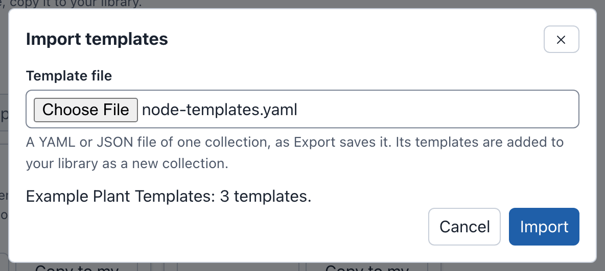

# Node Templates

A device template holds the fields of a new device. Builder fills in these
fields before you add the device: icon, custom icon, icon size, outline and
fill colors, Purdue layer, and the whole node spec (type, hardware,
interfaces and the rest).
**Add nodes** lists the templates under **Device templates**. To add a
device made from a template, select the template, or drag it onto the canvas
(see [Adding devices](diagrams.md#adding-devices)).

Templates are kept in three places:

- **In a diagram.** A diagram template is part of the Builder document, so
  it goes everywhere that the diagram goes: other tabs, the people you share
  the draft with, its downloads and its publications. See
  [Diagram templates](#diagram-templates).
- **In your library.** Each user has one template library on the phenix
  server. Its templates show in every diagram that you open. You manage them
  on the **Node Templates** tab of the drafts page. You can share them with
  other users, and publish them for everyone on the server. See
  [The template library](#the-template-library).
- **On the phenix server.** An administrator can put template files in the
  template directory of the server. phenix reads each file at start as a
  read-only collection that everyone sees. See
  [Server collections](#server-collections).

Template files move templates between these places. **Export** saves
templates as a YAML file, and **Import templates** reads a file into your
library. See [Exporting and importing templates](#exporting-and-importing-templates).

The description of a template is only its tooltip in **Add nodes**. A device
made from a template gets no description. A device keeps no link to its
template, so if you change or delete a template later, no device changes.

## Templates in Add nodes

{ width="240" }

**Add nodes** lists the device templates in groups, in this order:

| Group | Templates |
|---|---|
| **This diagram** | The templates saved in the diagram. |
| **My library** | Your own templates. A new library holds the five built-in templates. |
| **Shared with me** | Templates other users share with you. |
| **Server-wide** | Templates published for everyone on the server. |
| **Server:** *and each server collection's name* | The templates of a collection the phenix server read from its template directory, read only, for example **Server: NLR Node Templates** (see [Server collections](#server-collections)). |
| **Built-in** | The five built-in templates, only while your library cannot be loaded. |

The name of a group shows only when two or more groups have templates.
Point at a template to see its description. The tooltip of a template of
another user adds "Shared by" or "Published by" and the name of the owner,
for example "Shared by alice." The tooltip of a template of a server
collection adds "From the server collection", the name of the collection,
and "which is read only".

Two buttons follow the **Device templates** heading:

- **New device template** (the **+**) makes a template of this diagram (see
  [Making a diagram template](#making-a-diagram-template)).
- **Node Templates library** leaves the draft, as **Back to drafts** does,
  and shows the **Node Templates** tab of the drafts page. It also works in a
  draft that you can only view.

A device made from a template has these properties:

- Its name is the hostname of the template. When that name is taken, a
  number is added, for example plc and then plc-2.
- It has a connection point for each interface that the template names, and
  it is connected to nothing. A VLAN that names a network of the diagram is
  emptied. Other VLAN text is kept.
- It names the custom icon of the template, which the icon library of the
  server holds (see [Custom icons](diagrams.md#custom-icons)).
- It draws its icon at the icon size of the template. When the template
  names no size, it uses the size of the diagram (see
  [Icon size](diagrams.md#icon-size)).
- It has the Purdue layer of the template, if the template has one (see
  [Purdue layers](diagrams.md#purdue-layers)).

In the command palette, **Add device** lists **Device**, then each template
by group. The second line gives the group and the image, for example "My
library · ubuntu.qc2" or "This diagram · no image".

### When the library cannot be loaded

While Builder reads your library for the first time, **Add nodes** says
"Loading your templates…". When Builder cannot read the library, the five
built-in templates show under **Built-in** in its place, with "Your library
could not be loaded." and **Retry**. You can still build a diagram. When a
read succeeds, the templates of your library replace the built-in ones. If
a later read fails, the library from the earlier read stays listed.

When the phenix server holds a library that it cannot read (for example,
because a newer version of phenix saved it), **Add nodes** shows the
built-in templates and "Your library cannot be read. A newer version of
phenix may have saved it." with no **Retry**. The **Node Templates** tab
says the same, and still lists the shared and server-wide templates of
other users. Open the library with the phenix version that saved it.

Builder reads your library when it opens, and again:

- Each time it reads the drafts lists.
- When a draft opens in the editor.
- When the browser window returns to the front while the editor is open.
- After you sign in again.
- After each change that you make to the library.

## Diagram templates

### Making a diagram template

To save ws-01 of Riverside Water as a template of the diagram:

1. Select ws-01 on the canvas.
2. Select **New device template** (the **+** beside **Device templates**),
   or run **New device template** from the command palette. The template
   editor opens, titled **New device template**.
3. The template starts from ws-01, named ws-01. Change **Name** to
   `Engineering workstation`, and add a **Description**, for example
   `CORP workstation with CAD tools`.
4. Select **Save to diagram**.

The template now shows under **This diagram** in **Add nodes**. Saving it is
one change of the diagram. **Undo** removes the template, with the name
"Added template Engineering workstation".

A template made from a selected device keeps all of the device except its
connections. The VLAN of each interface is emptied, because a VLAN says what
the device is connected to in this diagram. Builder first saves the changes
that the Inspector holds unapplied for that device. When no device is
selected, or several nodes are selected, the template starts from a plain
device (hostname `device`, image `ubuntu.qc2`) with no name.

In a draft that you can only view, the **+** does nothing, and its tooltip
says "This diagram is read only." When the diagram has the most templates
it can hold, the tooltip says "This diagram has 50 templates, the most it
can hold."

### The template editor


On the left, under **Template**:

- **Name** (required).
- **Description**. Its hint says "Shown as a tooltip in Add nodes. It is not
  written to the node."

For their lengths, see [Limits](#limits). A name or a description is saved
on one line: a pasted line break or tab becomes a space. A name that another
template already has shows "Another template has this name." under
**Name**, but it is allowed.

On the right, **Node fields** has the fields of the Inspector, in columns:
**Hostname**, **Icon**, **Custom icon**, **Icon size**, **Outline Color**,
**Fill Color**, the node spec and **Purdue layer**. They have the same
checks as on the canvas (see [Editing a node](editor.md#editing-a-node)).
**Hostname** is the name that new devices start from. When **Icon size** is
**Diagram default**, the device draws its icon at the size of the diagram
that it is in. For a template of the diagram, the choice names the size of
that diagram, for example "Diagram default (Large)". For a template of your
library, the choice names no size, because the device can go into any
diagram. There is no **Apply**, no **Position** and no **Connection
points**. **Save** keeps everything.

**Save** (or **Save to diagram** for a new template) first checks the
fields. When a field has an error, focus moves to the list of fields that
need attention, for example "1 field needs attention before this template
can be saved." A template that is too large says "This template is too
large to save (16 KiB at most). Remove some of its settings."
<kbd>Enter</kbd> in **Name** or **Description** saves.

**Cancel**, <kbd>Esc</kbd>, the close button or a click outside the dialog
closes it. If you made changes, it asks first: "Discard changes to this
template?", with **Keep editing** and **Discard**.

### Editing and deleting a diagram template

A template of **This diagram** has a menu beside it ("Actions for template"
and its name):

- **Edit** opens the template editor, titled "Edit template" and the name.
- **Save to library** copies the template into your library: "Saved
  Engineering workstation to your library." The two templates are separate
  from then on. Your role needs `configs` `create`. When the diagram carries
  its own copy of the custom icon, that copy goes to the icon library of the
  server first (see
  [The diagram and its icons](diagrams.md#the-diagram-and-its-icons)). If
  that fails, Builder saves the template and says so, for example "The
  server already has an icon named plc-icon that differs from this
  diagram's. The saved template shows the server's icon."
- **Delete** removes the template from the diagram, without a question. It
  is one change: **Undo** brings it back.

## The template library

Each user has one template library on the phenix server. It starts with the
five built-in templates (**Server**, **Workstation**, **Router**,
**Firewall** and **External device**, see
[Adding devices](diagrams.md#adding-devices)). They are ordinary templates:
you can change and delete them. A deleted built-in template stays deleted
until you restore it (see
[Restoring built-in templates](#restoring-built-in-templates)). Another
user, or a new phenix server, starts with all five.

Each action on the library needs the `configs` permission of its verb, on
any name. For example, **New template** needs `configs` `create`.
Publishing server-wide also needs `builder-templates` `publish` (see
[What each task needs](administration.md#what-each-task-needs)). A role
without `configs` `create` sees "Your role can view templates, but not
create them." Your library is your own. No role, Global Admin included,
reads or changes the library of another user, except to take back a
server-wide item.

### The Node Templates tab

To see your library, select the **Node Templates** tab on the drafts page,
or select **Node Templates library** in **Add nodes**. The command palette
has **Open Node Templates library** in the editor, and **Show Node
Templates** on the drafts page.

![The Node Templates tab showing the collection Riverside lab: New template, New collection and Import templates; Show set to Riverside lab; the collection's name, 5 templates, its description, and Edit collection, Share, Delete collection and Export collection; the selection row with Select all, 2 of 5 selected, Add to collection, Remove from collection, Share selected, Delete selected and Export selected; and cards for Server, Workstation, Router, Firewall and External device, with Workstation and Firewall selected, each saying In Riverside lab, with its description and Edit, Share, Delete and Export.](../images/builder/node-templates-tab.png)

The tab holds:

- **New template**, **New collection** and **Import templates** (see
  [Exporting and importing templates](#exporting-and-importing-templates)).
  When you deleted a built-in template, **Restore built-in templates** is
  also there (see
  [Restoring built-in templates](#restoring-built-in-templates)).
- **Show**, which selects the list: **My templates**, one of your
  collections, **Shared with me** and **Server-wide** with their
  collections (when there are any), and the server collections under
  **Server**.
- A row for selecting several templates (see
  [Selecting several templates](#selecting-several-templates)).
- A card for each template. The card shows the icon and name of the
  template, a checkbox at the top right, and when the template was last
  updated (a built-in template that you never changed has no time). It also
  shows the collections that the template is in ("In" and their names), who
  it is shared with, its description, and **Edit**, **Share**, **Delete**
  and **Export**.

Until the first read is complete, the tab says "Loading…". When Builder
cannot read the library, the tab says "Could not load your templates." and
why, with **Retry**. An empty library says "Your library has no templates.
Select New template to make one."

**New template** opens the template editor, titled **New library
template**, on a plain device with no name. The **Edit** button of a card
opens the editor on that template. **Save to library** (or **Save**) sends
the template to the server. **Undo** cannot reverse this change. When the
save fails, the editor stays open and gives the reason, for example "Could
not save the template. A library holds at most 200 templates." When someone
changed the template in another tab or window after you opened it, the
editor says "This template was changed in another tab or window. Save
again to replace that version, or Cancel to keep it."

**Delete** asks first, for example "Delete template Engineering
workstation?": "It is removed from your library and its collections.
Diagrams that used it are not changed. This cannot be undone." Select
**Delete template**. When the template is shared, the question also names
the people who lose it.

### Restoring built-in templates

When one or more of the five built-in templates are not in your library,
the Node Templates tab shows a control to restore them:

- When one built-in template is missing, a button names it, for example
  **Restore built-in template Router**. Select it to restore the template.
- When more than one is missing, select **Restore built-in templates**.
  A menu lists each missing template and **Restore all**. Select one
  template, or select **Restore all** to restore every missing template.

A restored template has its original name, description and device. It is
added at the end of **My templates**, and it is in no collection. It is not
shared or published. The page says what it restored, for example "Restored
template Router." A built-in template that you changed is not missing, so a
restore does not replace your changes. When the restore would make your
library too large, it restores nothing and the page gives the reason, for
example "Could not restore the built-in template. A library holds at most
200 templates."

### Collections

A collection is a named group of your own templates. A template can be in
several collections. Use a collection to share or publish several templates
at once.

1. Select **New collection**. The **New collection** dialog asks for a
   **Name** (required) and a **Description**.
2. Select **Create collection**.

To fill it, select templates under **My templates**, open **Add to
collection** in the selection row, and choose the collection. **New
collection…** at the end of that menu makes a new collection with the
selected templates in it.

Choose a collection in **Show** to list its templates. Above them are the
name of the collection, how many templates it holds, its description, and
**Edit collection**, **Share** and **Delete collection**. While a collection
is shown, **Remove from collection** removes the selected templates from
it. **Edit collection** changes only the name and the description.

When you delete a collection, its templates stay in your library: "The
collection is removed. Its templates stay in your library." When you delete
a template, it is removed from its collections.

### Selecting several templates

Each card has a checkbox at its top right. The row above the cards has
**Select all**, how many are selected ("2 of 5 selected"), and the actions
your role allows:

- **Add to collection** and, while a collection is shown, **Remove from
  collection**.
- **Share selected** (see [Sharing templates](#sharing-templates)).
- **Delete selected**, which asks once: "Delete 2 templates?". Select
  **Delete templates**. Devices already made from them do not change.
- **Export selected** (see
  [Exporting and importing templates](#exporting-and-importing-templates)).

When you choose another list in **Show**, the selection is cleared. The keys
of the drafts page also select cards (see
[Selecting with the keyboard](drafts.md#selecting-with-the-keyboard)).

## Exporting and importing templates

A template file holds one collection of templates, as YAML or JSON. Export
writes the same format that Import and the phenix server read. You can
import an exported file on another phenix server, or put it in the template
directory of a server as it is (see [Server collections](#server-collections)).

### Exporting

**Export** saves a YAML file:

- On a card, **Export** saves the one template, as a collection with the
  name of the template.
- In the selection row, **Export selected** saves the selected templates,
  as a collection named after the list shown (the name of a collection, or
  for example "My templates").
- On a collection that you show, **Export collection** saves the collection
  with its name and description.

The file is named after the collection or template, for example
`plant-floor.templates.yaml`. Templates from all sources export: your own,
shared, server-wide, built-in and server collections. The file carries a
copy of each custom icon that its templates name, from the icon library of
the server. Builder says what it saved, for example "Exported 2 templates to
plant-floor.templates.yaml." It also names each icon that the icon library
does not have. The file does not carry that icon.

The templates of a file need names that are different when case is
ignored. A library can hold two names that are not, for example your own
"PLC" and a "plc" shared with you. Export keeps the first name and adds a
number to the others, "plc (2)", "plc (3)" and so on. It says so: "The
templates of a file need names that differ even ignoring case, so it holds
"plc" as "plc (2)"."

A file looks like this (the example file
[node-templates.yaml](examples/node-templates.yaml) is another one, with
three templates and no icons):

```yaml
$schema: https://phenix.sandia.gov/schemas/builder/templates/v1
name: Plant floor
description: Devices of the plant's control network.
templates:
  - name: PLC
    description: Programmable logic controller
    device:
      iconKey: server
      icon: plc-icon
      spec:
        type: VirtualMachine
        general:
          hostname: plc
          vm_type: kvm
        hardware:
          os_type: linux
          drives:
            - image: ubuntu.qc2
icons:
  plc-icon:
    data: iVBORw0KGgoAAAANSUhEUgAAAAEAAAABCAYAAAAfFcSJAAAADUlEQVR42mNkYPhfDwAChwGA60e6kgAAAABJRU5ErkJggg==
```

- `$schema` (required) names the format. The server serves its JSON
  Schema at `/api/v1/schemas/builder/templates/v1`.
- `name` (required) is the name of the collection, and `description` is
  its description. Each is one line (see [Limits](#limits)).
- `templates` (required) holds the templates. Each has a `name`, an
  optional `description`, and a `device` with the fields that the template
  fills in, as a library template has them. No two names can be different
  only in case. Templates have no IDs. The place where a template is kept
  gives it an ID.
- `icons` (optional) holds copies of custom icons, by icon name. Each is a
  PNG in base64, as a downloaded diagram carries them (see
  [Custom icons](diagrams.md#custom-icons)). A template can also name an
  icon that the file does not carry. The icon library of the server must
  then hold that icon.

YAML anchors and aliases (`&name`, `*name`) are not allowed. For the size
limits of a file, see [Limits](#limits).

### Importing

To import a template file into your library:

1. Select **Import templates** on the **Node Templates** tab.
2. Choose the file. Builder reads it immediately. For a file that it cannot
   import, it gives each problem and its location in the file, for example
   `templates[1].name: template name "plc" is also the name of templates[0],
   ignoring case`. A file it can import is described, for example "Plant
   floor: 2 templates and 1 custom icon."
3. Select **Import**.

The dialog in step 3, with the example file
[node-templates.yaml](examples/node-templates.yaml):

{ width="592" }

The templates are added to your library as copies, in a new collection with
the name and description of the file. When one of your collections already
has that name, the new collection gets a number, for example "Plant floor
(2)". The dialog shows this before you import. Builder says "Imported 2
templates as collection Plant floor (2)."

The custom icons in the file go to the icon library of the server first, as
when you upload a diagram (see
[The diagram and its icons](diagrams.md#the-diagram-and-its-icons)). If an
icon cannot go there, the import continues, and the dialog lists what
happened, for example "The server already has an icon named plc-icon that
differs from this file's. The imported templates show the server's icon."
Select **Close**.

Importing needs `configs` `create`, and space in your library (see
[Limits](#limits)).

## Server collections

An administrator can give everyone on a phenix server the same templates:
each template file in the server's template directory becomes one
collection, for example "NLR Node Templates" or "Sandia Node Templates".
phenix reads the directory when it starts (see
[Template files on the server](administration.md#template-files-on-the-server)).

Server collections show:

- In **Add nodes**, each in a group named **Server:** and its name, for
  example **Server: NLR Node Templates**.
- On the **Node Templates** tab, under **Server** in **Show**, each by its
  name.

They are read only for everyone, administrators included. A card has
**View**, **Copy to my library** and **Export**. A collection has **Copy
collection to my library** and **Export collection**. To change a template,
copy it to your library and change the copy. The collection says "Read from
a template file on the phenix server. To change a template, copy it to your
library."

Here the server's template directory holds the example file
[node-templates.yaml](examples/node-templates.yaml):


## Sharing templates

You can share your templates and collections with other phenix users, and
publish them for everyone on the server (see
[Publishing server-wide](#publishing-server-wide)). Sharing with people
needs user sign-in and a role with `configs` `update`.

1. Select **Share** on a card, on a collection you show, or **Share
   selected** in the selection row. The **Share** dialog opens, titled for
   example "Share Engineering workstation" or "Share 2 templates".
2. In **User**, type part of a name, choose the person, and select **Add**.
   They are listed under **To add**.
3. Select **Save**.

The dialog says what the people you add can do: "People you add find this
under Shared with me in their Node Templates and in Add nodes. They can use
it and copy it, and they see your later changes. They cannot change it."

For one item, **People with access** lists you as the owner and everyone it
is shared with. **Remove** marks a person for removal, and **Keep** cancels
the mark. For several items, the dialog only adds people: "Adds these people
to every selected item. People who already have access keep it." Nothing
changes until you select **Save**. If you made changes, **Cancel** asks
first.

Sharing a collection shares the templates in it. For the number of people,
see [Limits](#limits). When phenix has no user sign-in, there is only one
user, so the Node Templates tab has no **Share**, as for drafts.

A share belongs to the account of the person. When that account is deleted,
or deleted and made again with the same name, the share gives nothing. Your
Share dialog lists the person as "Account removed", and removes the person
when you save. If you add the name again, the item is shared with the new
account.

### Templates shared with you

Templates and collections that others share with you show:

- In **Add nodes**, under **Shared with me**.
- On the **Node Templates** tab, when you choose **Shared with me** in
  **Show**, or one of the shared collections. A shared collection shows its
  name and the name of its owner, for example "Field devices (alice)".

They are read only, and they stay current: you see the changes of the owner
the next time Builder reads your library. Each card shows the owner, and has
**View** and **Copy to my library**:

- **View** opens the template editor read only, titled "Template" and the
  name, with "Shared by alice" under the title, and **Close**.
- **Copy to my library** adds a copy that you own, for example "Copied Field
  PLC to your library." A shared collection has **Copy collection to my
  library**, which copies the collection with copies of its templates. Your
  role needs `configs` `create`.

A copy is yours: later changes of the owner do not change it. When your
library is full, Builder says "Your library holds 200 templates, the most it
can. Delete some first."

## Publishing server-wide

A template or a collection published server-wide is available to everyone
on the phenix server who can use the Builder. Each user whose role has
`configs` `list` sees it under **Server-wide**, in **Add nodes** and on the
**Node Templates** tab. Publishing a collection publishes its templates. A
published item has the tag **Server-wide** on its card.

To publish, your role needs `configs` `update` and the
`builder-templates` `publish` permission, and the item must be your own.
The built-in **Builder** role and the Global Admin role have that
permission (see [Permissions](administration.md#permissions)). With it, the
Share dialog has a **Server-wide** part:

- For one item, the checkbox **Published server-wide: anyone who can use the
  Builder on this server can use it**.
- For several items, the choice **Leave as it is**, **Publish
  server-wide** or **Remove from server-wide**.

Select **Save**. Builder says, for example, "Published Engineering
workstation server-wide."

To take an item back, clear the checkbox in its Share dialog, or choose
**Remove from server-wide**. A role with `builder-templates` `publish` can
also take back the item of another user. Show **Server-wide** (or the
collection of the item), select the item, and select **Remove from
server-wide**. Builder asks first, for example "Remove Field PLC from server-wide?": "It stays in
alice's library. Other people can no longer use it unless it is shared with
them." Select **Remove**. A template that is server-wide only through its
collection is taken back with the collection.

When the user sign-in of phenix is off, everyone is the same user. There is
one library, and it can publish server-wide.

## Limits

| What | Limit |
|---|---|
| Templates in a diagram | 50 |
| Templates in a library | 200 |
| Collections in a library | 50 |
| Templates in a collection | 200 |
| Whole library: templates and collections | 512 KiB |
| Template name | 1 to 128 bytes, one line |
| Template description | 1024 bytes, one line |
| Collection name | 1 to 128 bytes, one line |
| Collection description | 1024 bytes, one line |
| A template's device, as JSON | 16 KiB |
| People a template or a collection is shared with | 25 |
| Template file | 8 MiB, 1 to 200 templates, 50 custom icons |
| Template files the server reads | 50 |

## From a script

Scripts use the REST API to list, add, change, share and publish templates
(see [REST API](administration.md#rest-api)). The server collections come
from the template directory, which `--base-dir.builder-templates` names (see
[Template files on the server](administration.md#template-files-on-the-server)).
Diagram templates are part of the Builder document, so a Builder file can
hold them. Publishing never writes them into a Topology config.
