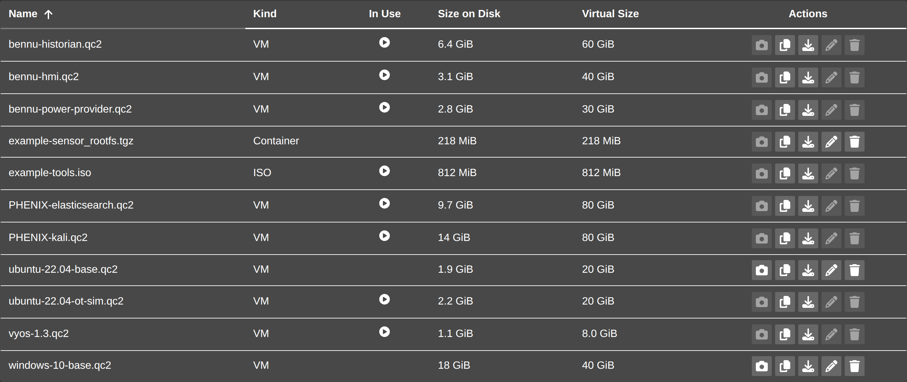
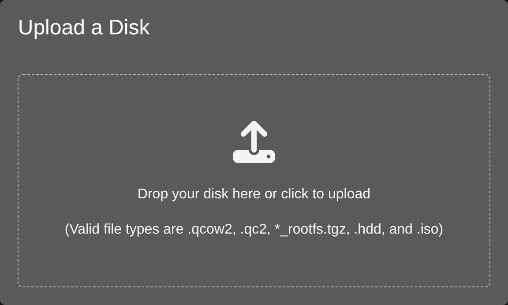

# Disks

The `Disks` tab lists the disk images phēnix knows about:

* the images with a known extension (`.qcow2`, `.qc2`, `_rootfs.tgz`, `.hdd`,
  `.iso`) in the minimega files directory and the folders under it, except the
  folders described in [Images in Folders](#images-in-folders);
* every image an experiment's topology names, wherever it is and whatever its
  extension, as long as phēnix can open it as a regular file;
* the images those are backed by.

Each image is listed once, by its full path, so two images with the same file
name in different folders are two rows. The tab needs `list` on `disks`, and
only images your role may see appear; see [Permissions](#permissions).

{: width=800 .center}

The same images can be managed from the command line; see
[Virtual Disk Images Management](image.md).

## The Disks Table

| Column | What it shows |
| :--- | :--- |
| `Name` | The image's path within the minimega files directory, such as `win/win10.qcow2`, or its full path, with a warning icon, when it is [outside that directory](#images-outside-the-files-directory). Clicking the row opens the image's details. |
| `Kind` | `VM`, `Container`, `ISO`, or `Unknown`. |
| `In Use` | An icon when something holds the image open, with a tooltip naming which experiments. |
| `Size on Disk` | How much room the file takes now. |
| `Virtual Size` | How large the disk looks to the guest. |
| `Actions` | Buttons for the actions that can be run on the image. |

Every column but `Actions` sorts. `Name` sorts, and the `Find a disk` search
box searches, by the path the column shows, so `win/` finds every image in the
`win` folder. `Size on Disk` and `Virtual Size` sort by their real byte count
rather than as text, so `900 MiB` sorts below `2.1 GiB`.

The `In Use` tooltip reads `In use by` and the running experiments that use the
image, for example `In use by foo, bar`, or `In use by a running experiment`
when phēnix cannot tie the lock to one.

## In Use

An image counts as in use when a process holds a lock on its file, which is how
minimega decides the same thing. In practice that means a running VM has the
file open.

Each image in a backing chain is judged on its own file. A backing image is not
marked in use just because an image built on it is, so a base image stays
available for snapshots while VMs run off its children.

## Experiments Using an Image

An experiment uses an image when a node in its topology names the image as a
drive, or when the image backs a drive the topology names. phēnix matches them
by full path, so a topology naming `win/base.qc2` does not use `base.qc2` at the
top of the minimega files directory. The `Experiments` row of the details window
lists every experiment using the image that your role may list, and marks the
ones that are not running, for example `foo, bar (stopped)`. The `In Use`
tooltip names only the running ones, since only those hold the image open.

## Images in Folders

Images can sit in folders under the minimega files directory, and a topology
names them by their path within it (`image: win/10/win10.qcow2`) or by their
full path. The list searches folders down to 16 levels below the files
directory, and leaves out:

* hidden files and folders, whose names start with `.`, and `lost+found`;
* a `files`, `tmp` or `miniccc_responses` folder directly inside a top-level
  folder, such as `my-experiment/files`: phēnix keeps an experiment's files,
  scratch images and command responses there, and the experiment's
  [Files](experiments.md#experiment-files) tab manages them;
* anything at the top level named `saved` or starting with `transfer_`, where
  minimega keeps saved VM state and files it is copying between cluster nodes.

Symlinked folders are not followed, so an image in one is listed only when a
topology names it; the files directory itself may be a symlink. A symlink to an
image file is listed at the link's path. A folder phēnix cannot read is left out
and logged, and the first folder found too deep is logged as
`disk list leaves out folders nested too deeply`.

An image the list leaves out is still listed when a topology names it, such as
a VM disk snapshot restored from an experiment's `files` folder, but phēnix does
not act on it (see [Actions](#actions)). The `Location` row of its details reads
`The standard images directory (/phenix/images), at a path the disk list leaves out`,
naming the files directory when the page can tell it from the list.

## Images Outside the Files Directory

A topology can also name an image anywhere else phēnix can read it, such as
`/data/vms/win10.qcow2`. The list shows such an image by its full path, with a
warning icon. Hovering over or focusing the icon shows why, naming the files
directory when the page can tell it from the list:

> Outside the standard images directory (/phenix/images). minimega does not
> copy this image to other cluster nodes, so on a multi-node cluster every node
> that may run a VM using it needs the same file at this path.

The same icon marks the image in its details window, whose `Location` row reads
`Outside the standard images directory`, beside an experiment page's `Disk`
menu while the menu's disk is outside (see [Disk Menu](vms.md#disk-menu)), and
on a running VM's disk or inserted ISO in its details. The CD-ROM picker lists
outside ISO images in a group of their own, without the icon.

minimega copies only images in its files directory to the cluster nodes that
launch VMs from them. Before using an outside image on a cluster of more than
one node, put the same file at the same path on every node that may run the VM.

!!! warning
    With minimega's `-abssnapshot` flag, which the Docker Compose setup turns
    on with `MM_ABSSNAPSHOT: true`, minimega cannot launch a snapshot VM whose
    image is outside its files directory on a cluster of more than one node,
    even when every node has the file. Keep such images in the files directory.

phēnix lists outside images but does not change them: every action, `Download`
included, is disabled for them, and the server refuses them. To manage one from
this tab, copy it into the minimega files directory and point the topology at
the copy.

phēnix reads an image from the path the topology names, and minimega must find
it at that same path. In the Docker Compose setup the phēnix and minimega
containers share `/phenix`, so an image elsewhere under `/phenix` works as it
is; a path outside `/phenix` needs the same mount in both containers.

phēnix leaves out a topology image it cannot open as a regular file, such as a
missing or unreadable one, and never inspects paths under `/proc`, `/sys`,
`/dev` or `/run`. The experiment page still shows such a disk, marked as not in
the list.

## Permissions

`disks` permissions name an image by its file name, such as `win10.qcow2`, in
whatever folder it is, so a name covers the files of that name in every folder:
`list` on `win10.qcow2` lists both `win10.qcow2` and `win/win10.qcow2`.

A role sees an image outside the minimega files directory only when, besides
`list` on its file name, it may `get` an experiment whose topology uses the
image, or the image backs one the role sees. The experiment page asks for the
images one experiment can use, which needs `get` on that experiment; see
[Disk Menu](vms.md#disk-menu).

## Actions

The `Actions` column offers `Snapshot`, `Clone`, `Download`, `Rename`, and
`Delete`. Clicking a row opens the image's details, which offer the same
actions and two more:

* **Snapshot** - Creates a new image backed by this image
* **Commit** - Commits change in this image to its backing image
* **Rebase** - Updates image and rebases onto a different backing image
* **Clone** - Creates a copy of the disk file
* **Resize**
* **Download**
* **Rename**
* **Delete**

An action you cannot use stays visible but is disabled, and its tooltip says
why:

* `Can't rename: the disk is outside the standard images directory` — phēnix
  acts only on images in the minimega files directory, so every action is
  disabled on an image outside it, and on one the list leaves out
  (`Can't delete: the disk is at a path the disk list leaves out`).
* `Can't resize: minimega cannot use the disk's path` — `Snapshot`, `Commit`,
  `Rebase`, and `Resize` run through minimega, which cannot take every path;
  see below.
* `Can't rename: the disk is in use by foo` — an image held open cannot be
  snapshotted, committed, rebased, resized, renamed, or deleted. `Clone` and
  `Download` still work, because they only read the file.
* `Can't snapshot: only VM disks can be snapshotted` — `Snapshot`, `Commit`,
  and `Rebase` apply to VM images only.
* `Can't delete: you don't have permission` — your role lacks the permission
  the action needs: `create` on `disks` for `Snapshot` and `Clone`, which the
  server checks against the new image's file name, `update` for `Rebase`,
  `Rename`, and `Resize`, `update` on both the image and its *backing* image
  for `Commit`, `get` for `Download`, and `delete` for `Delete`.

`Commit` is also disabled on an image with no backing image to commit into
(`Can't commit: the disk has no backing image to commit into`), and on one whose
backing image phēnix does not act on
(`Can't commit: its backing image is outside the standard images directory`),
since a commit writes into the backing image. The same reasons show when you
hover a disabled action in the details window, which is the only place `Commit`
and `Rebase` appear. `Rebase` offers the other images phēnix acts on and
minimega can use, sorted by the path the `Name` column shows, or `None` to make
the image independent.

`Snapshot`, `Clone`, and `Rename` ask for a new name, which is relative to the
image's own folder unless it is a full path in the minimega files directory;
`.qcow2` is added unless the name ends in `.qc2` or `.qcow2`. The name must
name a file: one that is empty, ends in `/`, or whose last part is `.` or `..`
is refused. The folder must already exist, and none of them replaces an
existing file.

`Snapshot`, `Commit`, `Rebase`, and `Resize` run through minimega, so the image,
the backing image `Rebase` sets, and any new name must be paths minimega can
take as one argument: no white space or control characters, and none of `"`,
`'`, `` ` ``, `\`, `#`, `*`, `?`, `[`, `]`, `{`, `}`, `$`, or `,`. A new name
from `Clone` or `Rename` follows the same rule. phēnix clones, renames, deletes,
and downloads the file itself, so those work on an existing image of any name.

The server makes the same checks, whatever sends the request, and the error
names the reason. It answers 400 for an image outside the minimega files
directory or at a path the list leaves out, a folder rather than an image, a new
name that does not name a file, or a name minimega cannot use; 404 when the
image, or the folder for a new one, does not exist; and 409 when the new name is
taken.

!!! warning
    Renaming an image that backs others leaves them pointing at the old name;
    rebase them onto the new one. Deleting an image that backs others makes
    them invalid. Both dialogs say so before you confirm.

The details window also draws the image's backing chain, the image itself first
and then the images it is backed by. Each of those is a button that opens that
image's own details; an image the list does not hold, such as one your role may
not list, shows as its full path instead.

## Uploading an Image

The upload button, right of the search box, needs `upload` on `disks`. It opens
`Upload a Disk`, where you can drop a file or click to pick one.

{: width=500 .center}

The dialog lists what it takes: `(Valid file types are .qcow2, .qc2,
*_rootfs.tgz, .hdd, and .iso)`. Anything else is refused with an error naming
the file, before the upload starts.

While an upload runs, the upload button shows its progress as a percentage, and
the dialog shows a progress bar. Closing the dialog does not stop the upload.
Uploaded images land at the top of the minimega files directory, so they appear
in the table on their own once the upload finishes.

## How phēnix Inspects Images

When `qemu-img` is installed — it is in the phēnix container image — phēnix
inspects images itself, several at a time, instead of running one minimega
`disk info` per image in turn. It reads each image's size, virtual size, format,
and backing chain that way, and can read an image a running VM holds locked.
Without `qemu-img`, phēnix falls back to asking minimega, and lists the folders
with minimega's `file list`, which, like phēnix's own search, does not follow
symlinked folders. The fallback leaves out the folders and images whose names
minimega cannot take, including images a topology names, and anything phēnix
sees as something other than a regular file.

An image is inspected again only when its file, or a file in its backing chain,
has changed since the last inspection. phēnix inspects every image at startup,
and again whenever the minimega files directory or a folder the list searches
changes and then stays quiet for a couple of seconds, so a long upload is not
inspected while it is still being written. When that happens, open `Disks`
pages reload on their own.

phēnix follows folders created later, and stops following removed ones. It
follows at most 4096 folders, and logs once when it stops at that limit, or at
the kernel's inotify limit, which the `fs.inotify.max_user_watches` sysctl
raises. Changes it does not follow, including to images outside the files
directory, show the next time the list loads.

The header's refresh button does more here than on other pages: it has the
server inspect every image again from scratch, changed or not. See
[Page Freshness and Refresh](web-ui.md#page-freshness-and-refresh).

phēnix asks minimega for its files directory (its `-filepath`) the first time
it needs it. Until minimega answers, phēnix uses `<base-dir.phenix>/images`,
logs `minimega did not give its files directory`, and asks again at most once a
minute. When minimega answers with a different directory, phēnix lists and
watches that one instead, and open `Disks` pages reload.

## Downloading an Image

`Download` confirms first, then downloads the image through the browser. The
server serves only images it acts on: in the minimega files directory or a
folder under it, but not at a path the list leaves out. A path with `../` in
it, a sibling directory whose name merely starts with that directory's name, and
an image outside the directory are all refused.
