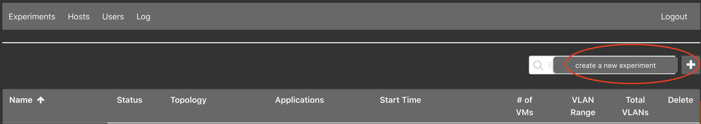
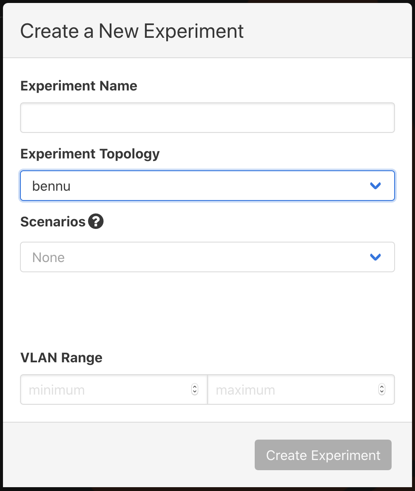
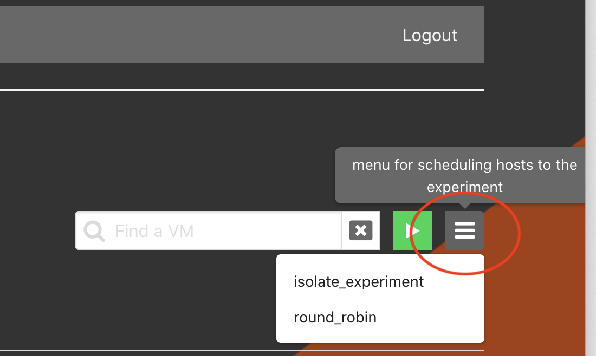

# Experiments

## Listing Experiments

### From the Web-UI

Click on the `Experiments` tab. This will display all available experiments that
the user has access to view or edit.

### From the Command Line Binary

This will display a list of all available experiments: it is run as a `root`
user.

```bash
phenix exp list
```

<br>

## Starting / Stopping Experiments

### From the Web-UI

Clicking the `stopped` button will start the experiment; similarly the `started`
button will stop the experiment. A progress bar is used to update the progress
of starting an experiment. During the update to the experiment -- starting or
stopping -- it will not be accessible or available to delete.

### From the Command Line Binary

```bash
phenix exp start <experiment name>
```

Or ...

```bash
phenix exp stop <experiment name>
```

Or ...

```bash
phenix exp restart <experiment name>
```

Optionally, you can use the `--dry-run` flag to do everything except call out to
minimega.

The `phenix exp --help` command will output:

```text
Experiment management

Usage:
  phenix experiment [flags]
  phenix experiment [command]

Aliases:
  experiment, exp

Available Commands:
  apps            List of available apps to assign an experiment
  create          Create an experiment
  delete          Delete an experiment
  edit            Edit an experiment
  list            Display a table of available experiments
  reconfigure     Reconfigure an experiment
  restart         Restart an experiment
  schedule        Schedule an experiment
  schedulers      List of available schedulers to assign an experiment
  scorch          Start a Scorch run for experiment
  start           Start an experiment
  stop            Stop an experiment
  trigger-running Trigger running stage for app(s) in experiment

Flags:
  -h, --help   help for experiment

Use "phenix experiment [command] --help" for more information about a command.
```

!!! note
    For a list of global flags supported across all `phenix` subcommands, see [Global Flags](settings.md#global-flags).

## Create a New Experiment

### From the Web-UI

{: width=800 .center}

Click the `+` button to the right of the filter field.

{: width=400 .center}

Enter `Experiment Name` and `Experiment Topology`, the remaining selection are
optional. In this example, `bennu` is an example topology and is not included
by default. You will need to [create](configuration.md) your own topology(ies).

#### Purely via the Web-UI (Uploading Topo/Scenario Files)

You can create an experiment entirely through the Web-UI using custom topology and scenario files without needing to use the CLI:

1. **Upload Configurations in the Configs Tab**:
   * Navigate to the **Configs** tab.
   * Click the **Upload** button to upload your topology file (`.yaml`).
   * (Optional) Click **Upload** again to upload your scenario file (`.yaml`).
   * Verify that your uploaded configurations appear in the table (e.g., `topology/my-topology` and `scenario/my-scenario`).

2. **Create Experiment in Experiments Tab**:
   * Navigate to the **Experiments** tab.
   * Click the `+` button to open the creation dialog.
   * Enter an **Experiment Name**.
   * Select your uploaded topology from the **Experiment Topology** dropdown.
   * (Optional) Select your uploaded scenario from the **Experiment Scenario** dropdown.
   * Click **Save** to create the experiment.

### From the Command Line Binary

You can create an experiment using either saved configuration names from the phēnix store or direct file paths to topology and scenario configuration files (`.yaml`).

```bash
# Using stored configuration names
phenix experiment create <experiment name> -t <topology name>
phenix experiment create <experiment name> -t <topology name> -s <scenario name>

# Using direct file paths for topology and scenario
phenix experiment create <experiment name> -t /path/to/topology.yaml
phenix experiment create <experiment name> -t /path/to/topology.yaml -s /path/to/scenario.yaml

# Specifying a base directory and disabled apps
phenix experiment create <experiment name> -t /path/to/topology.yaml -s /path/to/scenario.yaml -d </path/to/dir/> --disabled-apps "app1,app2"
```

The `phenix exp create --help` command will output:

```text
Create an experiment

  Used to create an experiment from existing configurations; can be a
  topology, or topology and scenario, or paths to topology/scenario
  configuration files (YAML or JSON). (Optional are the arguments for
  scenario or base directory.)

Usage:
  phenix experiment create <experiment name> [flags]

Examples:

  phenix experiment create <experiment name> -t <topology name or /path/to/filename>
  phenix experiment create <experiment name> -t <topology name or /path/to/filename> -s <scenario name or /path/to/filename>
  phenix experiment create <experiment name> -t <topology name or /path/to/filename> -s <scenario name or /path/to/filename> -d </path/to/dir/>
  phenix experiment create <experiment name> -t <topology name or /path/to/filename> -s <scenario name or /path/to/filename> --disabled-apps "app1,app2"

Flags:
  -d, --base-dir string         Base directory to use for experiment (optional)
  -b, --default-bridge string   Default bridge name to use for experiment (optional) (default "phenix")
      --disabled-apps strings   Comma separated ist of apps to disable
  -h, --help                    help for create
  -s, --scenario string         Name of an existing scenario to use (optional)
  -t, --topology string         Name of an existing topology to use
      --vlan-max int            VLAN pool maximum
      --vlan-min int            VLAN pool minimum
```

## Deleting Experiments

### From the Web-UI

The experiment must be stopped before it can be deleted; click the trash can
icon next to the experiment to delete it.

### From the Command Line Binary

An experiment must be stopped before it can be deleted:

```bash
phenix exp stop <experiment name>
phenix exp delete <experiment name>
```

Alternatively, the `-f`/`--force` flag can be used to automatically stop a
running experiment before deleting it, similar to `docker rm -f`:

```bash
phenix exp delete -f <experiment name>
```

Using `all` instead of a specific experiment name will delete all stopped
experiments (or, when combined with `--force`, all experiments regardless of
whether they are running).

The `phenix exp delete --help` command will output:

```text
Delete an experiment

  Used to delete an existing experiment; experiment must be stopped.
  Using 'all' instead of a specific experiment name will include all
  stopped experiments. Use the -f/--force flag to automatically stop
  a running experiment before deleting it.

Usage:
  phenix experiment delete <experiment name> [flags]

Aliases:
  delete, del

Flags:
  -f, --force   Stop a running experiment before deleting it
  -h, --help    help for delete
```

## Scheduling an Experiment

### From Web-UI

The experiment must be stopped; click on the experiment name to enter the
Stopped Experiment component. Click on the hamburger menu to the right of the
filter field and start button to select a desired schedule.

{: width=400 .center}

### From the Command Line Binary

The list of available schedules can be found by running the following command.

```bash
phenix experiment schedulers
```

Then apply the desired schedule with the following command.

```bash
phenix experiment schedule <experiment name> <algorithm>
```

## Common Workflows

### 1. Basic Experiment Lifecycle

```bash
# 1. Create experiment from topology/scenario files
phenix exp create my-experiment -t /path/to/topology.yaml -s /path/to/scenario.yaml

# 2. Start the experiment
phenix exp start my-experiment

# 3. View status and inspect VMs
phenix exp list
phenix vm info my-experiment

# 4. Stop the experiment when testing finishes
phenix exp stop my-experiment

# 5. Delete the experiment
phenix exp delete my-experiment
```

### 2. Updating and Reconfiguring an Experiment

```bash
# Reconfigure a running experiment after modifying underlying configuration files
phenix exp reconfigure my-experiment
```

### 3. Dry-Run Deployment Testing

```bash
# Test experiment startup logic without deploying minimega VMs
phenix exp start my-experiment --dry-run
```
