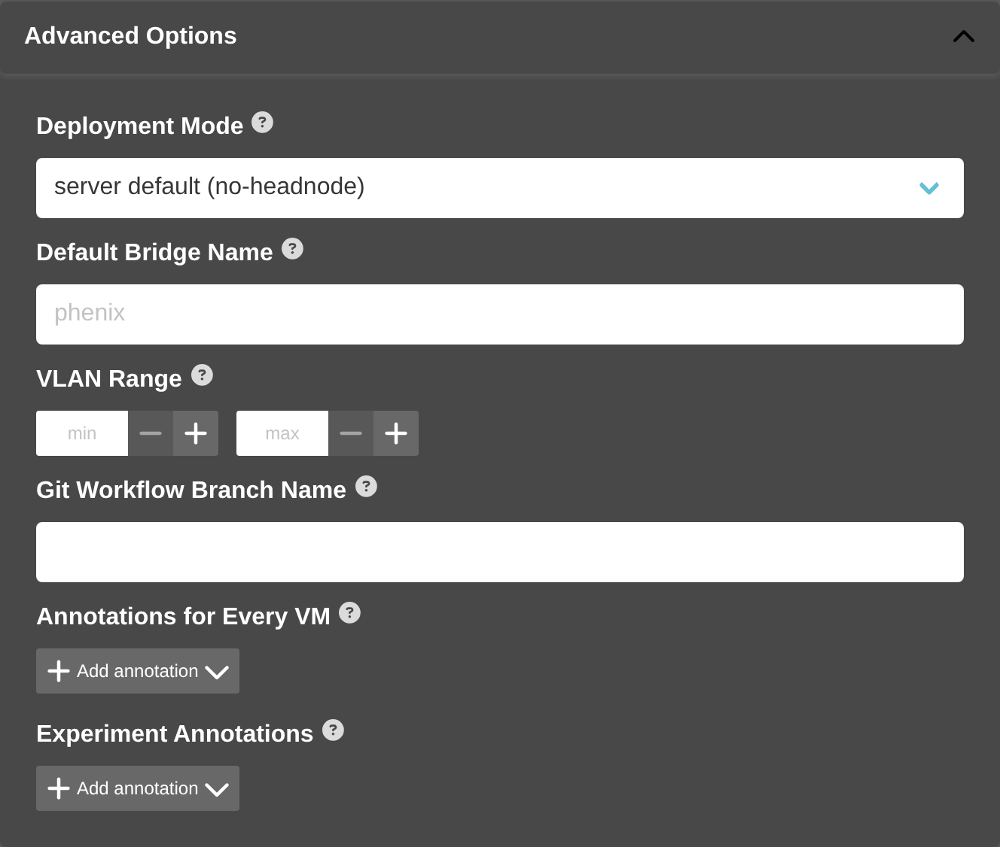
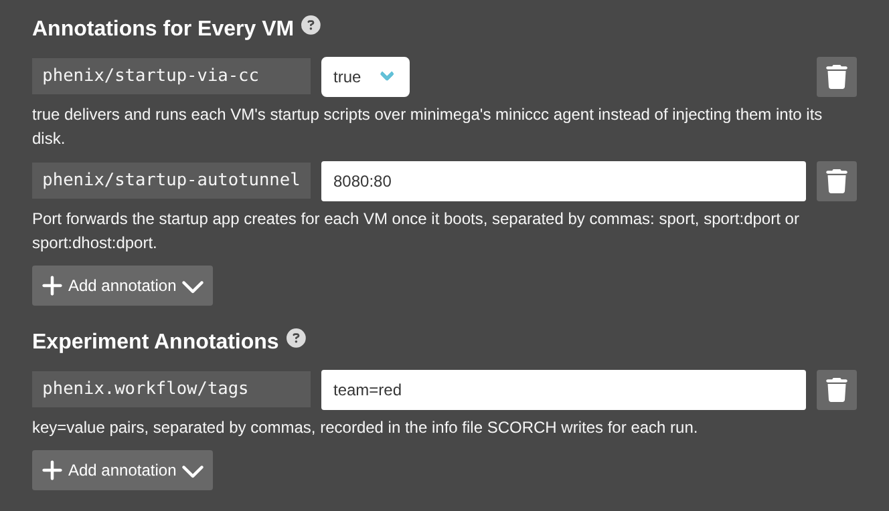
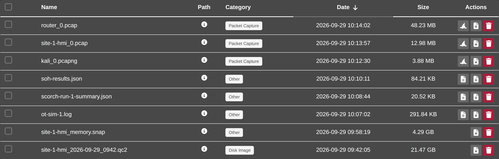
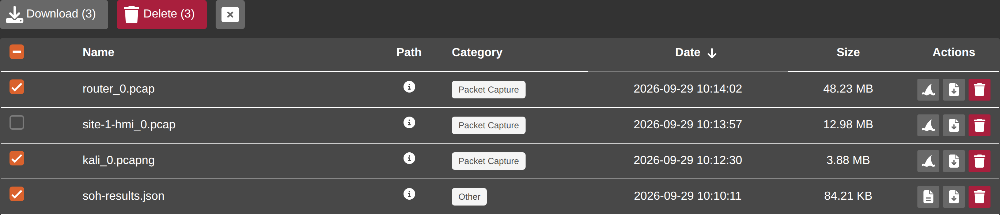

# Experiments

For experiments spanning multiple minimega hosts, see [GRE Mesh](gre-mesh.md)
to trunk experiment networks between hosts with `--use-gre-mesh`, including
the physical network MTU requirements.

## Listing Experiments

### From the Web-UI

Click on the `Experiments` tab. This will display all available experiments that
the user has access to view or edit.

Click a column heading to sort the table by it: `Name`, `Status`, `Topology`,
`Scenario`, `Start Time`, and `VMs` can all be sorted on. Experiments created or
started somewhere else, such as from the command line binary or a
[Git workflow](git-workflow.md), appear in the list as they are created or
start, without reloading the page.

### From the Command Line Binary

This will display a list of all available experiments: it is run as a `root`
user.

```bash
phenix exp list
```

<br>

## Starting / Stopping Experiments

### From the Web-UI

Clicking the `stopped` button will start the experiment; similarly the `started`
button will stop the experiment. A progress bar is used to update the progress
of starting an experiment. During the update to the experiment -- starting or
stopping -- it will not be accessible or available to delete.

The bar's percentage counts every one of the experiment's VMs: those minimega
has queued to launch, or, once nothing is queued any more, those still
building, out of the VMs in the topology.

### From the Command Line Binary

```bash
phenix exp start <experiment name>
```

Or ...

```bash
phenix exp stop <experiment name>
```

Or ...

```bash
phenix exp restart <experiment name>
```

Optionally, you can use the `--dry-run` flag to do everything except call out to
minimega.

After an experiment stops successfully, phēnix deletes the VM disk snapshots
created for file injection. To keep these snapshots for debugging, use
`--keep-injection-snapshots` or its `-K` shorthand:

```bash
phenix exp stop --keep-injection-snapshots <experiment name>
```

Only `phenix exp stop` accepts this option. Stopping an experiment from the
Web-UI, or with `phenix exp restart`, always deletes the snapshots.

The `phenix exp --help` command will output:

```text
Experiment management

Usage:
  phenix experiment [flags]
  phenix experiment [command]

Aliases:
  experiment, exp

Available Commands:
  apps            List of available apps to assign an experiment
  create          Create an experiment
  delete          Delete an experiment
  edit            Edit an experiment
  list            Display a table of available experiments
  reconfigure     Reconfigure an experiment
  restart         Restart an experiment
  schedule        Schedule an experiment
  schedulers      List of available schedulers to assign an experiment
  scorch          Start a Scorch run for experiment
  start           Start an experiment
  stop            Stop an experiment
  trigger         Trigger lifecycle stage for app(s) in experiment

Flags:
  -h, --help   help for experiment

Use "phenix experiment [command] --help" for more information about a command.
```

!!! note
    For a list of global flags supported across all `phenix` subcommands, see [Global Flags](settings.md#global-flags).

## Create a New Experiment

### From the Web-UI

{: width=800 .center}

Click the `+` button to the right of the filter field.

{: width=600 .center}

Enter `Experiment Name` and `Experiment Topology`, the remaining selection are
optional. In this example, `bennu` is an example topology and is not included
by default. You will need to [create](configuration.md) your own topology(ies).

Each field's label is followed by a help icon: hover over or focus it to see
what the field does. The book button in the card's header opens this section of
the documentation.

Expand `Advanced Options` for the remaining settings:

* `Deployment Mode`: which cluster hosts run the experiment's VMs
  (`no-headnode`, `only-headnode`, or `all`), which defaults to the server's
  `--deploy-mode` setting.
* `Default Bridge Name`: see [Bridge Mode](bridge-mode.md).
* `VLAN Range`: the VLAN IDs minimega may give the experiment's VLANs.
* `Git Workflow Branch Name`: links the experiment to a
  [Git workflow](git-workflow.md) branch.
* `Annotations for Every VM` and `Experiment Annotations`: see
  [Adding Annotations](#adding-annotations).

{: width=500 .center}

#### Purely via the Web-UI (Uploading Topo/Scenario Files)

You can create an experiment entirely through the Web-UI using custom topology and scenario files without needing to use the CLI:

1. **Upload Configurations in the Configs Tab**:
    * Navigate to the **Configs** tab.
    * Click the **Upload** button to upload your topology file (`.yaml`).
    * (Optional) Click **Upload** again to upload your scenario file (`.yaml`).
    * Verify that your uploaded configurations appear in the table (e.g., `topology/my-topology` and `scenario/my-scenario`).

2. **Create Experiment in Experiments Tab**:
    * Navigate to the **Experiments** tab.
    * Click the `+` button to open the creation dialog.
    * Enter an **Experiment Name**.
    * Select your uploaded topology from the **Experiment Topology** dropdown.
    * (Optional) Select your uploaded scenario from the **Experiment Scenario** dropdown.
    * Click **Create Experiment** to create the experiment.

### From the Command Line Binary

You can create an experiment using either saved configuration names from the phēnix store or direct file paths to topology and scenario configuration files (`.yaml`).

```bash
# Using stored configuration names
phenix experiment create <experiment name> -t <topology name>
phenix experiment create <experiment name> -t <topology name> -s <scenario name>

# Using direct file paths for topology and scenario
phenix experiment create <experiment name> -t /path/to/topology.yaml
phenix experiment create <experiment name> -t /path/to/topology.yaml -s /path/to/scenario.yaml

# Specifying a base directory and disabled apps
phenix experiment create <experiment name> -t /path/to/topology.yaml -s /path/to/scenario.yaml -d </path/to/dir/> --disabled-apps "app1,app2"

# Adding annotations to every VM and to the experiment (see Adding Annotations below)
phenix experiment create <experiment name> -t <topology name> --node-annotation phenix/startup-via-cc=true --annotation phenix.workflow/tags=team=red
```

The `phenix exp create --help` command will output:

```text
Create an experiment

  Used to create an experiment from existing configurations; can be a
  topology, or topology and scenario, or paths to topology/scenario
  configuration files (YAML or JSON). (Optional are the arguments for
  scenario or base directory.)

Usage:
  phenix experiment create <experiment name> [flags]

Examples:

  phenix experiment create <experiment name> -t <topology name or /path/to/filename>
  phenix experiment create <experiment name> -t <topology name or /path/to/filename> -s <scenario name or /path/to/filename>
  phenix experiment create <experiment name> -t <topology name or /path/to/filename> -s <scenario name or /path/to/filename> -d </path/to/dir/>
  phenix experiment create <experiment name> -t <topology name or /path/to/filename> -s <scenario name or /path/to/filename> --disabled-apps "app1,app2"
  phenix experiment create <experiment name> -t <topology name> --node-annotation phenix/default-apps=false --annotation phenix.workflow/tags=nightly

Flags:
      --annotation stringArray        Experiment annotation as key=value; may be repeated
  -d, --base-dir string               Base directory to use for experiment (optional)
  -b, --default-bridge string         Default bridge name to use for experiment (optional) (default "phenix")
      --disabled-apps strings         Comma separated list of apps to disable
  -h, --help                          help for create
      --node-annotation stringArray   Annotation for every VM as key=value; true, false and JSON lists or objects keep their type; may be repeated
  -s, --scenario string               Name of an existing scenario to use (optional)
  -t, --topology string               Name of an existing topology to use
      --vlan-max int                  VLAN pool maximum
      --vlan-min int                  VLAN pool minimum
```

### Adding Annotations

An experiment can be given annotations when it is created, without editing its
topology or scenario:

| Annotations | Web-UI (`Advanced Options`) | Command line (repeatable) | API (`POST /experiments`) |
| :--- | :--- | :--- | :--- |
| On every VM | `Annotations for Every VM` | `--node-annotation key=value` | `node_annotations` |
| On the experiment | `Experiment Annotations` | `--annotation key=value` | `annotations` |

**Annotations for every VM** are node annotations, which apps read from the
topology's nodes, such as
[`phenix/default-apps`](apps.md#disable-default-apps-for-a-vm) and
[`phenix/startup-via-cc`](apps.md#c2-startup-script-delivery). phēnix adds them
to every VM in the experiment's own copy of the topology, so the topology config
itself is unchanged. A VM that already has an annotation keeps its own value,
and [external nodes](configuration.md#external-nodes) are skipped.

**Experiment annotations** are added to the experiment's metadata annotations,
where apps can read them; for example, SCORCH records the `key=value` pairs of
`phenix.workflow/tags` in the info file it writes for each run. phēnix sets the
`topology` and `scenario` annotations itself and rejects them. In the Web-UI, the
`phenix.workflow/branch` annotation comes from the `Git Workflow Branch Name`
field, and an API request cannot give it both as an annotation and as
`workflow_branch`.

In the Web-UI, the `Add annotation` button under each list offers the
annotations phēnix's own apps read, each with a value input suited to it and a
description, or a `Custom annotation` with any key and value. On the command
line, and for a custom annotation in the Web-UI, a VM annotation's value `true`
or `false` becomes a boolean and a JSON list or object keeps that type; anything
else, numbers included, stays a string. Experiment annotations are always
strings. The API takes `node_annotations` as JSON values, keeping their types.
To change one VM's annotations after the experiment is created, use the
[Annotations](vms.md#annotations) section of its details card.

{: width=600 .center}

A value of the wrong type for an annotation the default apps read is rejected,
naming the annotation: `phenix/default-apps` must be `true` or `false`,
`phenix/startup-autotunnel` a list of port forwards, and `vrouter/vyos-password`
and `vrouter/enable-ssh` strings.

```bash
# For every VM, deliver startup scripts over C2 and create a port forward from 8080 to its port 80
phenix experiment create my-experiment -t my-topology \
  --node-annotation phenix/startup-via-cc=true \
  --node-annotation 'phenix/startup-autotunnel=["8080:80"]' \
  --annotation phenix.workflow/tags=team=red
```

The same request through the API:

```json
{
  "name": "my-experiment",
  "topology": "my-topology",
  "node_annotations": {
    "phenix/startup-via-cc": true,
    "phenix/startup-autotunnel": ["8080:80"]
  },
  "annotations": {
    "phenix.workflow/tags": "team=red"
  }
}
```

## Deleting Experiments

### From the Web-UI

The experiment must be stopped before it can be deleted; click the trash can
icon next to the experiment to delete it. phēnix asks you to confirm first, and
only that experiment's own button spins while it is deleted, so the rest of the
table stays usable.

### From the Command Line Binary

An experiment must be stopped before it can be deleted:

```bash
phenix exp stop <experiment name>
phenix exp delete <experiment name>
```

Alternatively, the `-f`/`--force` flag can be used to automatically stop a
running experiment before deleting it, similar to `docker rm -f`:

```bash
phenix exp delete -f <experiment name>
```

Using `all` instead of a specific experiment name will delete all stopped
experiments (or, when combined with `--force`, all experiments regardless of
whether they are running).

The `phenix exp delete --help` command will output:

```text
Delete an experiment

  Used to delete an existing experiment; experiment must be stopped.
  Using 'all' instead of a specific experiment name will include all
  stopped experiments. Use the -f/--force flag to automatically stop
  a running experiment before deleting it.

Usage:
  phenix experiment delete <experiment name> [flags]

Aliases:
  delete, del

Flags:
  -f, --force   Stop a running experiment before deleting it
  -h, --help    help for delete
```

## Scheduling an Experiment

### From Web-UI

The experiment must be stopped; click on the experiment name to enter the
Stopped Experiment component. Click on the hamburger menu to the right of the
filter field and start button to select a desired schedule.

{: width=400 .center}

### From the Command Line Binary

The list of available schedules can be found by running the following command.

```bash
phenix experiment schedulers
```

Then apply the desired schedule with the following command.

```bash
phenix experiment schedule <experiment name> <algorithm>
```

## Triggering App Lifecycle Stages

You can manually trigger an app lifecycle stage for an experiment without
stopping and restarting it.

### From the Command Line Binary

The `phenix exp trigger` command runs one app lifecycle stage on demand:

```bash
phenix exp trigger <lifecycle> <experiment name> [<app name> ...]
```

Where `<lifecycle>` is one of the following stages, or its shorthand:

* `configure` (or `config`)
* `pre-start` (or `pre`)
* `post-start` (or `post`)
* `running` (or `run`)
* `cleanup` (or `clean`)

Providing no app names triggers the stage for every app in the experiment. Use
`all` instead of an experiment name to trigger the stage in every experiment.
The `running` stage is skipped for experiments that are not running.

**Examples:**

Trigger the running stage for all apps in an experiment:

```bash
phenix exp trigger running my-experiment
```

Trigger the running stage for a specific app:

```bash
phenix exp trigger running my-experiment soh
```

Trigger the configure stage for all experiments:

```bash
phenix exp trigger configure all
```

### `trigger configure` vs. `reconfigure`

`phenix exp trigger configure` and `phenix experiment reconfigure` both re-run
the `configure` lifecycle stage, but they serve different purposes and are not
interchangeable:

| | `phenix exp trigger configure` | `phenix experiment reconfigure` |
|---|---|---|
| Use case | Manually re-run a specific app's (or apps') configure hook on demand, e.g. for debugging | Re-apply configuration after editing an experiment's stored topology, scenario, or deployment settings |
| Targets specific apps | Yes, via `[<app name> ...]` | No, always applies to every app |
| Validates the experiment config | No | Yes |
| Runs registered config hooks | No | Yes |
| Resets the minimega bridge | No | Yes (deletes it so it's recreated with current settings, unless using the GRE mesh) |
| Guards against running experiments | No | Yes (refuses to run if the experiment is running) |

Use `phenix experiment reconfigure` after changing an experiment's stored
settings. Use `phenix exp trigger configure` for targeted, on-demand
re-invocation of one or more apps' configure hooks, such as when debugging an
app.

### Deprecated Command

The `phenix exp trigger-running` command, and its `trig` alias, are deprecated
and will be removed in a future release. Use `phenix exp trigger running`
instead. The deprecated command:

```bash
phenix exp trigger-running my-experiment [<app name> ...]
```

Is equivalent to:

```bash
phenix exp trigger running my-experiment [<app name> ...]
```

## Experiment Files

The `Files` tab of an experiment lists the files phēnix, its apps, and SCORCH
wrote for that experiment, wherever on the cluster they were written. It is the
second tab on both the running and the stopped experiment page, and a role needs
`list` on `experiments/files` to see it at all. These files are kept in the
experiment's `files` folder in the minimega files directory, which the
[Disks](disks.md) tab leaves out, so the experiment's VM disk snapshots and
other images there are managed here rather than there.

{: width=800 .center}

### Finding a File

The table has a `Name`, `Path`, `Category`, `Date`, `Size`, and `Actions`
column. `Path` is an information icon; hover over it for the file's full path on
the phēnix server, such as
`/phenix/images/my-experiment/files/scorch/1/tcpdump/capture.pcap`. Click the
`Name`, `Date`, or `Size` heading to sort by that column; the table starts with
the newest file first. `Category` cannot be sorted on.

phēnix categorizes each file by what it is and what wrote it: `Packet Capture`,
`Scorch Artifact` (with the SCORCH run ID and the component's name as categories
of their own), `Filebeat`, `ELF Memory Snapshot`, `VM Memory Snapshot`,
`VM Disk Snapshot`, `Backing Image`, or `Unknown`. The `All Categories` dropdown
left of the search box keeps only the files in one category, and the
`Find a File` search box matches a file's name or its categories. The dropdown
narrows the rows the table has already loaded; the search box goes to the
server, which applies it to every file in the experiment.

Once the experiment has more files than fit on one page, a `Paginate` toggle
appears above the table. It is remembered in your browser for this table until
you turn it off again. Sorting, searching, changing the category, and changing
the page each list the files again, and phēnix reuses a listing for a few
seconds, so a file an app has only just written may not be in the next listing.

### Opening a File

Clicking a text file's name opens it in a read-only viewer, so you do not have
to download it to read it. phēnix treats `.json`, `.jsonl`, `.log`, `.txt`,
`.yaml`, and `.yml` files as text, and indents JSON so it is readable. `Exit`
closes the viewer.

Clicking a capture file's name opens it in
[WebShark](webshark.md#viewing-captures), when WebShark is installed. Capture
files are `.pcap`, `.pcapng`, and `.cap` files, optionally gzipped. Any other
kind of file has to be downloaded to be read.

### Acting on One File

The buttons in a row's `Actions` column are icons; hover over one for its label.
In order, they are:

* the button that opens the file: `Open in WebShark`, a shark fin, for a capture
  file, or `view file` for a text file. A row for any other kind of file leaves
  that space empty.
* `download`, which downloads that one file.
* `delete`, which asks you to confirm, naming the file, and spins while the file
  is deleted. Deleting a file removes it from every cluster node and cannot be
  undone.

The `delete` button appears only for a role with `delete` on
`experiments/files`, which among the default roles means `Global Admin` and
`Experiment Admin` (see [Roles](user-administration.md#roles)).

### Acting on Several Files

A role that can download or delete an experiment's files also gets a checkbox on
each row, and one in the heading that checks or clears every file the table is
showing. Checking a file puts a toolbar above the table, holding whichever of
these your role allows:

* `Download (N)` downloads the checked files as one
  `<experiment name>-files.zip` archive.
* `Delete (N)` asks to confirm once for all of them, with `Delete N Files` as
  the confirm button, then deletes them together.
* The last button clears the selection.

{: width=800 .center}

Only files you can still see stay checked: searching, changing the category, or
moving to another page drops the rest of the selection.

When some of the files cannot be deleted, phēnix deletes the ones it can and
reports the rest, naming up to ten of them with the reason and counting any
beyond that. Those files stay checked, so you can try again or download them
instead.

!!! note
    One zip download holds at most 500 files and 2 GiB in total. A larger one is
    refused before any of it is sent; through the [API](api.md) that is a `413`.

!!! warning
    A `.pcap` file a running capture is still writing cannot be viewed,
    downloaded, or deleted, so a half-written capture never leaves the server
    (a `400` through the API). Stop the capture first, or watch it live in
    [WebShark](webshark.md#viewing-captures), which follows a running capture as
    it grows. A file that is no longer on the cluster gives a `404`.

### Adding Files

phēnix and its apps write most of an experiment's files. To add your own, such
as an installer or a configuration file, upload it through the phēnix file
server; see
[Uploading Experiment Files from the phēnix Server](vms.md#uploading-experiment-files-from-the-phenix-server),
which also covers copying an uploaded file into a VM. Uploads land in the
experiment's files directory, so they appear in the `Files` tab like any other
file.

## Common Workflows

### 1. Basic Experiment Lifecycle

```bash
# 1. Create experiment from topology/scenario files
phenix exp create my-experiment -t /path/to/topology.yaml -s /path/to/scenario.yaml

# 2. Start the experiment
phenix exp start my-experiment

# 3. View status and inspect VMs
phenix exp list
phenix vm info my-experiment

# 4. Stop the experiment when testing finishes
phenix exp stop my-experiment

# 5. Delete the experiment
phenix exp delete my-experiment
```

### 2. Updating and Reconfiguring an Experiment

```bash
# Reconfigure a stopped experiment after modifying underlying configuration files
phenix exp reconfigure my-experiment
```

### 3. Dry-Run Deployment Testing

```bash
# Test experiment startup logic without deploying minimega VMs
phenix exp start my-experiment --dry-run
```
