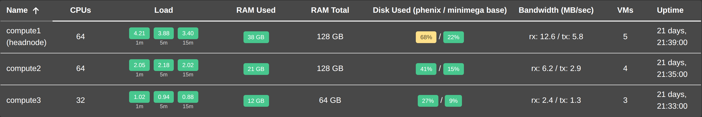

# Hosts

The `Hosts` tab lists the nodes in the minimega mesh and what each one is
carrying. It needs `list` on `hosts`, and only hosts your role may list appear.

{: width=800 .center}

## The Hosts Table

| Column | What it shows | Sorts |
| :--- | :--- | :--- |
| `Name` | The host's name, with `(headnode)` after it on the head node. | yes |
| `CPUs` | How many CPUs the host has. | yes |
| `Load` | The host's three load averages, each labeled with the span it covers: `1m`, `5m`, and `15m`. | no |
| `RAM Used` | Memory in use. | yes |
| `RAM Total` | Memory the host has. | yes |
| `Disk Used (phenix / minimega base)` | How full the disks holding the phēnix and minimega base directories are, as two percentages. | no |
| `Bandwidth (MB/sec)` | The host's traffic, as `rx: <in> / tx: <out>`. | no |
| `VMs` | How many VMs are running on the host. | yes |
| `Uptime` | How long the host has been up, as `HH:MM:SS`, with a day count in front once it is over a day. | yes |

The `Load`, `RAM Used`, and `Disk Used` values are colored tags: green below
65%, yellow from 65% up to 85%, and red at 85% and above. A load average is
measured against the host's CPU count, so a load of 4 on an 8-CPU host is green
and the same load on a 4-CPU host is red. Hovering the `Load` cell says what the
three numbers are: `Load average over the last 1, 5 and 15 minutes`.

The `Paginate` toggle appears above the table once there are more hosts than one
page holds; see [Tables](web-ui.md#tables).

## Disk Usage

Each percentage comes from a command run on the host itself, which waits in
minimega's queue behind experiment work. phēnix therefore measures a host's disk
usage at most once a minute: a listing within a minute of the last measurement
shows that measurement again, so the two percentages can be older than the rest
of the row.

## Refreshing

The page reloads every 30 seconds. Each reload has the server ask minimega about
every host, so a reload is skipped while the previous one is still running and
while you are not looking at the page — its browser tab is hidden, or its window
does not have focus. The header's refresh button reloads it at once, and says
how old the figures on screen are; see
[Page Freshness and Refresh](web-ui.md#page-freshness-and-refresh).
