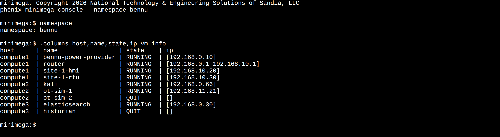

# minimega Integration

phēnix uses [minimega](https://sandia-minimega.github.io/minimega/) as its underlying network and virtual machine emulation backend. The `phenix mm` command provides direct access to send commands to minimega or attach to minimega's interactive console from the phēnix host. For full details on minimega's command set and capabilities, consult the [minimega Documentation](https://sandia-minimega.github.io/minimega/) and the [minimega API Reference](https://sandia-minimega.github.io/minimega/reference/minimega/).

## Command Line Usage

```text
Send commands, or attach, to minimega

Usage:
  phenix mm <minimega args>... [flags]

Flags:
      --attach             Attach to minimega console instead of sending commands
  -h, --help               help for mm
      --namespace string   Default minimega namespace to use
```

!!! note
    For a list of global flags supported across all `phenix` subcommands, see [Global Flags](settings.md#global-flags).

## Sending Commands to minimega

You can execute non-interactive minimega commands directly through `phenix mm`.

```bash
# View minimega cluster host status
phenix mm host

# Display minimega VM information across all namespaces
phenix mm vm info

# List active VLANs in minimega
phenix mm vlan
```

### Namespace Scoping

When working with experiment-specific VMs or VLANs, use the `--namespace` flag to target a specific minimega namespace:

```bash
# Execute minimega commands within the 'my-experiment' namespace
phenix mm --namespace my-experiment vm info

# Check network connections in a specific experiment namespace
phenix mm --namespace my-experiment vm net
```

## Attaching to the minimega Console

The `--attach` flag opens an interactive minimega console session, allowing real-time interaction with the minimega shell.

```bash
# Attach to the global minimega console
phenix mm --attach

# Attach to the minimega console scoped to a specific experiment namespace
phenix mm --attach --namespace my-experiment
```

To exit the attached console session, type `disconnect` or press `Ctrl+D`. Typing `quit` stops the minimega daemon itself.

### From the Web-UI

When the phēnix server is started with `phenix ui --minimega-console` (or
`PHENIX_UI_MINIMEGA_CONSOLE=true`), the `Console` tab in the banner near the top
of the UI opens a minimega console, running `phenix mm --attach`, in the
browser. The tab is shown to roles with `post` on `miniconsole`; without
`--minimega-console`, it says that console access is not configured.

The console belongs to the user who started it; no other user can see, use, or
end it. It keeps running while you use other pages, reload the page, or open
phēnix in another tab of the same browser: coming back to the `Console` tab
shows the same console and its earlier output instead of starting a new one.
The console ends when:

* you press `Ctrl+D` or type `disconnect` in it
* you log out
* 15 seconds pass after the last tab that has it open closes

Once it has ended, `Start a new console` starts another one. If the connection
to it is lost, including when the server drops a tab that falls too far behind
the console's output, `Reconnect` attaches to it again, or starts a new one if
it has ended in the meantime.

{: width=800 .center}

## minimega Command and Control (`miniccc`)

phēnix and its applications rely on minimega's command and control infrastructure ([miniccc](https://sandia-minimega.github.io/minimega/reference/minimega/)) running inside experiment VMs to execute commands, transfer files, and monitor VM health.

* **VM Execution**: phēnix apps run scripts and commands on VMs via `cc exec`.
* **File Operations**: Files are sent to VMs using `cc send`.
* **State of Health**: Health metrics are collected via C2 probes (e.g., `ip addr`, `systemctl`, `pgrep`).

## Daemon Configuration and Socket Access

By default, phēnix connects to minimega via a UNIX domain socket.

| Setting | Default | Description |
| :--- | :--- | :--- |
| `--base-dir.minimega` | `/tmp/minimega` | Base directory for minimega runtime state. |
| `MM_SOCKET_PATH` | `/tmp/minimega/minimega` | Path to the minimega command socket. |
| `MM_FILEPATH` | `/phenix/images` | Base directory for minimega disk images. |
| `--deploy-mode` | — | Deploy mode for minimega VMs (`all`, `no-headnode`, `only-headnode`). |

## Common Workflows

### 1. Debugging Experiment VMs

When troubleshooting virtual machine or network deployment issues, use `phenix mm` to inspect minimega's internal state:

```bash
# Check detailed VM status and tap interface mappings
phenix mm --namespace my-experiment vm info

# Inspect minimega log entries
phenix mm log
```

### 2. Monitoring Cluster Hosts

In multi-node minimega deployments, use `phenix mm` to verify cluster connectivity and host status:

```bash
# Verify health of all minimega headnodes and compute nodes
phenix mm host
```
