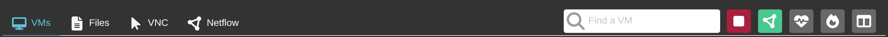
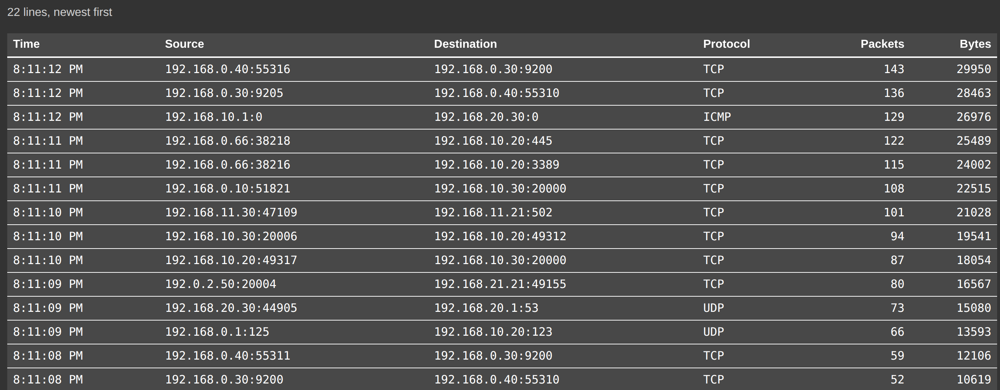

# Experiment Netflow

The minimega platform supports [netflow
capture](https://sandia-minimega.github.io/minimega/reference/minimega/#capture), wherein flows
through an Open vSwitch bridge can be parsed into an ASCII format and forwarded
to a remote endpoint for additional consumption.

phēnix extends this capability by collecting an experiment's netflow records
from minimega and streaming them to the web UI over a WebSocket. The only
requirement for enabling netflow for an experiment is that the experiment be
configured to use a bridge name that is not the default `phenix` bridge. This
can be done automatically for all experiments by enabling [auto bridge mode](bridge-mode.md),
or per-experiment via the UI by expanding the `Advanced Options` section when
creating a new experiment and providing the `Default Bridge Name` setting.

{: width=400 .center}

!!! note
    The `Default Bridge Name` field is only shown when the server is running in
    `manual` bridge mode. In `auto` mode the bridge name is always the
    experiment name, so the field is hidden.

This can also be done via the CLI by providing the `--default-bridge, -b` option
when using the `phenix exp create` subcommand.

!!! warning
    As mentioned above, the experiment netflow capability **will not work** if a
    default bridge name is not explicitly specified for an experiment. This is
    to prevent network flows across multiple experiments from being captured.

## Usage

Running experiments have a green network button in the button row to the right
of the VM search box, alongside the red button that stops the experiment and the
heartbeat button that opens [State of Health](state-of-health.md). Its tooltip
reads `Start Netflow Capture`. Clicking it starts netflow capture for the
non-default bridge the experiment is configured to use for all VM network
interfaces.

{: width=800 .center}

The button spins while a capture is starting or stopping. Once the capture is
running the button turns red and its tooltip reads `Stop Netflow Capture`. To
stop netflow capture for the experiment, click the red button. If you return to
a running experiment that is already capturing, the page joins the capture in
progress and the button is red straight away.

The `Netflow` tab is the last tab of the running experiment, and it is always
there for users whose role can read netflow. Until flows arrive it reads
`No netflow captures yet. Start one with the netflow button above.`

Captured flows are shown as a table with `Time`, `Source`, `Destination`,
`Protocol`, `Packets` and `Bytes` columns, newest flow first. `Source` and
`Destination` are each an address and port, and `Protocol` is named for the
protocols phēnix knows (`ICMP`, `TCP`, `UDP` and `ICMPv6`) and is otherwise the
IP protocol number. The table is sized to the window, so the page footer stays
on screen as flows come in. Starting and stopping a capture add their own rows,
so the table also records when each capture ran.

{: width=800 .center}

The line above the table reports how many flows the tab is holding. It keeps the
10,000 most recent flows and shows the newest 500 of them.

With the `Netflow` tab active, the search box reads `Search netflow` and filters
the flows already collected, on their time, addresses and protocol. The count
above the table then reports how many of the collected flows match.

!!! note
    A capture stops on its own when the experiment stops, and a capture started
    in one browser window can be stopped from another. If the capture has
    already stopped on the server, stopping it resets the button and says so
    instead of reporting an error.
