# State of Health

State of Health (SoH) is a core (but not default) app meant to assist with
understanding the state of a running experiment. It has many [configuration options](#configuration-options), and relies on [minimega's command and control
infrastructure](https://sandia-minimega.github.io/minimega/training/miniclass/module-28/) (ie. the `miniccc` agent running in experiment VMs) to drive and
collect the experiment health state data. See the [command and control](#command-and-control) section for more details.

## User Interface

SoH information is presented in the UI in two places. The `State of Health`
tab in the navbar summarizes every experiment in one table; see [State of
Health Overview](#state-of-health-overview). A single experiment also has its
own SoH page, which shows that experiment's [topology graph](#topology-graph)
and, when SoH packet capture is enabled, its [network
volume](#network-volume). You can access an experiment's SoH page by clicking
the SoH button from the Experiments or Running Experiment components.

Button available on the experiments table.

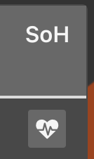{: width=100 .center}

Button available in running experiment.

{: width=200 .center}

An experiment's SoH page has at most two tabs, `Topology Graph` and `Network
Volume`, and the `Network Volume` tab is only present when the SoH [packet
capture](#packet-capture) option is enabled. Without it there is nothing to
switch to, so the tab bar is hidden entirely and the topology graph fills the
page.

A `Go to Experiment` button in the top left corner of the page returns to the
experiment. Two counters above the graph's top-left corner show how many VMs
and VLANs the current filter is showing. Above the graph's top-right corner, a
book button opens this documentation page and a flame button opens the
experiment's [Scorch](scorch.md) pipelines. The status legend is stacked in a
column to the left of the graph.

Both the overview and an experiment's SoH page read their data through the
API, so the refresh control in the header applies to them. The label beside it
says when the page's data was last loaded, and the button reloads it: the icon
is yellow while it refreshes, green after a successful load, and red after a
failure.

`GET /api/v1/soh` returns the same summary the `State of Health` tab shows,
for every experiment the caller may `get`. See [API](api.md) for the
interactive API documentation and for how to authenticate.

## State of Health Overview

The `State of Health` tab in the navbar (`/soh`) lists every experiment in one
table, so you can see which experiments need attention without opening each
one. The tab needs the `experiments` `list` permission, and it lists only the
experiments your role may `get`.

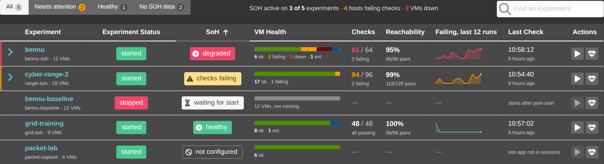{: width=800 .center}

Each row describes one experiment:

| Column | Shows |
|---|---|
| `Experiment` | the experiment's name, linking to it, with its scenario and VM count beneath |
| `Experiment Status` | `started`, `stopped`, or what phēnix is currently doing to it; a starting experiment shows a progress bar instead |
| `SoH` | the experiment's verdict (see below) |
| `VM Health` | a bar of the experiment's VMs by state, with the counts beneath |
| `Checks` | how many checks passed out of the total, and how many are failing |
| `Reachability` | the share of reachability pairs that pass, with the pair counts, or `not tested` when the `soh` app is not testing reachability |
| `Failing, last 12 runs` | a sparkline of the failing check count of each of the last 12 runs, or `after next run` until the app has run twice |
| `Last Check` | the time of day of the last run and how long ago it was, or `running now…` while a run is in progress |
| `Actions` | a button to run SoH on the experiment, and one to view its topology graph |

The `SoH` column holds one of five verdicts, the waiting one naming what it is
waiting for:

| Verdict | Meaning |
|---|---|
| `degraded` | a VM that should be up is down, at least 20% of the checked hosts have a failing check, or fewer than 90% of the reachability pairs pass |
| `checks failing` | at least one check is failing, but none of the `degraded` conditions is met |
| `waiting for start` | the `soh` app is configured, but the experiment is not running yet |
| `waiting for first run` | the experiment is running, but the app has no results yet |
| `healthy` | every check the app ran passed |
| `not configured` | the experiment's scenario does not include the `soh` app |

Rows are marked down their left edge, red for `degraded` and orange for
`checks failing`. The table is sorted by verdict, worst first, and can also be
sorted by `Experiment`, `Experiment Status`, `Checks` and `Last Check`.
Columns that need results from a run show a dash for an experiment that has
none, and the `Last Check` column says why: `soh app not in scenario`,
`starts after post-start`, `first run in progress…` or `no results yet`.

Above the table, four filters show how many experiments each one holds: `All`
(the default), `Needs attention` (the `degraded` and `checks failing`
experiments), `Healthy`, and `No SOH data` (the experiments waiting for
results or without the app). The count on `Needs attention` turns orange while
anything is in it. Beside the filters, a one-line summary gives how many
experiments SoH is active on, how many hosts are failing checks, and how many
VMs are down, and the `Find an Experiment` box narrows the table to
experiments whose name contains what you type.

The row of an experiment with problems can be expanded. The detail names how
many problems the experiment has, then lists them in a table of `Host`,
`Check`, `Target`, `Result` and `Checked` — failing checks first, newest
first, then the VMs that are down. Six problems are listed at a time, with a
`Show all N problems` link for the rest, and buttons to `Open topology graph`
or `Run SOH`. The server sends at most 50 failing checks and down VMs per
experiment; when a run has more than that, the detail says so and points at
the topology graph, which has them all.

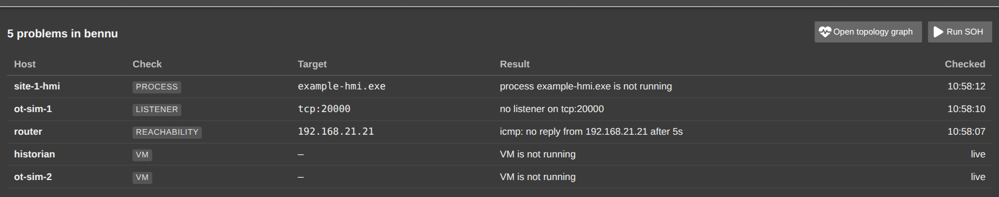{: width=800 .center}

A legend under the table names the colors of the `VM Health` bar: `Running`,
`Checks failing`, `Not running`, `Not booted`, `Delayed start` and
`External / HIL`. A VM counts as down only when it should be up: a VM marked Do
Not Boot, an external device, or a VM still waiting for its delayed start is
not a problem.

The `Run SOH` button in a row's `Actions` column triggers a new run for that
experiment and spins until the run is reported. When a run cannot be
triggered, the button is disabled and its tooltip says why (you may not
trigger runs on the experiment, the `soh` app is not in its scenario, the
experiment is not running, SoH is already running, or SoH is still running its
first checks).

The overview loads in the background along with the other tabs, so it shows
its last known data as soon as you open it. It reloads when an experiment, a
VM or an `soh` run changes, and while a run is writing its results it reloads
every 15 seconds for as long as the page is in the foreground. The refresh
control in the header reloads it at any time.

## Topology Graph

This tab displays a network graph of the running experiment.

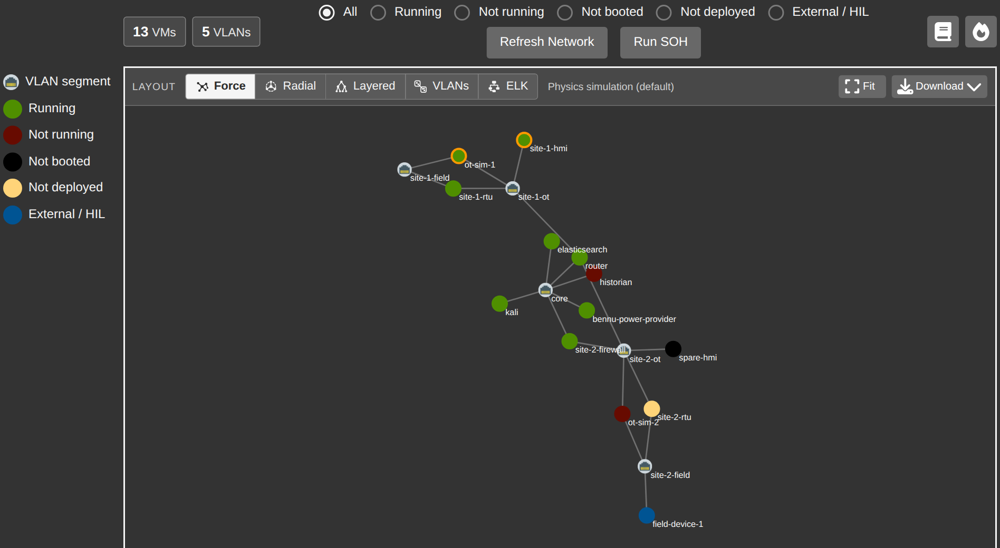{: width=800 .center}

The color of the node is based on the condition of the corresponding VM and
could be:

* `Running`
* `Not running` (part of the experiment, but currently paused)
* `Not booted` (part of the experiment, but marked as Do Not Boot)
* `Not deployed` (part of the experiment, but flushed from minimega)
* `External / HIL` (an [external node](configuration.md#external-nodes), i.e.
  hardware in the loop, not deployed by minimega)

Those five conditions, along with the icon used for a VLAN segment, make up
the legend in the column to the left of the graph. While the experiment is
stopped its VMs are drawn without a status color; external nodes keep theirs.

The graph can also be filtered to one condition. The six filters sit above the
graph, and are, in order:

* `All` (the default)
* `Running`
* `Not running`
* `Not booted`
* `Not deployed`
* `External / HIL`

The filter you pick is kept when the graph reloads, and the VM and VLAN
counters above the graph's top-left corner show how much of the experiment it
is showing. When nothing matches, the graph area reads `There are no nodes
matching your filter criteria!`; choose `All` to see every node again.

The `Refresh Network` button reloads the graph data from the server, showing a
spinner while it does. It keeps the filter you picked.

The `Run SOH` button triggers a new SoH run. It is only shown to roles that
may trigger apps for the experiment, and while a run cannot be triggered it is
replaced by a disabled button that says why: `Loading…`, `Exp Not Running`,
`SOH Is Initializing`, `SOH Is Running` or `SOH Not Initialized`. To bring in
the latest server-side SoH data without running the checks again, use the
`Refresh Network` button or the refresh control in the header.

Hovering over a node in the graph will cause it to expand to show what operating
system the node is running. An orange border around a node is indicative of the
node currently having health issues (e.g., expected files, services, or
processes are missing, or the node cannot reach other nodes on the network).
Other virtual systems will also be represented accordingly (e.g., a printer or
firewall).

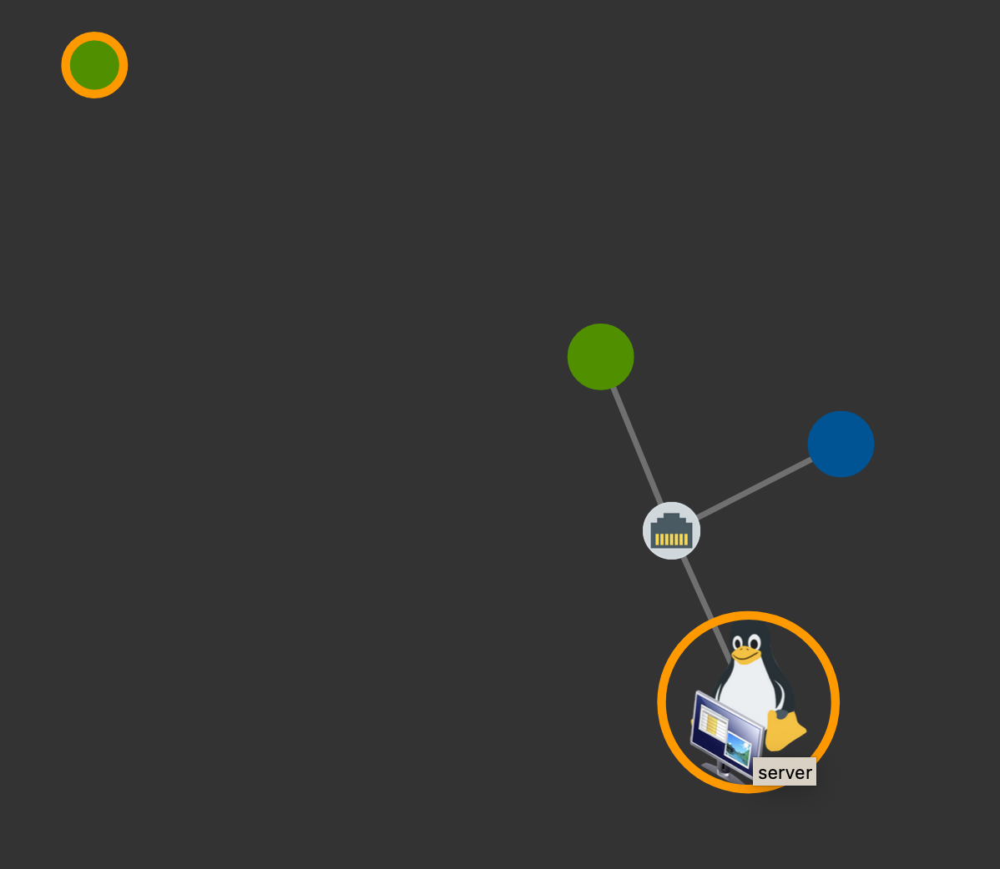{: width=800 .center}

Clicking on the node with an orange border will produce a details modal with the
current error reporting.

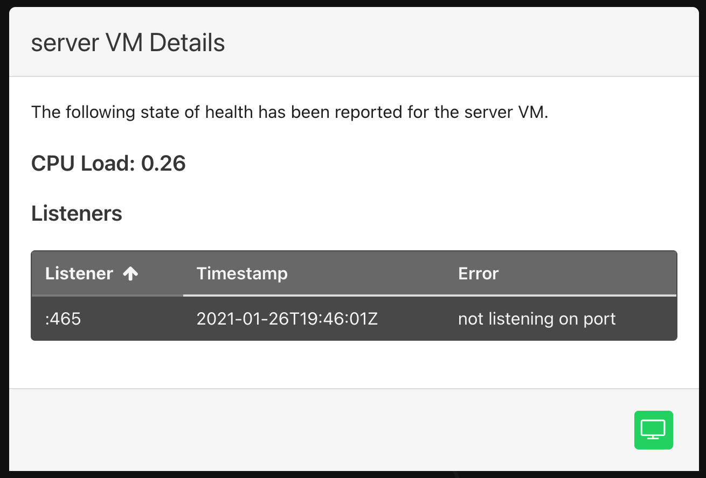{: width=800 .center}

If there are no errors to report and command and control is enabled, the details
modal will only show the current CPU load.

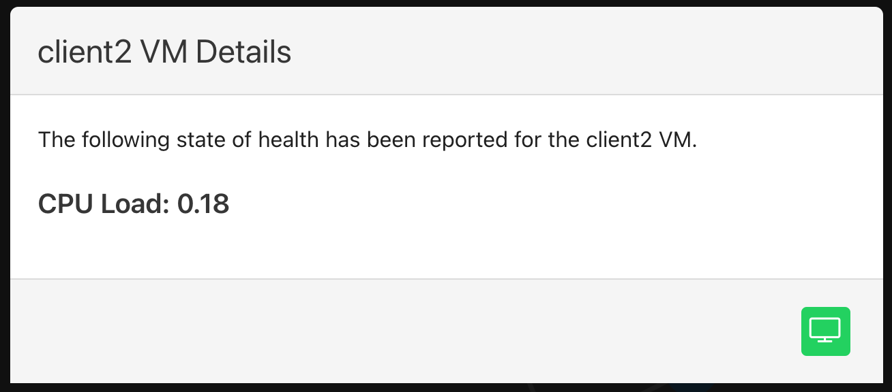{: width=800 .center}

Note the green button in the lower right corner of the modal; this will provide
access to the VNC for any running VM. When the VM is not running, access to the
VNC will be disabled. Finally, if there is no SoH information to report on a
given VM, it will be noted in the details modal. The following screenshot is an
example of no SoH information with the VNC button disabled.

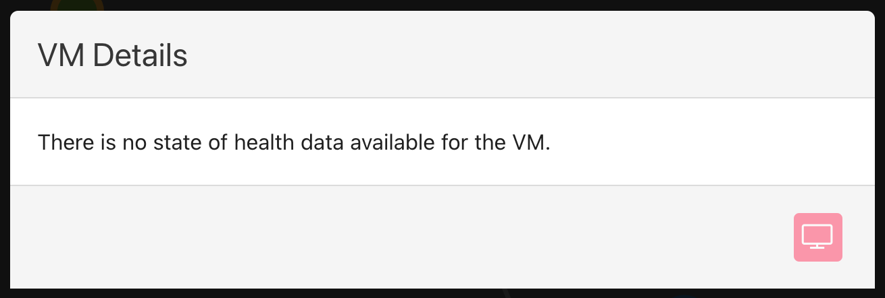{: width=800 .center}

## Graph Layouts

The `Layout` picker in the bar above the graph decides how the nodes are
arranged. The hint for the layout you have picked is shown beside the picker,
and `Computing layout…` appears while a layout is being worked out.

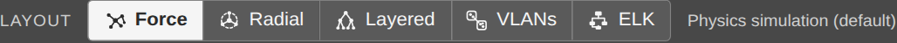{: width=800 .center}

| Layout | What it draws |
|---|---|
| `Force` | `Physics simulation (default)`: nodes repel each other and their links pull them together, so the graph settles into a shape |
| `Radial tree` | `Rings out from the core router`: the most central router or firewall in the middle, everything else in rings by hop distance |
| `Layered` | `Top-down tiers (dagre)`: the core on top, VLANs under their routers, hosts below, with the hosts that only sit on one VLAN packed into a block under it |
| `VLAN groups` | `Hosts boxed by VLAN (cola.js)`: a labeled box per VLAN around the hosts on it |
| `ELK layered` | `Top-down tiers with host blocks (ELK)`: tiers like `Layered`, arranged by the ELK engine |

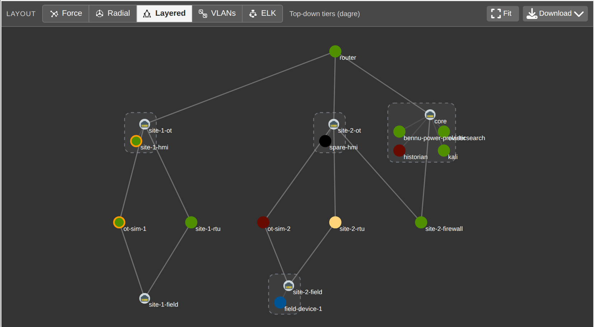{: width=800 .center}

`VLAN groups` is unavailable on graphs of more than 300 nodes, because the
library it uses slows down steeply with size — a few seconds at 500 nodes and
tens of seconds at a few thousand. The button is disabled and its tooltip says
so, naming the node count; if the remembered choice is `VLAN groups` and the
graph turns out to be that big, the graph is drawn with `Force` and a notice
explains why.

Each layout's library is downloaded the first time you pick that layout, so
the page itself stays small. Your choice is remembered in the browser and
survives filter changes, reloads and later visits. If a layout fails to load
or to compute, the graph falls back to `Force` and an error notification names
the layout that failed.

Everything else about the graph works the same in every layout: hovering a node
expands it to its OS icon, clicking it opens the details modal, nodes keep
their status colors, orange SoH error borders and any custom node style, and
VMs are recolored as they start and stop.

The `Fit` button zooms the whole graph into view. The graph is sized to the
room left in the window, so the page needs no scrolling, and it refits itself
when the window is resized — unless you have zoomed or panned it, in which
case it is left where you put it until you press `Fit` again.

## Downloading the Graph

The `Download` menu beside the `Fit` button saves the graph as drawn, in one of
three formats.

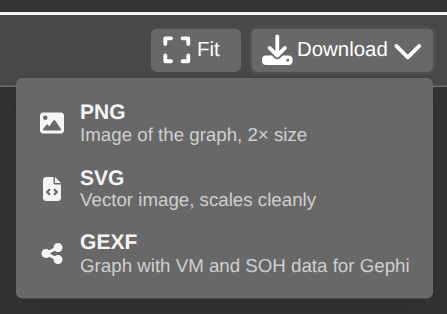{: width=800 .center}

| Format | Menu hint | What you get |
|---|---|---|
| `PNG` | `Image of the graph, 2× size` | A bitmap rendered at twice the drawing's size, reduced only if it would exceed what the browser can draw |
| `SVG` | `Vector image, scales cleanly` | A standalone vector image that can be scaled or edited |
| `GEXF` | `Graph with VM and SOH data for Gephi` | A GEXF 1.3 graph file for [Gephi](https://gephi.org/) and Gephi Lite |

The PNG and the SVG keep the zoom level the graph is at and are sized so the
whole graph fits, so nothing is cut off. Both carry a title naming the
experiment, a line giving the VM and VLAN counts, the filter, the layout and
the date, and the legend beneath the graph. The OS and VLAN icons are embedded,
so the file stands on its own.

The GEXF file carries much more than the picture. Every VM and VLAN node is
exported with typed attributes: its status and status label, OS type, minimega
VM state, cluster host, IP addresses, VLANs and interface count, CPUs, memory,
disk image and uptime, whether it is external or marked Do Not Boot, its
description, labels, notes and custom node style, the CPU load, the number of
passed and failed SoH checks in each category, a failed total, and a readable
summary of what failed. Nodes also carry the color, shape, size and the
position they have on screen, so the graph opens in Gephi looking like the one
in phēnix. Edges between a VM and a VLAN carry the interface's VLAN, index and
IP address, and, when [network volume](#network-volume) data is available, the
SoH traffic flows are added as weighted directed edges, with an extra node for
any flow endpoint that is not one of the experiment's VMs. The VM details
(host, addresses, CPUs, memory, disk) are only included when your role may list
the experiment's VMs; the file's description says when they are missing.

Downloads are named `<experiment>-soh-<layout>-<timestamp>.<ext>`, where
`<layout>` is the layout's short name (`force`, `radial`, `layered`, `groups`
or `elk`) and `<timestamp>` is the local time as `yyyymmdd-hhmmss`, for example
`foobar-soh-layered-20260214-143002.svg`.

## External Devices

Experiments that include hardware-in-the-loop or other devices not deployed by
minimega can still represent them in the topology graph by adding them to the
topology as [external nodes](configuration.md#external-nodes) (`external:
true`). External nodes show up in the graph with the `External / HIL` status
color (see the legend above) and, when hovered, still show which OS type/icon
was configured for them.

Because external nodes don't run `miniccc`, they're excluded from the
automated command-and-control-based checks described in [Command and
Control](#command-and-control) (network config, reachability, listening ports,
processes, Docker containers, CPU load). Clicking on an external node's details modal will
therefore always report no SoH information available, and the VNC button will
be disabled since phenix has no console access to it.

External nodes can still participate in reachability testing indirectly: their
IP address(es) are read from the topology configuration, so they can be used as
the `src` or `dst` in a
[`testCustomReachability`](#configuration-options) entry to verify connectivity
to/from the device from another VM in the experiment.

!!! tip "Getting a line to draw to an external device"
    The topology graph only draws a line between two nodes when they share a
    common VLAN name on one of their network interfaces (the VLAN name becomes
    the shared switch node in the graph). To connect an external node to the
    rest of the topology in the graph, give it a `network.interfaces[].vlan`
    value that matches the VLAN used by the node(s) you want it connected to.
    Interfaces on the `MGMT` or `MIRROR` VLANs are always ignored when drawing
    these lines (for both external and internal nodes), and an external node
    with no `vlan` set on its interface(s) will appear in the graph as an
    isolated node with no connecting lines.

## Network Volume

This tab displays a chord graph that shows network flows between nodes using
flows from Packetbeat fed to Elasticsearch; connections represent the volume of
traffic between nodes.

!!! tip
    This information is only available if the packet capture option is enabled
    for SoH.

This is an example chord graph of a Protonuke server with two clients; one of
which is requesting content at a delayed interval (therefore less traffic flow).

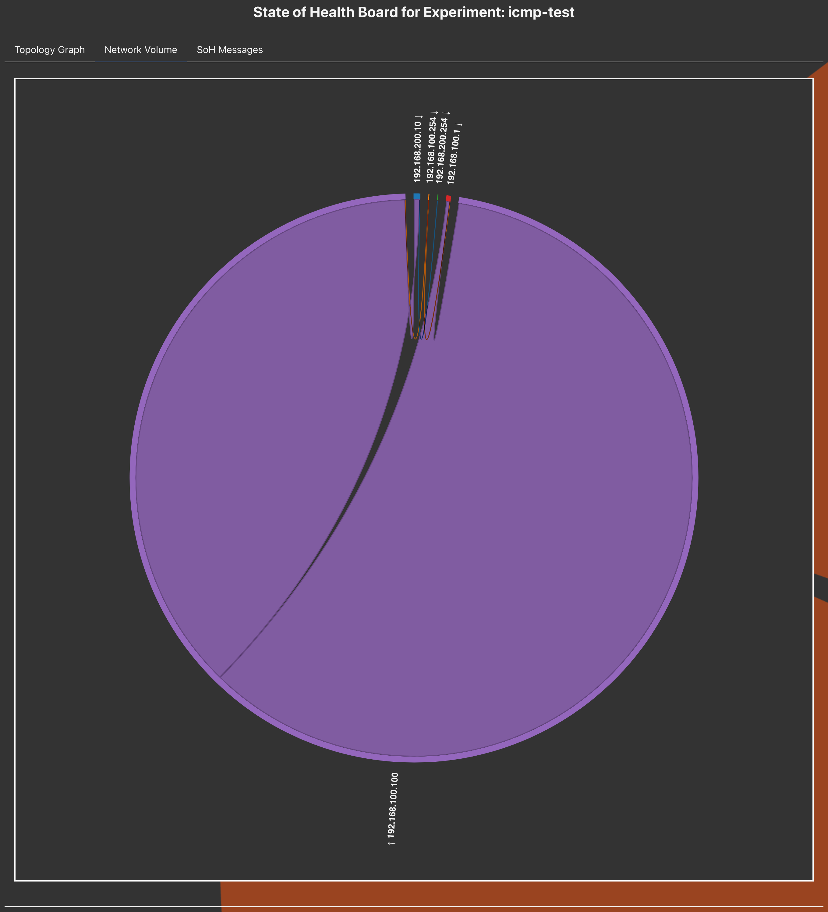{: width=800 .center}

If you hover over traffic flow, a tooltip will appear providing additional
details. (In this screenshot, the mouse is hovering over the traffic for IP
`192.168.100.1`.)

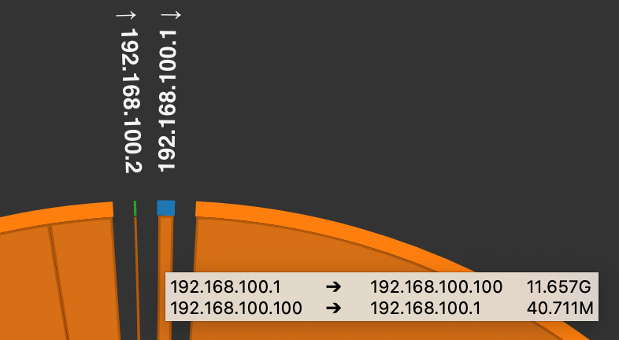{: width=800 .center}

## Configuration Options

* `disabled`: Like any (non-default) phenix app, `soh` can be disabled at startup
  by setting `disabled: true`. In this case, health checks will not be run at experiment
  startup but can be triggered manually after the experiment is running through either
  the `phenix` cli or web UI

* `appMetadataProfileKey`: since the listeners and processes one might want to
  monitor could be highly dependent on other apps that are configured for an
  experiment, it's possible to specify the `hostListeners` and `hostProcesses`
  to be monitored in the other apps themselves under the key specified here.
  The default key is `sohProfile`.

* `c2Timeout`: a [Golang duration
  string](https://golang.org/pkg/time/#ParseDuration) specifying how long to
  wait for the `miniccc` C2 client to become active in a VM before moving on and
  marking the VM as not to be monitored. The default is `5m`.

* `exitOnError`: a boolean representing whether the app should cause the entire
  experiment deployment to fail if it has any errors. The default is `false`.

* `startupDelay`: a [Golang duration
  string](https://golang.org/pkg/time/#ParseDuration) specifying how long to
  wait before initiating checks at the experiment starts. This can be useful
  when some processes are not healthy immediately at experiment start. This
  only delays SoH when it first runs at the experiment start. It will not delay
  SoH when run manually later by clicking the `Run SOH` button in the UI or
  running `phenix exp trigger running` (or the deprecated `trigger-running`
  command) from the command line. The default is no delay.

* `hostCustomTests`: If present, a map of custom tests to run on the given
  hosts.

    * `name`: name of test. Used as script name to be sent to the host.

    * `testScript`: the actual script (can be multiple lines) to be executed
      using the specified `executor`.

    * `executor`: the application to execute the `testScript` with (e.g. `bash`,
      `powershell`).

    * `testStdout`: a string to look for in STDOUT from the executed script. If
      found, the test passes. If not found, it fails.

    * `testStderr`: a string to look for in STDERR from the executed script. If
      found, the test passes. If not found, it fails.

    * `validateStdout`: a script to run that will be provided, via STDIN, the
      STDOUT from the executed script. If this validation script exits 0, the
      test passes. If it exits non-zero, the test fails. This validation script
      should always be a bash script, even if the host is a Windows host.

    * `validateStderr`: a script to run that will be provided, via STDIN, the
      STDERR from the executed script. If this validation script exits 0, the
      test passes. If it exits non-zero, the test fails. This validation script
      should always be a bash script, even if the host is a Windows host.

* `hostFiles`: a map of VMs, each specifying a list of file paths that should
  exist within the VM. Paths may target Linux or Windows VMs. Missing files are
  reported in the node's **Files** table in the SoH details modal and mark the
  node as unhealthy. The default is `nil`.

    ```yaml
    hostFiles:
      linux-server:
      - /etc/phenix/startup/1_hostname-start.sh
      windows-client:
      - 'C:\ProgramData\phenix\ready.txt'
    ```

* `hostServices`: a map of VMs, each specifying a list of service names that
  should be running within the VM. Linux VMs are checked via `systemctl`, and
  Windows VMs are checked via `Get-Service`. Services that aren't active are
  reported in the node's **Services** table in the SoH details modal and mark
  the node as unhealthy. The default is `nil`.

    ```yaml
    hostServices:
      linux-server:
      - sshd
      windows-client:
      - Spooler
    ```

* `dockerContainers`: a map of VMs, each specifying a list of Docker container
  names/IDs that should be up and healthy within the VM. For each container, if
  it has a [Docker
  healthcheck](https://docs.docker.com/reference/dockerfile/#healthcheck)
  configured, its health status (`healthy`, `unhealthy`, or `starting`) is
  used to determine node health; otherwise, the container simply being in the
  `running` state is considered healthy. Requires the `docker` CLI to be
  available on the VM (Linux or Windows) and the VM's `miniccc` user to have
  permission to run it. Results are reported in the node's **Docker
  Containers** table in the SoH details modal and mark the node as unhealthy
  if a container is missing, not running, or unhealthy. The default is `nil`.

    ```yaml
    dockerContainers:
      linux-server:
      - nginx
      - redis
    ```

* `hostListeners`: a map of VMs, each specifying a list of listening ports to
  check for within the VM. If the port can be listening on any interface, the
  form `:80` can be used. If the port should be listening on a specific
  interface, the form `192.168.1.10:80` can be used. The default is `nil`.

* `hostProcesses`: a map of VMs, each specifying a list of process names to
  check for within the VM. The default is `nil`.

* `hostsToUseUUIDForC2Active`: a list of topology hostnames to use the minimega
  VM UUID for when determining if their cc agent is active. This is useful for
  topology nodes that are configured with snapshots disabled, preventing their
  hostname from getting updated when booted. Note that this configuration option
  also supports being set to `all` (e.g., `hostsToUseUUIDForC2Active: all`) if a
  user wishes to use the minimega VM UUID for all topology nodes.

* `injectICMPAllow`: a boolean representing whether any existing firewall/router
  rulesets should have a rule added to allow ICMP between all nodes to
  facilitate reachability testing. See [Injecting ICMP
  Rules](#injecting-icmp-rules) for more details. If reachability tests are
  disabled, then this will be too, regardless of its setting here. The default
  is `false`.

* `packetCapture`: if present, a partially hidden packet capture infrastructure
  based on Elasticsearch, Kibana, and Packetbeat will be deployed for the experiment.
  See [Packet Capture](#packet-capture) for more details. The default is `nil`.

    * `elasticImage`: path to the disk image to use for the Elastic/Kibana VM
      for packet capture. An `image/PHENIX-elasticsearch` config comes bundled with
      phenix and can be used to build an image to use here. There is no default
      for this setting; if packet capture is to be deployed it must be provided.

    * `packetBeatImage`: path to the disk image to use for the Packetbeat VM for
      packet capture. An `image/PHENIX-packetbeat` config comes bundled with phenix and
      can be used to build an image to use here. There is no default for this
      setting; if packet capture is to be deployed it must be provided.

    * `elasticServer`:

        * `hostname`: the hostname to use for the Elastic/Kibana server added to
          the experiment topology. There is no default for this setting; if
          packet capture is to be deployed it must be provided.

        * `vcpus`: the number of CPUs to assign to the Elastic/Kibana server VM.
          The default is 4.

        * `memory`: the amount of memory to assign to the Elastic/Kibana server
          VM. The default is 4096.

        * `ipAddress`: the IP address to use for the Elastic/Kibana server added
          to the experiment topology. The network interface this IP address is
          used for will be added to the experiment VLAN specified by `vlan`. The
          IP address should be specified in CIDR notation. There should also be
          sufficient IP addresses after the one specified here to be assigned to
          each of the Packetbeat monitor VMs that will be deployed, as the IP
          addresses assigned to them on the VLAN specified by `vlan` will
          increment up from this IP. There is no default for this setting; if
          packet capture is to be deployed it must be provided.

        * `vlan`: the experiment VLAN to add the Elastic/Kibana and Packetbeat
          VMs to. There is no default for this setting; if packet capture is to
          be deployed it must be provided.

    * `captureHosts`: a map of VMs, each specifying a list of network interface
      names to monitor. One Packetbeat VM will be deployed for each VM interface
      specified. The default is `nil`.

* `skipInitialNetworkConfigTests`: by default, a set of tests will be run on
  each VM to ensure the VM was assigned the correct IP address and can reach its
  default gateway (if specified). Setting this to true will skip these initial
  tests, but will also disable reachability testing. The default is `false`.

* `skipHosts`: a list of VM hostnames and/or disk image names to skip health
  monitoring for. For disk image names, any host using the disk image as its
  primary image will be skipped. The default is `nil`.

* `testReachability`: reachability testing is the process of making sure each VM
  can reach other VMs within the experiment over the network. See [Network
  Reachability](#network-reachability) for more details. There are three options
  for this setting: `off`, `sample`, `full`.

    * `off`: reachability testing is disabled. This is the default.

    * `sample`: each VM in the experiment will attempt to ping a random VM in
      every other experiment VLAN.

    * `full`: each VM in the experiment will attempt to ping every other VM in
      every other experiment VLAN.

* `testCustomReachability`: if present, a list of custom reachability test
  settings.

    * `src`: hostname to conduct test from.

    * `dst`: hostname and interface name (e.g. `host-01|IF0`) to conduct test
      to.

    * `proto`: protocol to use for test. Currently the options are `tcp` and
      `udp`. If `udp` is used, the `udpPacketBase64` setting must be provided.

    * `port`: destination port to conduct test to.

    * `wait`: amount of time to wait for a response from the destination. If not
      provided, the default of `5s` is used.

    * `udpPacketBase64`: a base64-encoded packet to send when testing using
      `udp`. This is required to generate a response over UDP to determine if
      the remote server is up and reachable. The given packet must be valid
      enough to generate a response from the server.

### Network Reachability

Testing network reachability for a VM requires that the VM has minimega's
command and control (C2) layer active (ie., the `miniccc` agent is running in
the VM), has the correct IP address configured, and can ping its default route
if one is configured. If C2 is not active for a VM after the `c2Timeout`
duration has passed, then the VM will be excluded from reachability testing.
Once C2 is up for a VM, the VM is queried to confirm its IP address is
configured and its gateway is reachable for a maximum of 5 minutes. Once all the
VMs with C2 detected have their IP address configured and their gateways are
reachable, reachability tests begin.

Reachability tests are run in the post-start stage and each time the running
stage is triggered. Given this, if for some reason a VM comes up with its C2
agent active, but its network has to be configured manually, it will not be
included in reachability tests during the post-start stage. Once the VM's
network settings have been configured manually, the running stage can be
triggered and the VM will be included in reachability tests this time around.

### Injecting ICMP Rules

The `injectICMPAllow` option can be used to add rules to routers/firewalls in
the topology to prevent reachability tests from failing due to ACLs. When
enabled, all rulesets present in the experiment (either in the topology or
scenario) will have a rule prepended to the list of existing rules allowing the
ICMP protocol to/from any address. To ensure this rule is applied before any
other rule, the SoH app attempts to inject it with an ID of 1 (since Vyatta/VyOS
orders rules by ID). If a rule already exists with an ID of 1 then injecting
this rule will fail.

A check is done each time an experiment is started to see if injecting ICMP
rules is enabled, and if not, any injected rules are removed from the
experiment. This means the setting can be changed between runs of an experiment
(e.g., using `phenix config edit experiment/<name>`) and the change will be
reflected accurately when the experiment is started again.

### Packet Capture

The SoH packet capture capability leverages minimega's tap mirroring to monitor
traffic on experiment VM interfaces with Packetbeat and feed network flow data
to Elasticsearch.

When enabled, an Elasticsearch/Kibana VM is added to the experiment's topology so it
can be accessed via the phenix UI. Packetbeat VMs are deployed in minimega for
each experiment VM interface that's configured to be monitored, but are not
added to the experiment topology so they do not clutter the phenix UI.

When packet capture is enabled, the phenix UI SoH tab will include a Network
Volume tab that uses network flow data queried from Elasticsearch to populate a
chord graph in an effort to depict how much traffic is flowing between VMs.
Without packet capture there is no `Network Volume` tab, and the experiment's
SoH page shows no tab bar at all. Users/Analysts can also access Kibana using
VNC via the phenix UI to do additional analysis on the network flow data that's
being captured.

## Sample SoH Scenario Config

```yaml
spec:
  apps:
  - name: soh
    disabled: false
    metadata:
      appMetadataProfileKey: sohProfile  # metadata key to look for in other apps
      c2Timeout: 5m
      exitOnError: false
      startupDelay: 5m  # only delays at experiment start (PostStart phase)
      hostCustomTests:
        host-00:
        - name: FooBarTest
          testScript: |
            cat /etc/passwd | grep root
          validateStdout: |
            count=$(wc -l)
            [[ $count -eq 1 ]] && exit 0 || exit 1
          executor: bash
        host-01:
        - name: SuckaTest.ps1
          testScript: |
            Get-Process miniccc -ErrorAction SilentlyContinue
          testStdout: miniccc
          executor: powershell -NoProfile -ExecutionPolicy bypass -File
      hostFiles:
        host-00:
        - /etc/phenix/startup/1_hostname-start.sh
        host-01:
        - 'C:\ProgramData\phenix\ready.txt'
      hostServices:
        host-00:
        - sshd
        host-01:
        - Spooler
      dockerContainers:
        host-00:
        - nginx
        - redis
      hostListeners:
        client:
        - :502
        server:
        - :80
        - :443
      hostProcesses:
        client:
        - miniccc
        server:
        - miniccc
      hostsToUseUUIDForC2Active:
      - host-02
      injectICMPAllow: true
      packetCapture:
        elasticImage: /phenix/images/elasticsearch.qc2
        packetBeatImage: /phenix/images/packetbeat.qc2
        elasticServer:
          hostname: soh-elasticsearch-server
          vcpus: 4
          memory: 4096
          ipAddress: 172.16.200.1/16
          vlan: MGMT
        captureHosts:
          client:
          - IF0  # interface to monitor on "client" node in topology
          server:
          - IF0  # interface to monitor on "server" node in topology
      skipInitialNetworkConfigTests: false  # if true, testReachability will be off
      skipHosts:
      - kali.qc2  # can be an image name, in which case any host using image will be skipped
      - foobar-host  # can be hostname from topology
      testReachability: full  # can be off, sample, or full
      testCustomReachability:
      - src: host-00
        dst: host-01|IF0
        proto: tcp
        port: 22
        wait: 30s
      - src: host-01
        dst: host-00|IF0
        proto: tcp
        port: 22
        wait: 30s
```

## Command and Control

As mentioned earlier, SoH relies on minimega's command and control infrastructure ([miniccc](https://sandia-minimega.github.io/minimega/training/miniclass/module-28/))
to drive and collect the experiment health state data. Under the hood, the SoH
app uses C2 to execute a test on a VM (`cc exec`), wait for the command to
complete (`cc commands`), grab the STDOUT/STDERR of the command (`cc
responses`), and compare it to an expected response.

Current tests executed on Linux VMs include the following:

* `ip addr`
* `ip route`
* `ping -c 1 <ip>`
* `stat -c present -- '<path>'`
* `systemctl is-active -- '<service>'`
* `pgrep -f <process>`
* `ss -lntu state all 'sport = <port>'`
* `cat /proc/loadavg`

Corresponding tests for Windows VMs include the following:

* `ipconfig /all`
* `route print`
* `ping -n 1 <ip>`
* `powershell -NoProfile -Command "if (Test-Path -LiteralPath '<path>' -PathType Leaf) { 'present' }"`
* `powershell -NoProfile -Command "if ((Get-Service -Name '<service>' -ErrorAction SilentlyContinue).Status -eq 'Running') { 'active' }"`
* `powershell -command "Get-Process <process> -ErrorAction SilentlyContinue"`
* `powershell -command "netstat -an | select-string -pattern 'listening' | select-string -pattern '<port>'"`
* `powershell -command "Get-WmiObject Win32_Processor | Measure-Object -Property LoadPercentage -Average | Select Average"`

### SoH Run History

Besides the per-host results of its latest run, the `soh` app records each
finished run in its app status: `lastRun`, the time the run finished;
`lastRunDuration`, how long it took in seconds; and `history`, a summary of the
last 20 runs. Each history entry holds the run's `time` and `duration`, the
`total` number of checks it ran and how many were `failing`, `hostsFailing`
(hosts with at least one failing check) and `hostsDown` (hosts whose network
configuration could not be confirmed). As new runs finish the oldest entries
are dropped, so the history never grows past 20 runs.

This is where the [State of Health Overview](#state-of-health-overview) gets
its `Last Check` column and its `Failing, last 12 runs` sparkline, which is why
an experiment needs two runs before the sparkline can be drawn.
