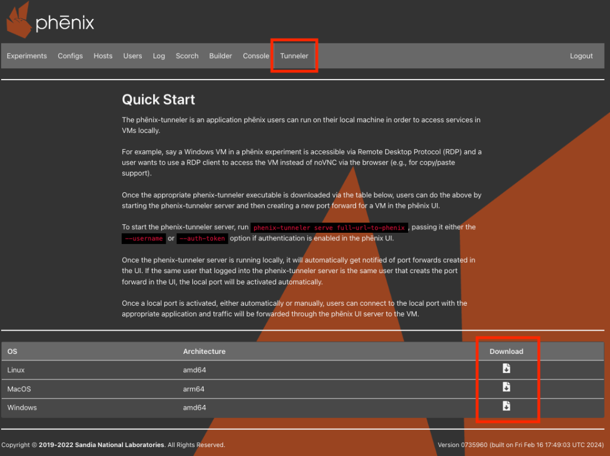
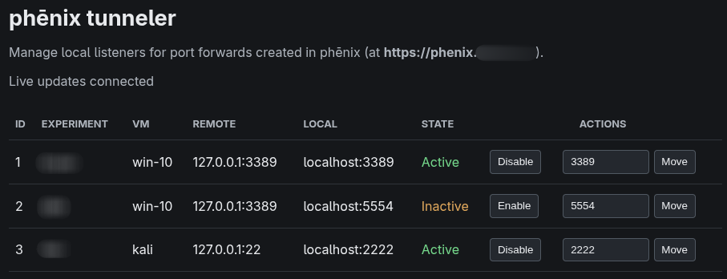

# Tunneler

The `phenix-tunneler` is a small application that runs on a user's local
machine to forward TCP traffic from VMs in a running experiment down to
local ports. This lets a user interact with a VM directly using command line tools, instead of having to go through noVNC in a browser. A common
example is using a real RDP client to connect to a Windows VM instead of
interacting with it through noVNC (which enables things like copy/paste
support that noVNC does not).

Traffic is proxied through the phēnix UI server over a WebSocket
connection, so the local machine only needs network access to the phēnix
UI.

## Downloading the Tunneler

Click on the `Tunneler` tab in the banner near the top of the phēnix UI.



This page lists the `phenix-tunneler` binaries built for the phēnix
instance's version, along with a download link for each supported OS and
architecture:

| OS      | Architecture |
| ------- | ------------ |
| Linux   | amd64        |
| MacOS   | arm64        |
| MacOS   | amd64        |
| Windows | amd64        |

Download the binary that matches your local machine and make it
executable (on Linux/MacOS, `chmod +x phenix-tunneler-<os>-<arch>`).

!!! note
    The `Tunneler` tab, and its downloads, are only available if the
    phēnix server has been configured to serve tunneler binaries (a
    `downloads/tunneler` directory must exist alongside the phēnix
    binary on the server). This will be the case if you have a typical deployment using the Docker image.

## Starting the Tunneler Server

Once downloaded, start the tunneler's local proxy server with the `serve`
subcommand, passing it the full URL to the phēnix UI:

```shell
phenix-tunneler serve https://phenix.example.com
```

If authentication is enabled in the phēnix UI, credentials must also be
provided via one of the following flags:

* `--username` (`-u`) -- the phēnix username to log in with. The tunneler
  will prompt for the corresponding password (input is hidden) and use it
  to log in to phēnix on your behalf.
* `--auth-token` (`-t`) -- an existing phēnix API/JWT auth token, used in
  place of a username/password login. The username is parsed directly out
  of the token, so a separate `--username` isn't needed.
* `--use-cookie` (`-c`) -- optional, only used alongside `--auth-token`.
  Sets the name of a cookie to send the auth token in, in addition to the
  `X-Phenix-Auth-Token` header, for phēnix deployments that expect the
  token as a cookie.

```shell
# log in interactively with a username/password
phenix-tunneler serve https://phenix.example.com --username jdoe

# use an existing auth token instead of logging in
phenix-tunneler serve https://phenix.example.com --auth-token <token>
```

The `serve` command keeps running in the foreground and needs to stay
running for as long as forwarded ports should remain reachable locally.
While it runs, it:

* Connects to phēnix over a WebSocket and listens for port forward
  create/delete events happening across the phēnix UI.
* Fetches the list of port forwards that already exist for the logged-in
  user and creates local listeners for each of them.
* Automatically creates a new local listener any time the logged-in user
  creates a new port forward for a VM in the phēnix UI (see below).
* Exposes a local Unix domain socket (at
  `$TMPDIR/phenix/tunneler.sock`) that the other `phenix-tunneler`
  subcommands (`list`, `activate`, `deactivate`, `move`) use to manage
  listeners while `serve` is running.

## Creating a Port Forward for a VM

With `phenix-tunneler serve` running locally, create a port forward for a
VM from the phēnix UI:

1. Open a running experiment and click on a VM tile to open its VM
   information modal.
2. Click the `create port forward` button (the arrow icon). This button
   requires the VM to be running with an active cc agent.
3. Fill out the `Create New Port Forward` dialog:
    * `Source Port` -- the port to listen on locally.
    * `Destination Host` -- the host, reachable from the phēnix server,
      to forward traffic to (typically the VM's own IP address).
    * `Destination Port` -- the port on the destination host to forward
      traffic to (e.g., `3389` for RDP).
4. Click `Create`.

If the port forward was created by the same user that's logged into the
running `phenix-tunneler serve` process, the local listener is activated
automatically -- no further action is needed. Port forwards created by
other users show up too, but must be activated manually (see
[`activate`](#activate-id) below) before they can be used locally.

Once a local port is listening, connect to it with whatever application
is appropriate (an RDP client, a database client, `ssh`, etc.) and
traffic will be forwarded through the phēnix UI server to the VM.

Existing port forwards for a VM are listed in the same VM information
modal, and can be removed by clicking the trash icon next to a forward.

## Managing Listeners from the Local Web App

The `serve`` command provides an option for also serving up a local web
application for listing and managing listeners. It is disabled by default, and
can be enabled with the ``--web-listen 127.0.0.1:8080` flag (the address or
port can be changed if needed).



## Managing Listeners from the Command Line

While `phenix-tunneler serve` is running, use the following subcommands
(in another terminal) to inspect and manage local listeners.

### `list`

Show a table of all known port forwards, including their local port and
whether or not they're currently listening (activated) locally.

```shell
phenix-tunneler list
```

### `activate <id>`

Start listening locally on the local port assigned to the given listener
ID. Used to manually activate a port forward that wasn't created by the
logged-in user (and therefore wasn't activated automatically).

```shell
phenix-tunneler activate <id>
```

### `deactivate <id>`

Stop listening locally for the given listener ID, without deleting the
port forward itself.

```shell
phenix-tunneler deactivate <id>
```

### `move <id> <port>`

Move an existing listener to a different local port.

```shell
phenix-tunneler move <id> <port>
```

Listener IDs used by `activate`, `deactivate`, and `move` can be found
in the output of `phenix-tunneler list`.
