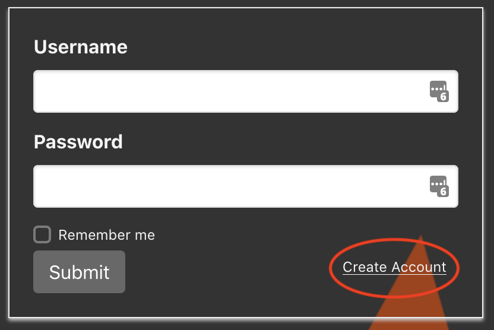
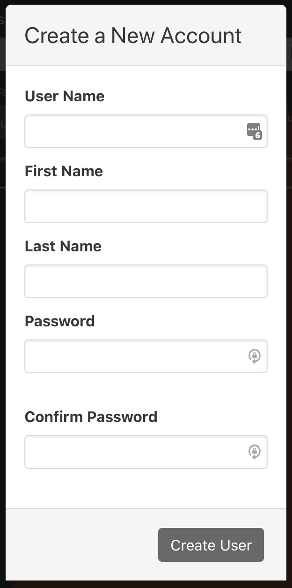
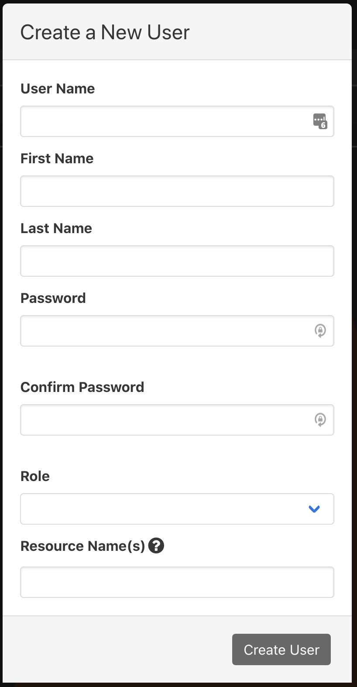

# User Authn/Authz in phenix

`phenix` provides three separate modes of user authentication (authn) and
authorization (authz).

* disabled
* enabled
* proxy

## `disabled` Mode

When in `disabled` mode, no user authentication or authorization occurs. Users
do not have to authenticate, and all actions are allowed.

To use `disabled` mode, the UI should be built with `VUE_APP_AUTH=disabled` (if
Docker is being used to build the UI, use Docker build arg
`PHENIX_WEB_AUTH=disabled`) and the UI server should be started without the
`-k/--jwt-signing-key` option set.

## `enabled` Mode

When in `enabled` mode, user authentication and authorization occurs within
phenix directly. Users have to authenticate to the phenix UI, and certain
actions are prohibited based on the role assigned to the user.

To use `enabled` mode, the UI should be built with `VUE_APP_AUTH=enabled` (if
Docker is being used to build the UI, use Docker build arg
`PHENIX_WEB_AUTH=enabled`) and the UI server should be started with the
`-k/--jwt-signing-key` (and optionally the `--jwt-lifetime`) option set.

## `proxy` Mode

When in `proxy` mode, user authentication is expected to occur in a reverse
proxy that sits in front of phenix but user authorization still occurs within
phenix directly. Users authenticate to the proxy, and certain actions are
prohibited based on the role assigned to the user.

To use `proxy` mode, the UI should be built with `VUE_APP_AUTH=proxy` (if Docker
is being used to build the UI, use Docker build arg `PHENIX_WEB_AUTH=proxy`) and
the UI server should be started with the `-k/--jwt-signing-key` and
`--proxy-auth-header` (and optionally the `--jwt-lifetime`) options set.

In addition, the reverse proxy should add a header to requests being proxied
that contains the username of the authenticated user, with the name of the
header matching what `--proxy-auth-header` is set to (for example,
`--proxy-auth-header=X-phenix-user`).

If a user is able to authenticate to the proxy but is not yet a user in phenix,
they will be added as a phenix user automatically and assigned the `Disabled`
role that will deny all actions until an admin user can assign them a different
role.

## Create a new user

There are three primary ways to create new users.

1. Choose the `Create Account` link off the login page and complete all fields
   in the `Create a New Account` dialogue. This will initiate a message to an
   administrator's account who can then activate the account, setting the
   role(s) and resource name(s).

   {: width=400 .center}

   {: width=400 .center}

2. From the `Users` tab, click the `+` button to create a new user. Here the
   administrator will add the [role(s) and resource
   name(s)](#user-administration).

   {: width=400 .center}

3. Create a YAML or JSON file at `/etc/phenix/users.[yml|json]` with the
   following structure. When the `phenix` UI starts, it looks for this file and
   adds any users present in the file that are not already present in `phenix`.
   For users in the file that already exist, `phenix` ensures the user role
   matches what's in the file and updates it as necessary. This file is also
   automatically watched, so any users added to the file while `phenix` is
   running will automatically be added to `phenix`.

```yaml
ui:
  users:
    - <username>:<password>:<role name>
    - ...
```

## Login

The login page is self-descriptive. Using the `Remember me` checkbox will set a
token to local storage so that you can remove the requirement to enter a
`Username` and `Password` each time the page or site is reloaded.

If an administrator starts the UI server with the following command,
authentication is enabled:

```shell
phenix ui -k <some_string>
```

Without the `-k` (or `--jwt-signing-key`), authentication is disabled.

## Generating User Authentication Tokens

From the `Users` tab, click the key icon next to the given user's name. A dialog
box will pop up where you can enter in a description for the token to be created
and an expiration date. This expiration date should be entered in Golang time
duration. For example, `4320h` is valid and represents 4320 hours or about 6
months. After clicking `Create Token` a token should appear with the expiration
date.

This token can be used to authenticate when using the Phenix API. Specifically, you would include the following as a header in HTTP requests.

```http
X-phenix-auth-token: ******
```

## User Administration

### Updating Users

An administrator is able to click on the username on the table in the Users tab
to update a user. They can update `First Name` or `Last Name`, `Role`,
`Experiment Names`, and `Resource Name(s)`.

### Roles

`Global Admin` is the administrator level account and has access to all
capabilities, to include user management. Global Admins also have access to all
resources. The following table provides a high-level overview of all the
available roles and their access rights.

| Role              | Limits                                                                                                                   | List  |  Get  | Create | Update | Patch | Delete |
|-------------------|:-------------------------------------------------------------------------------------------------------------------------|:-----:|:-----:|:------:|:------:|:-----:|:------:|
| Global Admin      | Can see and control absolutely anything/everything.                                                                      | E V U | E V U | E V U  | E V U  | E V U | E V U  |
| Global Viewer     | Can see absolutely anything/everything, but cannot make any changes.                                                     | E V U | E V U |        |        |       |        |
| Experiment Admin  | Can see and control anything/everything for assigned experiments, including VMs, but cannot create new experiments.      | E V   | E V   |   V    | E V    |   V   |   V    |
| Experiment User   | Can see assigned experiments, and can control VMs within assigned experiments, but cannot modify experiments themselves. | E V   | E V   |        |        |   V   |        |
| Experiment Viewer | Can see assigned experiments and VMs within assigned experiments, but cannot modify or control experiments or VMs.       | E V   | E V   |        |        |       |        |
| VM Admin          | Can see assigned experiments, and has full administrative control over VMs in assigned experiments.                       | E V   | E V   |   V    |   V    |   V   |   V    |
| VM Viewer         | Can only see VM screenshots and access VM VNC, nothing else.                                                             |   V   |       |        |        |       |        |

Key: E - experiment resource, V - VM resource, U - user resource

### Resources

#### Resource: `experiments`

|      |      |
|------|------|
| Verb | list |
| Desc | get a list of all experiments |
| Exp. Scoped | yes (list is filtered to only include experiments in scope) |
| Res. Scoped | no |

|
|------|------
| Verb | get
| Desc | get a specific experiment
| Exp. Scoped | yes
| Res. Scoped | no

|
|------|------
| Verb | create
| Desc | create a new experiment
| Exp. Scoped | no
| Res. Scoped | no

|
|------|------
| Verb | delete
| Desc | delete a specific experiment
| Exp. Scoped | yes
| Res. Scoped | no

#### Resource: `experiments/start`

|
|------|------
| Verb | update
| Desc | start an experiment
| Exp. Scoped | yes
| Res. Scoped | no

#### Resource: `experiments/stop`

|
|------|------
| Verb | update
| Desc | stop an experiment
| Exp. Scoped | yes
| Res. Scoped | no

#### Resource: `experiments/schedule`

|
|------|------
| Verb | get
| Desc | get current schedule for an experiment
| Exp. Scoped | yes
| Res. Scoped | no

|
|------|------
| Verb | create
| Desc | schedule an experiment using schedule algorithm
| Exp. Scoped | yes
| Res. Scoped | no

#### Resource: `experiments/trigger`

|
|------|------
| Verb | create
| Desc | trigger the running stage of an experiment
| Exp. Scoped | yes
| Res. Scoped | no

#### Resource: `experiments/captures`

|
|------|------
| Verb | list
| Desc | get list of packet captures for an experiment
| Exp. Scoped | yes (list is filtered to only include experiments in scope)
| Res. Scoped | yes (list is filtered to only include VMs in scope)

#### Resource: `experiments/files`

|
|------|------
| Verb | list
| Desc | get list of files for an experiment
| Exp. Scoped | yes (list is filtered to only include experiments in scope)
| Res. Scoped | no

|
|------|------
| Verb | get
| Desc | get specific experiment file
| Exp. Scoped | yes
| Res. Scoped | no

#### Resource: `vms`

|
|------|------
| Verb | list
| Desc | get list of VMs for an experiment
| Exp. Scoped | yes (list is filtered to only include experiments in scope)
| Res. Scoped | yes (list is filtered to only include VMs in scope)

|
|------|------
| Verb | get
| Desc | get a specific experiment VM
| Exp. Scoped | yes
| Res. Scoped | yes

|
|------|------
| Verb | patch
| Desc | update a specific experiment VM
| Exp. Scoped | yes
| Res. Scoped | yes

|
|------|------
| Verb | delete
| Desc | delete a specific experiment VM
| Exp. Scoped | yes
| Res. Scoped | yes

#### Resource: `vms/start`

|
|------|------
| Verb | update
| Desc | start a specific experiment VM
| Exp. Scoped | yes
| Res. Scoped | yes

#### Resource: `vms/stop`

|
|------|------
| Verb | update
| Desc | stop a specific experiment VM
| Exp. Scoped | yes
| Res. Scoped | yes

#### Resource: `vms/redeploy`

|
|------|------
| Verb | update
| Desc | redeploy a specific experiment VM
| Exp. Scoped | yes
| Res. Scoped | yes

#### Resource: `vms/screenshot`

|
|------|------
| Verb | get
| Desc | get screenshot for a specific experiment VM
| Exp. Scoped | yes
| Res. Scoped | yes

#### Resource: `vms/vnc`

|
|------|------
| Verb | get
| Desc | get VNC address for a specific experiment VM
| Exp. Scoped | yes
| Res. Scoped | yes

#### Resource: `vms/captures`

|
|------|------
| Verb | list
| Desc | get list of packet captures for a specific experiment VM
| Exp. Scoped | yes
| Res. Scoped | yes

|
|------|------
| Verb | create
| Desc | start a packet capture on a specific experiment VM
| Exp. Scoped | yes
| Res. Scoped | yes

|
|------|------
| Verb | delete
| Desc | stop all packet captures on a specific experiment VM
| Exp. Scoped | yes
| Res. Scoped | yes

#### Resource: `vms/snapshots`

|
|------|------
| Verb | list
| Desc | get list of snapshots for a specific experiment VM
| Exp. Scoped | yes
| Res. Scoped | yes

|
|------|------
| Verb | create
| Desc | create a snapshot of a specific experiment VM
| Exp. Scoped | yes
| Res. Scoped | yes

|
|------|------
| Verb | update
| Desc | restore a specific experiment VM to a previous snapshot
| Exp. Scoped | yes
| Res. Scoped | yes

#### Resource: `vms/commit`

|
|------|------
| Verb | create
| Desc | create a new backing image from a specific experiment VM
| Exp. Scoped | yes
| Res. Scoped | yes

#### Resource: `applications`

|
|------|------
| Verb | list
| Desc | get list of user applications
| Exp. Scoped | no
| Res. Scoped | yes (list is filtered to only include applications in scope)

#### Resource: `topologies`

|
|------|------
| Verb | list
| Desc | get list of available topologies
| Exp. Scoped | no
| Res. Scoped | yes (list is filtered to only include topologies in scope)

#### Resource: `disks`

|
|------|------
| Verb | list
| Desc | get list of available backing images
| Exp. Scoped | no
| Res. Scoped | yes (list is filtered to only include backing images in scope)

#### Resource: `hosts`

|
|------|------
| Verb | list
| Desc | get list of minimega cluster hosts
| Exp. Scoped | no
| Res. Scoped | yes (list is filtered to only include hosts in scope)

#### Resource: `users`

|
|------|------
| Verb | list
| Desc | get list of users
| Exp. Scoped | no
| Res. Scoped | yes (list is filtered to only include users in scope)

|
|------|------
| Verb | get
| Desc | get a specific user
| Exp. Scoped | no
| Res. Scoped | yes

|
|------|------
| Verb | create
| Desc | create a new user
| Exp. Scoped | no
| Res. Scoped | no

|
|------|------
| Verb | patch
| Desc | update an existing user
| Exp. Scoped | no
| Res. Scoped | yes

|
|------|------
| Verb | delete
| Desc | delete an existing user
| Exp. Scoped | no
| Res. Scoped | yes

#### Resource: `users/roles`

|
|------|------
| Verb | patch
| Desc | update user role assignments
| Exp. Scoped | no
| Res. Scoped | yes

#### Resource: `configs`

|
|------|------
| Verb | list, get, create, update, delete
| Desc | manage store configurations (topologies, scenarios, etc.)
| Exp. Scoped | no
| Res. Scoped | yes

#### Resource: `settings`

|
|------|------
| Verb | update
| Desc | update phēnix system settings
| Exp. Scoped | no
| Res. Scoped | no

#### Resource: `vms/mount`

|
|------|------
| Verb | list, get, post, patch, delete
| Desc | manage VM filesystem mounts on headnode
| Exp. Scoped | yes
| Res. Scoped | yes

#### Resource: `vms/forwards`

|
|------|------
| Verb | list, get, create, delete
| Desc | manage port forwarding rules for experiment VMs
| Exp. Scoped | yes
| Res. Scoped | yes

#### Resource: `vms/cdrom`

|
|------|------
| Verb | update, delete
| Desc | mount or eject CD-ROM ISO images on experiment VMs
| Exp. Scoped | yes
| Res. Scoped | yes

#### Resource: `vms/memorySnapshot`

|
|------|------
| Verb | create
| Desc | create ELF memory dumps of experiment VMs
| Exp. Scoped | yes
| Res. Scoped | yes

### Built-In Roles

The following default roles are defined in phēnix as YAML resource specifications:

#### Global Admin (`global-admin`)

```yaml
apiVersion: phenix.sandia.gov/v1
kind: Role
metadata:
  name: global-admin
spec:
  roleName: Global Admin
  policies:
  - resources:
    - "*"
    - "*/*"
    resourceNames:
    - "*"
    - "*/*"
    verbs:
    - "*"
```

#### Global Viewer (`global-viewer`)

```yaml
apiVersion: phenix.sandia.gov/v1
kind: Role
metadata:
  name: global-viewer
spec:
  roleName: Global Viewer
  policies:
  - resources:
    - "*"
    - "*/*"
    resourceNames:
    - "*"
    - "*/*"
    verbs:
    - list
    - get
  - resources:
    - "vms/mount"
    resourceNames:
    - "*"
    - "*/*"
    verbs:
    - post
    - delete
```

#### Experiment Admin (`experiment-admin`)

```yaml
apiVersion: phenix.sandia.gov/v1
kind: Role
metadata:
  name: experiment-admin
spec:
  roleName: Experiment Admin
  policies:
  - resources:
    - experiments
    - "experiments/*"
    verbs:
    - list
    - get
    - update
  - resources:
    - vms
    - "vms/*"
    verbs:
    - list
    - get
    - create
    - update
    - patch
    - delete
  - resources:
    - disks
    resourceNames:
    - "*"
    verbs:
    - list
  - resources:
    - "experiments/files"
    verbs:
    - create
  - resources:
    - hosts
    resourceNames:
    - "*"
    verbs:
    - list
```

#### Experiment User (`experiment-user`)

```yaml
apiVersion: phenix.sandia.gov/v1
kind: Role
metadata:
  name: experiment-user
spec:
  roleName: Experiment User
  policies:
  - resources:
    - experiments
    - "experiments/*"
    verbs:
    - list
    - get
  - resources:
    - vms
    - "vms/*"
    verbs:
    - list
    - get
    - patch
  - resources:
    - "vms/redeploy"
    verbs:
    - update
  - resources:
    - "vms/captures"
    verbs:
    - create
    - delete
  - resources:
    - "vms/snapshots"
    verbs:
    - list
    - create
    - update
  - resources:
    - "experiments/files"
    verbs:
    - create
  - resources:
    - hosts
    resourceNames:
    - "*"
    verbs:
    - list
```

#### Experiment Viewer (`experiment-viewer`)

```yaml
apiVersion: phenix.sandia.gov/v1
kind: Role
metadata:
  name: experiment-viewer
spec:
  roleName: Experiment Viewer
  policies:
  - resources:
    - experiments
    - "experiments/*"
    - vms
    - "vms/*"
    verbs:
    - list
    - get
  - resources:
    - hosts
    resourceNames:
    - "*"
    verbs:
    - list
  - resources:
    - "vms/mount"
    verbs:
    - post
    - delete
```

#### VM Admin (`vm-admin`)

```yaml
apiVersion: phenix.sandia.gov/v1
kind: Role
metadata:
  name: vm-admin
spec:
  roleName: VM Admin
  policies:
  - resources:
    - experiments
    - "experiments/*"
    verbs:
    - list
    - get
  - resources:
    - vms
    - "vms/*"
    verbs:
    - "*"
```

#### VM Viewer (`vm-viewer`)

```yaml
apiVersion: phenix.sandia.gov/v1
kind: Role
metadata:
  name: vm-viewer
spec:
  roleName: VM Viewer
  policies:
  - resources:
    - vms
    verbs:
    - list
  - resources:
    - "vms/screenshot"
    - "vms/vnc"
    verbs:
    - get
  - resources:
    - "vms/mount"
    verbs:
    - post
    - list
    - delete
    - get
```
