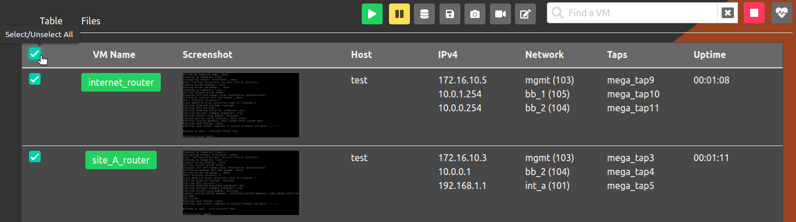
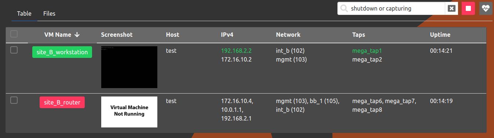
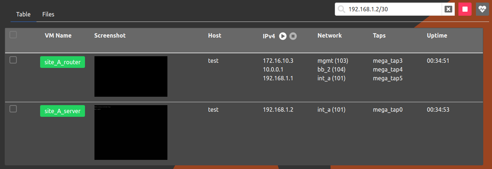
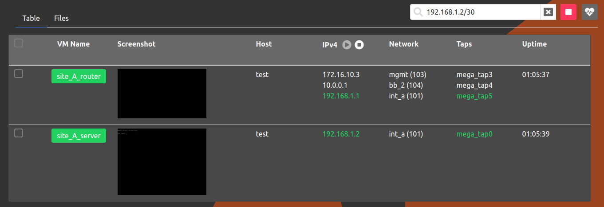
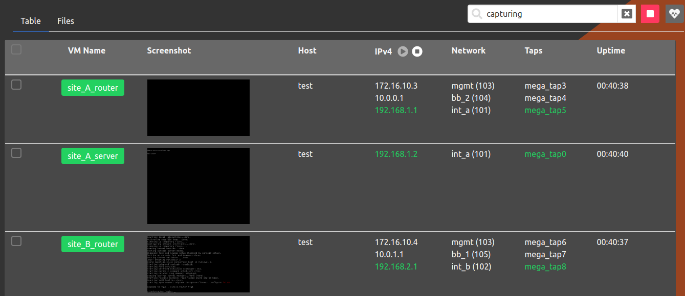

# VM Multi Action

## Selecting VMs

### From the Web-UI

The experiment must be started; click on the experiment name to enter the
Running Experiment component. Within that component, click on the checkbox
adjacent to the `VM Name` column to select all the VMs. Alternatively,
the checkbox adjacent to a specific VM name can be used to select the
VM. Once one or more VMs are selected, a toolbar will appear to the
left of the search text box. The buttons on the toolbar are essentially
the same as described in [VMs](vms.md).



### From the Command Line Binary

Several `phenix vm` commands support selecting target VMs by label with `-l` / `--label`, or all VMs using `all`.
When using labels, a VM name argument is not required.

Supported commands:

* `phenix vm info`
* `phenix vm pause`
* `phenix vm resume`
* `phenix vm restart`
* `phenix vm reset-disk`
* `phenix vm redeploy`
* `phenix vm shutdown`
* `phenix vm kill`

Behavior:

* Multiple labels are supported and use OR semantics (a VM is selected if any label matches).
* Labels support glob patterns (for example, `ot-*` or `*-server`).
* The special label `all` selects every VM in the experiment.
* Labels can be provided by repeating `-l` and/or as a comma-separated value.

Examples:

```shell
# Show VM info for all VMs with a label matching "ot-*"
phenix vm info <experiment name> --label ot-*

# Restart VMs that match either label
phenix vm restart <experiment name> -l control -l historian

# Pause VMs using comma-separated labels
phenix vm pause <experiment name> -l control,historian

# Shutdown all VMs in the experiment
phenix vm shutdown <experiment name> --label all
```

## Searching for VMs

The search text box can be used to filter the list of VMs to
only apply actions to the filtered list.

### From the Web-UI

The experiment must be started; click on the experiment name to enter the
Running Experiment component. Within that component, use the search
textbox to find VMs by:

* state - The keywords `running,shutdown,paused,capturing` can be used
  to find VMs in a specific state. Also, the `not` keyword can be used
  to negate search term(s) (i.e. `not running`)

* ipv4 address - VMs in a specific subnet can be found by entering the
  subnet (i.e `192.168.2.0/30`)

* other fields (i.e. name, taps, tags) - All other fields will be
  searched for a keyword contained within the field

* combine search terms - Search terms can be combined by using `or and`
  keywords. Parenthesis can also be used to group search terms.

* escape keywords - To find keywords that appear in a VM name use double
  quotes. For example, to find a VM named `free_running`, type `"running"`.

#### Example

Multiple search terms



### From the Command Line Binary

While the interactive search bar is specific to the Web-UI, you can view and list all VMs in an experiment (or filter for specific VMs by name or label) using the `phenix vm info` command:

```bash
# List details for all VMs in an experiment
phenix vm info <experiment name>

# Display details for a specific VM in an experiment
phenix vm info <experiment name> <vm name>

# Filter VMs by label
phenix vm info <experiment name> --label <label>
```

## Starting/Stopping Packet Captures

### From the Web-UI

When a valid ipv4 subnet is entered, the `play` button adjacent to the IPv4 label will be enabled.
To start capturing, press the `play` button.



Once there are valid captures, the `stop` button adjacent to the play button will be enabled.
To stop all the captures, press the `stop` button.



To stop all packet captures for all subnets, the term `capturing` can be entered in the search bar
to find all the VMs with active packet captures.



### From the Command Line Binary

To start packet captures on running VMs for a specific subnet, use the following command.

```shell
phenix vm capture start-subnet <experiment name> <subnet>
```

To stop all packet captures for a specific subnet, use the following command.

```shell
phenix vm capture stop-subnet <experiment name> <subnet>
```

To stop all packet captures for an experiment, use the following command.

```shell
phenix vm capture stop-all <experiment name>
```

## Stopped Experiment Component

Similar to the Running Experiment component, multiple VMs can be selected
for the Stopped Experiment component. In addition, VMs in the Stopped
Experiment component can be searched by:

* state - The keyword `dnb` can be used to find all VMs with the
  `do not boot` flag set to `true`. Also, the `not` keyword can be used
  to negate search term(s) (i.e. `not dnb`)

* ipv4 address - VMs in a specific subnet can be found by entering the
  subnet (i.e `192.168.2.0/30`)

* other fields (i.e. VM, host, disk)

* combine search terms - Search terms can be combined by using `or and`
  keywords. Parenthesis can also be used to group search terms.

* escape keywords - To find keywords that appear in a VM name use double
  quotes. For example, to find a VM named `dnb_me`, type `"dnb"`.
