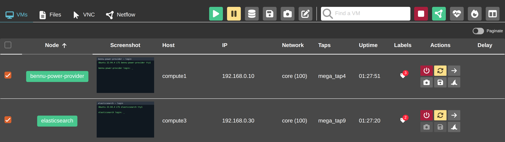
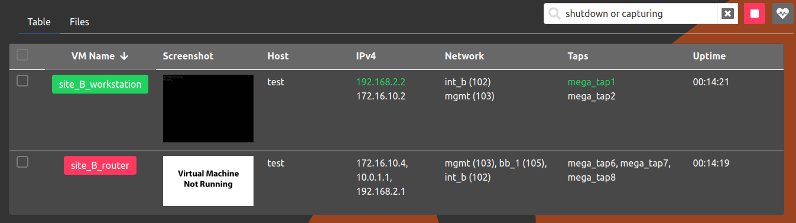
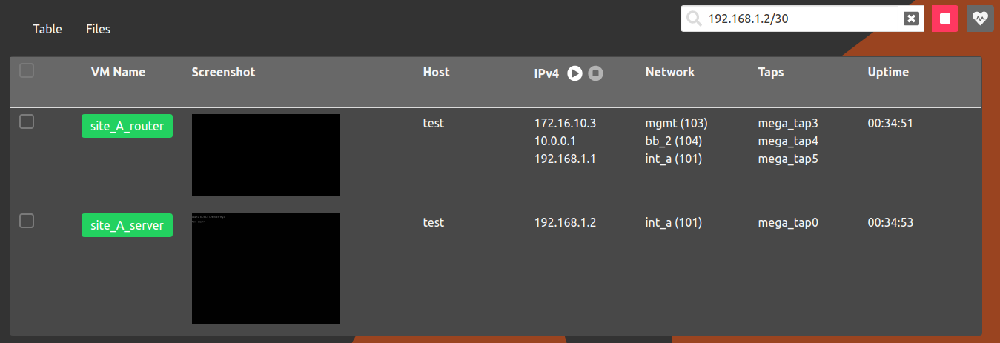
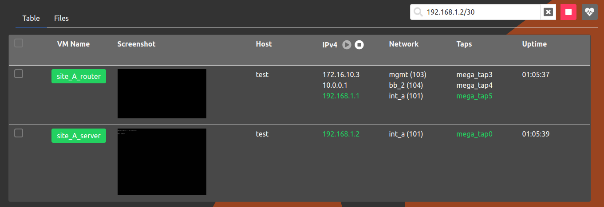
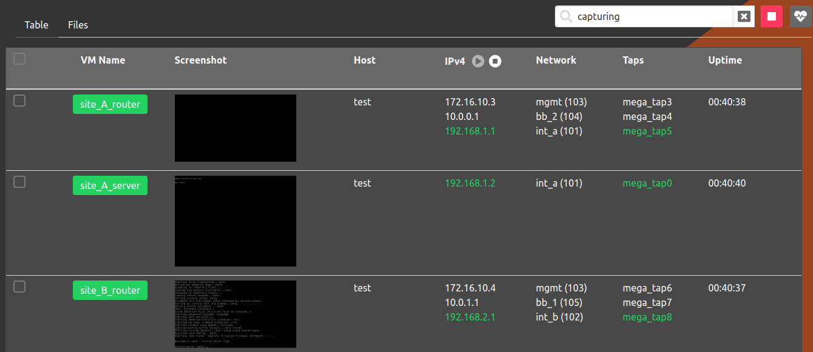

# VM Multi Action

## Selecting VMs

### From the Web-UI

The experiment must be started; click on the experiment name to enter the
Running Experiment component. Within that component, click on the checkbox
in the header of the first column, to the left of the `Node` column, to
select all the VMs; its tooltip reads `Select/Unselect All`. Alternatively,
the checkbox adjacent to a specific VM name can be used to select the
VM. Once one or more VMs are selected, a toolbar will appear to the
left of the search text box.



Every button on the toolbar acts on all of the selected VMs at once, and a
button is only shown if your role allows its action on every one of them.
The buttons, named by their tooltips, are:

* `start` - starts the selected VMs that are not already running; a paused
  VM resumes where it left off

* `pause` - pauses the selected VMs, keeping their memory, until they are
  resumed

* `create memory snapshot` - opens the `Create memory snapshot` dialog,
  which offers a file name for each selected VM, and dumps each VM's
  memory to the file it is given

* `create backing image` - opens the `Create a Disk Image` dialog, which
  offers a file name for each selected VM, and creates a new backing image
  from each VM's current disk

* `create vm snapshot` - saves each selected VM's disk and memory as a
  snapshot that can be restored later

* `modify state` - replaces these buttons with the modify state toolbar
  described below

A button, here or on the modify state toolbar below, skips the selected VMs its
action cannot be applied to rather than failing on them, by the same rules that
disable the action's button in a VM's details card (see [VMs](vms.md)). Every
button skips VMs that are busy with another action, such as a redeploy or a
snapshot. `start` skips VMs that are already running; `pause`,
`create memory snapshot`, `shutdown` and `kill` skip VMs that are not running;
`create vm snapshot` and `create backing image` skip VMs that are not running or
do not have snapshots enabled; `restart` skips paused VMs; and
`reset disk state` skips VMs that are paused or do not have snapshots enabled. A
selected VM the table no longer shows, because it is on another page, a search
filtered it out, or it was killed, is skipped as well, since its state is
unknown. Skipped VMs are named, with the reason, in a `No Action` dialog, such
as `The VMs web and db are not running.`, and the VMs that are left are listed
in a dialog before anything happens. Clicking an action's button clears the
selection, whether or not its dialog is then confirmed.

#### Modify State Toolbar

The `modify state` button replaces the toolbar with the actions that change
a VM's state. These buttons, again named by their tooltips, are:

* `redeploy` - opens the `Redeploy the VMs` dialog, where `CPUs`, `Memory`,
  `Disk` and `Replicate Original Injection(s)` can be set for each VM, and
  then kills and deploys each VM again

* `reset disk state` - resets each selected VM's disk to how it was when the
  experiment started, discarding changes; only VMs with snapshots enabled
  can be reset, and a paused VM cannot be

* `restart` - restarts each selected VM; a paused VM cannot be restarted

* `shutdown` - powers off the selected VMs that are running; they can be
  started again later

* `kill` - kills the selected VMs and removes them from the running
  experiment; they cannot be restored until the experiment is restarted

* `close toolbar` - returns to the toolbar above

Per-VM actions, including the ones this toolbar has no equivalent for, are
described in [VMs](vms.md).

### From the Command Line Binary

Several `phenix vm` commands support selecting target VMs by label with `-l` / `--label`, or all VMs using `all`.
When using labels, a VM name argument is not required.

Supported commands:

* `phenix vm info`
* `phenix vm pause`
* `phenix vm resume`
* `phenix vm restart`
* `phenix vm reset-disk`
* `phenix vm redeploy`
* `phenix vm shutdown`
* `phenix vm kill`

Behavior:

* Multiple labels are supported and use OR semantics (a VM is selected if any label matches).
* Labels support glob patterns (for example, `ot-*` or `*-server`).
* The special label `all` selects every VM in the experiment.
* Labels can be provided by repeating `-l` and/or as a comma-separated value.

Examples:

```shell
# Show VM info for all VMs with a label matching "ot-*"
phenix vm info <experiment name> --label ot-*

# Restart VMs that match either label
phenix vm restart <experiment name> -l control -l historian

# Pause VMs using comma-separated labels
phenix vm pause <experiment name> -l control,historian

# Shutdown all VMs in the experiment
phenix vm shutdown <experiment name> --label all
```

## Searching for VMs

The search text box can be used to filter the list of VMs to
only apply actions to the filtered list.

### From the Web-UI

The experiment must be started; click on the experiment name to enter the
Running Experiment component. Within that component, use the search
textbox to find VMs by:

* state - The keywords `running,shutdown,paused,capturing` can be used
  to find VMs in a specific state. Also, the `not` keyword can be used
  to negate search term(s) (i.e. `not running`)

* ipv4 address - VMs in a specific subnet can be found by entering the
  subnet (i.e `192.168.2.0/30`)

* other fields (i.e. name, taps, tags) - All other fields will be
  searched for a keyword contained within the field

* combine search terms - Search terms can be combined by using `or and`
  keywords. Parenthesis can also be used to group search terms.

* escape keywords - To find keywords that appear in a VM name use double
  quotes. For example, to find a VM named `free_running`, type `"running"`.

#### Example

Multiple search terms



### From the Command Line Binary

While the interactive search bar is specific to the Web-UI, you can view and list all VMs in an experiment (or filter for specific VMs by name or label) using the `phenix vm info` command:

```bash
# List details for all VMs in an experiment
phenix vm info <experiment name>

# Display details for a specific VM in an experiment
phenix vm info <experiment name> <vm name>

# Filter VMs by label
phenix vm info <experiment name> --label <label>
```

## Starting/Stopping Packet Captures

### From the Web-UI

When a valid ipv4 subnet is entered, the `play` button adjacent to the IPv4 label will be enabled.
To start capturing, press the `play` button.



Once there are valid captures, the `stop` button adjacent to the play button will be enabled.
To stop all the captures, press the `stop` button.



To stop all packet captures for all subnets, the term `capturing` can be entered in the search bar
to find all the VMs with active packet captures.



### From the Command Line Binary

To start packet captures on running VMs for a specific subnet, use the following command.

```shell
phenix vm capture start-subnet <experiment name> <subnet>
```

To stop all packet captures for a specific subnet, use the following command.

```shell
phenix vm capture stop-subnet <experiment name> <subnet>
```

To stop all packet captures for an experiment, use the following command.

```shell
phenix vm capture stop-all <experiment name>
```

## Stopped Experiment Component

Similar to the Running Experiment component, multiple VMs can be selected
for the Stopped Experiment component. Its toolbar has two buttons, named by
their tooltips: `Set to Boot` and `Set to Do Not Boot`, which clear or set
the `do not boot` flag on every selected VM. In addition, VMs in the Stopped
Experiment component can be searched by:

* state - The keyword `dnb` can be used to find all VMs with the
  `do not boot` flag set to `true`. Also, the `not` keyword can be used
  to negate search term(s) (i.e. `not dnb`)

* ipv4 address - VMs in a specific subnet can be found by entering the
  subnet (i.e `192.168.2.0/30`)

* other fields (i.e. VM, host, disk)

* combine search terms - Search terms can be combined by using `or and`
  keywords. Parenthesis can also be used to group search terms.

* escape keywords - To find keywords that appear in a VM name use double
  quotes. For example, to find a VM named `dnb_me`, type `"dnb"`.
