# VMs

## VM Info

### From the Web-UI

The experiment must be started; click on the experiment name to enter the
Running Experiment component. Within that component, click on the VM name and
you will be presented with a VM information modal.

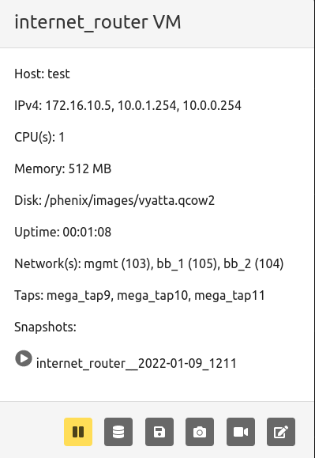

Available commands

* `restore` a snapshot by clicking the play button next to the desired snapshot name.

Buttons from left to right:

* `pause` a running VM
* Create a `memory snapshot` of a running VM
* Create a `backing image` of a running VM
* Create a `snapshot` of a running VM
* `record screenshot` of a running VM
* `modify state` opens another toolbar of buttons

#### Modify State Toolbar


Buttons from left to right:

* `redeploy` a running VM
* `reset disk state` of a running VM
* `restart` a running VM
* `shutdown` a running VM
* `kill` a running VM
* `close` modify state toolbar

### From the Command Line Binary

There are two options for displaying the information for VMs in an experiment. First run
the following command to see information for all VMs in a given experiment.

```shell
phenix vm info <experiment name>
```

Or, run the following to see the information for a specific VM in an experiment.

```shell
phenix vm info <experiment name> [vm name] [--label <label>]
```

## Create a Backing Image

### From the Web-UI

Click on the name of a running VM in a started experiment to access the VM information
modal. Click the `create backing image` button as shown in the screenshot below.

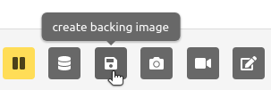

### From the Command Line Binary

There is currently no CLI subcommand to create backing images from running VMs. This operation is available through the Web-UI and the REST API (`POST /api/vms/commit`).

## Create a Memory Snapshot

### From the Web-UI

Click on the name of a running VM in a started experiment to access the VM information
modal. Click the `memory snapshot` button as shown in the screenshot below.

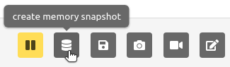

### From the Command Line Binary

To create an ELF memory dump, run the following command.

```shell
phenix vm memory-snapshot <experiment name> <vm name> <snapshot file path>
```

## Create a VM Snapshot

### From the Web-UI

Click on a running VM in a started experiment to access the VM information
modal. Click the `vm snapshot` button as shown in the screenshot below.

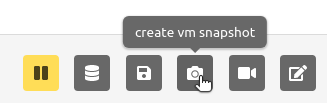

### From the Command Line Binary

While ELF memory dumps can be created via `phenix vm memory-snapshot`, there is currently no CLI subcommand to take standard VM disk snapshots. VM disk snapshots are managed through the Web-UI and the REST API (`POST /api/vms/snapshots`).

## VM VNC Access

### From the Web-UI

The experiment must be started; click on the VM screenshot to open a new browser
tab that provides VNC access to the VM.

### From the Command Line Binary

Not applicable.

## Mount a VM

The VM Mount feature lets you transfer files to and from a running VM directly
through the phēnix Web-UI. It is an optional feature that must be enabled when
starting the phēnix UI with the `vm-mount` feature flag (see
[Enabling VM Mount](#enabling-vm-mount) below).

!!! note

```text
Mounting a VM requires the minimega command-and-control agent (`miniccc`)
to be installed and actively running in the VM. If `cc` is not active for a
VM, the mount button is disabled.
```

### Enabling VM Mount

VM Mount is disabled by default. Enable it by passing the `vm-mount` feature to
the `--features` flag when starting the UI:

```shell
phenix ui --features vm-mount
```

The feature can also be enabled via the `ui.features` configuration key or the
`PHENIX_UI_FEATURES` environment variable. See
[Settings & Configuration](settings.md#settings-reference) for details.

### From the Web-UI

The experiment must be started. Click on the name of a running VM to access the
VM information modal, then click the `mount vm` button (the hard-drive icon).

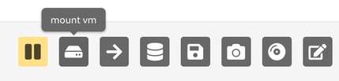

The mount browser modal presents two panes:

* **Local file system** — browse to a file on your local machine and upload it
  into the VM, or download a file from the VM to your local machine.
* **Experiment files** — copy files that already exist on the phēnix server
  into the VM. This option is only available when the
  [experiment file server](settings.md#settings-reference) is enabled (see
  below).

### Uploading Experiment Files from the phēnix Server { #uploading-experiment-files-from-the-phenix-server }

phēnix can optionally run a lightweight file server on a port separate from the
main UI. This was added to support environments where the phēnix UI is only
reachable on a private network but files (for example, application installers or
configuration files) need to be uploaded to an experiment from a public network.

When the file server is enabled, the VM Mount modal gains the **Experiment
files** option described above, allowing files that have been uploaded to an
experiment to be copied directly into a VM without going through the user's
local machine.

Enable the file server by passing the `--file-server-endpoint` flag when
starting the UI:

```shell
# Bind to 127.0.0.1 on port 8080 (port-only value binds to localhost)
phenix ui --features vm-mount --file-server-endpoint 8080

# Bind to a specific interface and port
phenix ui --features vm-mount --file-server-endpoint 0.0.0.0:8080
```

The file server presents a simple interface for selecting an experiment and
uploading a file to it. When authentication/authorization is enabled for the
main phēnix UI, it is automatically enforced on the file server as well, so
users must already have valid phēnix credentials to upload files. File upload
permissions are included in the default **Experiment Admin** and **Experiment
User** roles.

See [Settings & Configuration](settings.md#settings-reference) for the
`ui.file-server-endpoint` configuration key.

### From the Command Line Binary

Use `phenix vm mount` to mount a running VM's filesystem to a directory on the
phēnix headnode. Unlike the Web-UI mount browser above, this does not require
the `vm-mount` UI feature flag to be enabled, and the mounted filesystem is
accessed directly on the headnode's filesystem rather than through the
browser.

```shell
phenix vm mount <experiment name> <vm name> [host path]
```

If `host path` is omitted, the VM is mounted to a default path of
`<mount-dir>/<experiment name>/<vm name>`, where `<mount-dir>` defaults to
`<base-dir.phenix>/mounts` (see [`mount-dir`](settings.md#settings-reference)).
The command prints the resolved host path once the mount succeeds.

```shell
phenix vm mount my-exp my-vm
# VM my-vm in experiment my-exp mounted at: /phenix/mounts/my-exp/my-vm

phenix vm mount my-exp my-vm /tmp/my-vm-files
# VM my-vm in experiment my-exp mounted at: /tmp/my-vm-files
```

To unmount the VM's filesystem, run:

```shell
phenix vm unmount <experiment name> <vm name>
```

!!! note

```text
Mounting a VM requires the minimega command-and-control agent (`miniccc`)
to be installed and actively running in the VM; the command will fail if
the agent is not reachable.

Mounts are automatically unmounted, and their mount directories removed,
when the owning experiment is stopped or deleted, so mounts do not
outlive their experiment.
```

## Packet Capture

### From the Web-UI

Click on the name of the network tap on a running VM in a started experiment to
start a packet capture. The name of the network tap will turn green once a packet
capture has started. It is possible to start captures on multiple network taps.
However, when you stop packet capture, it will stop captures on all network taps.

### From the Command Line Binary

To start a packet capture, run the following command.

```shell
phenix vm capture start <experiment name> <vm name> <iface index> </path/to/out file>
```

To stop all packet captures on a running VM, use the following command.

```shell
phenix vm capture stop <experiment name> <vm name>
```

## Kill a VM

### From the Web-UI

Click on the name of a running VM in a started experiment to access the VM information
modal. Click the `modify state` button on the far right to open the modify state toolbar.
Click the `kill` button as shown in the screenshot below.

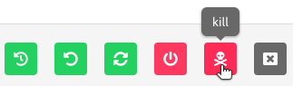

_Note_: if you stop and then start the experiment again, that VM will run again
per the experiment configuration.

### From the Command Line Binary

To kill a VM, run the following command.

```shell
phenix vm kill <experiment name> [vm name] [--label <label>]
```

## Modify the Network Connectivity

### From the Web-UI

Click on the network for the desired VM in the Running Component to modify the
settings. Select from a pull down what network you want to switch the VM interface
you clicked on to. To revert back to previous setting, simply repeat selecting the
network interface you wish to change, and select the previous network setting.

### From the Command Line Binary

To connect a VM network interface to a different network, run the following command.

```shell
phenix vm net connect <experiment name> <vm name> <iface index> <vlan id>
```

To disconnect a VM network interface, run the following command.

```shell
phenix vm net disconnect <experiment name> <vm name> <iface index>
```

## Pause a VM

### From the Web-UI

Click on the name of a running VM in a started experiment to access the VM information
modal. To pause a VM, click on the `pause` button as shown in the screenshot below.
To start a paused VM, that same button will become a green play button; simply
click it to start.

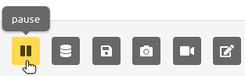

### From the Command Line Binary

To pause a VM, run the following command.

```shell
phenix vm pause <experiment name> [vm name] [--label <label>]
```

To resume a paused VM, run the following command.

```shell
phenix vm resume <experiment name> [vm name] [--label <label>]
```

## Redeploy a VM

### From the Web-UI

Click on the name of a running VM in a started experiment to access the VM information
modal. Click the `modify state` button on the far right to open the modify state toolbar.
Click the `redeploy` button as shown in the screenshot below.

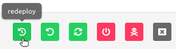

### From the Command Line Binary

To redploy a VM, run the following command.

```shell
phenix vm redeploy <experiment name> [vm name] [--label <label>]
```

## Reset Disk State

### From the Web-UI

Click on the name of a running VM in a started experiment to access the VM information
modal. Click the `modify state` button on the far right to open the modify state toolbar.
Click the `reset disk state` button as shown in the screenshot below.

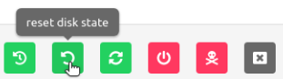

### From the Command Line Binary

To reset the first disk to the initial pre-boot state, run the following command.

```shell
phenix vm reset-disk <experiment name> [vm name] [--label <label>]
```

## Restart a VM

### From the Web-UI

Click on the name of a running VM in a started experiment to access the VM information
modal. Click the `modify state` button on the far right to open the modify state toolbar.
Click the `restart` button as shown in the screenshot below.

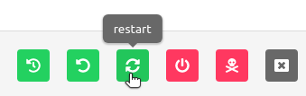

### From the Command Line Binary

To restart a VM, run the following command.

```shell
phenix vm restart <experiment name> [vm name] [--label <label>]
```

## Resume a VM

### From the Web-UI

Click on the name of the paused VM in a started experiment to access the VM information
modal. Click the green play button (previously the pause button, furthest button to the
left).

### From the Command Line Binary

To resume a paused VM, run the following command.

```shell
phenix vm resume <experiment name> [vm name] [--label <label>]
```

## Shutdown a VM

### From the Web-UI

Click on the name of a running VM in a started experiment to access the VM information
modal. Click the `modify state` button on the far right to open the modify state toolbar.
Click the `shutdown` button as shown in the screenshot below.

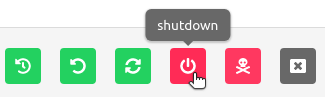

### From the Command Line Binary

To shutdown a VM, run the following command.

```shell
phenix vm shutdown <experiment name> [vm name] [--label <label>]
```

## Modify VM Settings

### From the Web-UI

There are two ways to modify VM settings:

1. Click on a stopped experiment to access the Stopped Component. You are able to edit the
following:
    * Host name
    * CPUs
    * Memory
    * Disk
    * Do not boot flag
1. From a running experiment, click on the VM name and then the redeploy button (yellow
power button, second from the right on the modal footer). You are able to edit the following:
    * CPU
    * Memory
    * Disk
    * Replication of original injections

### From the Command Line Binary

To modify VM settings, run the following command, specifying one or more of the
configuration flags described below.

```shell
phenix vm set <experiment name> [<vm name>] [flags]
```

Only the flags that are explicitly provided will be applied; any setting whose
flag is omitted is left unchanged. The following flags are supported:

| Flag                  | Description                                                                                                       |
| --------------------- | ----------------------------------------------------------------------------------------------------------------- |
| `-c, --cpu`           | Number of VM CPUs (1-8 is valid).                                                                                 |
| `-m, --mem`           | Amount of memory in megabytes (512, 1024, 2048, 3072, 4096, 8192, 12288, 16384 are valid).                        |
| `-d, --disk`          | VM backing disk image.                                                                                            |
| `-p, --partition`     | Partition of disk to inject files into.                                                                           |
| `--do-not-boot`       | Set the do-not-boot flag for the VM.                                                                              |
| `--snapshot`          | Set the snapshot (non-persistent) flag for the VM.                                                                |
| `-L, --label-changes key=value` | VM label to set, in `key=value` form. May be repeated to set multiple labels.                                         |
| `--append-label`       | Append the provided labels to the VM's existing labels instead of replacing them.                                     |
| `-l, --label`         | Apply the change to every VM whose label matches the provided label (supports glob patterns). Use `all` to select every VM in the experiment. May be repeated. |

For example, to set the CPU count to 4 and memory to 2048 MB for a VM named
`my-vm` in an experiment named `my-exp`:

```shell
phenix vm set my-exp my-vm --cpu 4 --mem 2048
```

To set the `role=server` labels on VMs whose existing labels matches
`tier=web*` in the same experiment, without clearing the existing labels:

```shell
phenix vm set my-exp --label "tier=web*" -L role=server --append-labels
```

To set two labels on the VM `my-vm` and replace the existing labels on the VM:

```shell
phenix vm set my-exp my-vm -L val1=true -L val2=roger
```

!!! note
    Only label updates and interface VLAN connections can be modified while an
    experiment is running. To change CPU, memory, disk, partition, do-not-boot,
    or snapshot settings, the experiment must be stopped. Use
    [`phenix vm net`](#modify-the-network-connectivity) to modify interface
    VLAN connections on a running experiment.

## Applying Actions to Multiple VMs

!!! note
    See [VM Multi Action](vm-multi-action.md) for documentation on applying
    actions to multiple VMs at once.
