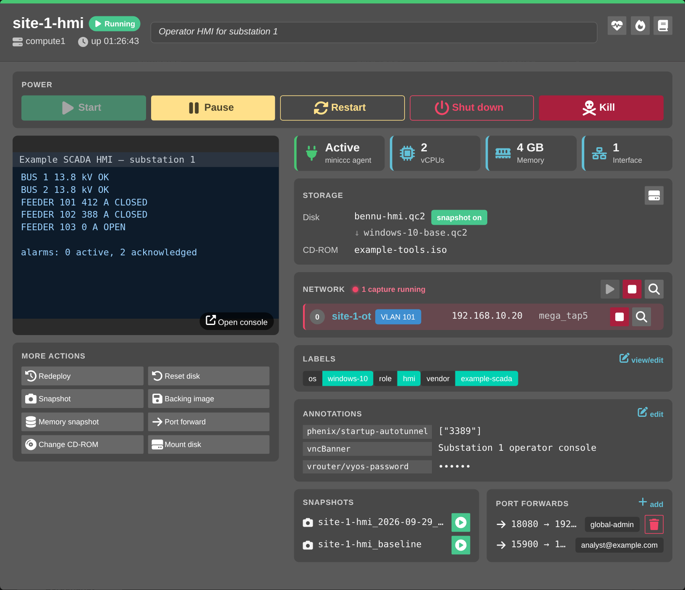
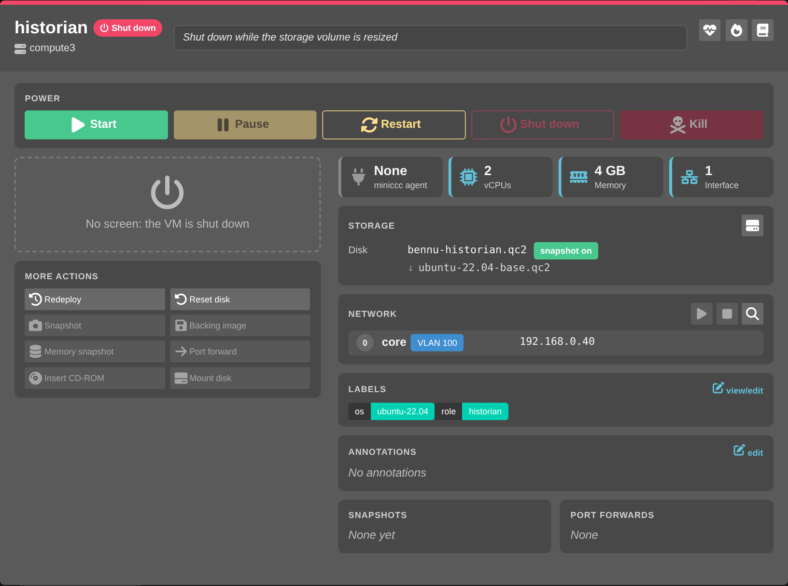
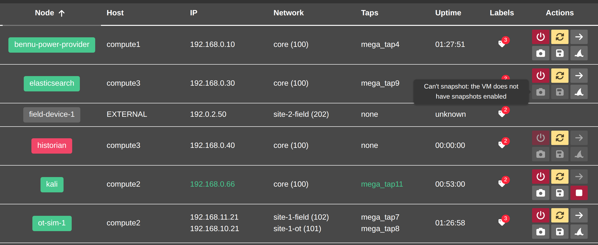
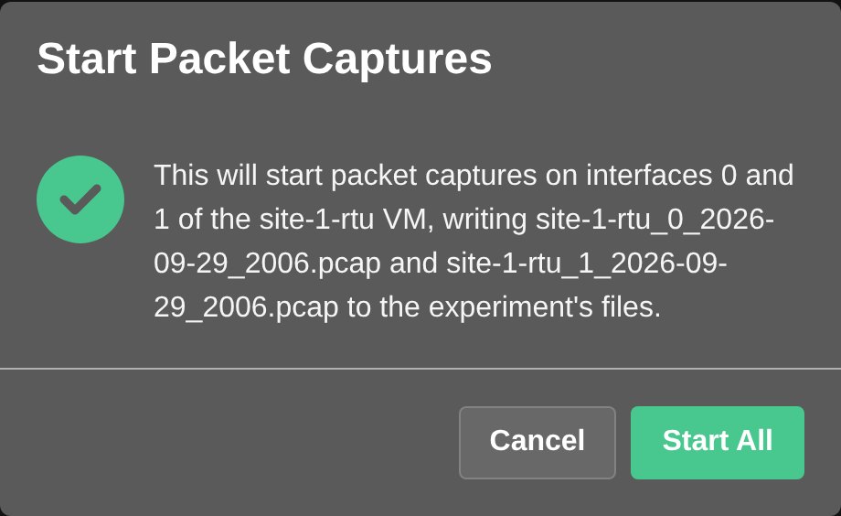
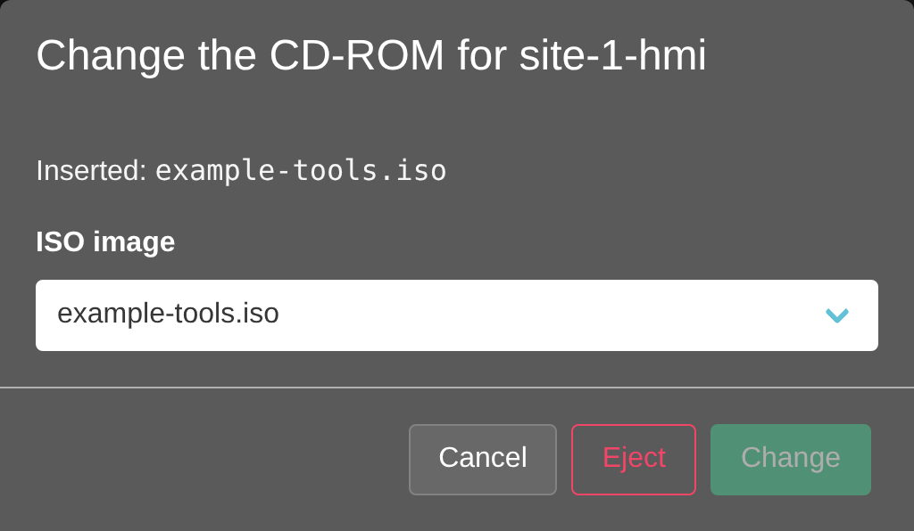

# VMs

## VM Info

### From the Web-UI

The experiment must be started; click on the experiment name to enter the
Running Experiment component. Within that component, click on the VM name (its
tooltip reads `details and actions`) and you will be presented with the VM's
details card. The card gathers everything phēnix knows about the VM together
with every action you can take on it.

{: width=800 .center}

#### The Header

The header is colored by the VM's state and shows:

* the VM name and a state tag: `Running`, `Paused`, `Shut down`, `Building`,
  `Delayed start`, `Error`, `Busy` or `Not booted`;
* a `do not boot` tag, when the VM is flagged not to boot;
* the host the VM is scheduled on, and how long it has been up, or
  `starts after <delay>` for a VM with a delayed start;
* the VM's description from the topology, if it has one, in a box between the
  name and the buttons; a long description shows its first three lines, and
  hovering it shows the rest;
* buttons that open the experiment's
  [State of Health](state-of-health.md) page, its
  [SCORCH](scorch.md) page, and this documentation page. The first two only
  appear if your role may view the experiment.

#### Screenshot and Console

A running VM's screenshot sits at the top left of the card. Click it to open
the VM's console in a new browser tab. When the VM is not running, the tile
reads `No screen: the VM is shut down`, naming whichever state the VM is in.

#### Power

The `Power` section holds the VM's power operations as labeled buttons:

* `Start` — start the VM. On a paused VM the button reads `Resume` and resumes
  the VM where it left off.
* `Pause` — pause the VM, keeping its memory, until it is resumed.
* `Restart` — restart the running VM.
* `Shut down` — power off the VM; it can be started again later.
* `Kill` — kill the VM and remove it from the running experiment.

#### More Actions

`More actions`, under the screenshot, holds everything else:

| Button | What it does |
| ------ | ------------ |
| `Redeploy` | Kill the VM and deploy it again, optionally with new CPUs, memory or disk |
| `Reset disk` | Reset the VM's disk to how it was when the experiment started, discarding changes |
| `Snapshot` | Save the VM's current disk and memory as a snapshot that can be restored later |
| `Backing image` | Create a new backing image from the current VM disk |
| `Memory snapshot` | Save a dump of the VM's memory for forensics tools such as Volatility |
| `Port forward` | Forward a port to a port on the VM through its miniccc agent |
| `Insert CD-ROM` | Insert an ISO image into the VM's CD-ROM drive; reads `Change CD-ROM` when one is already inserted |
| `Mount disk` | Mount the VM's filesystem to browse, upload and download files |

`Mount disk` is only present when the `vm-mount` feature is enabled; see
[Mount a VM](#mount-a-vm).

An action your role may not take is not shown at all. An action the VM's
current state rules out stays visible but disabled, with the reason in its
tooltip — `Can't pause: the VM is not running`, `Can't snapshot: the VM does
not have snapshots enabled`, or `Can't restart: the VM is paused and must be
resumed first`.

{: width=800 .center}

#### Tiles

Four tiles beside the screenshot summarize the VM: `miniccc agent` (`Active` or
`None`), `vCPUs`, `Memory` and `Interfaces`.

#### Storage

`Storage` names the VM's disk and tags it `snapshot on` or `snapshot off`. With
`snapshot on`, disk writes go to a temporary overlay and the disk image itself
is left unchanged; with `snapshot off`, writes go straight to the disk image.
The disk is named as the [Disks](disks.md) page names it: by its path within the
minimega files directory, or by its full path, with a warning icon, when it is
[outside that directory](disks.md#images-outside-the-files-directory). A disk
the list does not hold, or any disk for a role that may not list disks, is named
by its file name. Hovering over the name shows the full path. When the disk is
built on other images, that backing image chain is listed beneath it, nearest
image first. A `CD-ROM` row appears only while an ISO image is inserted, and
names the image the same way. A button in the section heading opens the
[Disks](disks.md) page, if your role may list disks.

#### Network

`Network` lists one row per interface: the interface index, the VLAN alias, a
`VLAN <id>` tag, the IP address and the tap name. Click the alias to move the
interface onto a different VLAN, if your role may do so. While the VM is
running, every connected interface also has a shark-fin button that starts a
packet capture on it; while a capture is running, the row is highlighted, the
button becomes a red stop button, and an `Open in WebShark` button appears
beside it. The section heading counts the captures running on the VM. See
[Packet Capture](#packet-capture) and [WebShark](webshark.md).

Three buttons sit at the right of the section heading:

* a green play button, `Capture all interfaces`, which starts a capture on every
  connected interface that is not already being captured (see
  [Capture All Interfaces](#capture-all-interfaces));
* a red stop button, `Stop all packet captures`, which stops every capture
  running on the VM;
* a search button that opens the [WebShark](webshark.md) tab: on the VM's
  running capture (the lowest interface's, when several are running), or on the
  experiment's saved captures when none is.

The play button is grayed out when every connected interface is already being
captured, and the stop button when no capture is running; hover either one to
see why. The first two only appear if your role may start or stop captures, and
the third only when WebShark is installed and your role may list captures.

#### Labels, Snapshots and Port Forwards

`Labels` lists the VM's labels as key and value pairs; `view/edit` opens the
label editor. `Snapshots` lists the VM's snapshots; click the play button next
to a snapshot name to restore it. `Port forwards` lists each forward as
`<source port> → <destination host>:<destination port>`, along with the
user who created it; `add` creates one, and you can delete the forwards you
own. Each of these three sections only appears if your role may list what it
holds.

#### Annotations

`Annotations` lists the VM's own node annotations, which apps read for per-VM
settings, from the experiment's copy of the topology, one key and value per row. Values that are not text, such as the
list `phenix/startup-autotunnel` takes, are shown as JSON, and the
`vrouter/vyos-password` value is hidden behind an eye button that shows it.

If your role may update the VM, `edit` turns the list into the same editor the
create experiment card uses (see
[Adding Annotations](experiments.md#adding-annotations)): change or remove a
row, or add one of the annotations phēnix knows or a custom one. `Save`
replaces the VM's annotations with the list and `Cancel` discards the changes.
The server refuses a value of the wrong type for an annotation the default apps
read and names the key. Annotations are saved to the experiment, not to the
Topology config, and can be changed while the experiment runs, but apps read
most of them when the experiment starts, so most changes take effect the next
time it starts.

#### Busy VMs

While an action is running on the VM, the card shows `Busy with another action`
and a progress bar above the `Power` section, and every action is disabled.
Clicking a busy VM's name in the table opens a `VM Busy` alert instead of the
card.

### From the Command Line Binary

There are two options for displaying the information for VMs in an experiment. First run
the following command to see information for all VMs in a given experiment.

```shell
phenix vm info <experiment name>
```

Or, run the following to see the information for a specific VM in an experiment.

```shell
phenix vm info <experiment name> [vm name] [--label <label>]
```

## VM Actions Column

The running experiment's VM table has an `Actions` column of compact icon
buttons that act on that row's VM without opening its details card:

* `Shut down`
* `Restart`
* `Port forward`
* `Snapshot`
* `Backing image`
* `Capture all interfaces`, which becomes `Stop all packet captures` while the
  VM is capturing (see [Capture All Interfaces](#capture-all-interfaces))

{: width=400 .center}

The buttons follow the same rules as the ones on the details card: a button is
disabled, with the reason in its tooltip, when your role may not use it
(`Can't snapshot: you don't have permission`) or when the VM's state rules it
out (`Can't restart: the VM is busy with another action`). Three buttons fit on
a row and the rest wrap below, so the column never widens. External nodes have
no buttons, and the whole column is hidden if your role may not take any of
these actions. `Actions` is one of the columns you can turn off from the column
picker above the table.

## Create a Backing Image

### From the Web-UI

Click on the name of a running VM in a started experiment to open its details
card, then click `Backing image` in `More actions`; its tooltip reads
`Create a new backing image from the current VM disk`. The same action is also
in the VM table's [Actions column](#vm-actions-column).

The VM must be running and have snapshots enabled. On a VM that does not, the
button is disabled and its tooltip says why.

### From the Command Line Binary

There is currently no CLI subcommand to create backing images from running VMs. This operation is available through the Web-UI and the REST API (`POST /api/vms/commit`).

## Create a Memory Snapshot

### From the Web-UI

Click on the name of a running VM in a started experiment to open its details
card, then click `Memory snapshot` in `More actions`. The button is disabled
when the VM is not running.

### From the Command Line Binary

To create an ELF memory dump, run the following command.

```shell
phenix vm memory-snapshot <experiment name> <vm name> <snapshot file path>
```

## Create a VM Snapshot

### From the Web-UI

Click on a running VM in a started experiment to open its details card, then
click `Snapshot` in `More actions`. The same action is also in the VM table's
[Actions column](#vm-actions-column). The VM must be running and have snapshots
enabled; on a VM that does not, the button is disabled with
`Can't snapshot: the VM does not have snapshots enabled`.

Once a snapshot exists, the card's `Snapshots` section lists it, and the play
button next to its name restores it.

### From the Command Line Binary

While ELF memory dumps can be created via `phenix vm memory-snapshot`, there is currently no CLI subcommand to take standard VM disk snapshots. VM disk snapshots are managed through the Web-UI and the REST API (`POST /api/vms/snapshots`).

## VM VNC Access

### From the Web-UI

The experiment must be started; click on the VM screenshot to open a new browser
tab that provides VNC access to the VM.

#### VNC Banners

The VNC tab shows a banner above and below the VM's screen. Both read
`EXP: <experiment> - VM: <vm>` unless the VM has a `vncBanner` annotation:

* **A string** is the text of both banners, and each newline in it starts a new
  line.
* **A map** sets each banner apart. `topBanner` and `bottomBanner` each take a
  `banner` list of lines, a `backgroundColor` and a `textColor`. A banner the
  map leaves out is not shown, and `disabled: true` turns both off.

```yaml
annotations:
  vncBanner:
    topBanner:
      banner:
        - Training range
        - Lab use only
      backgroundColor: "#007a33"
      textColor: white
    bottomBanner:
      banner:
        - Training range
      backgroundColor: "#007a33"
      textColor: white
```

Colors are CSS color names, such as `green`, or hex colors, such as `#007a33`.
For any other color, phēnix logs a warning and uses the default white
background or black text. It also logs and ignores map keys it does not know.

Banner text is shown exactly as written, so HTML in it appears as text rather
than as markup. The VNC tab sends a `Content-Security-Policy` that lets only
phēnix's own scripts run, so scripts a reverse proxy adds to the page do not
run.

### From the Command Line Binary

Not applicable.

## Mount a VM

The VM Mount feature lets you transfer files to and from a running VM directly
through the phēnix Web-UI. It is an optional feature that must be enabled when
starting the phēnix UI with the `vm-mount` feature flag (see
[Enabling VM Mount](#enabling-vm-mount) below).

!!! note

    Mounting a VM requires the minimega command-and-control agent (`miniccc`)
    to be installed and actively running in the VM. If `cc` is not active for a
    VM, the `Mount disk` button is disabled.

### Enabling VM Mount

VM Mount is disabled by default. Enable it by passing the `vm-mount` feature to
the `--features` flag when starting the UI:

```shell
phenix ui --features vm-mount
```

The feature can also be enabled via the `ui.features` configuration key or the
`PHENIX_UI_FEATURES` environment variable. See
[Settings & Configuration](settings.md#settings-reference) for details.

### From the Web-UI

The experiment must be started. Click on the name of a running VM to open its
details card, then click `Mount disk` (the hard-drive icon) in `More actions`.
The button is disabled, with the reason in its tooltip, when the VM is not
running or has no active miniccc agent.

The mount browser modal presents two panes:

* **Local file system** — browse to a file on your local machine and upload it
  into the VM, or download a file from the VM to your local machine.
* **Experiment files** — copy files that already exist on the phēnix server
  into the VM. This option is only available when the
  [experiment file server](settings.md#settings-reference) is enabled (see
  below).

### Uploading Experiment Files from the phēnix Server { #uploading-experiment-files-from-the-phenix-server }

phēnix can optionally run a lightweight file server on a port separate from the
main UI. This was added to support environments where the phēnix UI is only
reachable on a private network but files (for example, application installers or
configuration files) need to be uploaded to an experiment from a public network.

When the file server is enabled, the VM Mount modal gains the **Experiment
files** option described above, allowing files that have been uploaded to an
experiment to be copied directly into a VM without going through the user's
local machine.

Enable the file server by passing the `--file-server-endpoint` flag when
starting the UI:

```shell
# Bind to 127.0.0.1 on port 8080 (port-only value binds to localhost)
phenix ui --features vm-mount --file-server-endpoint 8080

# Bind to a specific interface and port
phenix ui --features vm-mount --file-server-endpoint 0.0.0.0:8080
```

The file server presents a simple interface for selecting an experiment and
uploading a file to it. When authentication/authorization is enabled for the
main phēnix UI, it is automatically enforced on the file server as well, so
users must already have valid phēnix credentials to upload files. File upload
permissions are included in the default **Experiment Admin** and **Experiment
User** roles.

See [Settings & Configuration](settings.md#settings-reference) for the
`ui.file-server-endpoint` configuration key.

### From the Command Line Binary

Use `phenix vm mount` to mount a running VM's filesystem to a directory on the
phēnix headnode. Unlike the Web-UI mount browser above, this does not require
the `vm-mount` UI feature flag to be enabled, and the mounted filesystem is
accessed directly on the headnode's filesystem rather than through the
browser.

```shell
phenix vm mount <experiment name> <vm name> [host path]
```

If `host path` is omitted, the VM is mounted to a default path of
`<mount-dir>/<experiment name>/<vm name>`, where `<mount-dir>` defaults to
`<base-dir.phenix>/mounts` (see [`mount-dir`](settings.md#settings-reference)).
The command prints the resolved host path once the mount succeeds.

```shell
phenix vm mount my-exp my-vm
# VM my-vm in experiment my-exp mounted at: /phenix/mounts/my-exp/my-vm

phenix vm mount my-exp my-vm /tmp/my-vm-files
# VM my-vm in experiment my-exp mounted at: /tmp/my-vm-files
```

To unmount the VM's filesystem, run:

```shell
phenix vm unmount <experiment name> <vm name>
```

!!! note

    Mounting a VM requires the minimega command-and-control agent (`miniccc`)
    to be installed and actively running in the VM; the command will fail if
    the agent is not reachable.

    Mounts are automatically unmounted, and their mount directories removed,
    when the owning experiment is stopped or deleted, so mounts do not
    outlive their experiment.

## Packet Capture

### From the Web-UI

Click on the name of the network tap, or on the IP address, of a running VM in a
started experiment to start a packet capture on that interface. The name of the
network tap will turn green once a packet capture has started. Each interface in
the VM's details card has its own shark-fin button that does the same thing.

Either way, phēnix first asks the server which captures are already running on
the VM. minimega lists them across the cluster, so this takes a moment; the
button or tap name shows a spinner until the answer arrives and the dialog
opens. Captures started from the Web-UI are written to the experiment's files as
`<vm>_<interface>_<time>.pcap`.

It is possible to start captures on multiple network taps. When you stop a
capture and it is the only one running on the VM, phēnix just asks you to
confirm. When several are running it asks which you mean:
`Stop Interface <index> Only` or `Stop All Captures`.

A capture cannot be started on a disconnected interface; phēnix says
`Cannot capture traffic on a disconnected interface.` instead of starting one.

### From the Command Line Binary

To start a packet capture, run the following command, specifying the target
network interface by its name (as declared in the experiment topology, e.g.
`IF0`) or its zero-based index.

```shell
phenix vm capture start <experiment name> <vm name> <iface name/index> </path/to/out file>
```

To stop all packet captures on a running VM, use the following command.

```shell
phenix vm capture stop <experiment name> <vm name>
```

Pass an interface name or index to stop only that interface's capture, leaving
the VM's other captures running.

```shell
phenix vm capture stop <experiment name> <vm name> [iface name/index]
```

!!! note
    Stopping the capture on a single interface, from the Web-UI or the command
    line, requires minimega 3.3.0 or later.

To view a capture's packets in the browser, or stream a running capture into a
local Wireshark (`phenix vm capture stream`), see [WebShark](webshark.md).

## Capture All Interfaces

`Capture all interfaces`, in the VM table's
[Actions column](#vm-actions-column) and as the play button on the details
card's [Network](#network) section, starts a packet capture on every connected
interface of a VM that does not already have one, so you do not have to start
them one interface at a time. phēnix asks the server which captures are already
running, then confirms once, naming the interfaces it will capture and the files
it will write — `<vm>_<interface>_<time>.pcap` for each, in the experiment's
files.

The button is disabled, with the reason in its tooltip, when the VM is not
running, has no interfaces, has all of its interfaces disconnected, or is
already capturing every connected interface. A role that may not create packet
captures sees `Can't capture all interfaces: you don't have permission`
instead.

While captures are running on the VM, a red `Stop all packet captures` button
takes its place. It confirms, naming the interfaces it will stop, spins while
the server stops the captures, and turns back into `Capture all interfaces`
once they have stopped.

{: width=500 .center}

## Kill a VM

### From the Web-UI

Click on the name of a running VM in a started experiment to open its details
card, then click `Kill` in the `Power` section.

_Note_: if you stop and then start the experiment again, that VM will run again
per the experiment configuration.

### From the Command Line Binary

To kill a VM, run the following command.

```shell
phenix vm kill <experiment name> [vm name] [--label <label>]
```

## Modify the Network Connectivity

### From the Web-UI

Click on the network for the desired VM in the Running Component to modify the
settings. Select from a pull down what network you want to switch the VM interface
you clicked on to. To revert back to previous setting, simply repeat selecting the
network interface you wish to change, and select the previous network setting.

### From the Command Line Binary

To connect a VM network interface to a different network, run the following command.

```shell
phenix vm net connect <experiment name> <vm name> <iface index> <vlan id>
```

To disconnect a VM network interface, run the following command.

```shell
phenix vm net disconnect <experiment name> <vm name> <iface index>
```

## Pause a VM

### From the Web-UI

Click on the name of a running VM in a started experiment to open its details
card, then click `Pause` in the `Power` section.

`Pause` and `Start` are separate buttons and both are always shown. On a paused
VM, `Start` reads `Resume` — its tooltip is
`Resume the paused VM where it left off` — and `Pause` is disabled with
`Can't pause: the VM is not running`.

### From the Command Line Binary

To pause a VM, run the following command.

```shell
phenix vm pause <experiment name> [vm name] [--label <label>]
```

To resume a paused VM, run the following command.

```shell
phenix vm resume <experiment name> [vm name] [--label <label>]
```

## Redeploy a VM

### From the Web-UI

Click on the name of a running VM in a started experiment to open its details
card, then click `Redeploy` in `More actions`. The dialog that opens lets you
change the VM's CPUs, memory and disk, and whether the original injections are
replicated, before it is deployed again. Its `Disk` menu starts on the VM's
current disk and works as described in [Disk Menu](#disk-menu). The dialog sends
a disk only when you pick a different one, so leaving the menu alone never moves
the VM onto another image.

### From the Command Line Binary

To redeploy a VM, run the following command.

```shell
phenix vm redeploy <experiment name> [vm name] [--label <label>]
```

## Reset Disk State

### From the Web-UI

Click on the name of a running VM in a started experiment to open its details
card, then click `Reset disk` in `More actions`. The button is disabled with
`Can't reset disk: the VM does not have snapshots enabled` on a VM whose
snapshot flag is off, since a persistent VM has no separate disk state to
discard, and with `Can't reset disk: the VM is paused and must be resumed
first` on a paused VM.

### From the Command Line Binary

To reset the first disk to the initial pre-boot state, run the following command.

```shell
phenix vm reset-disk <experiment name> [vm name] [--label <label>]
```

## Restart a VM

### From the Web-UI

Click on the name of a running VM in a started experiment to open its details
card, then click `Restart` in the `Power` section. `Restart` is also in the VM
table's [Actions column](#vm-actions-column). On a paused VM it is disabled with
`Can't restart: the VM is paused and must be resumed first`.

### From the Command Line Binary

To restart a VM, run the following command.

```shell
phenix vm restart <experiment name> [vm name] [--label <label>]
```

## Resume a VM

### From the Web-UI

Click on the name of the paused VM in a started experiment to open its details
card, then click `Resume` in the `Power` section. That is the same button that
reads `Start` on a VM that is not paused.

### From the Command Line Binary

To resume a paused VM, run the following command.

```shell
phenix vm resume <experiment name> [vm name] [--label <label>]
```

## Shutdown a VM

### From the Web-UI

Click on the name of a running VM in a started experiment to open its details
card, then click `Shut down` in the `Power` section. `Shut down` is also in the
VM table's [Actions column](#vm-actions-column).

### From the Command Line Binary

To shutdown a VM, run the following command.

```shell
phenix vm shutdown <experiment name> [vm name] [--label <label>]
```

## Modify VM Settings

### From the Web-UI

There are two ways to modify VM settings:

1. Click on a stopped experiment to access the Stopped Component. Its VM table
shows each VM's host and IP address, and lets you edit the following:
    * Host — the cluster host the VM is scheduled on
    * CPUs
    * Memory
    * Disk — the image the VM boots from; see [Disk Menu](#disk-menu)
    * Partition — the disk partition files are injected into
    * Labels
    * Boot — the do-not-boot flag
    * Persistence — `Non-Persistent` (snapshots on) or `Persistent`
1. From a running experiment, click on the VM name and then `Redeploy` in
`More actions` on its details card. You are able to edit the following:
    * CPUs
    * Memory
    * Disk
    * Replicate Original Injection(s)

### Disk Menu

The stopped experiment's `Disk` column and the `Redeploy` dialog pick a VM's
disk from the images on the [Disks](disks.md) page that the experiment can use.
The menu lists the images in the minimega files directory and its folders by
their path within it, such as `win/win10.qcow2`, sorted by that path. Below
them, a group headed `Outside the standard images directory` lists, by full
path, the images outside that directory that this experiment's topology names,
or that back an image in the menu. Picking an image asks for confirmation on a
stopped experiment, then writes the image's full path into the topology.

* An image whose path minimega cannot use as a VM disk, such as one with a
  space, a quote, `#`, `$`, or `,` in it, is shown disabled and marked
  `(minimega cannot use this name)`. The server refuses such a disk too.
* A warning icon beside the menu marks a disk
  [outside the minimega files directory](disks.md#images-outside-the-files-directory);
  hovering over or focusing it explains that minimega does not copy the image to
  other cluster nodes.
* A disk the list does not hold, such as a missing image, shows as
  `<full path> (not listed)`, with a warning icon whose tooltip reads
  `This image is not in your disk list: it may be missing, unreadable, or hidden from your role.`
* A VM with no disk shows `No disk`.

The menu needs `list` on `disks` to offer other images. Without it, the menu
shows only the VM's current disk, with no warning, since phēnix cannot tell
whether the disk is listed. A role that may not `patch` the VM sees its disk as
text, named as on the Disks page, with the same warning icons.

### CD-ROM

`Insert CD-ROM` in the details card's `More actions` opens the CD-ROM picker for
a running VM. The button reads `Change CD-ROM`, and the picker is titled
`Change the CD-ROM for <vm name>`, when an ISO image is already inserted; the
picker then also names the inserted image. A spinner shows while the picker
lists the ISO images it can insert. If there are none it says so and links to
the Disks page, where an `.iso` file can be uploaded; if they cannot be listed,
or your role may not list disk images, it says that instead.

The picker names ISO images as the [Disks](disks.md) page does, with the ones
outside the minimega files directory in a group of their own, and disables an
image whose path minimega cannot use. It starts on the image that is already
inserted, so `Change` only becomes available once you pick a different one.
`Insert` (or `Change`) inserts the selected image, and `Eject` removes the
inserted one; `Eject` is only offered while an image is inserted. The action is
disabled when the VM is not running.

{: width=500 .center}

### From the Command Line Binary

To modify VM settings, run the following command, specifying one or more of the
configuration flags described below.

```shell
phenix vm set <experiment name> [<vm name>] [flags]
```

Only the flags that are explicitly provided will be applied; any setting whose
flag is omitted is left unchanged. The following flags are supported:

| Flag                  | Description                                                                                                       |
| --------------------- | ----------------------------------------------------------------------------------------------------------------- |
| `-c, --cpu`           | Number of VM CPUs (1-8 is valid).                                                                                 |
| `-m, --mem`           | Amount of memory in megabytes (512, 1024, 2048, 3072, 4096, 8192, 12288, 16384 are valid).                        |
| `-d, --disk`          | VM backing disk image.                                                                                            |
| `-p, --partition`     | Partition of disk to inject files into.                                                                           |
| `--do-not-boot`       | Set the do-not-boot flag for the VM.                                                                              |
| `--snapshot`          | Set the snapshot (non-persistent) flag for the VM.                                                                |
| `-L, --label-changes key=value` | VM label to set, in `key=value` form. May be repeated to set multiple labels.                                         |
| `--append-label`       | Append the provided labels to the VM's existing labels instead of replacing them.                                     |
| `-l, --label`         | Apply the change to every VM whose label matches the provided label (supports glob patterns). Use `all` to select every VM in the experiment. May be repeated. |

For example, to set the CPU count to 4 and memory to 2048 MB for a VM named
`my-vm` in an experiment named `my-exp`:

```shell
phenix vm set my-exp my-vm --cpu 4 --mem 2048
```

To set the `role=server` labels on VMs whose existing labels matches
`tier=web*` in the same experiment, without clearing the existing labels:

```shell
phenix vm set my-exp --label "tier=web*" -L role=server --append-labels
```

To set two labels on the VM `my-vm` and replace the existing labels on the VM:

```shell
phenix vm set my-exp my-vm -L val1=true -L val2=roger
```

!!! note
    Only label updates and interface VLAN connections can be modified while an
    experiment is running. To change CPU, memory, disk, partition, do-not-boot,
    or snapshot settings, the experiment must be stopped. Use
    [`phenix vm net`](#modify-the-network-connectivity) to modify interface
    VLAN connections on a running experiment.

## Applying Actions to Multiple VMs

!!! note
    See [VM Multi Action](vm-multi-action.md) for documentation on applying
    actions to multiple VMs at once.
