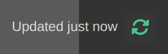
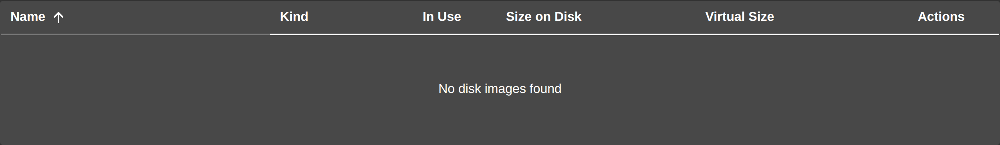

# Using the Web UI

The phēnix web UI is a single page in the browser. Whichever tab you are on,
the banner at the top holds the tabs and the page's freshness status, and the
footer holds a book button that opens this documentation. This page describes
the behavior that is the same everywhere; the pages themselves are described
under [Experiments](experiments.md), [VMs](vms.md), [Disks](disks.md),
[Hosts](hosts.md), and the rest.

## The Navbar

The tabs appear in this order, and only when your role and the server allow
them:

| Tab | Needs |
| :--- | :--- |
| `Experiments` | `list` on `experiments` |
| `Configs` | `list` on `configs` |
| `Disks` | `list` on `disks` |
| `Hosts` | `list` on `hosts` |
| `Users` | any role other than `Disabled` |
| `Logs` | `get` on `logs` |
| `Scorch` | `list` on `experiments` |
| `State of Health` | `list` on `experiments` |
| `Builder` | `list` on `configs`; opens in a new browser tab |
| `Console` | `post` on `miniconsole` |
| `WebShark` | the `webshark` feature, plus `get` on `experiments/files` or `list` on `vms/captures` |
| `Tunneler` | the `tunneler-download` feature |
| `Settings` | `update` on `settings` |

A feature is something the server found at startup, not a permission. The
server reports the `webshark` feature when it finds a WebShark build (see
[WebShark](webshark.md)) and `tunneler-download` when it finds a
`downloads/tunneler` directory to hand tunneler builds out from (see
[Tunneler](tunneler.md)).

The `Console` tab is shown by permission alone, but the console itself works
only when the server was started with `phenix ui --minimega-console`. Without
it, the page reads `Console access is not configured.`, because the server
answers `POST /console` with `405` and `'minimega-console' CLI arg not
enabled`. See
[Attaching to the minimega Console](minimega.md).

## Page Freshness and Refresh

Pages do not hide behind a full-page spinner. Each one shows the data it last
loaded straight away and loads a fresh copy behind it, so the right-hand end
of the navbar says how old what you are looking at is, with a button beside it
(`Refresh this page's data`) that reloads only the page's data.

{: width=500 .center}

The status reads:

* `Loading…` while the page's first load runs.
* `Refreshing…` while a later load runs.
* `Updated just now`, then `Updated 3 min ago` and so on, counting up every 15
  seconds.
* `Updated 10:42:05 AM`, the time of the load, once it is an hour or more old.
* `Refresh failed` when the last load failed. The page keeps showing what it
  already had.

The button's icon is colored to match: yellow while a load is running, green
after a load succeeded, and red after one failed. While a load runs, the icon
spins and the button cannot be pressed. A page with nothing to reload, such as
`Builder`, shows neither the status nor the button.

The Experiments, Configs, Disks, Hosts, Users, Logs, Scorch, State of Health
and Settings pages, the VM tiles, and each experiment's own page keep the data
they last loaded, so returning to one opens it filled in. An experiment's page
says `Loading experiment…` when nothing has been kept for it yet. The kept data
is cleared when you log out, so one user never sees another's.

After you sign in, the UI loads the Experiments, Configs, Users, Logs, Hosts,
Scorch, State of Health, Settings and Disks tabs in the background, two requests
at a time, so they open with data already in place. Disks is loaded last,
because inspecting disk images is the most expensive listing. The VM tiles are
left out, because each tile carries a screenshot.

A page's load finishes even if you leave before it comes back, for up to two
minutes, so the data is ready when you return; a request nothing is waiting on
any more is canceled instead.

## Tables

The `Paginate` toggle sits above its table, on the right, and appears only
when the table has more rows than one page holds. It starts off in a fresh
browser.

Each table remembers its own `Paginate` setting in the browser, not in your
account. The setting is shared by everyone who uses that browser, survives
logging out, and is never sent to the server. In a private window, or with site
data blocked, tables simply start unpaginated.

Sort arrows sit beside the heading they sort by, and a centered heading stays
centered over the values below it.

An empty table says why it is empty rather than assuming you searched for
something. On Disks, for example, it reads `Loading disks…` while the first
load runs, `Could not load disks` when that load failed, `No disk images found`
when there are none, and `No disk images match your search` when the search
ruled them all out. Other tables word the same four cases for what they list.

{: width=600 .center}

A table is only called empty once this visit's own load has come back empty, so
an experiment you know exists is never reported missing while the list is still
on its way.

## Search Boxes

Every page's search box looks and works the same way: it sits at the right
above its table, has a magnifier on its left, and shows its clear button only
once there is something to clear.

## Errors

A failure opens a red notification at the top of the page. It stays until you
dismiss it (`Dismiss error`), and it is wide enough that a long server message
does not wrap into a narrow column.

Text from the server is escaped and shown as text, never rendered as HTML. When
the server nests one error inside another, the notification splits the chain
into steps: `Error:` and the outermost message first, then each step that led
to it on a line of its own, with the root cause last and in bold. A failure
deep inside a SCORCH run is much easier to read this way than as one long
sentence.

## Permissions

Opening a page your role cannot use — from an old link or a bookmark — would
only show permission errors, so the UI sends you to the first page your role
can use instead, either Experiments or the VM tiles. A role named `Disabled`
goes to the account-disabled page. Buttons and menu items your role cannot use
are hidden or disabled, and a disabled button says why in its tooltip.

For what a role may do, see
[User Authn/Authz in phenix](user-administration.md).

## Refresh Rates

Some pages keep asking the server for fresh data on their own:

| What | How often |
| :--- | :--- |
| The Hosts page | every 30 seconds |
| The VM tiles | every 60 seconds |
| Screenshots of the VMs on a running experiment's page | every 15 seconds, running VMs only |
| The State of Health overview, while a run is in progress | every 15 seconds |

Each of these has the server ask minimega, which runs one command at a time, so
every other request waits behind them. The Hosts, VM tiles and State of Health
pages therefore skip a refresh while the last one is still waiting on the
server, and while you are not looking at the page: its browser tab is hidden, or
its window does not have focus.

Screenshots work the same way from the other end. The server takes them for the
VMs a running experiment's page is showing, and stops when that page stops
asking. Hiding its browser tab stops them, and they start again, with fresh
ones, when you come back. Leaving the page stops them altogether, which leaves
minimega free for everything else.

## When an Experiment Goes Away

If a running experiment is stopped or deleted somewhere else — from the command
line, another browser window, or another user — its page has nothing left to
show. It says so, for example `The foo experiment was stopped elsewhere.`, and
returns you to the experiment list.
