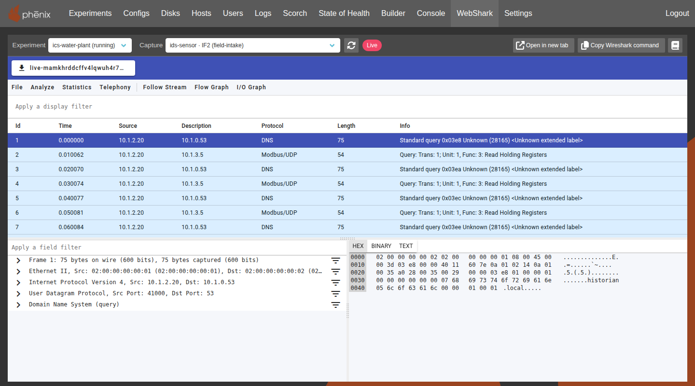

# WebShark

The phēnix UI can show the packets of an experiment's packet captures in
[WebShark](https://github.com/QXIP/webshark), a build of Wireshark that runs in
the browser. It shows both captures that are still running, updating as packets
are captured, and capture files saved in the experiment's files.

phēnix can also stream a running capture to programs outside the browser, such
as a local Wireshark or `tshark`; see
[Streaming a Running Capture](#streaming-a-running-capture).

{: width=800 .center}

## Installing WebShark

The phēnix Docker and Podman images and the Debian package include WebShark in
`/opt/phenix/webshark`. The phēnix server serves it when it finds a WebShark
build in `/opt/phenix/webshark` or in a `webshark` directory in the directory the
server runs from, and says so in its log (`Serving WebShark`).

To build WebShark yourself, check out its
[source](https://github.com/QXIP/webshark) and run phēnix's
`docker/build-webshark.sh`, which needs Node.js 22.22.3 or a later 22 release,
24.15.0 or a later 24 release, or 26 or later, plus npm, gzip, wget, and
python3:

```shell
git clone https://github.com/QXIP/webshark.git
sceptre-phenix/docker/build-webshark.sh webshark /opt/phenix/webshark
```

Restart the phēnix server afterwards. Without WebShark, the phēnix UI has no
WebShark tab or buttons.

!!! note
    WebShark is licensed under the GNU Affero General Public License v3.0, and
    its Wireshark build under the GNU General Public License v2.0. The build
    script copies the license and a `NOTICE` naming the source repository and
    commit into the build.

### Behind a Reverse Proxy

When a reverse proxy serves the phēnix UI under a base path, such as
`https://example.com/phenix/`, WebShark is served under the same base path
(`/phenix/webshark/`), and the proxy needs no route of its own for it.
WebShark's build hardcodes `/webshark/`, so the phēnix server rewrites it under
the base path in the WebShark pages, scripts, and styles it serves. For that,
start the server with the base path the UI was built with (the
`PHENIX_BASE_PATH` Docker build argument): `phenix ui --base-path /phenix/`.

The base path can use only letters, digits, `-`, `.`, `_`, `~`, `%`, and `/`.
With any other character, the server logs a warning and WebShark works only at
`/webshark/` from the root of the phēnix server, which the proxy must then also
forward to it.

WebShark's RTP audio player works only when WebShark is open in a tab of its
own over HTTPS, where the browser can isolate the page from other sites. Behind
a proxy that ends HTTPS, the proxy must tell the phēnix server so with an
`X-Forwarded-Proto: https` or `Forwarded: proto=https` header. Everything else
in WebShark works either way.

## Viewing Captures

Click the `WebShark` tab in the banner near the top of the phēnix UI, pick an
experiment, then pick a capture:

* **Live captures** are the experiment's running captures, by VM and
  interface. WebShark reloads the capture as it grows, every second for small
  captures and up to every 10 seconds for large ones, and the page shows a red
  `Live` tag.
* **Saved files** are the capture files (`.pcap`, `.pcapng`, or `.cap`,
  optionally gzipped) in the experiment's files, newest first. A file that a
  running capture is still writing is shown live.

The page's URL names the experiment and capture, so it can be bookmarked or
shared with other phēnix users. `Open in new tab` opens the capture in WebShark
in a tab of its own.

The UI also links to the WebShark tab from:

* the `Files` tab of an experiment, where clicking a capture file's name opens
  it in WebShark, as does the `Open in WebShark` button (a shark fin) first in
  its `Actions` column; text files have a `view file` button there instead,
  which opens them like clicking their name
* the Network section of a running VM's details, where each interface with a
  running capture has an `Open in WebShark` button

To start a capture, see [Packet Capture](vms.md#packet-capture).

### Permissions

A role needs `get` on `experiments/files` to open saved capture files. To open
a running capture, it also needs `list` on `vms/captures` for the VM. A role
with neither has no WebShark tab.

## Streaming a Running Capture

phēnix streams a running capture as a pcap stream: every packet captured so far,
then each new packet as it is captured, until the capture stops or the reader
disconnects. It works whichever cluster node runs the VM.

For a live capture, the WebShark tab has a `Copy Wireshark command` button that
copies a command like this one, which streams the capture into a local
Wireshark as the signed-in user:

```shell
curl -fsSN --max-redirs 0 -L -H 'X-Phenix-Auth-Token: Bearer <token>' \
  'https://phenix.example.com/api/v1/experiments/<exp>/vms/<vm>/captures/<iface>/stream' \
  | wireshark -k -i -
```

When phēnix refuses the request, or a proxy in front of it redirects it, curl
stops with an error instead of passing Wireshark an error or sign-in page.

!!! warning
    The command includes your sign-in token. Treat it like a password.

Behind a sign-in proxy (a UI built with `PHENIX_WEB_AUTH=proxy`), the proxy
turns the command away unless it signs in to the proxy the way your browser
does, usually with the proxy's sign-in cookie, and curl stops with an error
such as `Maximum (0) redirects followed`. Copy the cookie from your browser's
developer tools and add it to the command as `-b 'NAME=VALUE'`, or stream the
capture with the CLI on the phēnix server, which does not go through the proxy.
The button shows both.

On the phēnix server, the CLI streams a capture to stdout or a file:

```shell
phenix vm capture stream <exp> <vm> <iface> | wireshark -k -i -
phenix vm capture stream <exp> <vm> <iface> --from-now | tshark -i -
phenix vm capture stream <exp> <vm> <iface> --output copy.pcap
```

`<iface>` is the interface's index; the CLI also accepts its name.
`--from-now` skips the packets captured before the command started.

### Stream API

`GET /api/v1/experiments/{exp}/vms/{vm}/captures/{iface}/stream` answers with
`Content-Type: application/vnd.tcpdump.pcap` and streams the capture over the
open response. `{iface}` is the interface's index. Add `?from=now` to skip the
packets captured before the request.

The same URL upgrades to a websocket, which sends the stream as binary
messages: the 24-byte pcap file header first, then whole packet records. The
websocket closes when the capture stops.

Both need the same permissions as a live capture in the WebShark tab, and
answer `404` when the VM's interface has no running capture.

## Limitations

* WebShark loads a whole capture into the browser and parses it there, so large
  captures (hundreds of megabytes) are slow to open, and a live capture is
  downloaded again each time WebShark reloads it. For large captures, stream
  them into a local Wireshark instead.
* A WebShark link keeps working for 12 hours after it was last used, or until the
  phēnix server restarts; after that, open the capture again from the WebShark
  tab.
