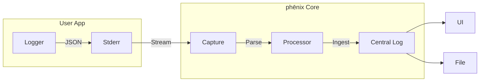

# phēnix Example Applications

[](https://github.com/sandialabs/sceptre-phenix/actions/workflows/examples.yml)

> [!TIP]
> **New to phēnix apps?** Check out the step-by-step [Tutorial](TUTORIAL.md) to learn how to run and modify these examples.

This directory contains reference applications demonstrating how to build apps compatible with the phēnix platform.

## 📖 Overview

phēnix apps are standalone executables (or scripts) that the phēnix Core orchestrates during an experiment's lifecycle. They communicate with the Core via standard streams (`STDIN`, `STDOUT`, `STDERR`).

## 🤝 The App Contract

Any application running on phēnix must adhere to the following contract:

1.  **Input (`STDIN`)**: The app receives the full experiment configuration as a JSON object via standard input.
2.  **Arguments**: The app receives the current **lifecycle stage** as the first command-line argument (e.g., `configure`, `start`, `stop`).
3.  **Output (`STDOUT`)**: The app must print the (potentially modified) experiment JSON to standard output. This allows apps to chain modifications.
4.  **Logging (`STDERR`)**: All logs must be written to standard error as single-line **JSON objects**.

### Lifecycle Stages
Common stages include:
*   `configure`: Setup initial state.
*   `pre-start`: Actions before the experiment starts.
*   `post-start`: Actions immediately after start.
*   `running`: Main execution loop.
*   `cleanup`: Teardown resources.

### How Logging Works

The phēnix Core captures `stderr` from all running applications, parses the output as JSON, and ingests it into the centralized logging system.



1.  **Orchestration**: When phēnix launches an app, it injects `PHENIX_LOG_FILE=stderr`.
2.  **App Initialization**:
    *   **Python**: The `phenix_apps` library detects `PHENIX_LOG_FILE=stderr` and automatically configures the logger to emit structured JSON to standard error.
    *   **Go**: The application manually configures `log/slog` (or similar) to write JSON to `os.Stderr`. It typically ignores `PHENIX_LOG_FILE` as `stderr` is the expected default for container-native apps.
3.  **Capture**: phēnix captures the app's `stderr` stream.
4.  **Processing**: The core daemon parses the JSON lines.
    *   **Tracebacks**: If a `traceback` field exists, it is appended to the message.
    *   **Timestamps**: The app's `time` field is preserved as `proc_time`.
5.  **Ingestion**: The processed log entry is ingested into the centralized logging system (`plog`), making it available in the UI and system logs.

## 🐍 Python Example

Located in `python/`, this example demonstrates how to use the `phenix_apps` library to build robust applications.

### Key Features
*   **`AppBase` Class**: Handles argument parsing, JSON I/O, and stage dispatching automatically.
*   **Structured Logging**: Uses `phenix_apps.common.logger` to emit JSON logs compatible with the phēnix UI.
*   **Error Handling**: Automatically captures exceptions and formats tracebacks as structured log fields.

### Usage for Developers

To run the Python example locally:

```bash
# 1. Install dependencies
make install-dev

# 2. Run the app (simulating the 'running' stage)
make -C examples run-python
```

### Logging Best Practices
```python
from phenix_apps.common.logger import logger

# Add context to logs
logger.bind(item_id=123).info("Processing item")

# Handle exceptions (tracebacks are automatically structured)
try:
    do_work()
except Exception:
    logger.exception("Work failed")
```

## 🐹 Go Example

Located in `go/`, this example demonstrates how to build a lightweight app using the Go standard library.

### Key Features
*   **`log/slog`**: Uses Go 1.21+ structured logging with `slog.NewJSONHandler`.
*   **Core Dependencies**: Uses core `phenix` packages (`phenix/types`, `phenix/store`) for robust configuration parsing, but avoids external frameworks.
*   **Panic Recovery**: Captures panics and logs them as structured JSON with tracebacks.

### Usage for Developers

To run the Go example locally:

```bash
# Build and run the app (simulating the 'running' stage)
make -C examples run-go
```

## ⚠️ Common Pitfalls

### Handling Missing JSON Fields
The experiment JSON received via `STDIN` might not always contain every field you expect, especially if the experiment configuration is minimal.

*   **Python**: Use `dict.get()` or check for existence before accessing nested keys. The `AppBase` class helps, but custom logic should be defensive.
*   **Go**: When unmarshaling into a struct, missing fields will be zero-valued. When unmarshaling into `map[string]any`, check for `nil` or existence before type assertion.

### Outputting Invalid JSON
The phēnix Core expects valid JSON on `STDOUT`. If your app crashes or prints debug text to `STDOUT`, it will break the pipeline.
*   **Solution**: Always write logs to `STDERR`. Ensure `STDOUT` is only used for the final JSON payload.

### Logging Tracebacks
Printing raw stack traces to `STDERR` can break the JSON log parser in the Core.
*   **Python**: Use `logger.exception("message")` instead of `traceback.print_exc()`.
*   **Go**: Use structured logging fields for errors.

## ⚙️ Configuration

Both examples support configuration via environment variables:

| Variable | Description | Default |
| :--- | :--- | :--- |
| `PHENIX_LOG_LEVEL` | Log verbosity (`DEBUG`, `INFO`, `WARN`, `ERROR`). | `INFO` |

## ✅ Testing

These examples are verified in CI to ensure they remain compatible with the core platform. We strongly recommend creating unit tests for your own applications to ensure reliability and adherence to the App Contract.

### Test Patterns

*   **Python**: Tests use `unittest.mock` to inject JSON into `sys.stdin` and capture `sys.stderr` logs. This allows testing app logic in-process.
*   **Go**: Tests use the "subprocess pattern" (re-executing the test binary) to verify end-to-end behavior, including argument parsing and exit codes.

### Running Unit Tests

**Go:**
```bash
go test -v ./examples/go/...
```

**Python:**
```bash
PYTHONPATH=examples/python pytest examples/python/test_app.py
```

### Automated Checks

You can run all builds and tests locally from the top-level Makefile:

```bash
make examples
```